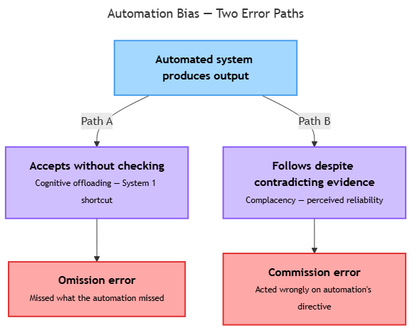

<!-- nav:top:start -->
[⬅ Previous: 9.4 — Anchoring bias](../../9-4-anchoring-bias-over-relying-on-the-first-piece-of-informatio/artifacts/reading.md)&emsp;·&emsp;[⬆ Table of Contents](../../../../../../../README.md#curriculum-topic-index)&emsp;·&emsp;[Next: 9.6 — How human biases get encoded into AI training data ➡](../../9-6-how-human-biases-get-encoded-into-ai-training-data/artifacts/reading.md)
<!-- nav:top:end -->

---

# Automation Bias — Trusting Automated Systems over Human Judgment

## Overview

**Automation bias** is the tendency to over-rely on the output of an automated system — following its recommendations without applying independent judgment, even when doing so is clearly warranted [1]. It is not a deliberate choice or a sign of carelessness; it is a predictable product of the way human cognition handles complexity and time pressure. As AI-assisted tools become standard in workplaces and everyday decisions, understanding this bias is the first step toward managing it.

## Key Concepts

### What Automation Bias Is

Automation bias was first named and studied by researchers Kathleen Mosier and Linda Skitka in the 1990s, using simulated cockpit environments [2]. Their central finding: when an automated system made a recommendation, operators were significantly more likely to follow it — even when instrument readings visible to the pilot contradicted it. This makes it a **bias** in the technical sense: a systematic, predictable skew in judgment, not a random error. Given the same information, a person who sees an automated recommendation will tend to defer to it more than someone reasoning from raw data alone [1].

### Two Types of Error

Automation bias produces two distinct kinds of mistake [2].

**Omission error** — failing to notice or act on something because the automated system did not flag it.

- Example: A radiologist pays close attention to areas a computer-aided detection system has highlighted and less attention to areas it has not. If the system misses a tumour, the radiologist may miss it too — not from carelessness, but because the absence of a flag reduced their vigilance [1].
- The error is something you *failed to do* because the automation's silence implied "nothing to see here."

**Commission error** — doing something incorrect *because* the automated system instructed it, even when independent information should have prompted hesitation.

- Example: A pilot receives an automated navigation instruction to turn left. A visual scan shows a mountainside in that direction. The pilot turns left anyway, deferring to the system [2].
- The error is an action you *actively took* because the automated directive overrode your own judgment.

A useful memory peg: **omission = you missed what the automation missed; commission = you did something wrong because the automation told you to**.

*How an automated output leads to two distinct error types: omission (failing to act on what the system missed) and commission (acting on what the system recommended despite contradicting evidence).*

### Why Automation Bias Happens

Four interconnected mechanisms drive this bias. All are amplified by the cognitive processes studied in earlier topics.

**Cognitive offloading** — **cognitive offloading** is the process of deliberately moving mental work onto an external tool to reduce the load on your own working memory [1]. This is rational in isolation: a spell-checker frees attention for argument structure. The problem arises when offloading becomes so habitual that the human loses **situational awareness** — the ongoing, active sense of what is happening in the environment. Over time, an operator may stop maintaining the internal skills needed to catch the automation's errors [3].

**Perceived reliability and the authority heuristic** — humans naturally extend more trust to sources they perceive as expert or authoritative. When an automated system has been correct many times before, users unconsciously treat its outputs as reliable by default [1]. This shortcut is useful in low-stakes situations. It becomes dangerous when the system's reliability is assumed rather than verified. Note the connection to anchoring bias (9.4): the automated output functions as an anchor, and the human adjusts their judgment insufficiently away from it.

**System 1 processing under time pressure** — recall from 9.1 that System 1 thinking is the brain's fast, automatic, pattern-matching mode. When an automated system presents a recommendation — especially under time pressure, cognitive fatigue, or information overload — the brain tends to accept it through System 1 processing. The implicit reasoning is: *a system has already done the thinking; I do not need to do it again* [1][3]. This effect is most dangerous when the automated system's error looks like a plausible recommendation that would not trip a fast heuristic scan.

**Complacency** — **complacency** is a gradual reduction in vigilance that develops from repeated, successful interactions with a reliable automated system [1]. A clinician who has found a diagnostic tool reliable over thousands of cases will spend less time cross-checking its outputs. This is normal human adaptation, not a character flaw. The risk is that the rare edge case — when the automation is wrong — arrives when vigilance is at its lowest.

### Real-World Evidence

Automation bias is documented across three key domains.

- **Aviation:** Simulator studies consistently show that pilots fail to notice automated system errors more often when a "system normal" indicator is present. In one class of study, pilots flying with a malfunctioning automated system were significantly less likely to detect the malfunction than pilots flying without any automation at all [2].
- **Medicine:** A well-documented pattern is **alert fatigue** — when automated alert systems flag too many low-priority items, clinicians learn to dismiss them with a click, and the rate of missed genuinely important alerts rises accordingly [1].
- **AI-assisted decision-making:** When AI systems provide explanations alongside their recommendations, users tend to defer to those recommendations even when the explanations are incorrect. The presence of text that *looks* like reasoning activates trust at a System 1 level [3].

## Worked Example

**Scenario: AI-assisted resume screening**

A hiring manager uses an AI tool that scores each of 200 job applications from 1 to 100.

1. **Automated output arrives.** The top 20 applications score above 85; the bottom 100 score below 40. The manager opens and reviews only the top 20.
2. **Omission error occurs.** One application scoring 32 belongs to a strong career-changer whose non-traditional background was penalised by the model (trained on conventional credentials). The manager never sees this candidate — the automation's silence (a low score) caused the miss.
3. **Commission error occurs.** An application scoring 91 is shortlisted. Had the manager read it before seeing the score, they would have noticed the candidate's skills do not match the role's core requirements. The high score anchored their assessment and drove an incorrect shortlist decision.
4. **Both errors are discovered later.** A colleague audits the low-scoring pile and surfaces the career-changer. The shortlisted "91" candidate fails to demonstrate core skills at interview.
5. **Structural mitigation is added.** The team decides to: (a) always manually review a random sample of low-scoring applications, and (b) read candidate materials before looking at the score. These procedural changes — not personal resolve — are what actually reduce automation bias going forward.

## In Practice

**Where automation bias shows up most often:**

- Reviewing AI-generated drafts or summaries without re-reading the source
- Accepting code-completion suggestions without checking correctness
- Following GPS routing without considering whether the route makes sense
- Approving a diagnostic tool's output without reviewing the underlying test data

**What actually reduces it (structural approaches work; willpower alone does not):**

- **Mandatory independent check before viewing the automated output** — read the raw materials first, then compare with the system's recommendation
- **Random audits of items the system rated lowest** — catches omission errors the system and human both missed
- **Blind review protocols** — remove or delay the automated score so the reviewer forms an independent view first
- **Calibrated trust** — accepting a system's output at the level of confidence the evidence warrants, neither over-trusting nor reflexively rejecting it [1][3]

**A common misconception to correct:** awareness of automation bias is necessary but not sufficient. Because this bias operates largely through System 1 (fast, automatic) processing, knowing it exists does not reliably prevent it in real-time, high-pressure situations [1]. Knowing about confirmation bias (9.3) does not make you immune to it; the same applies here.

## Key Takeaways

- **Automation bias** is the systematic tendency to defer to automated system outputs without applying independent judgment — a cognitive bias, not a personal failing [1].
- It produces two error types: **omission errors** (missing what the automation missed) and **commission errors** (acting wrongly because the automation directed it) [2].
- The main drivers are cognitive offloading, perceived reliability, System 1 processing under time pressure, and complacency — all amplified when systems have a strong track record.
- Effective mitigation is structural and procedural — mandatory cross-checks, blind review protocols, and random audits — not individual willpower.
- The goal is **calibrated trust**: accepting a system's output at the level the evidence actually warrants, and maintaining situational awareness as a deliberate practice [1][3].

## References

[1] The Decision Lab. "Automation Bias." https://thedecisionlab.com/biases/automation-bias

[2] Wikipedia. "Automation bias." https://en.wikipedia.org/wiki/Automation_bias

[3] Springer. "Automation bias in human-AI collaboration." *AI & Society* (2025). https://link.springer.com/article/10.1007/s00146-025-02422-7

---
<!-- nav:bottom:start -->
[⬅ Previous: 9.4 — Anchoring bias](../../9-4-anchoring-bias-over-relying-on-the-first-piece-of-informatio/artifacts/reading.md)&emsp;·&emsp;[⬆ Table of Contents](../../../../../../../README.md#curriculum-topic-index)&emsp;·&emsp;[Next: 9.6 — How human biases get encoded into AI training data ➡](../../9-6-how-human-biases-get-encoded-into-ai-training-data/artifacts/reading.md)
<!-- nav:bottom:end -->
