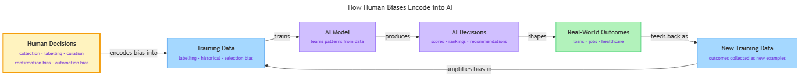

<!-- nav:top:start -->
[⬅ Previous: 9.5 — Automation bias](../../9-5-automation-bias-trusting-automated-systems-over-human-judgme/artifacts/reading.md)&emsp;·&emsp;[⬆ Table of Contents](../../../../../../../README.md#curriculum-topic-index)&emsp;·&emsp;[Next: 9.7 — The Judgment Framework ➡](../../../3-the-judgment-framework/9-7-the-judgment-framework-q1-what-is-the-cost-of-this-being-wro/artifacts/reading.md)
<!-- nav:top:end -->

---

# How Human Biases Get Encoded into AI Training Data

## Overview

AI systems learn from examples — feed them examples shaped by human prejudice or careless data collection, and they faithfully learn those patterns [1]. Almost every AI tool in use today was trained on data that humans produced, and that data carries human fingerprints: who was included, how things were labelled, and what past it recorded. Understanding how bias enters training data is the first step toward recognising it when it affects you — or when you are the person producing data that will train the next system.

## Key Concepts

### What "encoding" means

**Encoding** — capturing something into a form a computer can store and learn from.

When a bias is "encoded" into training data, it has been turned into a pattern inside a dataset. The AI does not see a human making a prejudiced decision — it sees numbers, labels, and text. If those numbers and labels reflect a prejudiced pattern, the AI treats that pattern as a fact about the world [1].

**Training data** — the set of examples an AI learns from before it is deployed. Whatever is in that data shapes what the AI "knows" [1][2].

A useful analogy: a camera does not judge — it records what is in front of the lens. But if the photographer always photographs one neighbourhood and never another, the photo archive will make the first look "normal" and the second look invisible. The camera had no bias; the choices behind it did.

### The four main routes bias travels

*The bias feedback loop: human decisions shape training data, which trains the AI model, whose decisions shape real-world outcomes, which feed back as new training data — amplifying the original bias with each cycle.*

**Labelling bias** — when the tags or categories attached to data reflect the prejudices or assumptions of the people doing the labelling, rather than objective reality [2].

Most large AI datasets are labelled by human workers who bring their own cultural backgrounds and blind spots. A company building a customer-service AI hired labellers to tag reviews as positive, negative, or neutral. One group consistently tagged sarcastic reviews as "positive" because they missed the tone; another tagged reviews using unfamiliar slang as "negative" because the language felt aggressive to them. The AI inherited both errors — it now misclassifies sarcasm and unfamiliar dialects in exactly the same way the human labellers did [2].

**Historical bias** — when training data accurately reflects a past that was itself unfair, and that unfairness gets carried forward into the AI's decisions as if it were a natural law [1].

This is a common surprise: a dataset can be completely accurate and still encode bias. Historical loan data shows higher default rates in certain zip codes — partly because past lending practices denied credit to those neighbourhoods. An AI trained on that data refuses loans to residents of those zip codes, reinforcing the same inequality that created the high default rate in the first place [1][2].

**Selection bias** (also called **representation bias**) — when the training data does not represent all the groups or situations the AI will later be used on [1][2].

Early commercial facial recognition systems were trained primarily on photos of light-skinned male faces, because public photo datasets scraped from the internet over-represented that demographic. When deployed, these systems had measurably higher error rates on darker-skinned women [1][3]. The AI was not intentionally discriminatory — it was under-trained on certain groups, and that gap showed up as performance disparity.

**Feedback loop amplification** — a cycle where the AI's own outputs become inputs for future training, compounding an initial bias with each cycle [1][3].

The steps of the loop are:

1. An AI is trained on biased data and deployed.
2. The AI makes decisions — loan approvals, resume rankings, patrol assignments.
3. Those decisions create real-world outcomes: who gets loans, who gets jobs, which areas get policed.
4. Data about those outcomes is collected and used to train the next version of the AI.
5. The next version learns from data that already reflects the AI's prior decisions — not just original human decisions.
6. Repeat.

A predictive policing AI illustrates this clearly. The AI directed more patrols to certain neighbourhoods; more patrols produced more arrests; those arrests were fed back to the AI as evidence the neighbourhood was "high risk." The AI's prediction was confirmed — not because the area was actually more dangerous, but because the deployment created the data that validated it [1][3].

### How cognitive biases from 9.3–9.5 make encoding worse

The encoding mechanisms above are structural — they describe how bias enters data. But the humans building and maintaining AI systems are also subject to the individual biases you studied earlier.

**Confirmation bias (9.3)** operates at the data pipeline level. A practitioner who believes a certain group is lower-risk will tend to choose datasets that confirm that belief, downweight contradicting data, and flag labels that disagree with expectations as "errors" while approving matching ones as "correct" [3]. This is selective search and biased interpretation working at scale.

**Automation bias (9.5)** prevents humans from catching the feedback loop in time. Engineers who accept AI outputs as authoritative — without checking whether those outputs reflect genuine world truth or the AI's prior biases — exhibit automation bias. When AI outputs are fed back as training data, no one catches the moment when AI-made decisions become the "ground truth" for the next training cycle [1][3]. This is the commission error variant from 9.5: acting on a recommendation without the critical evaluation that would expose the loop.

## Worked Example

**Tracing the bias path — a hiring AI:**

A large company trains an AI to rank job applicants by feeding it ten years of historical hiring records.

1. **Identify the data source.** Ten years of internal hire decisions, collected from 2010 to 2020.
2. **Check for historical context.** During that period, most senior roles were filled by men — reflecting an industry-wide pattern at the time.
3. **Check for selection.** Women are present in the data but concentrated in junior roles. Senior-level examples are predominantly male.
4. **Check for labelling.** The "successful hire" label was applied to whoever was actually hired — no correction for whether the selection process was fair.
5. **Check for aggregation.** All departments are pooled; no distinction between roles where gender gap was severe versus negligible.
6. **Check for feedback.** The AI is deployed and its rankings influence which candidates reach interview. Interview data is later used to update the model.
7. **Look for the cognitive bias layer.** The engineers reviewing data quality trusted the historical record without questioning what it reflected (automation bias). They chose datasets from the company's own archives rather than broader benchmarks that might have revealed the gap (confirmation bias).

The AI concluded that "male candidate" was a positive signal for senior-role success and began down-ranking women's resumes — not because it was told to, but because the historical data said that was the pattern [1][3]. The AI was right about the past; it was wrong to treat the past as a template for the future.

## In Practice

These encoding mechanisms appear in AI systems deployed at scale across multiple sectors [1][3].

| Sector | Mechanism | Pattern |
|---|---|---|
| Hiring | Historical + labelling bias | AI down-ranks women because historical data reflects male-dominated hiring [1] |
| Credit scoring | Historical bias via proxy variables | Race excluded as input, but zip code and credit history length encode historical inequality [1][2] |
| Healthcare | Historical bias via proxy | AI underestimates Black patients' needs because past under-treatment produced lower spending data [1][3] |
| Content moderation | Selection + labelling bias | Trained on English data; flags African American Vernacular English at higher rates than equivalent Standard English content [2][3] |

**For anyone who uses AI outputs:**

- When AI makes a decision about a person, ask: was the training data historically representative?
- When AI outputs feed into new data collection, watch for the feedback loop — the AI may be validating itself.
- When AI performs differently for different groups, suspect selection bias or aggregation bias.

**For anyone handling data that might train AI:**

- Treat labelling instructions as high-stakes documents — vague instructions produce inconsistent labels, inconsistent labels produce biased models.
- Audit representation before training begins: count who is and is not in your dataset.
- Keep training data separate from AI-generated outputs; do not let model predictions become labels for the next version without human review.
- Apply the confirmation bias check from 9.3: ask "what would I see if my assumption were wrong, and am I actively looking for it?"

A structured approach to detecting and addressing these problems — the **Judgment Framework** — is introduced in Topics 9.7–9.9. The goal here is to make the encoding path visible, which is the prerequisite for any corrective action [3].

## Key Takeaways

- **Bias enters AI through human decisions, not machine intention.** The four main routes are labelling bias (prejudiced tags), historical bias (accurate records of an unfair past), selection bias (unrepresentative data collection), and feedback loop amplification (AI outputs becoming future training data).
- **Accurate data is not the same as fair data.** A dataset can faithfully record history and still encode discrimination — because the history itself was discriminatory.
- **Feedback loops are the amplifier.** A small initial bias, cycled through deployment and re-training, can grow into a large structural disparity that looks like objective evidence.
- **Cognitive biases in practitioners make encoding worse.** Confirmation bias (9.3) shapes how data is collected and reviewed; automation bias (9.5) prevents humans from catching the feedback loop in time.
- **The encoding path is traceable.** Following the seven-step trace — source, historical context, selection, labelling, aggregation, feedback, cognitive bias layer — makes invisible bias visible [3].

## References

[1] IBM. "AI Bias." *IBM Think*. https://www.ibm.com/think/topics/ai-bias

[2] IBM. "Data Bias." *IBM Think*. https://www.ibm.com/think/topics/data-bias

[3] Navigli, R., et al. "Biases in Large Language Models: Origins, Inventory and Discussion." *arXiv*, 2023. https://arxiv.org/abs/2304.07683

---
<!-- nav:bottom:start -->
[⬅ Previous: 9.5 — Automation bias](../../9-5-automation-bias-trusting-automated-systems-over-human-judgme/artifacts/reading.md)&emsp;·&emsp;[⬆ Table of Contents](../../../../../../../README.md#curriculum-topic-index)&emsp;·&emsp;[Next: 9.7 — The Judgment Framework ➡](../../../3-the-judgment-framework/9-7-the-judgment-framework-q1-what-is-the-cost-of-this-being-wro/artifacts/reading.md)
<!-- nav:bottom:end -->
