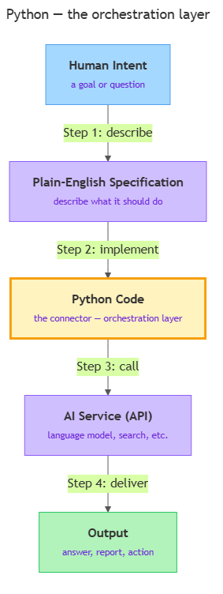

<!-- nav:top:start -->
[⬅ Previous: 10.7 — Writing a post-mortem](../../../../../m4-human-cognition-and-ai-oversight/week-10/4-post-mortem-writing/10-7-writing-a-post-mortem-what-failed-why-who-was-accountable-wh/artifacts/reading.md)&emsp;·&emsp;[⬆ Table of Contents](../../../../../../../README.md#curriculum-topic-index)&emsp;·&emsp;[Next: 11.2 — Setting up Google Colab ➡](../../11-2-setting-up-google-colab-no-installation-runs-in-the-browser/artifacts/reading.md)
<!-- nav:top:end -->

---

# Python's role — the orchestration layer connecting your specification to an AI system

## Overview

You have spent ten weeks learning to think about problems — drawing flowcharts, writing pseudocode, and studying how AI systems make decisions responsibly. Now comes the practical question: how do you actually tell a computer or an AI system what to do? The answer, in this course, is Python. Python is not just a list of commands — it is a **connector** that sits between your idea and the system that carries it out, translating your intent into something a machine can act on [1][5].

## Key Concepts

### The orchestration layer

Imagine a business meeting where two sides each speak a different language. A skilled translator sits in the middle, making sure the intent on one side travels correctly to the other. Python plays that translator role between you and an AI system [1][5].

The formal term for this role is **orchestration layer** — software whose job is to coordinate other components: receive instructions, call the right services in the right order, and assemble a result [1].

The four-layer model shows how an idea travels from a person's mind to a running system:

*The four-layer pipeline: Python sits in the middle, connecting your specification to the AI service.*

The diagram above shows each layer as a distinct responsibility. Here is what happens at each arrow:

1. **Human intent → Specification.** You decide what you want and write it in plain English before writing any code.
2. **Specification → Python code.** You turn the specification into Python statements the computer can execute.
3. **Python code → AI API call.** Python sends a request to an AI service and receives a response.
4. **AI API call → Output.** Python takes the AI's response and does something useful: displays it, stores it, or passes it to the next step.

An **API (Application Programming Interface)** is a defined way for one piece of software to talk to another. You do not need the technical details yet — those come in week 12. What matters now is that Python gives you one consistent language for calling any AI service [1]. Without it, you would need a different approach for every service you use [4].

### Coordinating multiple AI services

Python becomes even more powerful when a single program coordinates more than one AI service. Imagine a program that receives a user's question, sends it to a **search API** (a service that retrieves web pages), then sends those results to a **language model API** (a service that generates text), and finally formats the combined answer for the screen [1][4].

Neither service knows the other exists. Python knows about both and stitches their outputs together. This is orchestration: Python is not the AI — Python is the director.

### Python as a language — just enough for now

**Python** is a programming language — a formal, precise notation that a computer can interpret and execute [1]. A few properties matter for understanding its role:

- It is **interpreted**: the computer reads and executes your code line by line. Write a line; it runs immediately. This makes experimenting fast and fixing mistakes easy [1].
- It is **general-purpose**: it can process text, call web services, do maths, interact with files, and talk to AI APIs [1][4].
- It has a **standard library** (pre-written tools bundled with Python) plus thousands of **packages** — add-on tool collections the community has built. Packages such as `openai` and `anthropic` let you call AI services without writing low-level network code [1][4].
- It runs in **Google Colab** — a free, browser-based environment with no installation required [2]. You open a web page, type Python, and it runs. This is how you will work throughout the course.

The **syntax** — the rules for writing valid Python code — is covered in topics 11.2–11.6. Variables [3], data types, loops, and conditionals all come there. For now, hold the concept: Python is the language you use to write the orchestration layer.

Two kinds of problems you will encounter when you start coding are worth knowing about now:

| Problem type | What it means | When it appears |
|---|---|---|
| **Syntax error** | Bad grammar — Python cannot read the instruction | Before the program runs |
| **Runtime error** | Valid grammar, but a problem arises during execution | While the program is running |

Neither means failure. Python tells you exactly where the problem is [1][4].

Because Python is interpreted, it supports the **REPL (Read-Evaluate-Print Loop)** — an interactive mode where you type one instruction, press Enter, and see the result immediately. In Google Colab [2], every code cell is a mini-REPL: write a few lines, run the cell, see the output, adjust. This fast feedback loop is one reason Python became the language of choice for AI work [1][5].

### Why the AI ecosystem converged on Python

The major AI organisations — OpenAI (GPT series), Anthropic (Claude series), Google (Gemini series), and Hugging Face (open-source models) — all publish their official developer documentation and code examples in Python first [1][5]. When a new AI model is released anywhere in the world, the first code example available is almost always Python.

This creates a reinforcing cycle: researchers publish in Python because that is where the tools are; tools are built for Python because that is where the researchers are [4][5].

**PyPI (Python Package Index)** hosts over 500,000 packages [1][4]. For every task in AI work — calling a language model, processing PDFs, handling spreadsheets — there is almost always a package someone has already written. Installing it takes a single command.

You are not choosing an arbitrary language. You are joining the standard toolchain that the industry uses [4].

## Worked Example

Here is a concrete orchestration scenario you will encounter in professional AI work: a research assistant that takes a question and returns a structured summary.

The Python orchestration layer for that tool works like this:

1. Accept the researcher's typed question.
2. Call a search API to fetch relevant documents or abstracts.
3. Pass the fetched content and the original question to a language model with instructions to summarise the key points.
4. Receive the language model's structured response.
5. Format the response — question at the top, summary below, sources listed — and display it or save it to a file.

Every step is a Python instruction. The researcher types a question; Python does everything else [1][4][5]. The language model handles only step 3 — the analysis. Python is responsible for fetching, preparing, routing, collecting, and delivering.

Before writing any of that code, try mapping it in plain English first (as Exercise A below suggests). You already know how to think in this structured way from your flowchart and pseudocode work in M1. The syntax to implement these steps — variables [3], loops, functions — arrives in topics 11.2–11.6.

## In Practice

Python as an orchestration layer is how production AI systems are built, not just a teaching abstraction [1][4]. Two patterns appear repeatedly:

**Customer-facing chatbot:**
- Receives a customer's message from a website.
- Formats the message into a structured request for a language model.
- Calls the language model's API and receives a response.
- Applies safety and quality checks — the human-in-the-loop safeguards from M4.
- Returns the response to the customer and logs the interaction.

The AI model is one component. Python orchestrates the entire pipeline [1][4].

**Document summarisation pipeline:**
- Accepts a folder of PDF documents.
- Extracts text from each PDF using a Python package.
- Sends each document's text to a language model with a summarisation instruction.
- Collects the responses and writes them into a structured spreadsheet.

Python is responsible for every step except the analysis [1][4][5].

Key practices to carry forward:

- Keep the orchestration layer's responsibilities clear — Python moves and transforms data; it does not make judgement calls that should belong to a human [1][4].
- Write out each pipeline step in plain English before touching code; label what data enters, what the step does, and what leaves [4][5].
- "It ran without an error" does not mean "it is correct." Always check outputs against what you expected [1].
- Use Google Colab [2] for all coursework — free, browser-based, no installation.
- Learn spec-first discipline (topic 11.7) and the golden rule (topic 11.8) before writing substantial code [4][5].

## Key Takeaways

- Python is an **orchestration layer**: it connects your plain-English specification to AI (and other) services, translating human intent into executable calls [1][5].
- The **four-layer model** — human intent → specification → Python code → AI API call → output — describes how an idea travels from a person's mind to a running system.
- Python can coordinate **multiple AI services** in one pipeline, calling each in sequence and assembling their outputs [1][4].
- Python is **interpreted** and **general-purpose**: code runs line by line, the REPL in Google Colab [2] lets you test one instruction at a time, and the language connects to almost any service [1][5].
- The AI ecosystem — OpenAI, Anthropic, Google, Hugging Face — publishes Python SDKs and documentation first, making Python the de facto standard for AI orchestration [1][4][5].
- The **spec-first discipline** (topic 11.7) and the **golden rule** (topic 11.8) make the orchestration layer reliable — they are covered next.

## References

1. Python Software Foundation. *The Python Tutorial*. https://docs.python.org/3/tutorial/
2. Google. *Google Colaboratory*. https://colab.research.google.com/
3. Real Python. *Python Variables*. https://realpython.com/python-variables/
4. Sweigart, A. *Automate the Boring Stuff with Python*. https://automatetheboringstuff.com/
5. Harvard University. *CS50's Introduction to Programming with Python*. https://cs50.harvard.edu/python/

---
<!-- nav:bottom:start -->
[⬅ Previous: 10.7 — Writing a post-mortem](../../../../../m4-human-cognition-and-ai-oversight/week-10/4-post-mortem-writing/10-7-writing-a-post-mortem-what-failed-why-who-was-accountable-wh/artifacts/reading.md)&emsp;·&emsp;[⬆ Table of Contents](../../../../../../../README.md#curriculum-topic-index)&emsp;·&emsp;[Next: 11.2 — Setting up Google Colab ➡](../../11-2-setting-up-google-colab-no-installation-runs-in-the-browser/artifacts/reading.md)
<!-- nav:bottom:end -->
