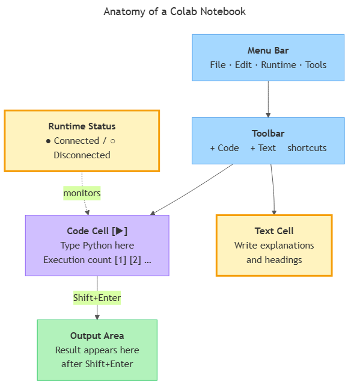

<!-- nav:top:start -->
[⬅ Previous: 11.1 — Python's role](../../11-1-pythons-role-the-orchestration-layer-connecting-your-specifi/artifacts/reading.md)&emsp;·&emsp;[⬆ Table of Contents](../../../../../../../README.md#curriculum-topic-index)&emsp;·&emsp;[Next: 11.3 — Variables ➡](../../../2-core-python-concepts/11-3-variables-naming-and-storing-values/artifacts/reading.md)
<!-- nav:top:end -->

---

# Setting up Google Colab — no installation, runs in the browser

## Overview

In topic 11.1 you met Google Colab by name as the place you will write Python throughout this course. Now it is time to actually open it, understand what you are looking at, and run your first line of code. Colab is a free, browser-based programming environment provided by Google — no software to install, no version mismatches, no setup errors [1]. Everything you need is a Google account and a modern web browser.

## Key Concepts

### What Colab is and why no installation is needed

When you press the run button in Colab, your code does not execute on your laptop. Instead, it is sent over the internet to a computer operated by Google called a **server** — a remote machine that runs the code and sends the result back to your browser as output [3]. Your machine is just displaying the interface; the actual computing happens on Google's hardware. This is why Colab works just as well on a cheap Chromebook as on a high-end laptop.

The only requirement on your side: a Google account (a Gmail address provides one) and any modern browser such as Chrome, Firefox, or Edge [1].

### The notebook: the fundamental unit of work

Everything in Colab lives inside a **notebook** — a single file that holds code, output, and explanatory writing all in one place [2]. Notebook files are stored with the extension `.ipynb`. You will produce, save, and submit `.ipynb` files throughout this course.

### Cells: code cells and text cells

Every notebook is made of building blocks called **cells** [3]. There are two types:

- **Code cell** — where you type Python. When you run it, the code is sent to Google's server, executed, and the result appears directly below in the **output area**. The output area can show numbers, text, tables, images, or error messages.
- **Text cell** — where you write plain English: headings, descriptions, reflections. Text cells do not run Python. They exist so you can explain your reasoning alongside your code. (The formatting system used in text cells is called **Markdown** — for example, `**word**` makes text bold — but you can also write plain text with no special symbols and it will display fine [2].)

Think of it this way: code cells tell the computer what to do; text cells tell the reader what is happening and why.

**Adding a new cell:** hover near the bottom of any existing cell and two buttons appear — `+ Code` and `+ Text`. Click either to insert below. The keyboard shortcut for a new code cell is **Ctrl+M B** (Cmd+M B on Mac) [2].

### The anatomy of a Colab notebook

*The diagram shows how the Menu Bar and Toolbar sit above the cell area; Code Cells connect to the Output Area below them, and Runtime Status monitors the running Code Cell.*

When you open a Colab notebook you see these key areas [2][3]:

| Area | Location | Purpose |
|---|---|---|
| **Menu bar** | Very top | File, Edit, Insert, Runtime, Tools menus |
| **Toolbar** | Below menu bar | Quick-access `+ Code` and `+ Text` buttons |
| **Cell area** | Centre | Your cells, in order from top to bottom |
| **Output area** | Below each code cell | Results after a cell runs |
| **Runtime status** | Top-right corner | Green dot = connected; grey dot = disconnected |

The runtime status is the first thing to check when you open a notebook. If it shows "Disconnected", click **Connect** before running anything.

### Running a code cell

To run a code cell, use either method [2][3]:

1. Click the **play button** on the left edge of the cell.
2. Press **Shift+Enter** — runs the cell and moves the cursor to the next one.

When you run a cell:
- A spinning circle replaces the play button while the code executes.
- The brackets on the left fill in with a number — for example, `[1]`. This is the **execution count**: it records the order in which cells were run. The first cell you run gets `[1]`, the next gets `[2]`, and so on.
- The result appears in the output area below.

One common beginner mistake: assuming code written above another cell has already run. **Only cells you have explicitly run are in effect.** If you write code in cell 1 but never press run, that code has no effect on cell 2, even though it appears above it in the notebook.

If the code has a problem, the output area shows an error message in red — a **syntax error** (code written incorrectly, like a typo) or a **runtime error** (code written correctly but something went wrong while executing). Both terms are from topic 11.1.

### The runtime and the session

The **runtime** is the remote Google computer currently assigned to your notebook [3][4]. A **session** is the period during which that runtime is active and connected.

A session ends when:
- The browser tab is left idle for roughly 90 minutes and Colab disconnects it [4].
- You choose Runtime → Disconnect and delete runtime.
- You restart the runtime manually.

**What is lost when a session ends:** any results computed by running code and any files temporarily uploaded to the runtime. **What is NOT lost:** the code in your cells, which is saved to Google Drive separately. When you reconnect, re-run the cells from the top to rebuild the results. This is why the execution count resets to `[1]` on reconnect — the runtime is a fresh slate.

### Saving your work

Colab saves your notebook to **Google Drive** automatically every few minutes [5]. You can also save manually with **Ctrl+S** (Cmd+S on Mac). Look for "All changes saved" near the top of the screen to confirm.

To submit a notebook, go to **File → Download → Download .ipynb**. This saves the file to your computer with both code cells and text cells intact [5]. Keep the `.ipynb` format for submission — it preserves the explanatory text cells that are part of what reviewers read.

## Worked Example

Here is the first-notebook procedure you will repeat at the start of every lab:

1. **Open Colab.** Go to colab.research.google.com [1]. Sign in with your Google account if prompted.
2. **Create a new notebook.** Click `+ New notebook` (or File → New notebook). A blank notebook opens with one empty code cell.
3. **Check runtime status.** Top-right corner — if it shows "Disconnected", click **Connect** and wait for a green dot or a RAM/Disk bar to appear.
4. **Type in the code cell.** Click inside the code cell and type: `2 + 2`
5. **Run the cell.** Press Shift+Enter. The number `4` appears in the output area. The brackets become `[1]`.
6. **Add a text cell.** Click `+ Text` in the toolbar. Type: `This is my first Colab notebook.` Press Shift+Enter to render it.
7. **Save the notebook.** Press Ctrl+S and confirm "All changes saved" appears.

You have just created a notebook, run code, written a text cell, and saved your work. Every lab in this course follows this same loop.

## In Practice

- **Run cells top to bottom.** Cells can affect each other — results from one cell are available in cells that run after it (you will learn exactly how through variables in topic 11.3). Running cells out of order leads to confusing results. Use **Runtime → Restart and run all** to verify your notebook runs cleanly from top to bottom [3].
- **Name notebooks immediately.** A new notebook defaults to "Untitled0.ipynb". Click the name at the top and give it a clear name (e.g. `week11-lab-gradecalculator`). Notebooks accumulate quickly in Drive.
- **Treat disconnects as normal.** On the free tier, Colab reclaims idle runtimes. When this happens, click Reconnect and re-run from the top [4]. It is expected behaviour, not a bug.
- **Autosave saves cells, not live state.** After reopening a notebook, always re-run to restore computed results — autosave only preserves what was in the cells at the time of saving, not the runtime's memory [4].

## Key Takeaways

- **Colab runs entirely in the browser** — no installation needed because your code executes on Google's servers, not your machine. You only need a Google account [1].
- **A notebook is made of two cell types.** Code cells run Python; text cells hold explanatory writing. Both live together in a single `.ipynb` file [2][3].
- **Running a cell sends it to the runtime.** The output appears below the cell. Use the play button or Shift+Enter. The execution count tracks the order cells were run [2].
- **A session is temporary.** When the runtime disconnects, computed results are lost — but your code is saved to Google Drive and survives. Reconnect and re-run from the top [4].
- **Save deliberately.** Autosave is on, but confirm with "All changes saved" or Ctrl+S. For submission, download the `.ipynb` file [5].

## References

[1] Google Colab homepage — https://colab.research.google.com/

[2] Official Colab intro notebook — https://colab.research.google.com/notebooks/intro.ipynb

[3] Colab features overview notebook — https://colab.research.google.com/notebooks/basic_features_overview.ipynb

[4] Official Colab FAQ — https://research.google.com/colaboratory/faq.html

[5] Colab I/O notebook — https://colab.research.google.com/notebooks/io.ipynb

---
<!-- nav:bottom:start -->
[⬅ Previous: 11.1 — Python's role](../../11-1-pythons-role-the-orchestration-layer-connecting-your-specifi/artifacts/reading.md)&emsp;·&emsp;[⬆ Table of Contents](../../../../../../../README.md#curriculum-topic-index)&emsp;·&emsp;[Next: 11.3 — Variables ➡](../../../2-core-python-concepts/11-3-variables-naming-and-storing-values/artifacts/reading.md)
<!-- nav:bottom:end -->
