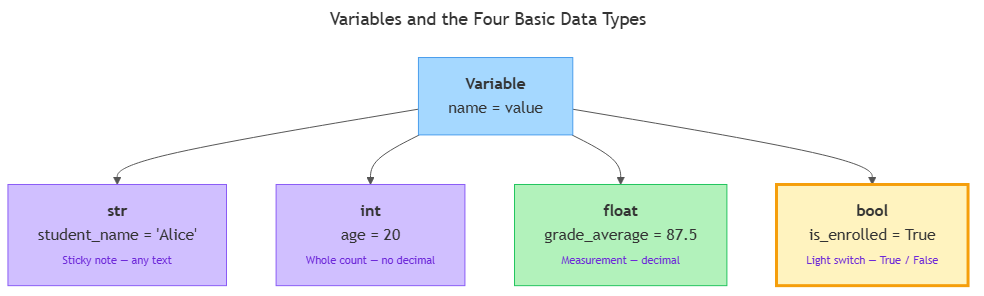

<!-- nav:top:start -->
[⬅ Previous: 11.2 — Setting up Google Colab](../../../1-getting-started-with-python/11-2-setting-up-google-colab-no-installation-runs-in-the-browser/artifacts/reading.md)&emsp;·&emsp;[⬆ Table of Contents](../../../../../../../README.md#curriculum-topic-index)&emsp;·&emsp;[Next: 11.4 — Data types ➡](../../11-4-data-types-string-integer-float-boolean/artifacts/reading.md)
<!-- nav:top:end -->

---

# Variables — naming and storing values

## Overview

Before a Python program can calculate a grade, call an AI model, or process a document, it needs somewhere to keep the information it is working with. A **variable** is a named label that points to a value in the computer's memory — the single most fundamental idea in programming [3]. In this topic you will learn how to create variables, what kinds of values they can hold, and the naming rules Python requires and the conventions professionals follow.

## Key Concepts

### What a variable is

Think about a sticky note. You write something on it — a name, a number, a reminder — and place it where you can find it later. A variable in Python works the same way: you give a piece of information a name, and Python holds onto it so you can use it again whenever you need it [3][5].

The key mental model: a variable is a **label** that points to a value, not a box that contains it. At any moment you can read what the label says, move it to a new value, or throw it away entirely [3].

You create a variable using the **assignment operator** — the `=` sign [1][3]:

```python
student_name = "Alice"
```

- `student_name` — the variable name (the label you chose).
- `"Alice"` — the value the label is pointing to.
- `=` — the assignment operator: "make this name point to this value" [3][5].

Important: `=` in Python does **not** mean "equal" the way it does in maths. It is an instruction — "evaluate the right side and point the name on the left at the result." Read every assignment right to left [3].

### The four basic data types

Not all values are the same kind of thing. The number `20` is different from the text `"Alice"`. Python uses the concept of a **data type** (often shortened to **type**) to tell those differences apart [2][4].


*The diagram shows a Variable node connecting to the four data types (str, int, float, bool), each with an everyday analogy and example value.*

The four types you will use constantly [2][4]:

**`str` — string (text)**
A **string** is a sequence of characters — letters, digits, spaces, punctuation — always wrapped in quotation marks (single `'` or double `"`) [1][2]. Think of a sticky note with words on it; the note can say anything, but it is always treated as text, never as a number to calculate with [4][5].

```python
student_name  = "Alice"
course_title  = "Python for AI"
student_id    = "20240071"   # digits inside quotes are still text, not a number
```

**`int` — integer (whole number)**
An **integer** is a whole number with no decimal point [1][2]. Think of counting whole items — 6 eggs, 3 marks, 12 students. There is no fraction; it is always a complete count [4].

```python
age           = 20
marks_out_of  = 100
student_count = 3
```

**`float` — floating-point (decimal number)**
A **float** is a number that can have a decimal point, representing fractional or continuous values [1][2]. Think of a measurement — 1.75 metres, a grade average of 87.5 [4].

```python
height_m      = 1.75
grade_average = 87.5
```

**`bool` — Boolean (True or False)**
A **Boolean** holds exactly one of two values: `True` or `False` [2][4]. Note the capital letter — Python requires `True` and `False` with an uppercase first letter; `true` and `false` (lowercase) produce a runtime error (the kind described in topic 11.1) [2]. Think of a light switch: on (`True`) or off (`False`), nothing in between [4][5].

```python
is_enrolled    = True
has_submitted  = False
```

### Checking a type with `type()`

Python provides a built-in function called `type()` that tells you the data type of any value or variable [1][2]. Use it whenever you are unsure what kind of value you are working with:

```python
print(type(student_name))    # <class 'str'>
print(type(age))             # <class 'int'>
print(type(grade_average))   # <class 'float'>
print(type(is_enrolled))     # <class 'bool'>
```

(The `print()` function is explained fully in topic 11.4; for now, just know that `print(something)` displays the value of `something` in the output area of your notebook.)

The output shows `<class 'str'>`, `<class 'int'>`, etc. Ignore the word `class` — it is just how Python reports the type. What matters is the name after it [2]. Checking types early prevents a common class of errors: trying to do arithmetic with a string, or treating a number as if it were text [3][4].

### Variable naming rules

Python has strict rules about valid names [1][3][5]:

**Rules you must follow:**
1. Names may contain letters (`a`–`z`, `A`–`Z`), digits (`0`–`9`), and underscores (`_`).
2. Names **cannot start with a digit** — `3marks` is invalid; `marks_3` is valid [3][5].
3. Names **cannot contain spaces** — `student name` is invalid; `student_name` is valid [3][5].
4. Names are **case-sensitive** — `age`, `Age`, and `AGE` are three different variables [3].
5. Names cannot be Python's **reserved words** — keywords like `if`, `for`, `True`, `False`, `import`, `return` already have special meanings and cannot be used as labels [1][3].

**Conventions you should follow:**
- **snake_case** — all lowercase, underscores between words: `student_name`, `grade_average`, `is_enrolled` [3][5].
- **Descriptive names** — `grade_average` is clear; `g` or `x` is not [3][5].

| Name | Valid? | Reason |
|---|---|---|
| `student_name` | Yes | Lowercase, snake_case, descriptive |
| `grade_average` | Yes | Descriptive, snake_case |
| `3marks` | No | Starts with a digit |
| `student name` | No | Contains a space |
| `if` | No | Reserved keyword |
| `StudentName` | Yes (but avoid) | Valid syntax, not snake_case convention |

Code is read far more often than it is written — by you later, by teammates, by AI tools helping you [3]. Readable names make everything easier.

### Reassignment — variables can change

A variable's value is not fixed. You can point it at a new value at any time [1][3][5]:

```python
score = 55
score = 72     # score now points to 72; 55 is no longer accessible through this name
```

Python also allows a variable that held an integer to later hold a string. This flexibility is part of what makes Python a **dynamically typed** language — the type is associated with the value, not locked to the variable name, so you never need to declare "this variable holds integers" in advance [3]. While dynamic typing is convenient, good practice is to keep a variable's role consistent throughout a program to avoid confusing code [3][5].

## Worked Example

The following snippet uses all four data types together and shows `type()` in action. Read it as a whole, then line by line.

```python
# Student record — variables for one student

<!-- nav:top:start -->
[⬅ Previous: 11.2 — Setting up Google Colab](../../../1-getting-started-with-python/11-2-setting-up-google-colab-no-installation-runs-in-the-browser/artifacts/reading.md)&emsp;·&emsp;[⬆ Table of Contents](../../../../../../../README.md#curriculum-topic-index)&emsp;·&emsp;[Next: 11.4 — Data types ➡](../../11-4-data-types-string-integer-float-boolean/artifacts/reading.md)
<!-- nav:top:end -->

---

student_name  = "Alice"       # str   — name as text
student_id    = "20240071"    # str   — ID treated as text, not a number
age           = 20            # int   — whole years
grade_average = 87.5          # float — calculated average mark
is_enrolled   = True          # bool  — currently registered?

print(type(student_name))     # <class 'str'>
print(type(student_id))       # <class 'str'>
print(type(age))              # <class 'int'>
print(type(grade_average))    # <class 'float'>
print(type(is_enrolled))      # <class 'bool'>
```

Try this yourself in a Google Colab code cell (as introduced in topic 11.2) [5]:

1. Open a new code cell.
2. Type the code above — typing beats copying for learning.
3. Press Shift+Enter to run the cell.
4. Match each line of output to the variable that produced it.
5. Change `grade_average` to a whole number (e.g., `grade_average = 87`) and re-run. What does `type()` report now?

This pattern — assign a variable, then immediately check its type — is a useful habit when you are starting out [3][4].

## In Practice

Variables are not a beginner's exercise — they are how every piece of data enters and moves through a real Python program [3][4].

**In AI pipelines**, every output from a model is captured in a variable before the next step does anything with it [4]:

```python
user_question  = "What is photosynthesis?"    # str
model_response = call_ai_model(user_question) # hypothetical — API calls covered in week 12
```

Every subsequent step — checking response length, extracting a part of it, logging it — works through the `model_response` variable.

**In data processing**, variables hold intermediate results as the program progresses. Storing three exam marks, calculating their average, and classifying the result each requires its own named variable — each one is a checkpoint [3][4].

**In configuration**, boolean variables control program behaviour:

```python
debug_mode   = True    # if True, extra information is printed
save_to_file = False   # if False, output goes to screen instead of file
```

Changing one line changes the whole behaviour of the program [4][5].

**Do / Don't:**

| Do | Don't |
|---|---|
| Choose descriptive names (`grade_average`) | Use single letters (`g`, `x`) for non-trivial values |
| Use snake_case throughout | Mix conventions (`GradeAverage` vs `grade_average`) |
| Keep a variable's role consistent | Reuse one name for unrelated values |
| Call `type()` when something misbehaves | Guess the type and debug blindly |

## Key Takeaways

- A **variable** is a named label pointing to a value in memory. The `=` operator assigns a value to a name — it does not test equality [3][5].
- Python has four fundamental data types: **`str`** (text), **`int`** (whole numbers), **`float`** (decimal numbers), and **`bool`** (`True` or `False`). Every value has one of these types [2][4].
- Use **`type()`** at any time to find out what data type a variable or value holds — one of the fastest debugging tools for type-related errors [1][2].
- Variable names must follow Python's rules: start with a letter or underscore, no spaces, no reserved keywords. By convention, use **snake_case** and choose **descriptive names** [3][5].
- Variables can be **reassigned** to a new value at any point. Python is dynamically typed, but good practice is to keep each variable's role consistent throughout a program [3][4].

## References

1. Python Software Foundation. *The Python Tutorial — An Informal Introduction to Python*. https://docs.python.org/3/tutorial/introduction.html
2. Python Software Foundation. *Built-in Types*. https://docs.python.org/3/library/stdtypes.html
3. Sturtz, J. *Python Variables*. Real Python. https://realpython.com/python-variables/
4. Real Python. *Basic Data Types in Python*. https://realpython.com/python-data-types/
5. W3Schools. *Python Variables*. https://www.w3schools.com/python/python_variables.asp

---
<!-- nav:bottom:start -->
[⬅ Previous: 11.2 — Setting up Google Colab](../../../1-getting-started-with-python/11-2-setting-up-google-colab-no-installation-runs-in-the-browser/artifacts/reading.md)&emsp;·&emsp;[⬆ Table of Contents](../../../../../../../README.md#curriculum-topic-index)&emsp;·&emsp;[Next: 11.4 — Data types ➡](../../11-4-data-types-string-integer-float-boolean/artifacts/reading.md)
<!-- nav:bottom:end -->
