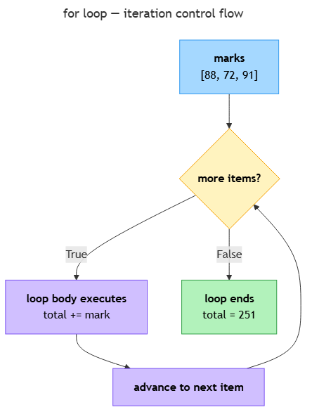

<!-- nav:top:start -->
[⬅ Previous: 11.5 — If / else](../../11-5-if-else-writing-decision-logic-in-code/artifacts/reading.md)&emsp;·&emsp;[⬆ Table of Contents](../../../../../../../README.md#curriculum-topic-index)&emsp;·&emsp;[Next: 11.7 — Spec-first discipline ➡](../../../3-professional-coding-discipline/11-7-spec-first-discipline-writing-the-plain-english-specificatio/artifacts/reading.md)
<!-- nav:top:end -->

---

# For loops — repeating an action across a list

## Overview

In the grade-average script you built across topics 11.3–11.5, you stored marks in three separate variables and added them like this: `total = mark1 + mark2 + mark3`. That works when you always have exactly three marks. The moment a student sits a fourth assessment, you must rewrite that line. A program that breaks whenever the data changes is fragile [1][2].

This topic introduces two new tools that eliminate that fragility: the **list** — Python's ordered collection of values — and the **for loop**, which repeats an action for every item in that list. Together they let you write one loop that handles three marks, ten marks, or a hundred marks without changing a single line of loop code — the list grows, not the program [1][2][5].

## Key Concepts

### Lists — an ordered collection

A **list** stores multiple values in a single variable, enclosed in square brackets and separated by commas [2][5]:

```python
marks = [88, 72, 91]
names = ["Alice", "Bob", "Charlie"]
```

Each value is called an **element**. Elements are stored in order. You access them by **index** — the same zero-based counting used for string characters in 11.4 [1][5]:

```python
marks = [88, 72, 91]
print(marks[0])   # 88
print(marks[1])   # 72
print(marks[2])   # 91
print(len(marks)) # 3
```

`len()` — already familiar from strings — returns the number of elements in a list.

### The for loop



A `for` loop visits every item in a sequence one at a time and runs the same indented block for each [1][2][3]:

```python
marks = [88, 72, 91]
for mark in marks:
    print(mark)
```

Output:
```
88
72
91
```

The loop has four parts:

| Part | Example | Role |
|---|---|---|
| `for` keyword | `for` | opens the loop |
| loop variable | `mark` | receives each item in turn |
| `in` + sequence | `in marks` | the collection to iterate |
| indented body | `print(mark)` | code that runs once per item |

Python takes the first element (88), assigns it to `mark`, runs the body; then takes the second (72), and so on until there are no elements left [1][2]. The indentation rule from 11.5 applies unchanged: the loop body is indented 4 spaces.

Name the loop variable as the singular of the list (`mark` for `marks`, `name` for `names`) — this reads almost like English [2].

### range() — a sequence of integers

`range()` generates a sequence of integers on demand, so you can loop a fixed number of times without first building a list [1][4]:

| Call | Generates |
|---|---|
| `range(3)` | 0, 1, 2 |
| `range(1, 4)` | 1, 2, 3 |
| `range(0, 10, 2)` | 0, 2, 4, 6, 8 |

```python
for i in range(3):
    print(i)   # prints 0, then 1, then 2
```

`range(n)` starts at 0 and stops before n — the same zero-based counting as list indices. To get 1, 2, 3 use `range(1, 4)` [4].

### The accumulator pattern

The most important pattern built on the for loop: start with a zero value, update it inside the loop, read the result after [1][2]:

```python
marks = [88, 72, 91]
total = 0               # initialise BEFORE the loop
for mark in marks:
    total += mark       # total = total + mark
print(total)            # 251
```

`total += mark` is shorthand for `total = total + mark`. After the loop, `total` holds the sum of every element. Divide by `len(marks)` to get the average [1][2]:

```python
average = total / len(marks)   # 83.666...
```

A counting accumulator uses the same shape but adds 1 instead of the item value:

```python
pass_count = 0
for mark in marks:
    if mark >= 60:        # if/else from 11.5 inside the loop
        pass_count += 1
print(pass_count)   # 3
```

The loop body can contain any code introduced in prior topics — including `if`/`else`. When `if` is inside `for`, indent it 4 spaces inside the loop body (8 spaces from the margin) [1][2].

## Worked Example

The complete generalised grade-average script replaces the three separate mark variables with a list and an accumulator loop:

```python
# Marks stored in one list

<!-- nav:top:start -->
[⬅ Previous: 11.5 — If / else](../../11-5-if-else-writing-decision-logic-in-code/artifacts/reading.md)&emsp;·&emsp;[⬆ Table of Contents](../../../../../../../README.md#curriculum-topic-index)&emsp;·&emsp;[Next: 11.7 — Spec-first discipline ➡](../../../3-professional-coding-discipline/11-7-spec-first-discipline-writing-the-plain-english-specificatio/artifacts/reading.md)
<!-- nav:top:end -->

---
marks = [88, 72, 91]

# Accumulator: compute total

<!-- nav:top:start -->
[⬅ Previous: 11.5 — If / else](../../11-5-if-else-writing-decision-logic-in-code/artifacts/reading.md)&emsp;·&emsp;[⬆ Table of Contents](../../../../../../../README.md#curriculum-topic-index)&emsp;·&emsp;[Next: 11.7 — Spec-first discipline ➡](../../../3-professional-coding-discipline/11-7-spec-first-discipline-writing-the-plain-english-specificatio/artifacts/reading.md)
<!-- nav:top:end -->

---
total = 0
for mark in marks:
    total += mark

# Average and grade

<!-- nav:top:start -->
[⬅ Previous: 11.5 — If / else](../../11-5-if-else-writing-decision-logic-in-code/artifacts/reading.md)&emsp;·&emsp;[⬆ Table of Contents](../../../../../../../README.md#curriculum-topic-index)&emsp;·&emsp;[Next: 11.7 — Spec-first discipline ➡](../../../3-professional-coding-discipline/11-7-spec-first-discipline-writing-the-plain-english-specificatio/artifacts/reading.md)
<!-- nav:top:end -->

---
average_rounded = round(total / len(marks), 1)

if average_rounded >= 90:
    grade = "A"
elif average_rounded >= 80:
    grade = "B"
elif average_rounded >= 70:
    grade = "C"
elif average_rounded >= 60:
    grade = "D"
else:
    grade = "F"

print("Average: " + str(average_rounded) + "  Grade: " + grade)
```

Output:
```
Average: 83.7  Grade: B
```

To handle a fourth assessment later, add one number to the `marks` list. The loop, accumulator, and grade logic stay identical — this is why storing data in a list beats storing it in separate variables [1][2].

**Collecting marks from the user** (combining `input()` from 11.5 with `range()` and `append()`):

```python
marks = []
for i in range(3):
    mark = int(input("Mark " + str(i + 1) + ": "))
    marks.append(mark)   # adds the new mark to the end of the list
```

`marks.append(mark)` grows the list by one element per iteration. After the loop, `marks` holds all three marks and the accumulator pattern above can run unchanged [5].

## In Practice

**AI batch processing.** Production AI systems process lists of inputs, not single inputs. A list of customer reviews, student essays, or support tickets is processed by iterating over it with a for loop: visit each item, pass it to the AI function, and collect the result into a new list [2]. The accumulator pattern (`.append()` to a results list) gathers every output into a single collection for analysis.

**Data validation loops.** Before running a machine-learning model, a data engineer loops over the input list and counts items that fail a quality check (`if value is None: bad_count += 1`). If `bad_count` is above a threshold, the pipeline stops [1][2].

**range() for labelled output.** When you need `Mark 1:`, `Mark 2:`, etc., use `range(len(marks))` and access `marks[i]` by index. Python also provides `enumerate()` — which gives both the index and the value in one step — introduced in a later topic [1].

## Key Takeaways

- A **list** stores an ordered sequence of values in square brackets; elements are zero-indexed; `len()` returns the count [1][5].
- A `for` loop visits every item in a list (or `range()` sequence) in delivery order, running the indented body once per item [1][2][3].
- `range(n)` generates 0 through n−1; `range(start, stop)` generates start through stop−1 [4].
- The **accumulator pattern** — initialise to zero before the loop, update inside, read after — computes sums, counts, and other running totals [1][2].
- The loop body can contain any prior Python code, including `if`/`else`; nesting adds another 4 spaces of indentation [1][2].

## References

1. Python Software Foundation. *More Control Flow Tools — for Statements*. https://docs.python.org/3/tutorial/controlflow.html#for-statements
2. Real Python. *Python "for" Loops (Definite Iteration)*. https://realpython.com/python-for-loop/
3. W3Schools. *Python For Loops*. https://www.w3schools.com/python/python_for_loops.asp
4. Python Software Foundation. *Built-in Functions — range()*. https://docs.python.org/3/library/functions.html#func-range
5. Real Python. *Lists and Tuples in Python*. https://realpython.com/python-lists-tuples/

---
<!-- nav:bottom:start -->
[⬅ Previous: 11.5 — If / else](../../11-5-if-else-writing-decision-logic-in-code/artifacts/reading.md)&emsp;·&emsp;[⬆ Table of Contents](../../../../../../../README.md#curriculum-topic-index)&emsp;·&emsp;[Next: 11.7 — Spec-first discipline ➡](../../../3-professional-coding-discipline/11-7-spec-first-discipline-writing-the-plain-english-specificatio/artifacts/reading.md)
<!-- nav:bottom:end -->
