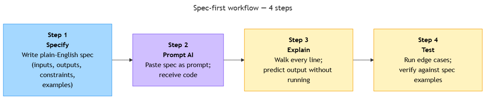

<!-- nav:top:start -->
[⬅ Previous: 11.6 — For loops](../../../2-core-python-concepts/11-6-for-loops-repeating-an-action-across-a-list/artifacts/reading.md)&emsp;·&emsp;[⬆ Table of Contents](../../../../../../../README.md#curriculum-topic-index)&emsp;·&emsp;[Next: 11.8 — The golden rule ➡](../../11-8-the-golden-rule-never-run-code-you-cannot-explain-line-by-li/artifacts/reading.md)
<!-- nav:top:end -->

---

# Spec-first discipline — writing the plain-English specification before writing or prompting code

## Overview

Before you write a single line of code — or type a single prompt to an AI — you need to write down exactly what the program is supposed to do. This written description is called a **specification** (spec for short). Writing the spec first is a discipline: it forces you to think before you build, so you catch misunderstandings on paper rather than in broken code [1][2].

## Key Concepts

### What a specification is

A **specification** is a plain-English description of a program's intended behaviour [1][2]. It has nothing to do with variables, loops, or if-statements — those are the code's job. The spec describes *what* the program does; the code describes *how* it does it.

Every specification has four parts:

| Part | Question it answers | Example |
|---|---|---|
| **Inputs** | What goes in? What type? What range? | Student name (string), 3 marks (integer, 0–100 each) |
| **Outputs** | What comes out? What format? | One line: `"Alice averaged 83.7 — Grade: B"` |
| **Constraints** | What rules govern the behaviour? | A≥90, B≥80, C≥70, D≥60, F<60; average rounded to 1 decimal place |
| **Examples** | What are 2–3 concrete input→output pairs? | Alice 88,72,91 → B; Bob 45,50,55 → F |

### Why write the spec first?

**1. Writing forces precision.** The vague phrase "the program takes marks and prints the grade" hides questions: What if there are two marks? What if a mark is 150? Filling in the spec table forces you to answer these questions before they become bugs [1][2].

**2. A spec you cannot write means a problem you do not understand.** If you cannot fill in the Inputs, Outputs, or Constraints columns, the program is not ready to be written. No amount of code — human-written or AI-generated — can fix an under-specified problem [1][2].

**3. The spec is your verification standard.** When the code runs, you check its output against the spec's examples — not against your gut feeling. If `Bob 45,50,55` should give `"Bob averaged 50.0 — Grade: F"` and it does, the code passes for that case [2][4].

**4. With AI, the spec is also the prompt.** A vague prompt gives vague code. A spec-shaped prompt gives precise, verifiable code [3][5].

### The four-step spec-first workflow


*The four-step spec-first workflow — this topic covers Steps 1 and 2; Steps 3 and 4 are introduced in topics 11.8 and 11.9.*

The workflow in order:

1. **Specify** — write the plain-English spec (this topic).
2. **Prompt the AI** — paste the spec directly into your prompt (this topic).
3. **Explain every line** — read and understand every line the AI wrote before running it (11.8).
4. **Test edge cases** — run the code with boundary inputs and verify the output matches the spec (11.9).

Steps 3 and 4 are named here so you know they exist; they are taught in the next two topics.

### Good spec vs. bad spec

A complete spec gives the AI — and you — a precise target. An incomplete spec gives neither of you anything to verify against.

**Good spec (complete):**
```
Program: Grade Average Calculator
Inputs:  student_name (string, non-empty)
         mark1, mark2, mark3 (integer, 0–100 inclusive)
Outputs: One print line: "[name] averaged [X.X] — Grade: [letter]"
Constraints:
         A if avg >= 90; B if >= 80; C if >= 70; D if >= 60; F otherwise
Examples:
         Alice, 88, 72, 91  →  Alice averaged 83.7 — Grade: B
         Bob,   45, 50, 55  →  Bob averaged 50.0 — Grade: F
```

**Bad spec (vague):**
```
Program: Grade calculator
Input: some marks
Output: print the grade
```

With the bad spec, any output the code produces could be claimed to be "correct" — because "correct" was never defined [1][2].

### The spec as a prompt ingredient

The good spec above becomes an AI prompt with one extra sentence asking for the implementation [3][5]. For example:

> *"Write Python code that takes a student name (string) and three marks (integers 0–100). It should compute the average rounded to 1 decimal place and print `[name] averaged [avg] — Grade: [letter]`, where A≥90, B≥80, C≥70, D≥60, F otherwise."*

That prompt — built directly from the spec — produces tighter, more verifiable code than a vague request like "write a grade calculator" [3][5].

## Worked Example

Here is the complete spec for the grade-average calculator, showing how each part of the spec table maps onto a real program:

**Step 1 — Identify the inputs.**
The program needs a student's name and three exam marks. Name is a string (non-empty). Each mark is an integer between 0 and 100 inclusive.

**Step 2 — Describe the output.**
One printed line per student, formatted as: `[name] averaged [X.X] — Grade: [letter]`. The average is rounded to one decimal place.

**Step 3 — State the constraints.**
Grade boundaries: A if average ≥ 90, B if ≥ 80, C if ≥ 70, D if ≥ 60, F otherwise.

**Step 4 — Write concrete examples.**

| Input | Expected output |
|---|---|
| Alice, 88, 72, 91 | `Alice averaged 83.7 — Grade: B` |
| Bob, 45, 50, 55 | `Bob averaged 50.0 — Grade: F` |

Now ask yourself: *"If I run the code with Alice 88, 72, 91, can I predict the exact output line by reading the code — without running it?"* If yes, the spec and the code agree. If not, something is wrong and you need to find it before moving on [4][5].

This is why writing examples with exact expected outputs matters. "Alice gets a B" is not specific enough. `"Alice averaged 83.7 — Grade: B"` is — it pins the number format, the separator, and the letter, leaving no room for ambiguity.

## In Practice

- **Write the spec before opening any code editor or AI chat.** Even two minutes with the four-column table surfaces assumptions you did not know you were making [1][2].
- **Paste the spec directly into your AI prompt.** Do not summarise it or paraphrase it — include the actual inputs, outputs, constraints, and examples [3][5].
- **Use the examples as your first manual test.** After the code runs, check its output against each example row in the spec. If any row fails, the code is wrong — not the spec [2][4].
- **Do not start coding if you cannot complete the spec.** A blank Constraints or Examples column is a signal to think harder, not to start typing [1][2].
- **Comments in code can echo the spec.** A short comment above a function that restates the input types and expected output keeps the spec visible inside the file, making future edits safer [4].

## Key Takeaways

- A **specification** is a written description of a program's inputs, outputs, constraints, and examples — written before any code or prompt [1][2].
- Writing the spec forces clarity: if you cannot complete the spec table, you do not yet understand the problem [1][2].
- The spec is the **verification standard**: when the code runs, you check its output against the spec's examples, not your intuition [2][4].
- The spec is also the **prompt ingredient**: pasting it directly into an AI prompt produces more precise, verifiable code than a vague request [3][5].
- The four-step workflow is: **specify → prompt → explain every line (11.8) → test edge cases (11.9)** [1][2][3].

## References

1. Fowler, M. *On the Nature of Software*. https://martinfowler.com/articles/on-the-nature-of-software.html
2. Spolsky, J. *Painless Functional Specifications — Part 1: Why Bother?* https://www.joelonsoftware.com/2000/10/02/painless-functional-specifications-part-1-why-bother/
3. Prompt Engineering Guide. *Introduction — Basics*. https://www.promptingguide.ai/introduction/basics
4. Real Python. *Writing Comments in Python*. https://realpython.com/python-comments-guide/
5. Anthropic. *Prompt Engineering Overview*. https://docs.anthropic.com/en/docs/build-with-claude/prompt-engineering/overview

---
<!-- nav:bottom:start -->
[⬅ Previous: 11.6 — For loops](../../../2-core-python-concepts/11-6-for-loops-repeating-an-action-across-a-list/artifacts/reading.md)&emsp;·&emsp;[⬆ Table of Contents](../../../../../../../README.md#curriculum-topic-index)&emsp;·&emsp;[Next: 11.8 — The golden rule ➡](../../11-8-the-golden-rule-never-run-code-you-cannot-explain-line-by-li/artifacts/reading.md)
<!-- nav:bottom:end -->
