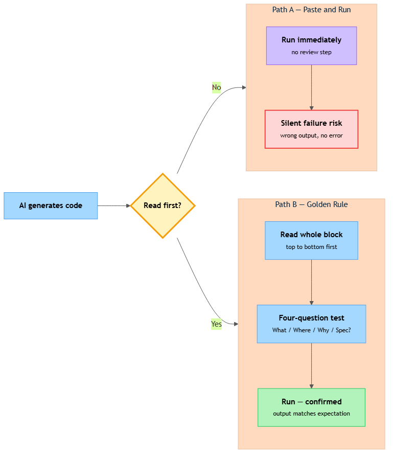

<!-- nav:top:start -->
[⬅ Previous: 11.7 — Spec-first discipline](../../11-7-spec-first-discipline-writing-the-plain-english-specificatio/artifacts/reading.md)&emsp;·&emsp;[⬆ Table of Contents](../../../../../../../README.md#curriculum-topic-index)&emsp;·&emsp;[Next: 11.9 — Edge cases ➡](../../11-9-edge-cases-testing-what-happens-at-the-boundary-of-expected/artifacts/reading.md)
<!-- nav:top:end -->

---

# The golden rule — never run code you cannot explain line by line

## Overview

When someone hands you a finished essay and asks you to defend it, the first question you get is "why did you write it this way?" — and if you never read it, you cannot answer. The same thing happens with code. AI tools can produce a working Python block in seconds, but speed creates a trap: you can run code you do not understand, get an output, and still have no idea whether that output is correct. The golden rule closes the trap — **never run code you cannot explain line by line**. This does not mean you have to write every line yourself. It means that before you run anything, you can say what every line does and why it is there.

## Key Concepts

### The two kinds of failure

Code can fail in two very different ways.

- **Loud failure** — Python raises an error message and stops. You see the problem immediately.
- **Silent failure** — Python runs without any error, but the output is quietly wrong. No warning. No red text. Just a plausible-looking result that is actually incorrect [2].

Silent failure is the more dangerous one. A loud failure tells you exactly where to look. A silent failure lets you walk away thinking everything worked [1]. Without understanding the code, you cannot tell the difference between a correct result and a quietly wrong one.


*Paste-and-run leads to silent failure with no safety net; the golden rule path adds an understanding check before execution.*

### What "explain line by line" actually means

Explaining a line is not the same as reading it out loud. It means you can answer four questions about every single line:

1. **What does this line create or change?** — What variable is set, or what value is produced?
2. **Where did the input come from?** — Is it a value you defined earlier, or something the previous line produced?
3. **Why is this line here at this point?** — What would break if you removed it or moved it?
4. **Does this match my spec?** — Does this line do what your plain-English plan said it should do?

If you cannot answer all four for a line, that line is a gap in your understanding — and a gap is where silent failures hide [1][4].

Question four is especially powerful when you use the **spec-first workflow** (from topics 11.3–11.7): write a plain-English plan before prompting. With a plan in hand, you have something concrete to compare each line against. A line that passes questions one through three but fails question four is still wrong — it just runs without telling you [3].

### "It ran without errors" is not the same as "I understand it"

This distinction matters enough to say plainly:

| Statement | What it is |
|---|---|
| "It ran without errors" | A technical fact — Python found no syntax problems |
| "I understand what the code does" | A professional standard — you can explain every line's purpose |

Running without errors is a starting point, not a finish line [3]. You have only met the professional standard when you can explain every line.

### AI code is your code once you accept it

When you ask an AI tool to write code and paste it into your notebook, ownership transfers to you — not to the AI. The AI cannot be asked to defend it. You can [1]. Accepting AI code without understanding it moves all the risk from the AI to you. It is your notebook, your output, and your responsibility to verify [4].

### Signs a line needs more investigation

If you notice any of the following, stop and investigate before running:

- A variable name you do not recognise appearing for the first time
- A function call you have not seen before in this sequence
- An off-by-one possibility (a loop that seems to process one too many or one too few items)
- A wrong default value (a variable set to `0` when your spec said to start at `1`)
- Missing edge-case handling — edge cases are covered in topic 11.9, but you will recognise a gap when your spec mentions a condition the code does not address

## Worked Example

Here is a short code block. Before running it, apply the four-question test to every line.

```python
names = ["Alice", "Bob", "Charlotte"]
total = 0
for name in names:
    total = total + len(name)
average = total / len(names)
print(average)
```

**Plain-English spec (written before prompting):** "Calculate the average mark from a list of student names."

Walk through each line:

1. `names = ["Alice", "Bob", "Charlotte"]`
   - Creates a list called `names` containing three strings.
   - Input: hard-coded values.
   - Why here: sets up the data to work with.
   - Matches spec? **No** — the spec says "marks", not "names". This is already wrong.

2. `total = 0`
   - Creates a variable `total` and sets it to zero. This is the **accumulator pattern** — a running total that starts at zero and grows with each loop pass.
   - Input: the literal `0`.
   - Why here: must exist before the loop adds to it.
   - Matches spec? Neutral — a total variable is expected.

3. `for name in names:`
   - Starts a loop. Each pass assigns one item from `names` to the variable `name`.
   - Input: the `names` list.
   - Why here: processes each item in turn.
   - Matches spec? **No** — looping over names, not marks.

4. `total = total + len(name)`
   - Adds the *length of the string* `name` to `total`. `len("Alice")` is `5`.
   - Input: `total` from the previous pass; `len(name)` from the current string.
   - Why here: accumulates lengths, not numeric values.
   - Matches spec? **No** — this accumulates character counts, not marks.

5. `average = total / len(names)`
   - Divides `total` by the number of items in `names`.
   - Input: `total` and `len(names)`.
   - Why here: computes the average.
   - Matches spec? The *formula* is correct for an average, but the *data* is wrong — this is the average name length, not the average mark.

6. `print(average)`
   - Displays the result.

**What the code produces:** `5.333...` — the average number of characters across the three names.
**What the spec asked for:** the average of a list of numeric marks.

The code runs without errors and prints a number. Without the four-question test against your spec, you might accept that number as the average mark. With the test, you catch the problem on line one.

## In Practice

Professional development teams treat this habit as standard. Code review is not just a compile check — the reviewer is responsible for understanding what each line does before approving it [1]. When that step is skipped, subtle logic errors survive into production [2]. An AI tool is not a peer sharing your responsibility — it is a tool that suggests code; you decide whether to use it [4].

**Do:**

- Read the full block top to bottom before touching the run button.
- Write the answers to the four questions as inline comments — one comment per line.
- Trace what value each variable holds at each step.
- Compare every line to your plain-English spec.
- Ask the AI to explain a line you do not follow — then verify that explanation against the four questions yourself.

**Don't:**

- Run immediately after pasting AI-generated code.
- Treat "no error" as confirmation that the code is correct.
- Explain the code only at the block level ("it calculates an average") without accounting for each line.
- Mark a line as understood when you only recognise its syntax — syntax and intent are different things.

## Key Takeaways

- **The golden rule applies every time, to every line.** "I explained most of it" is not enough — a single unexplained line is where silent failures enter.
- **Loud failure vs silent failure.** An error message is easy to catch. A wrong answer with no error message is not — and that is what unexamined code produces.
- **"It ran without errors" is a technical fact; "I understand it" is the professional standard.** Only the second one counts.
- **The four-question test makes the golden rule concrete.** Ask what each line creates, where the input came from, why it is here, and whether it matches your spec. A line you cannot answer for is a line to investigate.
- **Once you accept AI code into your notebook, it is yours.** You are the one who can be asked to explain, defend, and modify it.

## References

1. Addy Osmani, "Code Review in the Age of AI." <https://addyo.substack.com/p/code-review-in-the-age-of-ai>
2. IEEE Spectrum, "AI Coding Degrades Skill — and Introduces Silent Failures." <https://spectrum.ieee.org/ai-coding-degrades>
3. Güvencan Güven, "Stop Using AI to Write Code You Don't Understand." <https://medium.com/@guvencanguven965/stop-using-ai-to-write-code-you-dont-understand-6a10b21ebf33>
4. 8th Light, "AI-Assisted Coding Is Not Doing My Dishes and Laundry." <https://8thlight.com/insights/ai-assisted-coding-is-not-doing-my-dishes-and-laundry>

---
<!-- nav:bottom:start -->
[⬅ Previous: 11.7 — Spec-first discipline](../../11-7-spec-first-discipline-writing-the-plain-english-specificatio/artifacts/reading.md)&emsp;·&emsp;[⬆ Table of Contents](../../../../../../../README.md#curriculum-topic-index)&emsp;·&emsp;[Next: 11.9 — Edge cases ➡](../../11-9-edge-cases-testing-what-happens-at-the-boundary-of-expected/artifacts/reading.md)
<!-- nav:bottom:end -->
