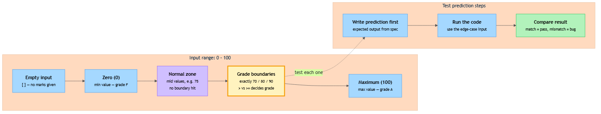

<!-- nav:top:start -->
[⬅ Previous: 11.8 — The golden rule](../../11-8-the-golden-rule-never-run-code-you-cannot-explain-line-by-li/artifacts/reading.md)&emsp;·&emsp;[⬆ Table of Contents](../../../../../../../README.md#curriculum-topic-index)&emsp;·&emsp;[Next: 12.1 — Functions ➡](../../../../week-12/1-functions-and-data-structures/12-1-functions-named-reusable-blocks-of-logic/artifacts/reading.md)
<!-- nav:top:end -->

---

# Edge Cases — Testing What Happens at the Boundary of Expected Input

## Overview

Most beginners test their code with comfortable, familiar inputs and stop there. But the worst bugs do not hide in the middle — they hide at the edges, where the input pushes right up against a limit. An **edge case** is an input that sits at or just beyond the boundary of what your code was designed to handle. Learning to find and test edge cases before you hand code to anyone else is one of the most important habits in professional programming. By the end of this topic, you will know how to spot edge cases, write a prediction before you run anything, and record whether each test passes or fails — exactly the skill required for the A4 portfolio (your first Python project, due week 13). [1]

## Key Concepts

### What is an edge case?

Think back to the grade-calculator script from the lab. It takes a list of marks and prints a letter grade. A normal test uses comfortable values like 75 or 82. An **edge case** uses inputs that sit at a limit:

- A mark of exactly **zero** — the lowest possible mark
- A mark of exactly **100** — the highest possible mark
- The exact value where one grade switches to another — such as **70**, **80**, or **90**
- An **empty list** with no marks at all: `[]`

Your code may work perfectly on 75 and 82 yet break on every one of these. [1][2]


*The diagram shows the normal input range (0–100) as a horizontal band. Grade-switch boundaries (70, 80, 90) and the endpoints (0, 100) are marked as edge-case zones — the places where bugs hide.*

### Normal inputs versus edge-case inputs

To find edge cases, you need to think clearly about where your input space splits into groups. Researchers call these groups **equivalence classes** — sets of inputs that your code treats the same way. [1][2]

Here is an example for a function that converts a mark to a letter grade:

| Group | Example inputs | What the code does |
|---|---|---|
| Normal passing marks | 60, 75, 85 | Falls cleanly into a middle branch; no boundary is touched |
| Exactly at a grade boundary | 70, 80, 90 | The exact comparison operator in your condition decides the outcome |
| Minimum valid input | 0 | Tests whether zero is handled as a real mark, not as "no data" |
| Maximum valid input | 100 | Tests whether the top grade branch accepts 100 without surprise |
| Invalid input | -1, 101, "hello" | May produce a wrong answer silently or crash loudly |

**Equivalence class in plain language:** a set of inputs your code treats the same way. Test one value from the middle of each group to confirm that group works. Test right at the border to confirm the boundary logic is correct.

**Boundary value in plain language:** the specific input that sits exactly on the line between two groups. Boundary values are the most important edge cases to test. [1]

### Why edges expose bugs

Bugs almost never hide in the middle of normal inputs. They hide at the edges. [1][2]

Here is why. When you write a condition like `if mark >= 70:`, you had a particular number in mind. But what about *exactly* 70? Is it included or not? That question is easy to answer wrong when you only test with 75 or 80.

Consider this code:

```python
def grade(mark):
    if mark > 70:
        return "B"
    else:
        return "C"
```

Test it with 75 — it returns "B". Looks right. Test it with 60 — it returns "C". Looks right too. But test it with **70** — it returns "C". If the spec says "70 and above is a B", that is a bug. Only the edge case of 70 would catch it. [2]

This type of error — where code is wrong by exactly one step at the boundary — is called an **off-by-one error**. Off-by-one errors are one of the most common bugs in all of programming, and they almost always live at edge cases. [1]

### The three most common edge-case categories

For the kinds of programs you write in this course, three categories come up again and again. [1][3]

**1. Empty input** — what happens when there is nothing at all?

- An empty list: `[]`
- An empty string: `""`

If your grade-averaging script tries to divide by `len([])`, Python stops with a division-by-zero error because `len([])` is 0. That is a **loud failure** (a term from topic 11.8). Alternatively, your code might silently produce a wrong answer of 0.0 and keep running. Empty input is the category most likely to produce one of these two extremes: a crash or a silent wrong answer. [3]

**2. Zero** — different from "nothing".

A mark of zero is a real mark. But in Python, the integer `0` is **falsy** (a term from topic 11.4) — meaning an `if score:` check treats zero the same as `False`. Your code could skip processing a perfectly valid mark. Always ask: what does my code do when a number input is zero? [3]

**3. Minimum and maximum values** — every range has endpoints.

For a 0–100 mark system, test both 0 and 100. At the maximum end, formatting choices can produce unexpected output — for example, an average of 100.0 printed with a format string designed for two-digit numbers may shift a column in a printed table. These are exactly the kinds of things an assessor or a user will notice. [1][2]

### Predicting expected output before running

Here is the single most important technique: before you run your code with an edge-case input, **write down what you expect the output to be**. This is called a **test prediction**. [1][2]

If you run code first and then look at the output, your brain naturally accepts whatever you see as correct. Instead, follow this order:

1. Read your spec.
2. Ask: for this edge-case input, what does the spec say the output should be?
3. Write that prediction down.
4. Run the code.
5. Compare the actual output to your prediction.

If they match — the test passes. If they do not — you have found a bug. Without a prediction written first, you cannot know whether the result is correct. [2]

## Worked Example

This example walks through edge-case testing on the week-11 lab script — a program that takes a student name and three marks, then prints the average and a letter grade (A for 90+, B for 80–89, C for 70–79, F below 70).

### Step 1 — Read your spec

The spec defines the valid range (0–100) and the boundaries (70, 80, 90). Those boundaries are where you test. This is why spec-first discipline (topic 11.7) is a prerequisite: without a spec, you cannot know where the edges are. [1]

### Step 2 — Write your predictions before running

Write each prediction as a code comment so it stays with the code and is visible to anyone reading your notebook:

```python
# Edge case 1: all zeros

<!-- nav:top:start -->
[⬅ Previous: 11.8 — The golden rule](../../11-8-the-golden-rule-never-run-code-you-cannot-explain-line-by-li/artifacts/reading.md)&emsp;·&emsp;[⬆ Table of Contents](../../../../../../../README.md#curriculum-topic-index)&emsp;·&emsp;[Next: 12.1 — Functions ➡](../../../../week-12/1-functions-and-data-structures/12-1-functions-named-reusable-blocks-of-logic/artifacts/reading.md)
<!-- nav:top:end -->

---
# Input: name="Ali", marks=[0, 0, 0]

<!-- nav:top:start -->
[⬅ Previous: 11.8 — The golden rule](../../11-8-the-golden-rule-never-run-code-you-cannot-explain-line-by-li/artifacts/reading.md)&emsp;·&emsp;[⬆ Table of Contents](../../../../../../../README.md#curriculum-topic-index)&emsp;·&emsp;[Next: 12.1 — Functions ➡](../../../../week-12/1-functions-and-data-structures/12-1-functions-named-reusable-blocks-of-logic/artifacts/reading.md)
<!-- nav:top:end -->

---
# Expected average: 0.0

<!-- nav:top:start -->
[⬅ Previous: 11.8 — The golden rule](../../11-8-the-golden-rule-never-run-code-you-cannot-explain-line-by-li/artifacts/reading.md)&emsp;·&emsp;[⬆ Table of Contents](../../../../../../../README.md#curriculum-topic-index)&emsp;·&emsp;[Next: 12.1 — Functions ➡](../../../../week-12/1-functions-and-data-structures/12-1-functions-named-reusable-blocks-of-logic/artifacts/reading.md)
<!-- nav:top:end -->

---
# Expected grade: F  (0 is below 70)

<!-- nav:top:start -->
[⬅ Previous: 11.8 — The golden rule](../../11-8-the-golden-rule-never-run-code-you-cannot-explain-line-by-li/artifacts/reading.md)&emsp;·&emsp;[⬆ Table of Contents](../../../../../../../README.md#curriculum-topic-index)&emsp;·&emsp;[Next: 12.1 — Functions ➡](../../../../week-12/1-functions-and-data-structures/12-1-functions-named-reusable-blocks-of-logic/artifacts/reading.md)
<!-- nav:top:end -->

---
# Prediction: script prints "Ali: average = 0.0, grade = F"

<!-- nav:top:start -->
[⬅ Previous: 11.8 — The golden rule](../../11-8-the-golden-rule-never-run-code-you-cannot-explain-line-by-li/artifacts/reading.md)&emsp;·&emsp;[⬆ Table of Contents](../../../../../../../README.md#curriculum-topic-index)&emsp;·&emsp;[Next: 12.1 — Functions ➡](../../../../week-12/1-functions-and-data-structures/12-1-functions-named-reusable-blocks-of-logic/artifacts/reading.md)
<!-- nav:top:end -->

---

# Edge case 2: average exactly on the 70 boundary

<!-- nav:top:start -->
[⬅ Previous: 11.8 — The golden rule](../../11-8-the-golden-rule-never-run-code-you-cannot-explain-line-by-li/artifacts/reading.md)&emsp;·&emsp;[⬆ Table of Contents](../../../../../../../README.md#curriculum-topic-index)&emsp;·&emsp;[Next: 12.1 — Functions ➡](../../../../week-12/1-functions-and-data-structures/12-1-functions-named-reusable-blocks-of-logic/artifacts/reading.md)
<!-- nav:top:end -->

---
# Input: name="Sam", marks=[70, 70, 70]

<!-- nav:top:start -->
[⬅ Previous: 11.8 — The golden rule](../../11-8-the-golden-rule-never-run-code-you-cannot-explain-line-by-li/artifacts/reading.md)&emsp;·&emsp;[⬆ Table of Contents](../../../../../../../README.md#curriculum-topic-index)&emsp;·&emsp;[Next: 12.1 — Functions ➡](../../../../week-12/1-functions-and-data-structures/12-1-functions-named-reusable-blocks-of-logic/artifacts/reading.md)
<!-- nav:top:end -->

---
# Expected average: 70.0

<!-- nav:top:start -->
[⬅ Previous: 11.8 — The golden rule](../../11-8-the-golden-rule-never-run-code-you-cannot-explain-line-by-li/artifacts/reading.md)&emsp;·&emsp;[⬆ Table of Contents](../../../../../../../README.md#curriculum-topic-index)&emsp;·&emsp;[Next: 12.1 — Functions ➡](../../../../week-12/1-functions-and-data-structures/12-1-functions-named-reusable-blocks-of-logic/artifacts/reading.md)
<!-- nav:top:end -->

---
# Expected grade: C  (spec says 70–79 is C)

<!-- nav:top:start -->
[⬅ Previous: 11.8 — The golden rule](../../11-8-the-golden-rule-never-run-code-you-cannot-explain-line-by-li/artifacts/reading.md)&emsp;·&emsp;[⬆ Table of Contents](../../../../../../../README.md#curriculum-topic-index)&emsp;·&emsp;[Next: 12.1 — Functions ➡](../../../../week-12/1-functions-and-data-structures/12-1-functions-named-reusable-blocks-of-logic/artifacts/reading.md)
<!-- nav:top:end -->

---
# Prediction: script prints "Sam: average = 70.0, grade = C"

<!-- nav:top:start -->
[⬅ Previous: 11.8 — The golden rule](../../11-8-the-golden-rule-never-run-code-you-cannot-explain-line-by-li/artifacts/reading.md)&emsp;·&emsp;[⬆ Table of Contents](../../../../../../../README.md#curriculum-topic-index)&emsp;·&emsp;[Next: 12.1 — Functions ➡](../../../../week-12/1-functions-and-data-structures/12-1-functions-named-reusable-blocks-of-logic/artifacts/reading.md)
<!-- nav:top:end -->

---

# Edge case 3: perfect marks

<!-- nav:top:start -->
[⬅ Previous: 11.8 — The golden rule](../../11-8-the-golden-rule-never-run-code-you-cannot-explain-line-by-li/artifacts/reading.md)&emsp;·&emsp;[⬆ Table of Contents](../../../../../../../README.md#curriculum-topic-index)&emsp;·&emsp;[Next: 12.1 — Functions ➡](../../../../week-12/1-functions-and-data-structures/12-1-functions-named-reusable-blocks-of-logic/artifacts/reading.md)
<!-- nav:top:end -->

---
# Input: name="Zoe", marks=[100, 100, 100]

<!-- nav:top:start -->
[⬅ Previous: 11.8 — The golden rule](../../11-8-the-golden-rule-never-run-code-you-cannot-explain-line-by-li/artifacts/reading.md)&emsp;·&emsp;[⬆ Table of Contents](../../../../../../../README.md#curriculum-topic-index)&emsp;·&emsp;[Next: 12.1 — Functions ➡](../../../../week-12/1-functions-and-data-structures/12-1-functions-named-reusable-blocks-of-logic/artifacts/reading.md)
<!-- nav:top:end -->

---
# Expected average: 100.0

<!-- nav:top:start -->
[⬅ Previous: 11.8 — The golden rule](../../11-8-the-golden-rule-never-run-code-you-cannot-explain-line-by-li/artifacts/reading.md)&emsp;·&emsp;[⬆ Table of Contents](../../../../../../../README.md#curriculum-topic-index)&emsp;·&emsp;[Next: 12.1 — Functions ➡](../../../../week-12/1-functions-and-data-structures/12-1-functions-named-reusable-blocks-of-logic/artifacts/reading.md)
<!-- nav:top:end -->

---
# Expected grade: A  (100 is 90 and above)

<!-- nav:top:start -->
[⬅ Previous: 11.8 — The golden rule](../../11-8-the-golden-rule-never-run-code-you-cannot-explain-line-by-li/artifacts/reading.md)&emsp;·&emsp;[⬆ Table of Contents](../../../../../../../README.md#curriculum-topic-index)&emsp;·&emsp;[Next: 12.1 — Functions ➡](../../../../week-12/1-functions-and-data-structures/12-1-functions-named-reusable-blocks-of-logic/artifacts/reading.md)
<!-- nav:top:end -->

---
# Prediction: script prints "Zoe: average = 100.0, grade = A"

<!-- nav:top:start -->
[⬅ Previous: 11.8 — The golden rule](../../11-8-the-golden-rule-never-run-code-you-cannot-explain-line-by-li/artifacts/reading.md)&emsp;·&emsp;[⬆ Table of Contents](../../../../../../../README.md#curriculum-topic-index)&emsp;·&emsp;[Next: 12.1 — Functions ➡](../../../../week-12/1-functions-and-data-structures/12-1-functions-named-reusable-blocks-of-logic/artifacts/reading.md)
<!-- nav:top:end -->

---
```

### Step 3 — Run and compare

Run the script with each set of edge-case inputs and record what you actually see:

```
Edge case 1 result: "Ali: average = 0.0, grade = F"   →  PASS
Edge case 2 result: "Sam: average = 70.0, grade = F"  →  FAIL (expected C, got F)
Edge case 3 result: "Zoe: average = 100.0, grade = A" →  PASS
```

Edge case 2 fails. Go back to your code and check the condition at the 70 boundary. If the code says `if average > 70:`, that is the bug — it excludes 70 itself. Change it to `if average >= 70:` and the boundary now includes 70, matching the spec. Re-run the edge case to confirm the fix. [1]

## In Practice

Professional developers think about edge cases before they write a single line of code. When they receive a specification, one of their first questions is: "Where are the boundaries in this input?" [1]

In AI engineering — the broader context of this course — edge cases matter enormously. An AI pipeline is a chain of functions. If one function passes an empty list or a zero to the next, the whole chain can fail silently. Silent failure (from topic 11.8) is especially dangerous here: the pipeline may keep running and produce plausible-looking wrong output with no warning. [3]

A practical habit: after writing any function, ask yourself "what is the most inconvenient input someone could give this?" Then test it. This question alone will catch a large fraction of real-world bugs. [3]

**Do:**

- Write your prediction before you run the code — every single time. [2]
- Test the minimum valid input (e.g., 0, a one-item list).
- Test the maximum valid input (e.g., 100, the largest allowed value).
- Test every boundary where your if/else conditions switch (e.g., exactly 70, 80, 90).
- Record each test — input, prediction, actual output, and pass/fail — in your notebook.
- Fix failing tests before submitting. If you cannot fix one, explain where the bug is.

**Do not:**

- Do not skip edge-case testing because the normal case works. Normal passing tells you almost nothing about boundaries.
- Do not look at the output first and then decide what you "expected". That defeats the purpose of the prediction. [2]
- Do not only test the value you were thinking of when you wrote the code — that value is the least likely to reveal a bug.

## Key Takeaways

- An **edge case** is an input at the boundary of your function's expected range — such as zero, an empty list, or the exact value where a condition switches. [1]
- Bugs hide at boundaries. Code that works perfectly on normal inputs can fail on edge inputs — often silently. [1][2]
- Always write your **test prediction** before running the code. A test without a prediction is not a test — it is just running code. [2]
- The three most reliable edge cases to check are: **empty input**, **zero**, and **minimum/maximum values**. [1][3]
- For the A4 portfolio (your first Python project, due week 13), each notebook must include at least three documented edge-case tests — with inputs, predictions, and outcomes.

## References

1. Ed Bennett, "Testing Edge Cases and Corner Cases," Software Carpentry Python Testing lesson. <https://edbennett.github.io/python-testing-ci/04-edges/index.html>
2. Runestone Academy, "Testing Functions," *Foundations of Python Programming*. <https://runestone.academy/ns/books/published/fopp/TestCases/Testingfunctions.html>
3. freeCodeCamp, "A Beginner's Guide to Testing: Implement These Quick Checks to Test Your Code." <https://www.freecodecamp.org/news/a-beginners-guide-to-testing-implement-these-quick-checks-to-test-your-code-d50027ad5eed/>

---
<!-- nav:bottom:start -->
[⬅ Previous: 11.8 — The golden rule](../../11-8-the-golden-rule-never-run-code-you-cannot-explain-line-by-li/artifacts/reading.md)&emsp;·&emsp;[⬆ Table of Contents](../../../../../../../README.md#curriculum-topic-index)&emsp;·&emsp;[Next: 12.1 — Functions ➡](../../../../week-12/1-functions-and-data-structures/12-1-functions-named-reusable-blocks-of-logic/artifacts/reading.md)
<!-- nav:bottom:end -->
