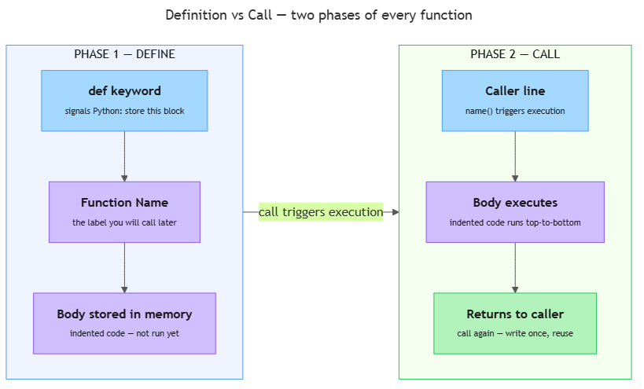

<!-- nav:top:start -->
[⬅ Previous: 11.9 — Edge cases](../../../../week-11/3-professional-coding-discipline/11-9-edge-cases-testing-what-happens-at-the-boundary-of-expected/artifacts/reading.md)&emsp;·&emsp;[⬆ Table of Contents](../../../../../../../README.md#curriculum-topic-index)&emsp;·&emsp;[Next: 12.2 — Parameters and return values ➡](../../12-2-parameters-and-return-values-defining-what-goes-in-and-what/artifacts/reading.md)
<!-- nav:top:end -->

---

# Functions — named, reusable blocks of logic

## Overview

A **function** is a named, reusable block of code. You write a set of steps once, give the set a name, and then run those steps whenever you like just by using that name. Functions are one of the most important building blocks in any programming language [1]. Without them, a real script that repeats the same logic in five places requires five separate copies of the code — and fixing a bug means editing all five. With a function, you fix the bug in one place and every copy updates automatically.

## Key Concepts

### What a function is

Think of a function as a recipe card. The card has a title ("Make Toast"). The card has a list of steps. It sits in a drawer until someone picks it up and follows it. The card sitting untouched is the function *defined but not yet run*. Someone reading the card and following the steps is the function *called* (run).

Every Python function has three parts [1]:

- **Name** — what you call the block. You choose this. It should describe what the function does.
- **Body** — the indented lines of code that run each time the function is called.
- **Call** — the line elsewhere in your code that actually triggers the body to execute.

### The `def` keyword

You create a function with the keyword **`def`** (short for "define") [2]. The format is always:

```python
def function_name():
    # body — indented 4 spaces
    step one
    step two
```

Key punctuation rules to follow every time:

- The **colon (`:`)** at the end of the `def` line is required. It tells Python that the header line is finished and the body is about to begin [1].
- **Indentation** — four spaces before every line in the body. Python uses indentation to decide which lines belong to the function. A line that goes back to zero indentation is no longer inside the function.

If you forget the colon, Python immediately raises a `SyntaxError`. If you forget the indentation, Python raises an `IndentationError`. Both errors appear before your program even starts running, so they are easy to spot and fix.

### Definition vs. call — two phases of every function


*Every function lives through two distinct moments: definition (stored in memory, nothing runs) and call (body executes).*

This distinction is the most common source of confusion for beginners. Definition and call are completely separate events.

| Moment | What happens | Code |
|---|---|---|
| **Definition** (`def`) | Python reads the function and stores it in memory. No code inside the body runs yet. | `def greet():` … |
| **Call** | Python actually runs every line in the body, top to bottom. | `greet()` |

A function that is defined but never called does nothing — ever. A call for a function that has not been defined yet causes a **`NameError`** — a crash message telling you Python does not recognise the name you used. Definition must always appear first in the file; the call must come after [1].

### Naming conventions

Choosing a clear name is not optional decoration — it is how you and your teammates understand code without running it [1]. Python's official style guide (called **PEP 8** — the community document that describes recommended Python coding conventions) gives these rules:

- Use **lowercase letters**.
- Separate words with **underscores** (`_`), not spaces or capital letters.
- Make the name a **verb or verb phrase** — functions *do* things, so their names should reflect actions.

| Good names | Why good |
|---|---|
| `greet()` | Clearly signals "this greets someone." |
| `print_summary()` | Verb + noun — prints a summary. |
| `load_data()` | Verb + noun — loads data. |
| `calculate_average()` | Precisely states the action. |

| Avoid | Why to avoid |
|---|---|
| `x()` | No meaning at all. |
| `doStuff()` | camelCase (words joined with capital letters) — not the Python convention. |
| `function1()` | Generic — tells you nothing about what it does. |
| `Data()` | Starts with a capital letter — reserved by convention for class names, not functions. |

A quick test: read just the function name. If you instantly know what it does, the name is good [1][3].

### The body uses everything you already know

The body of a function is ordinary Python code — the same code you wrote in Week 11. You can use variables (11.3), data types (11.4), `if`/`else` decisions (11.5), and `for` loops (11.6) inside a function body [2]. There is nothing new *inside* the body. The only new ideas in this topic are the `def` line, the name you choose, and the act of calling.

How to pass data *into* a function and get a result *back* out are the next step — covered in Topic 12.2.

## Worked Example

This example walks through writing and calling a function step by step, following the spec-first habit introduced in Topic 11.7.

**Step 1 — Write the spec as a comment before any code.**

State what the function should do in plain English. One sentence is enough.

```python
# greet_user: print a welcome message to the screen

<!-- nav:top:start -->
[⬅ Previous: 11.9 — Edge cases](../../../../week-11/3-professional-coding-discipline/11-9-edge-cases-testing-what-happens-at-the-boundary-of-expected/artifacts/reading.md)&emsp;·&emsp;[⬆ Table of Contents](../../../../../../../README.md#curriculum-topic-index)&emsp;·&emsp;[Next: 12.2 — Parameters and return values ➡](../../12-2-parameters-and-return-values-defining-what-goes-in-and-what/artifacts/reading.md)
<!-- nav:top:end -->

---
```

Writing the spec first forces you to be clear about the purpose before you commit to code. If you cannot write the spec in one sentence, the function may be trying to do too much.

**Step 2 — Write the `def` line.**

```python
def greet_user():
```

Check: the name is all lowercase with underscores, and the line ends with `():`.

**Step 3 — Write the body, indented 4 spaces.**

```python
def greet_user():
    print("Welcome to the AI course!")
```

Check: every line in the body is indented the same amount. Mixing two spaces on one line and four on another will cause an `IndentationError`.

**Step 4 — Call the function below the definition.**

The call goes at zero indentation (back to the left margin), below the entire `def` block.

```python
def greet_user():
    print("Welcome to the AI course!")

greet_user()
```

**Step 5 — Run and check the output.**

Expected output:
```
Welcome to the AI course!
```

If you see `NameError: name 'greet_user' is not defined`, the call appeared above the `def` line. Move the call below the definition and run again.

**Step 6 — Call it more than once to confirm reuse.**

```python
greet_user()
greet_user()
greet_user()
```

Output:
```
Welcome to the AI course!
Welcome to the AI course!
Welcome to the AI course!
```

Three lines of output came from one `print` statement in the source code — that is reuse [2][3]. If the message needs to change (say, from "Welcome to the AI course!" to "Hello, learner!"), you edit that one `print` line inside `greet_user()` and all three calls reflect the change automatically. You do not have to hunt through the file looking for every copy.

## In Practice

Functions appear in every Python script you will encounter in this course [1][3]. Recognising them helps you read professional code without feeling lost.

- **Wrapping repeated output.** Scripts that process data often print headers, separators, and summaries in multiple places. A function like `print_separator()` removes duplication. The separator logic lives in one place; every call to `print_separator()` uses it.

- **Data loading.** A function like `load_student_records()` appears near the top of scripts that read files. The file-reading logic is written once inside the function. The rest of the script calls `load_student_records()` whenever it needs the data.

- **Readable top-level flow.** Professional Python scripts often end with a short sequence of function calls — `load_data()`, `check_records()`, `print_summary()`. Each call says exactly one thing. A reader can follow the overall flow at a glance, without reading every implementation detail [1].

**Common do/don't pairs:**

| Do | Do not |
|---|---|
| Name functions as verb phrases: `calculate_average()` | Use vague names: `do_thing()`, `helper()`, `process()` |
| Define the function before calling it | Put the call above the `def` line (causes `NameError`) |
| Use 4 spaces for indentation throughout | Mix tabs and spaces (causes `IndentationError`) |
| Write a spec comment above each function (11.7 habit) | Copy the same block of code into two or more places |
| Include empty `()` when calling: `greet_user()` | Write `greet_user` without parentheses — that only references the function name, it does not run it |

## Key Takeaways

- A **function** is a named, reusable block of code. Write the steps once; run them anywhere, any number of times, just by using the name.
- The **`def` keyword** defines a function. Writing `def` stores the function in memory but runs no code yet. The body runs only when the function is called.
- A **function call** — the name followed by empty parentheses `()` — is what actually executes the body.
- **Definition must come before the call** in the file. Python reads top to bottom; a call placed above its `def` causes a `NameError` crash.
- **Names matter.** Use lowercase verb phrases with underscores (`calculate_average`, `load_data`). A name that tells you the action saves time for everyone who reads the code [1].

## References

1. Real Python. *Defining Your Own Python Function.* https://realpython.com/defining-your-own-python-function/
2. W3Schools. *Python Functions.* https://www.w3schools.com/python/python_functions.asp
3. Python Software Foundation. *The Python Tutorial.* https://docs.python.org/3/tutorial/index.html

---
<!-- nav:bottom:start -->
[⬅ Previous: 11.9 — Edge cases](../../../../week-11/3-professional-coding-discipline/11-9-edge-cases-testing-what-happens-at-the-boundary-of-expected/artifacts/reading.md)&emsp;·&emsp;[⬆ Table of Contents](../../../../../../../README.md#curriculum-topic-index)&emsp;·&emsp;[Next: 12.2 — Parameters and return values ➡](../../12-2-parameters-and-return-values-defining-what-goes-in-and-what/artifacts/reading.md)
<!-- nav:bottom:end -->
