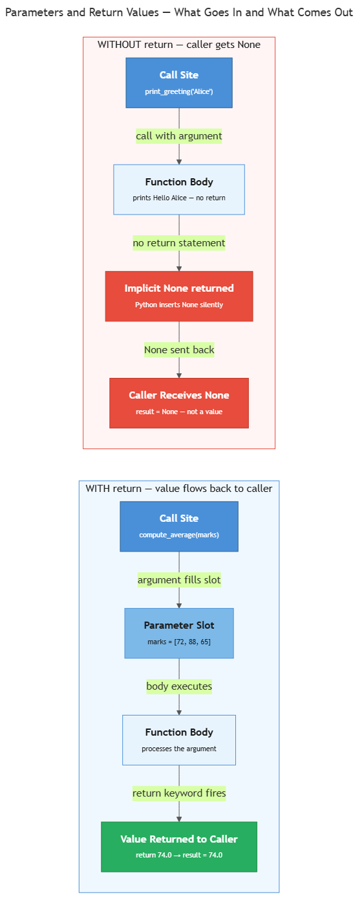

<!-- nav:top:start -->
[⬅ Previous: 12.1 — Functions](../../12-1-functions-named-reusable-blocks-of-logic/artifacts/reading.md)&emsp;·&emsp;[⬆ Table of Contents](../../../../../../../README.md#curriculum-topic-index)&emsp;·&emsp;[Next: 12.3 — One function = one job ➡](../../12-3-one-function-one-job-the-testable-unit-principle/artifacts/reading.md)
<!-- nav:top:end -->

---

# Parameters and Return Values — Defining What Goes In and What Comes Out

## Overview

In Topic 12.1 you learned to write functions — named blocks of code you can call by name. Those first functions were like light switches: flip the switch and the same thing happens every time. Useful, but limited. Most real tasks work more like a calculator: you type in two numbers, the calculator does something with them, and a result comes back out.

To turn your Python functions into calculators you need two ideas: **parameters** (what goes in) and **return values** (what comes out). Together they are what let you write a function once and use it with any data — passing in a list of student marks today, a different list tomorrow, and getting a fresh result each time [1][2].

By the end of this topic you will be able to write functions that accept inputs, compute results, and hand those results back to you in a form you can store, compare, or pass to another function.

## Key Concepts

### Parameters and Arguments

Beginners often hear "parameter" and "argument" used interchangeably — even by experienced programmers [2]. They refer to almost the same thing, but from two different vantage points:

- **Parameter** — the named placeholder you write inside the parentheses in the `def` line. It is the slot waiting to be filled.
- **Argument** — the actual value you pass when you call the function. It is what goes into the slot [2].

Think of a vending machine. The machine has a *slot* (parameter) — any coin fits there. When you push a specific coin in (argument), that is the value the machine works with. The distinction is about where you are standing: inside the `def` line you are looking at parameters; at the call line you are passing arguments.

```python
# "name" is the PARAMETER — the placeholder in the definition

<!-- nav:top:start -->
[⬅ Previous: 12.1 — Functions](../../12-1-functions-named-reusable-blocks-of-logic/artifacts/reading.md)&emsp;·&emsp;[⬆ Table of Contents](../../../../../../../README.md#curriculum-topic-index)&emsp;·&emsp;[Next: 12.3 — One function = one job ➡](../../12-3-one-function-one-job-the-testable-unit-principle/artifacts/reading.md)
<!-- nav:top:end -->

---
def greet(name):
    print("Hello,", name)

# "Alice" is the ARGUMENT — the actual value passed in the call

<!-- nav:top:start -->
[⬅ Previous: 12.1 — Functions](../../12-1-functions-named-reusable-blocks-of-logic/artifacts/reading.md)&emsp;·&emsp;[⬆ Table of Contents](../../../../../../../README.md#curriculum-topic-index)&emsp;·&emsp;[Next: 12.3 — One function = one job ➡](../../12-3-one-function-one-job-the-testable-unit-principle/artifacts/reading.md)
<!-- nav:top:end -->

---
greet("Alice")   # prints: Hello, Alice
greet("Bob")     # prints: Hello, Bob
```

One definition, many different inputs — because the argument changed each time [2][3].

**Positional parameters** — when a function has more than one parameter, Python matches arguments to parameters by position: the first argument fills the first parameter, the second fills the second, and so on [2]. Order matters.

```python
def describe_student(name, mark):
    print(name, "scored", mark)

describe_student("Alice", 87)   # name="Alice", mark=87
describe_student(87, "Alice")   # name=87, mark="Alice"  ← wrong order!
```

### Return Values


*Left panel: a function WITH return — the argument flows into the parameter slot, the body runs, and a value is returned to the caller. Right panel: WITHOUT return — the call triggers the body, but implicit None flows back instead.*

**Return value** — the result a function sends back to whoever called it, using the `return` keyword [1].

**`return` keyword** — a Python keyword that exits the function immediately and sends a value back to the caller [1]. Two things happen the moment Python reaches `return`:

1. The expression after `return` is evaluated.
2. That value is handed back to the caller and the function stops — no lines after `return` in the same execution path will run.

```python
def add(a, b):
    return a + b

result = add(3, 4)   # result is now 7
print(result)        # prints: 7
```

A function can have multiple `return` statements — for example, one in each branch of an `if`/`else`:

```python
def classify_mark(mark):
    if mark >= 50:
        return "Pass"
    else:
        return "Fail"

outcome = classify_mark(73)
print(outcome)    # prints: Pass
```

Once you have a returned value, you can use it in three ways [1]:

| How to use the returned value | Example |
|---|---|
| Assign it to a variable | `average = compute_average(marks)` |
| Use it directly in an expression | `if compute_average(marks) >= 50:` |
| Pass it straight to another function | `print(compute_average(marks))` |

Assigning to a named variable first is usually the clearest option — it makes the code easier to read and easier to debug.

### Implicit None — What Happens Without `return`

**`None`** — Python's way of saying "this function produced no value." It is not a number, not a string, not a boolean; it is a placeholder meaning "nothing here" [1].

When a function has no `return` statement, Python automatically returns `None` [1][3]:

```python
def print_greeting(name):
    print("Hello,", name)
    # no return statement

result = print_greeting("Alice")   # prints: Hello, Alice
print(result)                      # prints: None
```

The function ran and printed the greeting — but it returned nothing, so `result` holds `None`.

### print vs. return — A Critical Distinction

These two functions look similar but behave very differently [1]:

```python
def add_print(a, b):
    print(a + b)    # shows the result on screen; returns None

def add_return(a, b):
    return a + b    # sends the result back to the caller; shows nothing by itself
```

| | `print` inside the function | `return` from the function |
|---|---|---|
| Effect | Shows a value on screen | Makes a value usable by the caller |
| What the caller gets back | `None` | The computed value |
| Use when... | You only need to display it | The caller needs to store, compare, or pass it on |

**`print` makes a value visible. `return` makes a value usable** [1]. Functions that compute results should `return` them and leave printing to the caller — that way the caller decides whether to print, save, or pass the value onward [1][2].

## Worked Example

**Goal:** write a function that computes the average of a list of marks — spec-first, step by step.

**Step 1 — Write the plain-English spec first.**

```python
# compute_average: given a list of numbers, return their average (sum / count)

<!-- nav:top:start -->
[⬅ Previous: 12.1 — Functions](../../12-1-functions-named-reusable-blocks-of-logic/artifacts/reading.md)&emsp;·&emsp;[⬆ Table of Contents](../../../../../../../README.md#curriculum-topic-index)&emsp;·&emsp;[Next: 12.3 — One function = one job ➡](../../12-3-one-function-one-job-the-testable-unit-principle/artifacts/reading.md)
<!-- nav:top:end -->

---
```

Commit to what goes in and what comes out before writing any code [2]. This habit makes it much easier to test the function afterwards.

**Step 2 — Write the `def` line with the parameter.**

```python
def compute_average(marks):
```

`marks` is the parameter — the placeholder. You do not know yet what list will be passed; that is fine.

**Step 3 — Write the body using the parameter.**

```python
def compute_average(marks):
    total = 0
    for mark in marks:
        total = total + mark
    average = total / len(marks)
```

This uses the for loop and variables you already know. `len(marks)` is a built-in that returns the number of items in the list.

**Step 4 — Add the `return` statement.**

```python
def compute_average(marks):
    total = 0
    for mark in marks:
        total = total + mark
    average = total / len(marks)
    return average
```

Without `return average`, the computed value would be lost the moment the function finishes [1].

**Step 5 — Call the function, passing an argument.**

```python
class_marks = [72, 88, 65, 90, 55]
result = compute_average(class_marks)
print("Average:", result)
```

`class_marks` is the argument — the actual list passed to the `marks` parameter. The function runs with that data and returns the average into `result`.

**Step 6 — Read the output and verify.**

```
Average: 74.0
```

**Step 7 — Test with a different argument (edge-case thinking).**

```python
another_group = [40, 40, 40]
print("Average:", compute_average(another_group))   # expects 40.0
```

Same function, different data [2][3]. The parameter made this possible without rewriting anything.

## In Practice

Parameters and return values are the building blocks of every Python script in this course [1]. Here are three patterns you will use repeatedly.

**Pattern 1 — Computing summary statistics.**

Write three separate functions, each doing one job:

```python
def compute_average(marks):
    total = 0
    for mark in marks:
        total = total + mark
    return total / len(marks)

def find_highest(marks):
    highest = None          # None = "we haven't seen any mark yet"
    for mark in marks:
        if highest is None or mark > highest:
            highest = mark
    return highest
```

`find_highest` starts with `highest = None` as a flag. The first mark in the loop always replaces `None` because `highest is None` is true; after that, `mark > highest` keeps it updated [3]. Each function accepts the list as an argument and returns a single number — clean, testable, independent.

**Pattern 2 — Classify and decide.**

Return values work inside loops too:

```python
def classify_mark(mark):
    if mark >= 50:
        return "Pass"
    else:
        return "Fail"

for student_mark in [45, 72, 50]:
    outcome = classify_mark(student_mark)
    print(student_mark, "->", outcome)
```

```
45 -> Fail
72 -> Pass
50 -> Pass
```

No printing inside the function — the return value is used by the caller [1].

**Pattern 3 — Chaining functions together.**

Return values can flow from one function into another:

```python
def format_report(student_name, score):
    outcome = classify_mark(score)      # return value used here
    return student_name + ": " + str(score) + " — " + outcome
    # str(score) converts the number to text so it can be joined to the string

print(format_report("Alice", 72))   # Alice: 72 — Pass
print(format_report("Bob", 45))     # Bob: 45 — Fail
```

`format_report` calls `classify_mark` and uses its return value directly. Functions build on each other, each doing one job and passing results to the next [1][2].

## Key Takeaways

- A **parameter** is the named placeholder in the `def` line (`def greet(name):`); an **argument** is the actual value passed at the call (`greet("Alice")`). The argument fills the parameter's slot.
- **Positional parameters** are matched by order — the first argument goes to the first parameter, the second to the second. Order matters, and Python will not warn you if you get it wrong.
- The **`return` keyword** exits the function immediately and sends a value back to the caller. Any code after `return` in the same execution path does not run.
- A function with no `return` statement silently returns **`None`** — Python's way of saying "this function produced no value." Capturing `None` when you expected a number is one of the most common beginner mistakes.
- **`print` makes a value visible; `return` makes a value usable.** Functions that compute results should `return` them and let the caller decide whether to print, store, or pass them on [1].

## References

[1] Real Python. (2024). The Python return Statement: Usage and Best Practices. https://realpython.com/python-return-statement/

[2] Real Python. (2024). Defining Your Own Python Function. https://realpython.com/defining-your-own-python-function/

[3] Runestone Academy. (2024). Foundations of Python Programming — Returning a value from a function. https://runestone.academy/ns/books/published/fopp/Functions/Returningavaluefromafunction.html

---
<!-- nav:bottom:start -->
[⬅ Previous: 12.1 — Functions](../../12-1-functions-named-reusable-blocks-of-logic/artifacts/reading.md)&emsp;·&emsp;[⬆ Table of Contents](../../../../../../../README.md#curriculum-topic-index)&emsp;·&emsp;[Next: 12.3 — One function = one job ➡](../../12-3-one-function-one-job-the-testable-unit-principle/artifacts/reading.md)
<!-- nav:bottom:end -->
