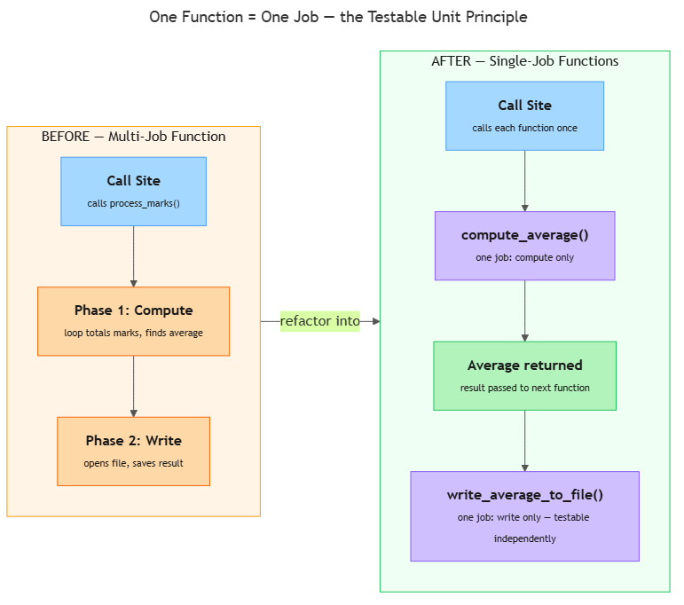

<!-- nav:top:start -->
[⬅ Previous: 12.2 — Parameters and return values](../../12-2-parameters-and-return-values-defining-what-goes-in-and-what/artifacts/reading.md)&emsp;·&emsp;[⬆ Table of Contents](../../../../../../../README.md#curriculum-topic-index)&emsp;·&emsp;[Next: 12.4 — Lists ➡](../../12-4-lists-storing-and-iterating-over-multiple-values/artifacts/reading.md)
<!-- nav:top:end -->

---

# One function = one job — the testable unit principle

## Overview

You have already written functions that package logic under a name (12.1) and functions that accept input and hand a result back to the caller (12.2). Now a natural question arises: how much work should one function do? The answer is one job — exactly one, clearly stated purpose per function [1]. A function that does one job can be tested on its own, fixed without disturbing anything else, and reused wherever that one job is needed. Those three qualities are what make your code reliable as it grows.

## Key Concepts

### What "one job" means

Imagine asking a colleague to get coffee, send the daily email, update the spreadsheet, and greet every team member — all in one go. If something goes wrong, which of the four steps caused it? You have no way to isolate the problem. Functions have exactly the same issue.

A function has **one job** when its entire body is devoted to a single, clearly stated purpose [1]. You can describe that purpose in one short sentence without using the word "and."

Here are four functions that each have one job:

| Function name | Job in one sentence |
|---|---|
| `compute_average(marks)` | Return the average of a list of marks. |
| `find_highest(marks)` | Return the largest value in a list of marks. |
| `classify_mark(mark)` | Return "Pass" or "Fail" for a given mark. |
| `write_average_to_file(average, filename)` | Write the average value to a file. |

A function does **more than one job** when it mixes concerns — for example:

- Computing a value **and** saving it to a file
- Fetching data **and** formatting it for display
- Validating input **and** processing it **and** printing the result

### The "and" naming heuristic

The quickest way to catch a multi-job function is to try to name it accurately [3]. If the most honest name for the function contains the word "and," the function almost certainly has two responsibilities that should be separated [1][3].

| Name you are tempted to write | What the "and" reveals |
|---|---|
| `compute_and_print_average` | Two jobs: compute, then print. |
| `validate_and_save_mark` | Two jobs: validate, then save. |
| `fetch_and_format_results` | Two jobs: fetch data, then format it. |
| `read_file_and_calculate_stats` | Two jobs: read, then calculate. |

The fix is always the same: split the function at the "and" into two single-job functions, each with a clean name.

This is called a **smell** — in programming, a smell (sometimes "code smell") is a sign in the code that something might be wrong. It does not guarantee a bug, but it tells you to look closer [3]. The word "and" in a function name is one of the most reliable smells you will encounter.

### What makes a single-job function testable

**Testable unit** — a piece of code small enough and focused enough that you can confirm it works by calling it once with a known input and checking the output [1][2]. A single-job function is a testable unit. A multi-job function usually is not.

A single-job function is testable for three reasons:

1. **The input and output are clear.** You know exactly what to pass in and exactly what value to compare the result against.
2. **Nothing else runs at the same time.** If the result is wrong, the problem is inside this one function — not somewhere else in a chain of mixed concerns.
3. **You can test it in isolation.** You do not need to set up the whole program. To check whether `compute_average([60, 80, 100])` returns `80.0`, you just call it and look [1][2].

Compare that to a multi-job function like `compute_and_save_average(marks, filename)`. To test whether the average calculation is correct, you must also create a file and read it back — even though you only care about the number. The responsibilities are tangled together [1].

In this course you will test functions manually: call the function, print the result, and compare it to the expected value by eye. Later in your studies you will meet tools like pytest that automate this check, but the underlying principle is identical — one function, one job, one check [1].

### How to spot a multi-job function

There are three reliable signals:

1. **The "and" test on the name.** Try writing a one-sentence spec for the function. If the sentence needs "and," the function has more than one job [1][3].
2. **Two visible phases in the body.** Look at the function body. If you can mentally draw a line between "the part that computes" and "the part that saves," those are two separate jobs [1].
3. **Hard to call in a test.** If you must create a file, connect to a database, or set up another system just to call the function once, the function is mixed with things that are not its core job [2].

### Refactoring — splitting one function into two

**Refactoring** — changing how code is structured without changing what it does [3]. When you split a multi-job function into single-job functions, the program still produces the same result, but each piece is now independently testable.

The refactoring pattern is always the same five steps:

1. Identify the two jobs — find the "and" in the spec, or the visible phase boundary in the body.
2. Write a spec comment for each new function — one sentence, no "and."
3. Extract each phase into its own `def` block, using `return` to pass the result from the first function to the second.
4. Replace the original body with two calls — one to each new function.
5. Test each new function independently before testing them together.

## Worked Example

The goal: compute the average of a list of marks, then write the result to a summary file.

**Step 1 — Write the multi-job version so you can see the problem clearly.**

```python
# compute_and_save_average: given a list of marks and a filename,

<!-- nav:top:start -->
[⬅ Previous: 12.2 — Parameters and return values](../../12-2-parameters-and-return-values-defining-what-goes-in-and-what/artifacts/reading.md)&emsp;·&emsp;[⬆ Table of Contents](../../../../../../../README.md#curriculum-topic-index)&emsp;·&emsp;[Next: 12.4 — Lists ➡](../../12-4-lists-storing-and-iterating-over-multiple-values/artifacts/reading.md)
<!-- nav:top:end -->

---
# compute the average AND write it to the file

<!-- nav:top:start -->
[⬅ Previous: 12.2 — Parameters and return values](../../12-2-parameters-and-return-values-defining-what-goes-in-and-what/artifacts/reading.md)&emsp;·&emsp;[⬆ Table of Contents](../../../../../../../README.md#curriculum-topic-index)&emsp;·&emsp;[Next: 12.4 — Lists ➡](../../12-4-lists-storing-and-iterating-over-multiple-values/artifacts/reading.md)
<!-- nav:top:end -->

---
def compute_and_save_average(marks, filename):
    total = 0
    for mark in marks:
        total = total + mark
    average = total / len(marks)
    file = open(filename, "w")
    file.write("Average: " + str(average) + "\n")
    file.close()
```

The "and" in the name signals two jobs. The body has two visible phases: compute, then write [1][3].

**Step 2 — Identify the two jobs.**

- Job 1: compute the average (pure calculation — needs `marks`, returns a number).
- Job 2: write the average to a file (file work — needs the number and a filename, returns nothing useful).

**Step 3 — Write a spec for each new function.**

```python
# compute_average: given a list of marks, return their average (sum / count)

<!-- nav:top:start -->
[⬅ Previous: 12.2 — Parameters and return values](../../12-2-parameters-and-return-values-defining-what-goes-in-and-what/artifacts/reading.md)&emsp;·&emsp;[⬆ Table of Contents](../../../../../../../README.md#curriculum-topic-index)&emsp;·&emsp;[Next: 12.4 — Lists ➡](../../12-4-lists-storing-and-iterating-over-multiple-values/artifacts/reading.md)
<!-- nav:top:end -->

---
# write_average_to_file: given a number (average) and a filename,

<!-- nav:top:start -->
[⬅ Previous: 12.2 — Parameters and return values](../../12-2-parameters-and-return-values-defining-what-goes-in-and-what/artifacts/reading.md)&emsp;·&emsp;[⬆ Table of Contents](../../../../../../../README.md#curriculum-topic-index)&emsp;·&emsp;[Next: 12.4 — Lists ➡](../../12-4-lists-storing-and-iterating-over-multiple-values/artifacts/reading.md)
<!-- nav:top:end -->

---
#                        write the average to the file

<!-- nav:top:start -->
[⬅ Previous: 12.2 — Parameters and return values](../../12-2-parameters-and-return-values-defining-what-goes-in-and-what/artifacts/reading.md)&emsp;·&emsp;[⬆ Table of Contents](../../../../../../../README.md#curriculum-topic-index)&emsp;·&emsp;[Next: 12.4 — Lists ➡](../../12-4-lists-storing-and-iterating-over-multiple-values/artifacts/reading.md)
<!-- nav:top:end -->

---
```

Neither spec contains "and" [1].

The diagram below shows exactly what this refactoring looks like — one tangled block on the left becomes two clean, independently testable functions on the right.


*The BEFORE side shows a single function with two phases; the AFTER side shows each phase extracted into its own function with the result passed between them.*

**Step 4 — Write the two single-job functions.**

```python
# compute_average: given a list of marks, return their average (sum / count)

<!-- nav:top:start -->
[⬅ Previous: 12.2 — Parameters and return values](../../12-2-parameters-and-return-values-defining-what-goes-in-and-what/artifacts/reading.md)&emsp;·&emsp;[⬆ Table of Contents](../../../../../../../README.md#curriculum-topic-index)&emsp;·&emsp;[Next: 12.4 — Lists ➡](../../12-4-lists-storing-and-iterating-over-multiple-values/artifacts/reading.md)
<!-- nav:top:end -->

---
def compute_average(marks):
    total = 0
    for mark in marks:
        total = total + mark
    return total / len(marks)


# write_average_to_file: given a number (average) and a filename,

<!-- nav:top:start -->
[⬅ Previous: 12.2 — Parameters and return values](../../12-2-parameters-and-return-values-defining-what-goes-in-and-what/artifacts/reading.md)&emsp;·&emsp;[⬆ Table of Contents](../../../../../../../README.md#curriculum-topic-index)&emsp;·&emsp;[Next: 12.4 — Lists ➡](../../12-4-lists-storing-and-iterating-over-multiple-values/artifacts/reading.md)
<!-- nav:top:end -->

---
# write the average to the file

<!-- nav:top:start -->
[⬅ Previous: 12.2 — Parameters and return values](../../12-2-parameters-and-return-values-defining-what-goes-in-and-what/artifacts/reading.md)&emsp;·&emsp;[⬆ Table of Contents](../../../../../../../README.md#curriculum-topic-index)&emsp;·&emsp;[Next: 12.4 — Lists ➡](../../12-4-lists-storing-and-iterating-over-multiple-values/artifacts/reading.md)
<!-- nav:top:end -->

---
def write_average_to_file(average, filename):
    file = open(filename, "w")
    file.write("Average: " + str(average) + "\n")
    file.close()
```

Each function does exactly one thing and has a name with no "and" [1][3].

**Step 5 — Combine them at the call site.**

```python
class_marks = [72, 88, 65, 90, 55]
avg = compute_average(class_marks)
write_average_to_file(avg, "summary.txt")
```

The program still produces the same result — but now you can test `compute_average` without touching a file [1][2].

**Step 6 — Test each function independently.**

```python
# Test compute_average in isolation — no file needed

<!-- nav:top:start -->
[⬅ Previous: 12.2 — Parameters and return values](../../12-2-parameters-and-return-values-defining-what-goes-in-and-what/artifacts/reading.md)&emsp;·&emsp;[⬆ Table of Contents](../../../../../../../README.md#curriculum-topic-index)&emsp;·&emsp;[Next: 12.4 — Lists ➡](../../12-4-lists-storing-and-iterating-over-multiple-values/artifacts/reading.md)
<!-- nav:top:end -->

---
result = compute_average([60, 80, 100])
print(result)    # expected: 80.0

result = compute_average([50, 50])
print(result)    # expected: 50.0

result = compute_average([100])
print(result)    # expected: 100.0
```

All three tests call the function with a known list and print the result. No file involved, no other function running [2]. If `compute_average` passes all three, you know the calculation is correct. Any bug in the file-writing step is now clearly isolated to `write_average_to_file`.

## In Practice

The one-function-one-job rule appears in every real Python project [1][2]. Here are the two patterns you will use most often.

**Pattern 1 — Separate statistics functions (the lab activity pattern).**

When computing average, highest, and lowest marks, keep each computation in its own function. Each can then be tested with a small hand-crafted list — no file required [1][2]:

```python
compute_average(marks)   # returns the average
find_highest(marks)      # returns the largest value
find_lowest(marks)       # returns the smallest value
```

**Pattern 2 — Validation separated from processing.**

Mixing validation and processing in one function is a common source of bugs [3]. Split them:

```python
# is_valid_mark: return True if the mark is between 0 and 100

<!-- nav:top:start -->
[⬅ Previous: 12.2 — Parameters and return values](../../12-2-parameters-and-return-values-defining-what-goes-in-and-what/artifacts/reading.md)&emsp;·&emsp;[⬆ Table of Contents](../../../../../../../README.md#curriculum-topic-index)&emsp;·&emsp;[Next: 12.4 — Lists ➡](../../12-4-lists-storing-and-iterating-over-multiple-values/artifacts/reading.md)
<!-- nav:top:end -->

---
def is_valid_mark(mark):
    if mark >= 0 and mark <= 100:
        return True
    else:
        return False


# classify_mark: given a valid mark, return "Pass" or "Fail"

<!-- nav:top:start -->
[⬅ Previous: 12.2 — Parameters and return values](../../12-2-parameters-and-return-values-defining-what-goes-in-and-what/artifacts/reading.md)&emsp;·&emsp;[⬆ Table of Contents](../../../../../../../README.md#curriculum-topic-index)&emsp;·&emsp;[Next: 12.4 — Lists ➡](../../12-4-lists-storing-and-iterating-over-multiple-values/artifacts/reading.md)
<!-- nav:top:end -->

---
def classify_mark(mark):
    if mark >= 50:
        return "Pass"
    else:
        return "Fail"
```

Now you can test `is_valid_mark` on edge cases (0, 100, -1, 101) without running any classification logic — and vice versa [1][3].

**Common do / don't rules:**

| Do | Do not |
|---|---|
| Write the spec comment first — one sentence, no "and" | Add "also" to a function's purpose ("computes — and also saves") |
| Use the "and" test before finalising a function name | Mix file I/O or printing with pure computation in the same function |
| Test each single-job function before combining | Interpret "one job" as "one line of code" — a function can be ten lines and still have one job |
| Pass results between functions using return values | Refactor prematurely — write the working version first, then split once the logic is clear |

## Key Takeaways

- A function has **one job** when its entire body serves a single, clearly stated purpose that you can describe in one sentence without using "and."
- The **"and" naming heuristic** is the fastest way to catch a multi-job function: if the most accurate name contains "and," the function likely has two responsibilities that should be separated [1][3].
- A **testable unit** is a function small enough and focused enough that you can confirm it works by calling it once with a known input and checking the output — no other system setup needed [1][2].
- **Refactoring** a multi-job function means splitting it at the "and" boundary, extracting each phase into its own `def` with a clean spec, and passing results between them using return values. The program produces the same result; each piece is now independently testable [3].
- Mixing file I/O (reading a file, printing to screen) with pure computation in one function makes both harder to test. Keeping them separate is the most practical application of the one-job rule in this week's lab [1][2].

## References

1. Real Python, "SOLID Principles in Python." <https://realpython.com/solid-principles-python/>
2. Python Tutorial, "Python Single Responsibility Principle." <https://www.pythontutorial.net/python-oop/python-single-responsibility-principle/>
3. Sobolevn, "Enforcing Single Responsibility Principle in Python." <https://sobolevn.me/2019/03/enforcing-srp>

---
<!-- nav:bottom:start -->
[⬅ Previous: 12.2 — Parameters and return values](../../12-2-parameters-and-return-values-defining-what-goes-in-and-what/artifacts/reading.md)&emsp;·&emsp;[⬆ Table of Contents](../../../../../../../README.md#curriculum-topic-index)&emsp;·&emsp;[Next: 12.4 — Lists ➡](../../12-4-lists-storing-and-iterating-over-multiple-values/artifacts/reading.md)
<!-- nav:bottom:end -->
