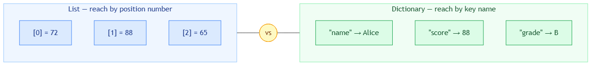

<!-- nav:top:start -->
[⬅ Previous: 12.4 — Lists](../../12-4-lists-storing-and-iterating-over-multiple-values/artifacts/reading.md)&emsp;·&emsp;[⬆ Table of Contents](../../../../../../../README.md#curriculum-topic-index)&emsp;·&emsp;[Next: 12.6 — Reading from a file ➡](../../../2-working-with-files/12-6-reading-from-a-file-open-read-lines-close/artifacts/reading.md)
<!-- nav:top:end -->

---

# Dictionaries — Key-Value Pairs for Structured Data

## Overview

In Topic 12.4 you stored a list of marks: `[72, 88, 65, 90, 55]`. That works well when all you need is raw numbers in order. But what if you need to know *which student* each mark belongs to? A plain list gives you no way to label the values — you can only reach them by counting positions (index 0, index 1, and so on).

A **dictionary** solves this. Instead of numbering its slots from zero, a dictionary lets you choose your own labels — called **keys**. Each key is paired with a value, and you look up the value by name rather than by number. Think of it like a real paper dictionary: you jump straight to the word you want without reading every page in order [1].

Dictionaries are used throughout Python. Student records, product listings, program settings, and data from external services all arrive as key-value pairs. After this topic you will be able to create, read, update, and safely query a dictionary — skills you will apply directly when you call an external service later in Week 12 [2][3].

## Key Concepts

**Creating a dictionary** uses curly braces `{` and `}`. Each item is a **key-value pair** — a label and its data, separated by a colon, with pairs separated by commas [1]:

```python
student = {"name": "Alice", "score": 88, "grade": "B"}
```

Four terms you need:

- **Dictionary** — a Python value that maps keys to values, created with curly braces.
- **Key** — the label you use to look something up. Keys must be unique inside one dictionary; most keys are strings.
- **Value** — the data stored under a key. Can be any Python type: string, integer, boolean, or list.
- **Key-value pair** — one key and its value written as `key: value`, separated from the next pair by a comma.

The diagram below makes the contrast with a list concrete:



*Left (blue): a list uses numbered position slots — [0], [1], [2]. Right (green): a dictionary uses named key slots — "name", "score", "grade". You reach a list value by counting; you reach a dictionary value by naming.*

**Accessing a value by key** uses square brackets around the key name — similar to list access, but the label is a word, not a number [1]:

```python
print(student["name"])    # Alice
print(student["score"])   # 88
```

If you ask for a key that does not exist, Python raises a **`KeyError`**. The safe alternative is `.get()` — covered below [1].

**Adding and modifying** both use the same assignment syntax. Python checks whether the key already exists: if it does, the value is updated; if it does not, a new pair is created [1][2]:

```python
student["grade"] = "B"    # adds a new key — did not exist before
student["score"] = 92     # updates an existing key
```

This is different from lists, where you must use `append()` to add a new slot — you cannot write `marks[5] = 99` on a five-item list because index 5 does not yet exist. With a dictionary you can add any new key at any time.

**Checking whether a key exists** uses the `in` keyword — the same keyword you know from `for item in list`, used here as a membership test [1]:

```python
if "score" in student:
    print("Score found:", student["score"])
else:
    print("No score recorded")
```

`"score" in student` returns `True` if `"score"` is a key, `False` if it is not [3].

**Reading safely with `.get()`** returns a default value instead of crashing when a key is missing [1]:

```python
grade = student.get("grade", "Not assigned")
print(grade)    # Not assigned — key was absent

score = student.get("score", 0)
print(score)    # 88 — key exists, actual value returned
```

The second argument is the default. If it is left out and the key is missing, `.get()` returns **`None`** — the Python value meaning "nothing here". You first saw `None` as the implicit return of a function with no `return` statement (Topic 12.2) [1][3].

**Iterating over a dictionary** offers three patterns [1][3]:

```python
for key in student:                   # keys only
    print(key)

for value in student.values():        # values only
    print(value)

for key, value in student.items():    # both key and value — most common
    print(key, "→", value)
```

Use `.items()` when you need to process every field in the record. `len(student)` counts the number of key-value pairs, just as `len(list)` counts items [1].

## Worked Example

**Goal:** build a student record, update it, read it safely, and print every field.

```python
# Step 1 — create the dictionary

<!-- nav:top:start -->
[⬅ Previous: 12.4 — Lists](../../12-4-lists-storing-and-iterating-over-multiple-values/artifacts/reading.md)&emsp;·&emsp;[⬆ Table of Contents](../../../../../../../README.md#curriculum-topic-index)&emsp;·&emsp;[Next: 12.6 — Reading from a file ➡](../../../2-working-with-files/12-6-reading-from-a-file-open-read-lines-close/artifacts/reading.md)
<!-- nav:top:end -->

---
student = {"name": "Alice", "score": 88}

# Step 2 — add a new field

<!-- nav:top:start -->
[⬅ Previous: 12.4 — Lists](../../12-4-lists-storing-and-iterating-over-multiple-values/artifacts/reading.md)&emsp;·&emsp;[⬆ Table of Contents](../../../../../../../README.md#curriculum-topic-index)&emsp;·&emsp;[Next: 12.6 — Reading from a file ➡](../../../2-working-with-files/12-6-reading-from-a-file-open-read-lines-close/artifacts/reading.md)
<!-- nav:top:end -->

---
student["grade"] = "B"

# Step 3 — update an existing field

<!-- nav:top:start -->
[⬅ Previous: 12.4 — Lists](../../12-4-lists-storing-and-iterating-over-multiple-values/artifacts/reading.md)&emsp;·&emsp;[⬆ Table of Contents](../../../../../../../README.md#curriculum-topic-index)&emsp;·&emsp;[Next: 12.6 — Reading from a file ➡](../../../2-working-with-files/12-6-reading-from-a-file-open-read-lines-close/artifacts/reading.md)
<!-- nav:top:end -->

---
student["score"] = 92

# Step 4 — safe read for a field that might be missing

<!-- nav:top:start -->
[⬅ Previous: 12.4 — Lists](../../12-4-lists-storing-and-iterating-over-multiple-values/artifacts/reading.md)&emsp;·&emsp;[⬆ Table of Contents](../../../../../../../README.md#curriculum-topic-index)&emsp;·&emsp;[Next: 12.6 — Reading from a file ➡](../../../2-working-with-files/12-6-reading-from-a-file-open-read-lines-close/artifacts/reading.md)
<!-- nav:top:end -->

---
status = student.get("status", "active")

# Step 5 — iterate and print every field

<!-- nav:top:start -->
[⬅ Previous: 12.4 — Lists](../../12-4-lists-storing-and-iterating-over-multiple-values/artifacts/reading.md)&emsp;·&emsp;[⬆ Table of Contents](../../../../../../../README.md#curriculum-topic-index)&emsp;·&emsp;[Next: 12.6 — Reading from a file ➡](../../../2-working-with-files/12-6-reading-from-a-file-open-read-lines-close/artifacts/reading.md)
<!-- nav:top:end -->

---
print("Student record:")
for key, value in student.items():
    print(" ", key, ":", value)
print("Status:", status)
print("Total fields:", len(student))
```

Output:

```
Student record:
  name : Alice
  score : 92
  grade : B
Status: active
Total fields: 3
```

`"status"` was never added to the dictionary, so `.get()` returned the default `"active"` without raising a `KeyError`.

**Building a dictionary from a list** is another common pattern. You have two lists — names and scores — and you want to pair them up [1][2]:

```python
names  = ["Alice", "Bob", "Carol"]
scores = [92, 78, 85]

grade_book = {}
for i in range(len(names)):
    grade_book[names[i]] = scores[i]

print(grade_book)
# {"Alice": 92, "Bob": 78, "Carol": 85}

<!-- nav:top:start -->
[⬅ Previous: 12.4 — Lists](../../12-4-lists-storing-and-iterating-over-multiple-values/artifacts/reading.md)&emsp;·&emsp;[⬆ Table of Contents](../../../../../../../README.md#curriculum-topic-index)&emsp;·&emsp;[Next: 12.6 — Reading from a file ➡](../../../2-working-with-files/12-6-reading-from-a-file-open-read-lines-close/artifacts/reading.md)
<!-- nav:top:end -->

---
```

This reuses the `range(len())` pattern from Topic 12.4 — step through both lists at the same index and build a new dictionary one pair at a time [1].

## In Practice

Dictionaries are the natural container for structured data in Python. Two patterns you will use directly in this course:

**Configuration settings.** Programs store settings as a dictionary so any part of the code can look up a value by name. When you call an external service later in Week 12, you will build something like this to set your parameters [2]:

```python
config = {
    "model": "claude-sonnet-4-5",
    "max_tokens": 1024,
    "temperature": 0.7
}
print("Using model:", config["model"])
```

**Parsing a response.** When your program talks to the Anthropic API (Application Programming Interface — a set of rules that lets two programs communicate with each other) later in Week 12, the reply arrives as structured key-value data. A simplified example of what that response looks like as a Python dictionary [3]:

```python
response = {
    "model": "claude-sonnet-4-5",
    "stop_reason": "end_turn",
    "text": "Here is a summary of your document.",
    "status": "success"
}

print("Model used:", response["model"])
reply_text = response.get("text", "")
print("Reply:", reply_text)
```

Reading `response["model"]` is reading a dictionary. After this topic you already have the skills to work with the reply from an AI model [1][2][3].

## Key Takeaways

- A **dictionary** stores key-value pairs inside curly braces: `{"name": "Alice", "score": 88}`. You reach values by label (key), not by position (index).
- Access a value with `dict["key"]`. Add or update with `dict["key"] = value` — the same syntax handles both cases.
- Use `"key" in dict` to check whether a key exists before reading it, or `dict.get("key", default)` to read safely in one step without crashing.
- Iterate with `for key in dict:` (keys only), `for value in dict.values():` (values only), or `for key, value in dict.items():` (both — the most common pattern).
- `len(dict)` counts the number of key-value pairs, just as `len(list)` counts items.
- Dictionaries are the natural container for structured data — student records, program settings, and API responses all use the same key-value shape [1].

## References

1. Hunner, T. (2023). *Python Dictionaries*. Real Python. https://realpython.com/python-dicts/
2. W3Schools. (2024). *Python Dictionaries*. https://www.w3schools.com/python/python_dictionaries.asp
3. Python Software Foundation. (2024). *Data Structures — Python 3 Tutorial*. https://docs.python.org/3/tutorial/datastructures.html

---
<!-- nav:bottom:start -->
[⬅ Previous: 12.4 — Lists](../../12-4-lists-storing-and-iterating-over-multiple-values/artifacts/reading.md)&emsp;·&emsp;[⬆ Table of Contents](../../../../../../../README.md#curriculum-topic-index)&emsp;·&emsp;[Next: 12.6 — Reading from a file ➡](../../../2-working-with-files/12-6-reading-from-a-file-open-read-lines-close/artifacts/reading.md)
<!-- nav:bottom:end -->
