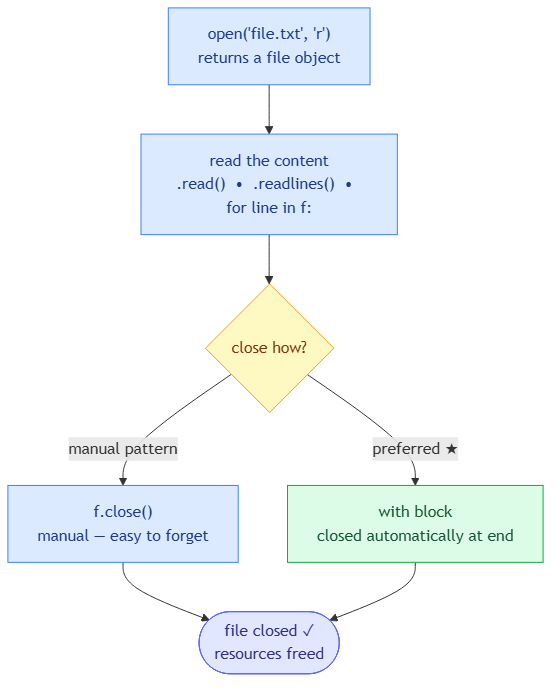

<!-- nav:top:start -->
[⬅ Previous: 12.5 — Dictionaries](../../../1-functions-and-data-structures/12-5-dictionaries-key-value-pairs-for-structured-data/artifacts/reading.md)&emsp;·&emsp;[⬆ Table of Contents](../../../../../../../README.md#curriculum-topic-index)&emsp;·&emsp;[Next: 12.7 — Writing to a file ➡](../../12-7-writing-to-a-file-open-write-close/artifacts/reading.md)
<!-- nav:top:end -->

---

# Reading from a File — open, read lines, close

## Overview

Variables in Python disappear the moment your program stops running. A **text file** — a file stored on disk containing plain text — keeps data around between runs. This topic covers the three-step pattern every Python program uses to read a file: open it, read from it, then close it. Master this pattern and you can load any data your program needs — student marks, configuration settings, sensor readings — without typing it by hand every time.

## Key Concepts

### Step 1 — Open the file with `open()`

**`open()`** is a built-in Python function that connects your program to a file on disk and returns a **file object** — a value that represents the live connection [1]. Think of a file object as a bookmark placed at the very start of the file; every reading call moves that bookmark forward through the text.

```python
f = open("marks.txt", "r")
```

Two arguments matter:

- **Filename** — the name of the file. If the file sits in the same folder as your script, just the filename is enough; otherwise provide the full path.
- **Mode** — what you plan to do with the file. `"r"` means read-only, and the file must already exist. Writing and appending modes are covered in a later topic.

If the file does not exist, Python raises a `FileNotFoundError` and the program stops. Handling that error with `try/except` is covered in a later topic [1].

### Step 2 — Read the content

The file object gives you three ways to pull text out [1][2]:

| Method | What it returns | When to use it |
|---|---|---|
| `.read()` | The whole file as one big string | You need the entire text at once |
| `.readlines()` | A list — one string per line | You need all lines and want to index them |
| `for line in f:` | One line at a time, in a loop | Large files; process as you go |

Each line coming off the file looks like `'Alice,88\n'` — note the trailing `\n` (the **newline character** that marks the end of a line in a text file). That character is invisible but real; it will break comparisons and integer conversions if you leave it in. The fix is always `.strip()`:

```python
clean = line.strip()   # 'Alice,88\n'  →  'Alice,88'
```

**`.strip()`** removes all leading and trailing whitespace, including `\n` [1][2].

### The file-reading lifecycle


*The three-step lifecycle every file read follows: open() creates the connection, a reading method pulls out the text, and close() (or the with block) releases it.*

### Step 3 — Close the file

Every file you open must eventually be closed [1][2]. The operating system limits how many files a program can hold open at the same time; forgetting `.close()` causes **resource leaks** — a slow build-up of unclosed connections that can crash long-running programs.

```python
f = open("marks.txt", "r")
content = f.read()
f.close()
```

### The `with` block — always use this

Remembering to call `.close()` is easy to forget, especially when an error interrupts your program before it reaches that line. Python's **`with` block** handles closing automatically, even if something goes wrong [1][2][3]:

```python
with open("marks.txt", "r") as f:
    content = f.read()
# file is closed here automatically

<!-- nav:top:start -->
[⬅ Previous: 12.5 — Dictionaries](../../../1-functions-and-data-structures/12-5-dictionaries-key-value-pairs-for-structured-data/artifacts/reading.md)&emsp;·&emsp;[⬆ Table of Contents](../../../../../../../README.md#curriculum-topic-index)&emsp;·&emsp;[Next: 12.7 — Writing to a file ➡](../../12-7-writing-to-a-file-open-write-close/artifacts/reading.md)
<!-- nav:top:end -->

---
```

- `as f` gives the file object the name `f` inside the block.
- The file closes the instant the indented block ends — no explicit `.close()` needed.
- This is the standard pattern you will see in every professional Python codebase.

From this point on, every file example uses a `with` block.

## Worked Example

**Goal:** read `marks.txt`, where each line holds a student name and a score separated by a comma, and print each student's result.

`marks.txt` contents:
```
Alice,88
Bob,72
Carol,95
```

**Step 1 — print raw lines:**

```python
with open("marks.txt", "r") as f:
    for line in f:
        print(line)
```

The output is double-spaced because each line already ends with `\n` and `print()` adds another newline on top. This is how you can see the `\n` is really there.

**Step 2 — strip the newline:**

```python
with open("marks.txt", "r") as f:
    for line in f:
        print(line.strip())
```

Output is now single-spaced and clean. One call to `.strip()` is all it takes.

**Step 3 — split name from score:**

```python
with open("marks.txt", "r") as f:
    for line in f:
        clean = line.strip()
        parts = clean.split(",")
        name  = parts[0]
        score = parts[1]
        print(name, "scored", score)
```

**`.split(",")`** cuts the string at every comma and returns a list [1][2]. `parts[0]` is the name; `parts[1]` is the score — still a string at this point.

**Step 4 — wrap in a function and convert score to integer:**

```python
def load_marks(filename):
    results = []
    with open(filename, "r") as f:
        for line in f:
            clean = line.strip()
            if clean:
                parts = clean.split(",")
                name  = parts[0]
                score = int(parts[1])
                results.append([name, score])
    return results
```

Three things to note:

- **`if clean:`** — a blank line stripped becomes an empty string `""`, which is falsy. This guard skips blank lines before `.split()` runs [1].
- **`int(parts[1])`** — converts the score string `"88"` to the integer `88` so arithmetic works later.
- The function returns a plain Python list, so all the list skills from Topic 12.4 apply directly.

Call it:

```python
data = load_marks("marks.txt")
print(data)
# [['Alice', 88], ['Bob', 72], ['Carol', 95]]

<!-- nav:top:start -->
[⬅ Previous: 12.5 — Dictionaries](../../../1-functions-and-data-structures/12-5-dictionaries-key-value-pairs-for-structured-data/artifacts/reading.md)&emsp;·&emsp;[⬆ Table of Contents](../../../../../../../README.md#curriculum-topic-index)&emsp;·&emsp;[Next: 12.7 — Writing to a file ➡](../../12-7-writing-to-a-file-open-write-close/artifacts/reading.md)
<!-- nav:top:end -->

---
```

## In Practice

**Two common real-world patterns:**

**Pattern 1 — loading a list of numbers for calculation:**

```python
def load_scores(filename):
    scores = []
    with open(filename, "r") as f:
        for line in f:
            value = line.strip()
            if value:
                scores.append(int(value))
    return scores

scores = load_scores("scores.txt")
total = 0
for s in scores:
    total += s
average = total / len(scores)
print("Average:", average)
```

The manual accumulator (`total = 0` then `total += s`) adds each score one by one — no extra imports needed [1][3]. Once you have the list, all your Topic 12.4 loop skills apply.

**Pattern 2 — reading a `key=value` config file:**

```python
settings = {}
with open("config.txt", "r") as f:
    for line in f:
        clean = line.strip()
        if clean and "=" in clean:
            key, value = clean.split("=", 1)
            settings[key] = value
```

`split("=", 1)` splits at the first `=` only, so values that themselves contain `=` are kept intact. The result is a dictionary (Topic 12.5) — each setting becomes one key-value pair [1][2].

**Do and don't checklist:**

- **Always use a `with` block** — it closes the file even when an error occurs mid-read.
- **Always `.strip()` every line** — raw lines carry `\n`; leaving it in breaks comparisons and `int()` conversion.
- **Always guard with `if clean:`** before calling `.split()` or `int()` — a blank line will crash without it.
- **Always convert numeric strings** with `int()` or `float()` before doing any arithmetic.
- **Do not call `.read()` twice** on the same file object — after the first call the bookmark is at the end; the second call returns `""` [1][3].
- **Avoid `.readlines()` on very large files** — it loads every line into memory at once; `for line in f:` reads one line at a time and uses far less memory [1].

## Key Takeaways

- **`open("filename.txt", "r")`** connects your program to a file for reading; mode `"r"` requires the file to already exist — a missing file raises `FileNotFoundError`.
- **Three ways to read:** `.read()` returns the whole file as one string; `.readlines()` returns a list of lines; `for line in f:` reads one line at a time.
- **`with open(...) as f:`** is the always-preferred pattern — it closes the file automatically when the block ends, even if an error occurs.
- **Every line includes a trailing `\n`** — always call `.strip()` before comparing, splitting, or converting a line.
- **Guard blank lines** with `if clean:` and convert numeric strings with `int()` or `float()` before arithmetic — these two habits prevent the most common beginner file-reading crashes.

## References

1. Python Tutorial, "Python Read Text File." <https://www.pythontutorial.net/python-basics/python-read-text-file/>
2. W3Schools, "Python File Open." <https://www.w3schools.com/python/python_file_open.asp>
3. freeCodeCamp, "Python open() — How to Read a Text File Line by Line." <https://www.freecodecamp.org/news/python-open-file-how-to-read-a-text-file-line-by-line/>

---
<!-- nav:bottom:start -->
[⬅ Previous: 12.5 — Dictionaries](../../../1-functions-and-data-structures/12-5-dictionaries-key-value-pairs-for-structured-data/artifacts/reading.md)&emsp;·&emsp;[⬆ Table of Contents](../../../../../../../README.md#curriculum-topic-index)&emsp;·&emsp;[Next: 12.7 — Writing to a file ➡](../../12-7-writing-to-a-file-open-write-close/artifacts/reading.md)
<!-- nav:bottom:end -->
