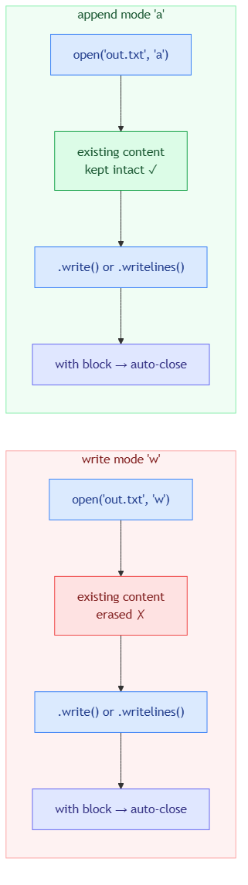

<!-- nav:top:start -->
[⬅ Previous: 12.6 — Reading from a file](../../12-6-reading-from-a-file-open-read-lines-close/artifacts/reading.md)&emsp;·&emsp;[⬆ Table of Contents](../../../../../../../README.md#curriculum-topic-index)&emsp;·&emsp;[Next: 12.8 — try / except ➡](../../12-8-try-except-handling-errors-gracefully-without-crashing/artifacts/reading.md)
<!-- nav:top:end -->

---

# Writing to a File — open, write, close

## Overview

In Topic 12.6 you learned how to open a file and read data from it. Reading is only half the story. Programs that are useful in the real world need to *save* their results — write a summary to a file, record what happened, or store output so it persists after the program finishes [1]. This topic covers the other direction: opening a file for writing, putting content into it, and closing it safely. You will also see how to *add* new lines to an existing file without erasing what is already there.

## Key Concepts

### Write mode (`'w'`) — creates or erases

To open a file for writing, pass the letter `'w'` as the second argument to `open()` [1]:

```python
file_object = open("results.txt", "w")
```

What happens next depends on whether the file already exists:

- **File does not exist yet:** Python creates a brand-new, empty file and hands you a file object pointing to its beginning.
- **File already exists:** Python **erases all existing content immediately** — before you write a single character — and hands you a file object pointing to the now-empty beginning.

The second behaviour is the critical gotcha [1][3]. The moment you call `open("results.txt", "w")`, any previous content is gone. There is no undo and no warning.

### Append mode (`'a'`) — adds to the end

Append mode uses the letter `'a'` [1]:

```python
file_object = open("results.txt", "a")
```

- **File does not exist yet:** Python creates a new, empty file.
- **File already exists:** Python opens it **without erasing anything**. The write position jumps to the very end. Every call after this adds new characters after whatever was already there [1][3].

The diagram below shows how the two modes compare across the full open → write → auto-close lifecycle:



*Write mode starts fresh each time; append mode preserves existing content and continues from the end.*

| | `'w'` Write mode | `'a'` Append mode |
|---|---|---|
| File does not exist | Creates it | Creates it |
| File already exists | **Erases content, starts from beginning** | Keeps content, starts from end |
| Typical use | Regenerate the whole file each run | Add new lines to a growing file |

### The `.write(string)` method

Once a file is open in write or append mode, call `.write()` to send content to it [1][2]:

```python
f.write("Alice,88")
```

Three rules apply:

1. **The argument must be a string.** Passing an integer raises a `TypeError`.
2. **No automatic newline.** Unlike `print()`, `.write()` writes exactly what you give it. Two back-to-back calls without `\n` produce one long line.
3. **The position bookmark advances** after each call, so the next call continues from where the last one stopped.

### Newlines — you must add `\n` yourself

Because `.write()` does not add a line break, include `\n` wherever you want a new line [1][3]:

```python
f.write("Alice,88\n")
f.write("Bob,74\n")
f.write("Carol,91\n")
```

Without `\n`, the file contains `Alice,88Bob,74Carol,91` — one long run-on string. This is the most common beginner mistake with `.write()`.

### The `.writelines(list)` method

When you already have a list of strings, `.writelines()` is a shorthand that writes every item in the list [1]:

```python
lines = ["Alice,88\n", "Bob,74\n", "Carol,91\n"]
f.writelines(lines)
```

`.writelines()` loops over the list and writes each string. The same newline rule applies — it does **not** add `\n` between items automatically.

If your list does not already include `\n`, add it with a plain `for` loop:

```python
raw = ["Alice,88", "Bob,74", "Carol,91"]
lines = []
for s in raw:
    lines.append(s + "\n")
f.writelines(lines)
```

### The `with` block — auto-close and auto-flush

The same `with` block you used in Topic 12.6 for reading works for writing [1][2]:

```python
with open("results.txt", "w") as f:
    f.write("Alice,88\n")
    f.write("Bob,74\n")
# File is automatically closed here

<!-- nav:top:start -->
[⬅ Previous: 12.6 — Reading from a file](../../12-6-reading-from-a-file-open-read-lines-close/artifacts/reading.md)&emsp;·&emsp;[⬆ Table of Contents](../../../../../../../README.md#curriculum-topic-index)&emsp;·&emsp;[Next: 12.8 — try / except ➡](../../12-8-try-except-handling-errors-gracefully-without-crashing/artifacts/reading.md)
<!-- nav:top:end -->

---
```

Two reasons to always use `with`:

1. **Guaranteed close.** If something goes wrong inside the block, Python still closes the file before the error propagates. A manually placed `f.close()` after a crash would never run.
2. **Flush on close.** Python may hold data in memory briefly before writing to disk. Closing the file **flushes the buffer** — sends any buffered data to disk. The `with` block closes as soon as the indented block ends [2].

### Converting values before writing — `str()` required

A file holds text. `.write()` only accepts strings. Passing a number directly raises a `TypeError` [2]:

```python
score = 88
f.write(score)        # TypeError: write() argument must be str, not int
f.write(str(score))   # Correct: writes the string "88"
```

**`str()`** — a built-in function that converts any value to its string form. You used it in Week 11 for string formatting; it works the same way here.

## Worked Example

Lab use-case: saving a list of student names and scores to a file, then adding a new student without erasing the existing results.

**Starting data — two parallel lists:**

```python
names  = ["Alice", "Bob", "Carol"]
scores = [88, 74, 91]
```

**Step 1 — Write lines one at a time**

```python
with open("results.txt", "w") as f:
    for i in range(len(names)):
        line = names[i] + "," + str(scores[i]) + "\n"
        f.write(line)
```

After this runs, `results.txt` contains:

```
Alice,88
Bob,74
Carol,91
```

**Step 2 — Verify `\n` is in every line**

Before committing to the file, `print()` each line to confirm it looks right:

```python
with open("results.txt", "w") as f:
    for i in range(len(names)):
        line = names[i] + "," + str(scores[i]) + "\n"
        print(line, end="")   # shows the line as it will appear in the file
        f.write(line)
```

Remove the `print` once you are satisfied.

**Step 3 — Wrap in a function**

A single-job function (Topic 12.3) handles one task: saving data to a file.

```python
def save_results(filename, names, scores):
    # This function saves names and scores to the given file
    with open(filename, "w") as f:
        for i in range(len(names)):
            line = names[i] + "," + str(scores[i]) + "\n"
            f.write(line)

save_results("results.txt", names, scores)
```

**Step 4 — Add a new student with append mode**

```python
def append_student(filename, name, score):
    with open(filename, "a") as f:
        line = name + "," + str(score) + "\n"
        f.write(line)

append_student("results.txt", "David", 79)
```

After this call, `results.txt` contains all four students — Alice, Bob, Carol, and David — without any earlier data being erased.

## In Practice

**Always use the `with` block.**
Never rely on manually calling `f.close()`. The `with` block guarantees the file is closed and flushed even if an error occurs [1][2].

**Think before opening in write mode.**
The instant you call `open("results.txt", "w")`, existing content is gone. A common mistake is opening in write mode *inside* a loop:

```python
# Bug — re-opens in write mode every iteration, erasing previous output

<!-- nav:top:start -->
[⬅ Previous: 12.6 — Reading from a file](../../12-6-reading-from-a-file-open-read-lines-close/artifacts/reading.md)&emsp;·&emsp;[⬆ Table of Contents](../../../../../../../README.md#curriculum-topic-index)&emsp;·&emsp;[Next: 12.8 — try / except ➡](../../12-8-try-except-handling-errors-gracefully-without-crashing/artifacts/reading.md)
<!-- nav:top:end -->

---
for i in range(len(names)):
    with open("results.txt", "w") as f:   # WRONG
        f.write(names[i] + "," + str(scores[i]) + "\n")

# Fix — open once, write many times

<!-- nav:top:start -->
[⬅ Previous: 12.6 — Reading from a file](../../12-6-reading-from-a-file-open-read-lines-close/artifacts/reading.md)&emsp;·&emsp;[⬆ Table of Contents](../../../../../../../README.md#curriculum-topic-index)&emsp;·&emsp;[Next: 12.8 — try / except ➡](../../12-8-try-except-handling-errors-gracefully-without-crashing/artifacts/reading.md)
<!-- nav:top:end -->

---
with open("results.txt", "w") as f:
    for i in range(len(names)):
        f.write(names[i] + "," + str(scores[i]) + "\n")
```

**Always include `\n` at the end of each line.**
Forgetting the newline is the single most common `.write()` mistake [1][3].

**Convert numbers to strings before writing.**

```python
f.write(str(score))
f.write(str(round(avg, 2)))
```

**Choose the mode that matches your intent.**

- Regenerate the whole file each run → use `'w'`
- Add to an existing file without erasing → use `'a'`

**Keep one function per file-writing task.**
One function to save results, a separate function to append a log entry. This follows the single-job principle from Topic 12.3 [1].

## Key Takeaways

- **Write mode (`'w'`) erases first.** Calling `open(filename, "w")` destroys any existing content immediately — before you write a single character.
- **Append mode (`'a'`) adds to the end.** It never erases existing content; it always continues from the last character.
- **`.write()` does not add newlines.** You must include `\n` explicitly in every string that should appear on its own line.
- **`.writelines()` writes a list of strings** — the same newline rule applies; it does not insert line breaks automatically.
- **Numbers must be converted to strings** with `str()` before calling `.write()`, or Python raises a `TypeError`.
- **Use the `with` block** for every file-writing operation — it guarantees the file is closed and flushed, even if something goes wrong.

## References

1. Python Tutorial — Writing to a Text File in Python. https://www.pythontutorial.net/python-basics/python-write-text-file/
2. Python Documentation — Input and Output. https://docs.python.org/3/tutorial/inputoutput.html
3. freeCodeCamp — File Handling in Python. https://www.freecodecamp.org/news/file-handling-in-python/

---
<!-- nav:bottom:start -->
[⬅ Previous: 12.6 — Reading from a file](../../12-6-reading-from-a-file-open-read-lines-close/artifacts/reading.md)&emsp;·&emsp;[⬆ Table of Contents](../../../../../../../README.md#curriculum-topic-index)&emsp;·&emsp;[Next: 12.8 — try / except ➡](../../12-8-try-except-handling-errors-gracefully-without-crashing/artifacts/reading.md)
<!-- nav:bottom:end -->
