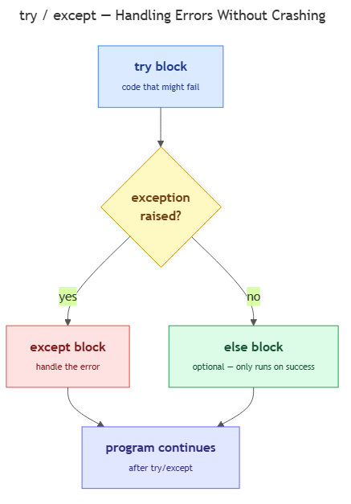

<!-- nav:top:start -->
[⬅ Previous: 12.7 — Writing to a file](../../12-7-writing-to-a-file-open-write-close/artifacts/reading.md)&emsp;·&emsp;[⬆ Table of Contents](../../../../../../../README.md#curriculum-topic-index)&emsp;·&emsp;[Next: 12.9 — What an API is ➡](../../../3-calling-an-llm-from-python/12-9-what-an-api-is-a-door-into-another-system-request-and-respon/artifacts/reading.md)
<!-- nav:top:end -->

---

# try / except — handling errors gracefully without crashing

## Overview

When your Python program opens a file that does not exist, Python stops the program immediately and prints an error. This abrupt stop is called a **crash** — all code below the failing line never runs. `try / except` is Python's built-in way to anticipate failures and handle them cleanly, keeping the program alive and giving users helpful messages instead of a wall of red text [1].

## Key Concepts

### What is an exception?

An **exception** is Python's signal that something went wrong while a line of code was running. When Python hits a problem it cannot fix — a missing file, a bad number conversion, a division by zero — it **raises** an exception and stops the current block.

Exceptions are different from **syntax errors**. A syntax error (like a missing colon) is caught before the program runs. An exception happens at **runtime** — while the code is actually executing — so you often cannot see it coming until it occurs.

Every exception has a **name** (its type) that tells you what went wrong [1]:

| Exception name | When it occurs |
|---|---|
| `FileNotFoundError` | `open()` was called on a path that does not exist [1] |
| `ValueError` | A function got the right type but a bad value — e.g., `int("hello")` [2] |
| `TypeError` | A function got the completely wrong type of argument [2] |
| `ZeroDivisionError` | Code tried to divide a number by zero |
| `PermissionError` | The operating system blocked file access |

### The try / except structure


*Python checks the try block line by line; the first exception jumps straight to the matching except clause, skipping any remaining try lines.*

The **`try` block** holds the code that might fail. The **`except` block** holds the recovery code that runs only if a specific exception was raised [1]:

```python
try:
    f = open("marks.csv", "r")
    content = f.read()
    f.close()
except FileNotFoundError:
    print("Error: marks.csv was not found.")
```

What happens step by step:
1. Python tries to open `marks.csv`.
2. If the file is missing, Python raises `FileNotFoundError`.
3. Instead of crashing, Python runs the `except` block and prints the message.
4. The program continues with whatever line comes after the whole `try / except` structure.

### Catch specific exceptions — never bare `except`

`except FileNotFoundError:` catches only that one type. This is intentional. A **bare `except`** — written without a type name — catches everything, including typos in variable names, keyboard interrupts, and memory errors, hiding bugs you need to see [1][3]:

```python
# DO NOT DO THIS

<!-- nav:top:start -->
[⬅ Previous: 12.7 — Writing to a file](../../12-7-writing-to-a-file-open-write-close/artifacts/reading.md)&emsp;·&emsp;[⬆ Table of Contents](../../../../../../../README.md#curriculum-topic-index)&emsp;·&emsp;[Next: 12.9 — What an API is ➡](../../../3-calling-an-llm-from-python/12-9-what-an-api-is-a-door-into-another-system-request-and-respon/artifacts/reading.md)
<!-- nav:top:end -->

---
try:
    f = open("marks.csv", "r")
except:
    print("Something went wrong.")  # hides all bugs
```

Always name the exception you expect. If you need to handle more than one, use multiple `except` clauses:

```python
try:
    raw = input("Enter a mark: ")
    mark = int(raw)
except ValueError:
    print(f"'{raw}' is not a valid number.")
    mark = 0
```

### The `else` clause

The optional **`else` block** runs only when the `try` block completed without any exception [2]. It is the "happy path":

```python
try:
    with open("marks.csv", "r") as f:
        lines = f.readlines()
except FileNotFoundError:
    print("File not found.")
else:
    print(f"Read {len(lines)} lines successfully.")
```

Code in `else` is not protected by the `except` clause above it, which makes the boundary explicit: lines inside `try` are actively guarded; lines in `else` run after the guard ends. This matters because if you put success-path code at the bottom of the `try` block instead, any exception that code raises would also be caught by the `except` clause above — usually not what you intend. For beginners, `else` is optional — but it is a clean, readable signal of intent.

Python also has a `finally` clause (runs regardless of outcome) — covered in a later topic.

## Worked Example

The function below wraps a file read in `try / except`, combines it with the `with open(...)` pattern from topic 12.6, and returns a safe default if the file is missing [1]:

```python
def read_marks(filename):
    try:
        with open(filename, "r") as f:
            lines = f.readlines()
        return lines
    except FileNotFoundError:
        print(f"Error: '{filename}' was not found.")
        return []
```

Walk through each decision:

1. **`try` wraps `with open(...)`** — if the file does not exist, `FileNotFoundError` is raised before the `with` block even starts.
2. **`with` is still used** — it guarantees the file is closed when the block exits, even mid-exception.
3. **`return []` in `except`** — the variable `lines` still has a usable value (`[]`) when the calling code continues, so no `NameError` follows downstream.

For input validation, the same structure catches `ValueError` when converting user text to a number:

```python
raw = input("Enter a mark: ")
try:
    mark = int(raw)
except ValueError:
    print(f"'{raw}' is not a valid number.")
    mark = 0

print(f"Mark recorded: {mark}")
```

`int("85")` works fine. `int("eighty-five")` raises `ValueError`. The `except` block catches it, sets a safe default of `0`, and the program keeps running [2].

## In Practice

**Where you will use this:**

- **File I/O at startup.** Any data pipeline reads an input file first. Wrapping that `open()` in `try / except FileNotFoundError` and printing a clear diagnostic is standard [3].
- **User input conversion.** Any script that prompts for a number should protect `int()` or `float()` with `try / except ValueError` — users will eventually type something unexpected [2][3].
- **API calls (upcoming).** The same pattern applies when calling external services like the Anthropic API (covered in topic 12.12) — exception types differ, but the structure is identical.

**Two mistakes to avoid [1][3]:**

- **Bare `except:`** — silences every possible error, including bugs you need to fix. Always name the exception type.
- **Silent swallow** — an `except` block that does nothing (`pass` with no comment) makes bugs invisible. If you genuinely need to ignore an exception, add a comment explaining why.

**Safe default pattern:** when downstream code depends on a variable, always assign it a safe value inside the `except` block:

```python
except FileNotFoundError:
    lines = []   # downstream code can safely call len(lines)
```

## Key Takeaways

- An **exception** is a runtime error signal. Without `try / except`, any unhandled exception crashes the program immediately.
- The **`try` block** wraps code that might fail; the **`except` block** runs only when a specific failure occurs — the program keeps running instead of crashing.
- Always catch **specific exception types** (`FileNotFoundError`, `ValueError`, etc.). Bare `except:` hides bugs and is strongly discouraged [1][3].
- The **`else` clause** runs only when no exception occurred — it cleanly separates success logic from failure logic.
- Wrapping `open()` in `try / except FileNotFoundError` is the standard, professional pattern for file operations — it gives users a meaningful message and lets the rest of the script continue [1].

## References

1. Python Tutorial — Try Except. https://www.pythontutorial.net/python-basics/python-try-except/
2. W3Schools — Python Try Except. https://www.w3schools.com/python/python_try_except.asp
3. DataCamp — Python Try Except Tutorial. https://www.datacamp.com/tutorial/python-try-except

---
<!-- nav:bottom:start -->
[⬅ Previous: 12.7 — Writing to a file](../../12-7-writing-to-a-file-open-write-close/artifacts/reading.md)&emsp;·&emsp;[⬆ Table of Contents](../../../../../../../README.md#curriculum-topic-index)&emsp;·&emsp;[Next: 12.9 — What an API is ➡](../../../3-calling-an-llm-from-python/12-9-what-an-api-is-a-door-into-another-system-request-and-respon/artifacts/reading.md)
<!-- nav:bottom:end -->
