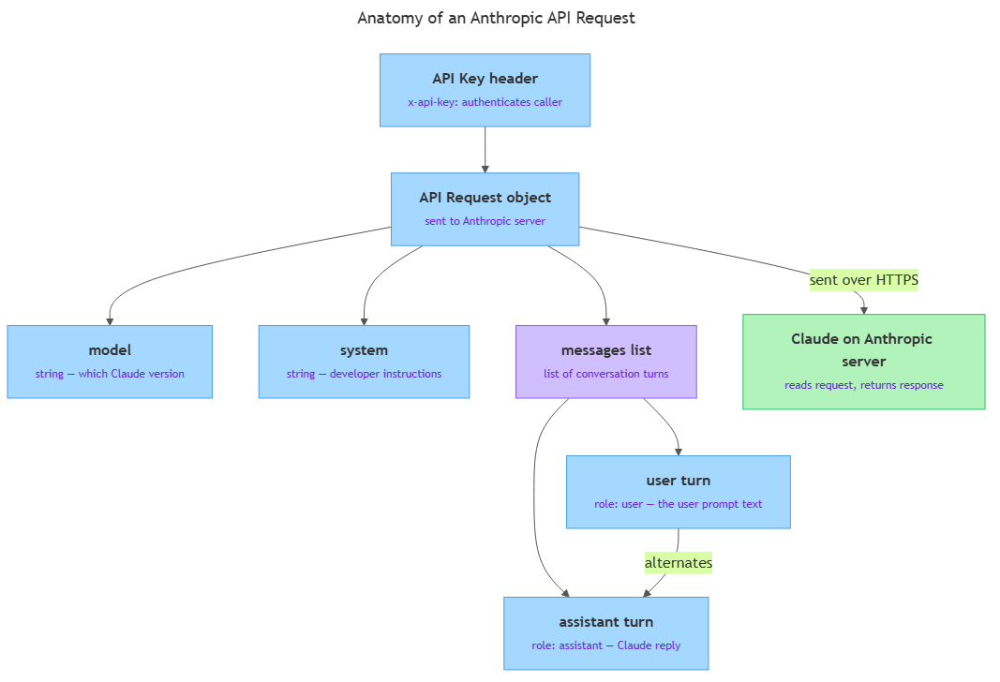

<!-- nav:top:start -->
[⬅ Previous: 12.9 — What an API is](../../12-9-what-an-api-is-a-door-into-another-system-request-and-respon/artifacts/reading.md)&emsp;·&emsp;[⬆ Table of Contents](../../../../../../../README.md#curriculum-topic-index)&emsp;·&emsp;[Next: 12.11 — Making the first API call ➡](../../12-11-making-the-first-api-call-install-the-library-write-the-call/artifacts/reading.md)
<!-- nav:top:end -->

---

# The Anthropic API — model, messages array, system prompt, user prompt, authentication

## Overview

When you call the Anthropic API, you send a request to a Claude model running on Anthropic's servers, Claude generates a reply, and sends it back to your Python program. The API only accepts requests that follow a specific shape — get the shape right and you get an answer; get it wrong and you get an error. This topic teaches you that shape: the four top-level fields every request must contain, what each one means, and why it exists.

## Key Concepts

Every request to the Anthropic Messages API [1] is built from four parts.


*The four top-level fields of an Anthropic API request: model, system prompt, messages array (with user and assistant turns), and the API key sent in the request header.*

### 1. The `model` parameter

**`model`** — a string naming the exact Claude version you want to use, such as `"claude-haiku-3-5"` or `"claude-sonnet-4-5"`.

You cannot say "give me Claude" — you must be specific [1]. Different versions differ in quality, speed, and cost:

| Model name | Typical use |
|---|---|
| `claude-opus-4-5` | Complex reasoning, highest quality |
| `claude-sonnet-4-5` | Balanced quality and speed |
| `claude-haiku-3-5` | Fast and low cost, simpler tasks |

If you pass a string that does not exactly match a published model name, the API returns an error — it will not guess what you meant.

### 2. The `messages` array

**`messages`** — a Python list of conversation turns, where every turn is a dictionary with exactly two keys: `role` and `content` [1][3].

- **`role`** — who is speaking: either `"user"` (the human side) or `"assistant"` (Claude).
- **`content`** — the text of that turn, as a string.

**Rules you must follow** — breaking any of these causes an `invalid_request_error`:

1. The list must not be empty.
2. The first item must have `role: "user"`.
3. Turns must alternate: `user`, `assistant`, `user`, `assistant`, …
4. Every item must have both `role` and `content`.
5. `"system"` is not a valid role inside `messages` — system instructions use a separate parameter.

The simplest valid messages array has one item:

```python
messages = [
    {"role": "user", "content": "What is the capital of France?"}
]
```

### 3. The system prompt

**System prompt** — a special string you pass in a separate `system` parameter that tells Claude how to behave for the entire conversation [2].

The system prompt sits outside the `messages` array, at the same level as `model`. It is not a `"user"` turn. Claude reads it before it reads the messages, so the rules it sets apply to every reply.

The **user prompt** is the `content` of a `"user"` turn inside `messages` — it is what the human (or your program) is actually asking. The two fields have different purposes:

| | System prompt (`system`) | User prompt (inside `messages`) |
|---|---|---|
| **What it contains** | Behavioral rules for Claude | The actual question or task |
| **Who writes it** | You, the developer | The user of your app (or your code) |
| **When Claude reads it** | Before the conversation | As part of the conversation |
| **Typical use** | Role, tone, topic limits, output format | A specific question or task |

### 4. Authentication — the API key

**Authentication** — the process of proving to the API that you have permission to use it.

The Anthropic API uses an **API key**: a long, randomly generated string unique to your account (e.g., `sk-ant-api03-…`). It is sent in the request headers under the key `x-api-key` [1]. The API checks the key before it reads anything else — no valid key, no response.

When you use Anthropic's Python library (topic 12.11), you pass your key to the client object once and the library attaches it to every request automatically. You never construct the header by hand.

**An API key is like a password.** The rules for keeping it safe:

- Never put it directly in your code — a file with a hardcoded key can be accidentally shared or committed to version control (a system like GitHub that records every change to a file; once a key appears there it stays in the history even if you delete it later).
- Never share it in a screenshot, chat, or email.
- Store it in an **environment variable** — a named value stored by the operating system, not in your script; your code reads it at runtime.
- If it is ever exposed, revoke it immediately and generate a new one.

A request with a missing or invalid key returns HTTP status `401` (Unauthorized). A valid key on an account that has run out of credits returns `429`.

## Worked Example

Here is a fully annotated request structure for a study-assistant bot. This is the shape — not yet runnable code (that is topic 12.11) — but every field is real and correctly formed [1][2].

```python
study_assistant_request = {
    "model":  "claude-sonnet-4-5",          # (1) which Claude version to use
    "system": "You are a study assistant for CIT students. "
              "Only answer questions about the CIT curriculum. "
              "Keep answers under four sentences.",  # (2) system prompt — rules for the whole conversation
    "messages": [                            # (3) the conversation — a list
        {
            "role":    "user",               # (4) the human side is speaking
            "content": "Explain what a for loop does."  # (5) the user prompt — the actual question
        }
    ]
}
# API key is attached separately by the client library (not shown here)

<!-- nav:top:start -->
[⬅ Previous: 12.9 — What an API is](../../12-9-what-an-api-is-a-door-into-another-system-request-and-respon/artifacts/reading.md)&emsp;·&emsp;[⬆ Table of Contents](../../../../../../../README.md#curriculum-topic-index)&emsp;·&emsp;[Next: 12.11 — Making the first API call ➡](../../12-11-making-the-first-api-call-install-the-library-write-the-call/artifacts/reading.md)
<!-- nav:top:end -->

---
```

Field-by-field breakdown:

1. **`"model"`** — `"claude-sonnet-4-5"`. Mid-tier model: good for explaining things clearly without the cost of Opus.
2. **`"system"`** — the system prompt. It does three things: sets a role ("study assistant"), sets a scope ("only CIT curriculum"), and sets an output constraint ("under four sentences"). These rules apply to every reply Claude gives in this conversation.
3. **`"messages"`** — a Python list. Even with one question it is still a list.
4. **`messages[0]["role"]`** — `"user"`. The human is speaking on this turn.
5. **`messages[0]["content"]`** — the user prompt: the specific question being asked.

If you can walk through a skeleton like this and explain every field, you are ready for topic 12.11.

## In Practice

**Model selection as a cost decision.** Production applications often use different models for different tasks. A fast, cheap model handles simple text classification; a more capable model handles nuanced document analysis. The `model` parameter lets you choose per-request — you are not locked into one model for all calls [1].

**System prompts as product features.** In real AI products, the system prompt is often the core intellectual property — users never see it, but it defines the product's personality, capabilities, and limits. Well-written system prompts separate a generic Claude response from a response tailored to a specific application [2].

**The API is stateless.** It does not remember previous calls. If you need a chatbot that remembers earlier parts of a conversation, you must append each new turn to the `messages` list and send the full history with every request [3]. This design makes the API predictable and easy to scale, but managing the history is your responsibility.

**Authentication is layered in production.** Companies that build on the Anthropic API do not expose their API key to end users. The company's server holds the key and makes API calls on behalf of users. End users authenticate with the company's app; the app authenticates with Anthropic. The API key never leaves the server.

**Key rules to remember:**

- Always start `messages` with a `"user"` turn — an `"assistant"` turn first causes an immediate error.
- Keep conversation history as short as needed — long histories increase both response time and cost.
- For learning and iteration, start with a smaller model (e.g., Haiku) — you will make many calls while experimenting and the cost adds up.
- Write system prompts as specific instructions, not vague requests: "respond in an encouraging tone and avoid negative language" works better than "be nice" [2].

## Key Takeaways

- Every Anthropic Messages API request requires at minimum: a `model` string, a `messages` array, and your API key in the request header for authentication. Additional parameters are introduced in topic 12.11.
- The `messages` array is a Python list of dictionaries; each dictionary must have `role` (either `"user"` or `"assistant"`) and `content` (the text). Turns must alternate and the first must be a `"user"` turn.
- The `system` parameter carries persistent behavioral instructions — role, tone, topic limits, output format — that apply to the whole conversation. It lives outside `messages`, not inside it.
- A user prompt is the `content` of a `"user"` turn; a system prompt is the separate `system` parameter. They serve different purposes and live in different places.
- An API key authenticates every request. It must be stored in an environment variable, never hardcoded in source files or version control. A missing or invalid key returns a `401` error before Claude ever reads your messages.

## References

1. Anthropic. *Messages API reference*. https://docs.anthropic.com/en/api/messages
2. Anthropic. *System prompts best practices*. https://docs.anthropic.com/en/docs/build-with-claude/prompt-engineering/system-prompts
3. Anthropic. *Upgrading to the Messages API*. https://docs.anthropic.com/en/docs/upgrading-to-the-messages-api

---
<!-- nav:bottom:start -->
[⬅ Previous: 12.9 — What an API is](../../12-9-what-an-api-is-a-door-into-another-system-request-and-respon/artifacts/reading.md)&emsp;·&emsp;[⬆ Table of Contents](../../../../../../../README.md#curriculum-topic-index)&emsp;·&emsp;[Next: 12.11 — Making the first API call ➡](../../12-11-making-the-first-api-call-install-the-library-write-the-call/artifacts/reading.md)
<!-- nav:bottom:end -->
