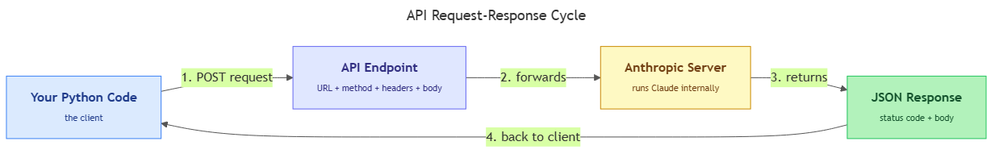

<!-- nav:top:start -->
[⬅ Previous: 12.8 — try / except](../../../2-working-with-files/12-8-try-except-handling-errors-gracefully-without-crashing/artifacts/reading.md)&emsp;·&emsp;[⬆ Table of Contents](../../../../../../../README.md#curriculum-topic-index)&emsp;·&emsp;[Next: 12.10 — The Anthropic API ➡](../../12-10-the-anthropic-api-model-messages-array-system-prompt-user-pr/artifacts/reading.md)
<!-- nav:top:end -->

---

# What an API is — a door into another system; request and response

## Overview

When your Python code needs to talk to an external service — a weather app, a payment processor, or an AI model — it cannot log into the service's internal servers directly. Instead, it uses a defined doorway called an **API (Application Programming Interface)**. Every API interaction follows the same pattern: your code sends a **request**, the server processes it, and the server sends back a **response**. Understanding this cycle is the conceptual foundation you need before writing a single line of code that calls an LLM (Large Language Model) like Claude [1].

## Key Concepts

### What "API" means

**API** stands for **Application Programming Interface**. Each word matters:

- **Application** — a piece of software or service running somewhere on the internet.
- **Programming** — it is designed to be used by code, not by humans clicking buttons.
- **Interface** — a defined contract. Both sides agree on the rules: what you can ask for, how to ask, and what you will get back.

Think of the word "interface" the way you think of a wall socket. The socket has a fixed shape and voltage. Any plug that matches that contract can use it. The socket does not care what device is plugged in; the device does not care how electricity is generated. The interface is the agreement between them [1]. An API works the same way — it is a published set of rules that says: "Send me a message in this format and I will send you a response in this format."

### The client-server model

Every API interaction has two roles:

| Role | Who it is | What it does |
|---|---|---|
| **Client** | Your Python code | Sends the request — asks for something |
| **Server** | The external system | Receives the request, processes it, sends back a response |

Your code is always the client. The external system — a weather service, a database, or an LLM — is the server. They communicate over the internet using **HTTP (HyperText Transfer Protocol)**, the standard language that web browsers and servers use. You do not need to understand HTTP at a low level; you just need to know the three-step pattern it enables:

1. Your code sends an HTTP request to a URL.
2. The server at that URL processes it.
3. The server sends an HTTP response back to your code [2].

### The waiter analogy

The best way to picture an API is a restaurant:

| Restaurant | API |
|---|---|
| You (the customer) | Your Python code (the client) |
| The waiter | The API |
| The kitchen | The server / the service |
| The menu | The API documentation |
| Your order | The request |
| Your meal | The response |

You do not walk into the kitchen or touch the ingredients. You tell the waiter what you want. The kitchen can change its equipment, hire new chefs, or update its recipes — and as long as the waiter still takes the same kind of order and brings back the right meal, you are unaffected. This is exactly why APIs exist: they **hide the implementation** behind a stable interface [1]. If Anthropic rewrites the internal code that runs Claude, your Python code does not break, because you are talking to the API, not to the internals.

### The full cycle — visualised



*The diagram shows how a request travels from your Python code to the server and how the response travels back — every API call follows this same loop.*

### What a request looks like

An API request is your code saying "I want something." Every request has four parts [2]:

**1. Endpoint (URL)**
The **endpoint** is the address of the specific capability you are calling. It is a **URL (Uniform Resource Locator)** — the same kind of address you type into a browser. Different endpoints on the same server do different things.

Example: `https://api.anthropic.com/v1/messages`

The path `/v1/messages` tells the server which specific operation you want.

**2. HTTP Method**
The **HTTP method** (also called a "verb") tells the server what kind of action you are taking:

| Method | Meaning | Typical use |
|---|---|---|
| **GET** | "Give me some information" | Fetching data — no data sent in body |
| **POST** | "Here is some data — process it" | Sending data to be processed |

When you call an LLM, you use **POST** — you are sending your prompt and asking the server to process it [3].

**3. Headers**
**Headers** are metadata that travel alongside your request but are not the main content. They tell the server things like what format the body is in and who is making the request (your API key). Think of headers as the labels on the outside of an envelope; the body is the letter inside [2].

**4. Body**
The **body** (also called the **payload**) is the actual data you are sending. GET requests typically have no body. POST requests almost always do. The body is usually formatted as **JSON (JavaScript Object Notation)** — a format that looks exactly like a Python dictionary from topic 12.5:

```
{
  "model": "claude-3-5-sonnet-20241022",
  "messages": [
    {"role": "user", "content": "What is machine learning?"}
  ],
  "max_tokens": 256
}
```

The exact fields the Anthropic API expects in this body are covered in topic 12.10.

### What a response looks like

After the server processes your request, it sends back a **response** with three parts [3]:

**1. Status code**
The **status code** is a three-digit number that tells you immediately whether the request succeeded or failed — before you read anything else:

| Code | Meaning | Example situation |
|---|---|---|
| **200** | OK — success | Your request worked; data is in the body |
| **400** | Bad Request | You sent something the server could not understand |
| **401** | Unauthorized | Your API key is missing or wrong |
| **404** | Not Found | The endpoint URL does not exist |
| **429** | Too Many Requests | You sent requests too fast (rate limit) |
| **500** | Internal Server Error | The server crashed — not your fault |

The pattern: **2xx = success, 4xx = problem on your side, 5xx = problem on the server's side** [1].

**2. Response headers**
Like the request, the response has headers — metadata about the response (format, usage stats). You rarely need to inspect these as a beginner.

**3. Response body**
The **response body** is the actual answer from the server, usually in JSON. A simplified Anthropic response looks like this:

```
{
  "id": "msg_01XFDUDYJgAACzvnptvVoYEL",
  "type": "message",
  "role": "assistant",
  "content": [
    {
      "type": "text",
      "text": "Machine learning is a branch of AI where..."
    }
  ],
  "model": "claude-3-5-sonnet-20241022",
  "usage": { "input_tokens": 14, "output_tokens": 58 }
}
```

The model's generated text is nested inside this structure. How to extract it is covered in topic 12.12.

### JSON as the common language

Almost every modern API sends and receives data in **JSON (JavaScript Object Notation)**. JSON uses the same key-value structure you already know from Python dictionaries (topic 12.5):

```
{"key": "value", "another_key": 42}
```

Two small cosmetic differences: JSON requires double quotes for strings, and uses lowercase `true`/`false` where Python uses `True`/`False`. Full JSON handling — converting a response into Python objects your code can use — is covered in topic 12.12. For now, just recognise that JSON is the universal envelope that lets your code and the server understand each other [1][3].

### Why APIs exist

A beginner might ask: "Why can't I just connect to the server directly?" Three reasons [1]:

1. **Hidden implementation.** The server's internal code, database, and models are private. The API exposes only what the provider chooses to share. You see the door, not the building.
2. **Stability.** A company's internal code changes constantly. The API is a stable promise: "We will not change how this endpoint works without telling you."
3. **Authentication and access control.** The API checks your credentials (your API key) before letting you in. The provider can track usage, enforce limits, and revoke access if a key is misused.

This is why every major AI provider — Anthropic, OpenAI, Google — exposes their models through an API. You send a request; the model runs on their servers; you receive the response. Your code never touches the model itself.

## Worked Example

Here is the full mental model in one concrete scenario: **you ask Claude "What is machine learning?"**

1. **Your Python code (client) prepares a POST request.**
   - Endpoint: `https://api.anthropic.com/v1/messages`
   - Method: `POST`
   - Headers: include `Content-Type: application/json` and your API key
   - Body: a JSON object containing the model name, your message, and a token limit

2. **The request travels over HTTP to Anthropic's servers.**

3. **Anthropic's server receives the request.**
   - It checks your API key (authentication).
   - It loads the Claude model and processes your prompt.

4. **The server sends back an HTTP response.**
   - Status code: `200` (success)
   - Body: a JSON object containing the model's answer nested inside a `content` array

5. **Your code reads the status code first.** A `200` means the call succeeded. Anything in the 4xx or 5xx range means something went wrong.

6. **Your code reads the response body.** The generated text is in there — how to pull it out is topic 12.12.

This six-step loop repeats for every API call you will ever make, whether you are calling a weather API, a payments API, or the Anthropic API in your lab.

## In Practice

**What to do:**

- **Check the status code before reading the body.** A `200` means the call succeeded. A `4xx` or `5xx` means something went wrong — read the body for the error message, which usually tells you exactly what to fix [2].
- **Keep your API key out of your code.** An API key is like a password. Store it as an environment variable or a config file that is not shared. Topic 12.10 covers how to do this for the Anthropic API.
- **Read the API documentation.** The documentation is the menu — it tells you exactly what fields the body must contain, which method to use, and what the response will look like. Guessing wastes time.
- **One request, one responsibility.** A good API call does one thing. This aligns with the single-responsibility principle from topic 12.3.

**What to avoid:**

- Do not retry a failed request without reading why it failed. A `400 Bad Request` often includes a message like `"missing required field: model"` — that is your fix.
- Do not embed your API key directly in code you share or commit to a repository. If it is visible in your script file, it is in the wrong place.
- Do not guess at endpoint paths or request formats. Use the documentation.

**Lab connection:** Lab Part 2 has you call the Anthropic API from Python. Every concept in this topic — endpoint, method, headers, body, status code, JSON response — maps directly onto what your code will do in that lab [3].

## Key Takeaways

- An **API (Application Programming Interface)** is a defined contract that lets two programs communicate. Your Python code is the client; the external service is the server.
- Every API interaction follows the **request-response cycle**: client sends a request → server processes it → server sends a response.
- A request has four parts: **endpoint** (URL), **HTTP method** (GET or POST), **headers** (metadata including your API key), and **body** (the data, usually JSON).
- A response has three parts: **status code** (2xx = success, 4xx = client error, 5xx = server error), **headers**, and **body** (usually JSON).
- LLM models like Claude are accessed via API. You send a POST request with your prompt as a JSON body; Anthropic's server runs the model and returns a JSON response. Your code never touches the model itself.

## References

1. Postman. *What is an API Call?* https://blog.postman.com/what-is-an-api-call/
2. Stream. *API Request — Glossary.* https://getstream.io/glossary/api-request/
3. Eunice JS. *API 101: Understanding the Basics of Making Requests and Handling Responses.* https://dev.to/eunice-js/api-101-understanding-the-basics-of-making-requests-and-handling-responses-3j00

---
<!-- nav:bottom:start -->
[⬅ Previous: 12.8 — try / except](../../../2-working-with-files/12-8-try-except-handling-errors-gracefully-without-crashing/artifacts/reading.md)&emsp;·&emsp;[⬆ Table of Contents](../../../../../../../README.md#curriculum-topic-index)&emsp;·&emsp;[Next: 12.10 — The Anthropic API ➡](../../12-10-the-anthropic-api-model-messages-array-system-prompt-user-pr/artifacts/reading.md)
<!-- nav:bottom:end -->
