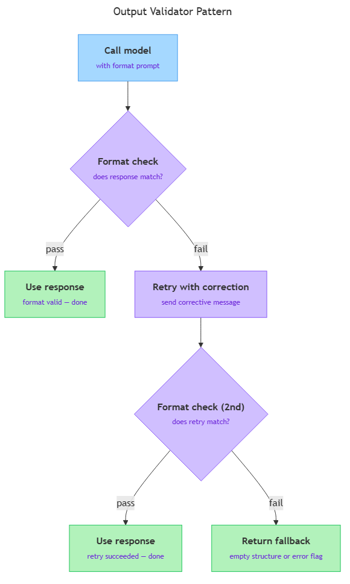

<!-- nav:top:start -->
[⬅ Previous: 13.5 — Constraints](../../13-5-constraints-telling-ai-what-not-to-do/artifacts/reading.md)&emsp;·&emsp;[⬆ Table of Contents](../../../../../../../README.md#curriculum-topic-index)&emsp;·&emsp;[Next: 13.7 — The 5-role context framework ➡](../../../2-the-5-role-context-framework/13-7-the-5-role-context-framework-authority-exemplar-constraint-r/artifacts/reading.md)
<!-- nav:top:end -->

---

# Output format control — getting JSON, numbered lists, or fixed structure through the prompt

## Overview

When you call an LLM (Large Language Model) from Python, the model decides how to shape its response on its own — unless you tell it otherwise. That free choice produces unpredictable output: one call returns a JSON block, the next returns a prose sentence, and your parser breaks. Output format control is the set of prompting techniques that declare the exact shape of a response and hold the model to it [1]. This topic covers three core strategies for specifying format, how to spot when the model has drifted off-spec, and how to build a simple validator that retries before giving up.

## Key Concepts

### Why LLMs produce inconsistent format by default

An LLM is trained on enormous amounts of human-written text — articles, books, forum posts, code. That text was written for human readers, not machines, so it is stylistically varied: sometimes a list, sometimes a paragraph, sometimes a table. The model learned all of those styles equally [1].

When you send a prompt, the model predicts the most probable next tokens (small chunks of text, roughly one word each) given what it has seen. If the prompt does not specify a format, the model picks whatever style best matches the training pattern for that kind of question [1]. Because that pattern is noisy:

- Small differences in phrasing change which training examples the model resembles most.
- The model samples from a probability distribution — identical prompts can produce different styles on different runs [2].
- Different models, and different versions of the same model, have different stylistic defaults [3].

The result: two calls with the same question can produce a JSON block one time and a paragraph the next.

### The format mismatch problem

The **format mismatch problem** is what happens when the model's chosen output shape does not match what your program expects. For example: your Python program expects `{"name": "...", "price": "..."}`, but the model returns "The product is called SuperBlend Pro and it costs $29.99." That answer is helpful to a human. It is useless to your code — `json.loads()` will raise an error, and trying to read a key like `data["name"]` will raise a `KeyError` (a Python error that fires when you try to read a dictionary key that does not exist in the dictionary).

### Format specification — the core technique

**Format specification** is writing a clear, explicit instruction in your prompt that tells the model the exact shape its response must take [1][2]. It is a type of constraint (from topic 13.5), targeted specifically at output structure.

A good format specification answers three questions:

1. **What structure?** (JSON, numbered list, table, fixed template, plain sentence…)
2. **What fields or positions?** (exactly which keys in the JSON, exactly which step labels in the list…)
3. **Nothing else?** (should the model add commentary, a preamble, a sign-off — or just the structure?)

Leaving any of these three unanswered is where drift starts.

| Under-specified | Fully specified |
|---|---|
| "Extract the product name and price." | "Return a JSON object: `{"name": "<product name>", "price": "<price>"}`. Output JSON only — no explanation." |

The second version answers all three format questions. [1][2]

### Three format-specification strategies

Real prompts often combine two or more of these strategies.

**Strategy 1 — Inline declaration**

An **inline declaration** states the format in plain language, usually one or two sentences. It is the simplest approach and works well for common formats.

- "Respond with a numbered list. Each item is one sentence. Output the list only."
- "Return a JSON object with the keys `task`, `priority`, and `deadline`. Output JSON only, no surrounding text."

Inline declarations are easy to write and work well when the format is straightforward and the model knows what "JSON object" or "numbered list" means [2][3].

**Strategy 2 — Format example**

A **format example** shows the model one concrete filled-in sample of the output shape you want. This is the format-focused application of few-shot prompting (from topic 13.3) — one example is usually enough to fix field names, punctuation, capitalisation, and line structure. It is more reliable than an inline declaration for unusual or precise formats [1][2].

```
Output format (follow this exactly):
Review 1: Positive
Review 2: Negative

Now classify:
Review 1: "The packaging was great but the product broke on day one."
Review 2: "Absolutely love it — would buy again."
```

**Strategy 3 — Template echo**

**Template echo** means providing the output template with placeholders and instructing the model to fill them in and return the completed template — nothing else. This is most useful when the output must slot into downstream text processing or when the format is complex enough that an inline declaration would be ambiguous [2][3].

```
Fill in the template below. Replace each <placeholder> with the correct value.
Do not change the template structure. Return only the filled-in template.

Customer name: <name>
Issue category: <category>
Recommended action: <action>
Priority: <High|Medium|Low>
```

### Requesting JSON output

JSON (JavaScript Object Notation — a text format for structured data used widely in web and application development) is the most common machine-readable format requested from LLMs in Python programs, because Python can parse it directly with `json.loads()`.

Three things make a JSON format instruction reliable:

1. **Name the format explicitly.** Write "JSON object" or "JSON array" — not just "structured data".
2. **Show the exact keys.** Use an inline example or the template-echo strategy.
3. **Suppress surrounding text.** Add: "Output the JSON only. Do not include any text before or after the JSON block."

The suppression instruction matters. Without it, many models wrap the JSON in a sentence like "Here is the extracted data:" or inside triple-backtick code fences (` ``` `), both of which break a direct `json.loads()` call [1][2].

### Format drift

**Format drift** is when a model response does not match the format you declared [2]. It is the most common failure mode in format control. Examples:

- You asked for JSON; the model returned JSON wrapped in a sentence ("Here is the result: {…}") [1].
- You asked for a numbered list; the model returned bullet points or a prose paragraph [2].
- A JSON key is spelled differently from what you specified (`"productName"` instead of `"product_name"`) [3].

Format drift happens because the model treats format instructions as strong suggestions, not hard rules. A long prompt, a complex task, or a question that strongly pattern-matches to prose can all push format instructions out of the model's effective attention [1][2].

### The output validator pattern

Even well-written format instructions do not eliminate drift entirely [1][2]. The **output validator pattern** is the professional practice of checking format after a response and retrying once before returning a fallback — rather than passing a malformed response to the rest of your program [2][3].



*The output validator pattern: call the model, check the format, retry once with a corrective message on failure, and return a safe fallback if the retry also fails.*

The pattern works like this:

1. Call the model with your format-specified prompt.
2. Check the response against the expected format.
3. If the check passes, use the response.
4. If the check fails, retry once — with a corrective follow-up: "Your last response was not in the required JSON format. Please return only a JSON object with the keys: …" [2][3].
5. If the retry also fails, return a safe fallback (an empty structure, a default value, or an error flag).

The validator must run *before* the rest of your program processes the response [2].

## Worked Example

The following Python steps add format control to a product-review extraction prompt and back it with a JSON validator.

**Step 1 — Write the format-specified system prompt.**

Place the format instruction in the system prompt (from topic 13.1) so it applies to every call:

```python
system_prompt = """You are a data extraction assistant.
Given a product review, extract the following fields.
Return a JSON object in exactly this format:
{
  "product_name": "<string>",
  "sentiment": "positive" | "negative" | "neutral",
  "key_issues": ["<issue1>", "<issue2>"]
}
Output the JSON object only. No explanation, no preamble."""
```

**Step 2 — Write the validator function.**

```python
import json

def validate_json_response(response: str, required_keys: list) -> tuple:
    """
    Returns (True, parsed_dict) if response is valid JSON with all required keys.
    Returns (False, None) otherwise.
    """
    try:
        text = response.strip()
        # Strip code fence markers (``` that some models add around JSON) if present
        if text.startswith("```"):
            lines = text.splitlines()
            text = "\n".join(lines[1:-1])
        data = json.loads(text)
        for key in required_keys:
            if key not in data:
                return False, None
        return True, data
    except json.JSONDecodeError:
        return False, None
```

**Step 3 — Add the retry loop.**

```python
def call_with_format_retry(client, system_prompt, user_message, required_keys):
    """
    Calls the model. If the response fails format validation, retries once
    with a corrective instruction. Returns the parsed dict or None.
    """
    response = client.call(system_prompt, user_message)  # your Week 12 API call
    valid, data = validate_json_response(response, required_keys)

    if valid:
        return data

    # One retry with a corrective message
    correction = (
        "Your previous response was not in the required JSON format. "
        "Return only a JSON object with these keys: "
        + ", ".join(required_keys)
        + ". No surrounding text."
    )
    response2 = client.call(system_prompt, correction)
    valid2, data2 = validate_json_response(response2, required_keys)

    return data2 if valid2 else None  # caller handles the None case
```

**Step 4 — Call it.**

```python
required = ["product_name", "sentiment", "key_issues"]
result = call_with_format_retry(client, system_prompt, user_review, required)

if result is None:
    print("Format validation failed after retry — using fallback.")
else:
    print(result["product_name"], result["sentiment"])
```

The `client.call` placeholder stands for the actual LLM API call you learned in Week 12 [2][3].

## In Practice

Format control through the prompt is standard in production LLM applications.

- **Automated data extraction** uses JSON format instructions to pull structured fields (names, dates, prices, classifications) from unstructured text and insert them directly into a database. Without format control, every extraction would require custom parsing [1][2].
- **Customer-service routing** uses fixed-template prompts to classify incoming messages — returning `{"category": "refund", "urgency": "high", "language": "en"}` — so messages are routed programmatically without a human reading them [2].
- **Report generation** uses template-echo prompts to produce consistently structured summaries. The template defines sections (Executive Summary, Key Findings, Recommended Actions) and the model fills in the content [3].

In all three patterns, the validator-with-retry sits between the model call and the rest of the application. It is not optional in production: format drift happens even with excellent prompts, and an unvalidated malformed response reaching application code produces bugs that are hard to trace [2].

**Do:**
- Be explicit about exact keys, positions, or headings — do not assume the model will infer structure [1][2].
- Always add a suppression instruction ("Output the JSON only") when the output must be machine-parsed — this is the single most impactful addition to a format instruction [2].
- Use the format-example strategy for unusual or highly specific formats where plain-language descriptions are ambiguous.
- Validate the response before passing it to the rest of your program — even a simple `try/except` is better than nothing.

**Do not:**
- Write format instructions that contradict each other — contradictions produce unpredictable output.
- Use vague format language ("structured format", "clean output", "machine-readable") without specifying the exact structure. The model cannot act on vague format instructions reliably [1][3].
- Skip the validator in code that will run in production. Format drift is not an edge case.
- Assume a format instruction in the user message is as reliable as one in the system prompt — persistent format requirements belong in the system prompt [1].

## Key Takeaways

- LLMs produce inconsistent output format by default because they are trained on stylistically varied text and sample from a probability distribution — without a format instruction, the shape of the response is unpredictable [1].
- The **format mismatch problem** is when the model's chosen shape breaks your program — `json.loads()` errors, missing keys, or wrong structure — and it is the core motivation for format control.
- **Format specification** — declaring the structure, fields, and suppression of surrounding text — is the core technique [1][2]. Three strategies cover most cases: **inline declaration**, **format example**, and **template echo** — they can be combined [2][3].
- **Format drift** (response not matching the declared format) happens even with good instructions; always validate before using the output in code [1][2].
- The **output validator pattern** — validate, retry once with a corrective message, return a fallback if the retry also fails — is the standard practice that separates test-grade prompts from production-grade prompts [2][3].

## References

[1] CodeSignal. "Structured Data Mastery: JSON and YAML Formats in LLM Responses." *Journey into Format Control in Prompt Engineering*. https://codesignal.com/learn/courses/journey-into-format-control-in-prompt-engineering/lessons/structured-data-mastery-json-and-yaml-formats-in-llm-responses

[2] Agenta. "The Guide to Structured Outputs and Function Calling with LLMs." https://agenta.ai/blog/the-guide-to-structured-outputs-and-function-calling-with-llms

[3] APXML. "Structuring Output Formats." *Prompt Engineering for LLM Application Development, Chapter 2*. https://apxml.com/courses/prompt-engineering-llm-application-development/chapter-2-advanced-prompting-strategies/structuring-output-formats

---
<!-- nav:bottom:start -->
[⬅ Previous: 13.5 — Constraints](../../13-5-constraints-telling-ai-what-not-to-do/artifacts/reading.md)&emsp;·&emsp;[⬆ Table of Contents](../../../../../../../README.md#curriculum-topic-index)&emsp;·&emsp;[Next: 13.7 — The 5-role context framework ➡](../../../2-the-5-role-context-framework/13-7-the-5-role-context-framework-authority-exemplar-constraint-r/artifacts/reading.md)
<!-- nav:bottom:end -->
