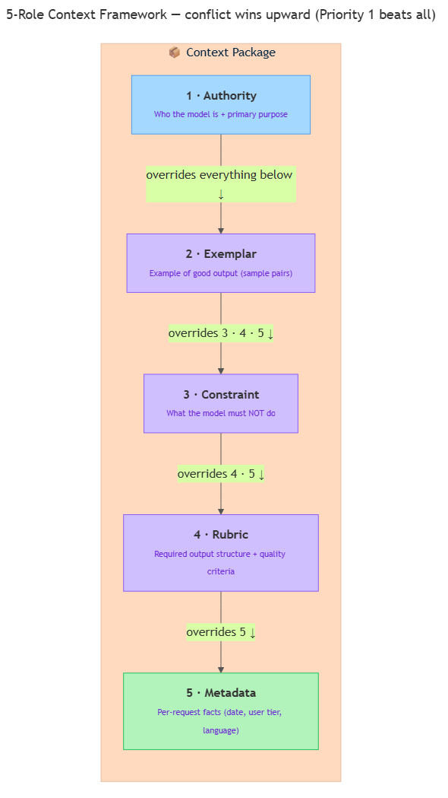

<!-- nav:top:start -->
[⬅ Previous: 13.6 — Output format control](../../../1-prompt-engineering-fundamentals/13-6-output-format-control-getting-json-numbered-lists-or-fixed-s/artifacts/reading.md)&emsp;·&emsp;[⬆ Table of Contents](../../../../../../../README.md#curriculum-topic-index)&emsp;·&emsp;[Next: 13.8 — Output validation ➡](../../../3-output-validation-and-retry/13-8-output-validation-checking-the-ais-response-meets-the-requir/artifacts/reading.md)
<!-- nav:top:end -->

---

# The 5-role context framework — Authority, Exemplar, Constraint, Rubric, Metadata

## Overview

You have already learned individual prompt engineering techniques — system prompts, role assignment, few-shot examples, constraints, and output format control. This topic shows you how to combine all of those into one organised structure called the **5-role context framework** [1]. The framework names five distinct roles that different parts of your prompt play, and gives you a clear rule for resolving conflicts between them.

## Key Concepts

Think of writing a prompt like briefing a new employee on their first day. You hand them five documents: a mission statement, a sample of good work, a list of things never to do, a marking rubric, and a cover sheet with the day's details. Each document plays a different role. Together they form a complete **context package** — all the information you pass to a model in a single interaction, assembled so the model has everything it needs [1].

The 5-role framework makes that structure explicit. The five roles have a fixed priority order: if two roles ever contradict each other, the higher-priority role wins.



### Role 1 — Authority

**Authority** — the part of your prompt that states who the model is and what its highest-level purpose is.

- This is your system prompt plus the role assignment you learned earlier.
- It answers: "What kind of assistant are you, and what is your primary job?"
- Example: `"You are a customer-support assistant for a bank. Your primary goal is to help customers resolve account issues accurately and safely."`
- Authority sits at the **top of the priority stack**. If anything else in the prompt conflicts with Authority, Authority wins [1].

### Role 2 — Exemplar

**Exemplar** — the part of your prompt that shows the model what a good response looks like, using concrete input-output pairs.

- These are the few-shot examples you learned earlier: one or more example exchanges.
- Example snippet:
  ```
  User: My card was declined.
  Assistant: I'm sorry to hear that. Common reasons include insufficient funds,
  an expired card, or a security block. Which would you like me to check first?
  ```
- Exemplar sits **second in the priority stack** [1]. A constraint (Role 3) overrides an example if the two conflict.

### Role 3 — Constraint

**Constraint** — the part of your prompt that tells the model what it must NOT do, and what limits apply.

- These are the negative instructions and guardrails you learned earlier.
- Example: `"Never share full account numbers. Do not speculate without checking data. Always respond in English."`
- Constraint sits **third in the priority stack** [1]. It overrides Rubric and Metadata if they conflict.

### Role 4 — Rubric

**Rubric** — the part of your prompt that describes the required output structure and quality criteria.

- This combines output format control with any quality expectations you want the model to follow.
- It answers: "What does a correct, well-formed response look like?"
- Example: `"Your response must: (1) acknowledge the customer's issue, (2) state one likely cause, (3) offer one concrete next step. Keep your response under 80 words."`
- Rubric sits **fourth in the priority stack** [1]. It shapes output quality but cannot override safety constraints.

### Role 5 — Metadata

**Metadata** — supporting facts about the context, such as the date, the user's account tier, or their language preference.

- Metadata does not give instructions; it gives facts the model can use *while* following instructions.
- Example: `"[Context: date=2026-06-14, customer_tier=Gold, language=en]"`
- You will often build this part programmatically in Python, injecting different values per request.
- Metadata sits **last in the priority stack** [1]. It informs the model without overriding anything.

### Priority order and conflict resolution

The **priority stack** is the ordered rule used to resolve contradictions when two roles give conflicting instructions [1].

| Priority | Role | Wins over |
|---|---|---|
| 1 (highest) | Authority | Everything |
| 2 | Exemplar | Constraint, Rubric, Metadata |
| 3 | Constraint | Rubric, Metadata |
| 4 | Rubric | Metadata |
| 5 (lowest) | Metadata | Nothing — purely informational |

Practical rule: if your example (Exemplar) shows the model doing something your Constraint forbids, fix the example. The priority rule is a safety net, not an excuse to leave contradictions in your prompt [2].

### Why does this matter?

Before this framework, you were adding prompt components one at a time without a checklist. Each missing role causes a specific problem [1]:

- Missing Authority → the model has no stable identity; tone shifts randomly.
- Missing Exemplar → the model guesses at output style; quality is inconsistent.
- Missing Constraint → the model may produce things you did not want.
- Missing Rubric → output structure varies; you have nothing to validate against.
- Missing Metadata → the model gives generic answers when it could give personalised ones.

## Worked Example

Below is a complete, annotated 5-role prompt for a recipe assistant. Each label marks which role that block belongs to.

```
[AUTHORITY]
You are a healthy-eating recipe assistant. Your primary purpose is to suggest
simple, nutritious recipes for home cooks with no professional culinary training.

[EXEMPLAR]
User: I have chicken, broccoli, and rice. What can I make?
Assistant: Try a simple stir-fry. Cook the rice first. Slice the chicken into
strips and fry for 5 minutes. Add broccoli for 3 more minutes. Season with
soy sauce and serve over rice. Total time: 20 minutes.

[CONSTRAINT]
Never suggest recipes that require more than 30 minutes of active cooking time.
Do not recommend deep frying. Do not suggest peanut-containing recipes unless
the user confirms no nut allergy.

[RUBRIC]
Your response must:
(1) Name the dish.
(2) List the steps as a numbered list.
(3) State total active cooking time.
(4) Keep the response under 150 words.

[METADATA]
[Context: date=2026-06-14, user_skill_level=beginner, dietary_restriction=none]
```

Here is what each role does — and what breaks without it:

| Role | What it controls | What goes wrong if missing |
|---|---|---|
| Authority | Model knows it is a recipe helper, not a general chatbot | Model might give financial advice instead |
| Exemplar | Model sees steps should be short and conversational | Model might write a 500-word academic essay |
| Constraint | Model will not suggest 45-minute deep-fried meals | User might get a recipe they cannot safely make |
| Rubric | Every response has a name, numbered steps, and a time estimate | Output structure varies per request |
| Metadata | Model knows the user is a beginner | Model might assume professional equipment |

In Python, you assemble these five strings and join them into a single system prompt [3]:

```python
authority = (
    "You are a healthy-eating recipe assistant. Your primary purpose is to suggest "
    "simple, nutritious recipes for home cooks with no professional culinary training."
)
exemplar = (
    "Example:\n"
    "User: I have chicken, broccoli, and rice. What can I make?\n"
    "Assistant: Try a simple stir-fry. Cook the rice first. Slice the chicken into "
    "strips and fry for 5 minutes. Add broccoli for 3 more minutes. Season with "
    "soy sauce and serve over rice. Total time: 20 minutes."
)
constraint = (
    "Never suggest recipes that require more than 30 minutes of active cooking time. "
    "Do not recommend deep frying. "
    "Do not suggest peanut-containing recipes unless the user confirms no nut allergy."
)
rubric = (
    "Your response must: "
    "(1) Name the dish. "
    "(2) List the steps as a numbered list. "
    "(3) State total active cooking time. "
    "(4) Keep the response under 150 words."
)
metadata = "[Context: date=2026-06-14, user_skill_level=beginner, dietary_restriction=none]"

system_prompt = "\n\n".join([authority, exemplar, constraint, rubric, metadata])
```

Every role is present, labelled, and joined in priority order. This is a complete context package [3].

## In Practice

Follow these steps to build and send a 5-role prompt using the Anthropic SDK.

1. **Create a dictionary** with one key per role. This keeps each role easy to inspect and update independently [2].

   ```python
   context_package = {
       "authority":  "",
       "exemplar":   "",
       "constraint": "",
       "rubric":     "",
       "metadata":   "",
   }
   ```

2. **Fill Authority, Exemplar, Constraint, and Rubric** with static strings. These stay the same across requests.

3. **Fill Metadata with dynamic values** by embedding variables directly in the string. Python lets you do this by writing `f"text {variable}"` — this is called an **f-string** — and Python fills in the variable's value when the string is created.

   ```python
   customer_tier = "Gold"
   today = "2026-06-14"
   context_package["metadata"] = (
       f"[Context: date={today}, customer_tier={customer_tier}, language=en]"
   )
   ```

4. **Assemble the system prompt** by joining the five values in priority order.

   ```python
   system_prompt = "\n\n".join([
       context_package["authority"],
       context_package["exemplar"],
       context_package["constraint"],
       context_package["rubric"],
       context_package["metadata"],
   ])
   ```

5. **Send the prompt** using the Anthropic SDK. The assembled string becomes the `system` argument; the user's question becomes the `messages` argument.

   ```python
   import anthropic

   client = anthropic.Anthropic()

   response = client.messages.create(
       model="claude-haiku-4-5-20251001",
       max_tokens=256,
       system=system_prompt,
       messages=[
           {"role": "user", "content": "My card was declined."},
       ]
   )
   print(response.content[0].text)
   ```

Common pitfalls to avoid [2]:

- Do not put dynamic facts (today's date, user name) inside Authority. Authority should be stable across all requests. Dynamic facts belong in Metadata.
- Do not skip Rubric because the format "seems obvious." Without it, the model chooses its own format every time.
- Check every Exemplar against your Constraint list. If an example shows behaviour a Constraint forbids, rewrite the example.

## Key Takeaways

- The **5-role context framework** organises every part of your prompt into one of five named roles: Authority, Exemplar, Constraint, Rubric, and Metadata [1].
- The **priority stack** (Authority > Exemplar > Constraint > Rubric > Metadata) is the rule for resolving conflicts — higher wins.
- Each role maps directly to a technique you already know: Authority = system prompt + persona, Exemplar = few-shot examples, Constraint = guardrails, Rubric = output format control, Metadata = dynamic injected facts.
- A missing role causes a predictable problem: no Authority means an unstable identity; no Constraint means unwanted output; no Rubric means unpredictable formatting.
- In Python, store each role in a dictionary key and use an f-string for Metadata so dynamic values update automatically per request [3].
- The framework gives you a repeatable template for building structured prompts — change one role at a time to compare outputs systematically.

## References

1. Context Engineering for AI Agents — arXiv:2604.04258. https://arxiv.org/abs/2604.04258
2. Prompt Engineering Frameworks — Parloa Knowledge Hub. https://www.parloa.com/knowledge-hub/prompt-engineering-frameworks/
3. Context-Engineered AI Prompt Framework for AI Agents — Medium. https://medium.com/@iborn2code/context-engineered-ai-prompt-framework-for-ai-agents-e3e3e07b9259

---
<!-- nav:bottom:start -->
[⬅ Previous: 13.6 — Output format control](../../../1-prompt-engineering-fundamentals/13-6-output-format-control-getting-json-numbered-lists-or-fixed-s/artifacts/reading.md)&emsp;·&emsp;[⬆ Table of Contents](../../../../../../../README.md#curriculum-topic-index)&emsp;·&emsp;[Next: 13.8 — Output validation ➡](../../../3-output-validation-and-retry/13-8-output-validation-checking-the-ais-response-meets-the-requir/artifacts/reading.md)
<!-- nav:bottom:end -->
