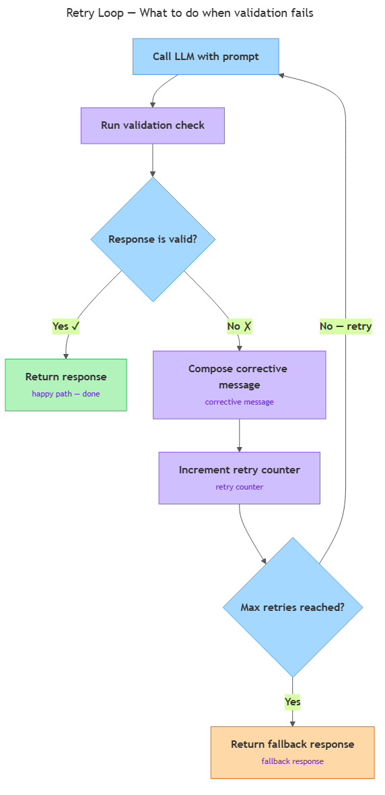

<!-- nav:top:start -->
[⬅ Previous: 13.8 — Output validation](../../13-8-output-validation-checking-the-ais-response-meets-the-requir/artifacts/reading.md)&emsp;·&emsp;[⬆ Table of Contents](../../../../../../../README.md#curriculum-topic-index)&emsp;·&emsp;[Next: 13.10 — Why version control matters ➡](../../../4-version-control-with-git-and-github/13-10-why-version-control-matters-never-lose-working-code-track-wh/artifacts/reading.md)
<!-- nav:top:end -->

---

# Retry logic — what to do when validation fails

## Overview

In topic 13.8 you learned how to check whether an LLM (Large Language Model) response has the right format — the right fields, the right structure. But detecting a failure is only half the job. When your validation function says "this response is wrong," you need a plan for what to do next. This topic gives you that plan: a **retry loop** that catches a failed validation, tells the model what went wrong, and tries again — up to a fixed limit — before returning a safe default. [1]

## Key Concepts



*The retry loop: call the model, validate the response, return on pass, or correct and retry until the max limit is reached, then fall back.*

### The retry loop

A **retry loop** is code that runs a validation check, and if the check fails, calls the LLM again before giving up. The loop repeats a fixed number of times until either the response passes validation or the limit is reached. [1]

Think of it like submitting a form on a website. If you leave a required field empty, the page shows you an error and lets you try again — it does not just crash. A retry loop does the same thing for your LLM call. [3]

### The corrective message

Calling the model again with the exact same prompt usually does not help. If the model produced a wrong format once, nothing has changed to make the next attempt any different.

The fix is a **corrective message** — a short addition to the prompt that explains what went wrong on the previous attempt and restates the expected format. For example:

> "Your last response was missing the JSON key `answer`. Please respond again using this exact format: `{"answer": "...", "confidence": "high|medium|low"}`."

A corrective message carries two pieces: what failed, and a concrete reminder of what the output should look like. That combination gives the model a specific target to hit on the next try. [1][2]

### The retry counter

A **retry counter** is a simple integer variable that tracks how many attempts the loop has made. It starts at zero and increases by one each time the loop calls the model again. [1]

Without a counter, a retry loop could run forever if the model keeps failing. The counter gives you control over when to stop.

### Max retries

**Max retries** is the maximum number of attempts you allow before the loop exits. Once the retry counter reaches this limit, the loop stops — whether or not the response has passed validation. [1][2]

A common default for beginner projects is 2 or 3 retries. Keep in mind: each LLM call is a new request, and each one costs time and may cost money. Two extra attempts beyond the first call is a practical ceiling.

### Fallback response

When the retry counter hits the max retries limit and the response still has not passed validation, the loop cannot wait any longer. At that point the code returns a **fallback response** — a safe, pre-written default your application can always rely on. [1][2]

The fallback is not a crash. It is a graceful exit: you acknowledge the model did not cooperate and return something sensible rather than nothing. A typical fallback looks like this:

```python
{"error": "max retries exceeded", "result": None}
```

## Worked Example

Here is a minimal Python function that puts all five pieces together. Read through it line by line in the numbered steps below.

```python
def call_with_retry(prompt, max_retries=2):
    attempts = 0
    message = prompt

    while attempts <= max_retries:
        response = call_llm(message)          # send prompt to the model
        if is_valid(response):                # run the validator (from 13.8)
            return response                   # validation passed — return it

        # validation failed — compose a corrective message
        attempts += 1
        if attempts > max_retries:
            break
        message = (
            prompt
            + "\n\nYour last response failed validation. "
            + "Please try again matching the required format exactly."
        )

    return {"error": "max retries exceeded", "result": None}  # fallback
```

**Step-by-step walkthrough:**

1. `attempts = 0` — the retry counter starts at zero before any call is made.
2. `message = prompt` — the first message is just the original prompt.
3. The `while` loop runs as long as `attempts` is at or below `max_retries` (2 by default).
4. `call_llm(message)` sends the current message to the model and gets a response.
5. `is_valid(response)` runs your validation function from 13.8. If the response is valid, the function returns it immediately — the loop is done.
6. If validation fails, `attempts += 1` increments the counter.
7. If `attempts` has now exceeded `max_retries`, the loop breaks — no more calls.
8. Otherwise, a corrective message is composed by appending the failure note to the original prompt, and the loop runs again from step 4.
9. After the loop exits (because the limit was reached), the fallback dictionary is returned. [1][3]

**Pattern mnemonic:** call → validate → pass (return) or fail → correct → retry → max reached → fallback.

## In Practice

Retry logic appears in any LLM application that requires structured output. Here are three common scenarios:

- **JSON chatbot:** The frontend needs a JSON object to parse. If the model returns plain text, the retry adds: "You MUST respond only with valid JSON."
- **Text classifier:** The model must return exactly one label (`positive`, `negative`, or `neutral`). If it returns an explanation instead, the retry says: "Respond with only one word: positive, negative, or neutral."
- **Data extractor:** A tool that pulls fields from a document. If a required field is missing, the retry names the missing field explicitly so the model knows what to fix. [2][3]

In every case the five-part structure stays the same. Only the corrective message content changes.

**Do:**
- Always set a max retries limit — never let a loop retry indefinitely.
- Make the corrective message specific: tell the model *what* failed, not just "try again."
- Include the expected format in the corrective message — paste the template or a short example.
- Return a meaningful fallback so your application can always continue.

**Do not:**
- Repeat the exact same prompt without any change — an identical prompt will likely produce the same failure.
- Set max retries higher than 3 for a beginner project — each call costs time and may cost money.
- Use retry logic as a substitute for a well-written original prompt. Fix the prompt first; treat the retry loop as a safety net.

You will see more advanced techniques — such as exponential backoff and structured output libraries — in later topics.

## Key Takeaways

- A **retry loop** detects a validation failure and calls the model again rather than giving up immediately.
- A **corrective message** tells the model what went wrong and restates the expected format — that is what makes the second attempt more useful than simply repeating the original prompt.
- A **retry counter** tracks attempts and enforces a limit so the loop cannot run forever.
- When the **max retries** limit is reached without a passing response, the code returns a **fallback response** — a safe, pre-written default.
- Full pattern: **call → validate → pass (return) or fail → correct → retry → max reached → fallback**.

## References

1. APXML. *Retry Mechanisms for LLM Applications*. https://apxml.com/courses/retry-mechanisms-llm
2. Mirascope. *LLM Validation with Retries*. https://mirascope.com/blog/llm-validation-retries
3. Python Instructor. *Retry Patterns for Structured LLM Output*. https://python.useinstructor.com/concepts/retrying

---
<!-- nav:bottom:start -->
[⬅ Previous: 13.8 — Output validation](../../13-8-output-validation-checking-the-ais-response-meets-the-requir/artifacts/reading.md)&emsp;·&emsp;[⬆ Table of Contents](../../../../../../../README.md#curriculum-topic-index)&emsp;·&emsp;[Next: 13.10 — Why version control matters ➡](../../../4-version-control-with-git-and-github/13-10-why-version-control-matters-never-lose-working-code-track-wh/artifacts/reading.md)
<!-- nav:bottom:end -->
