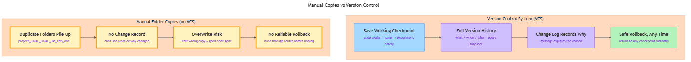

<!-- nav:top:start -->
[⬅ Previous: 13.9 — Retry logic](../../../3-output-validation-and-retry/13-9-retry-logic-what-to-do-when-validation-fails/artifacts/reading.md)&emsp;·&emsp;[⬆ Table of Contents](../../../../../../../README.md#curriculum-topic-index)&emsp;·&emsp;[Next: 13.11 — Git fundamentals ➡](../../13-11-git-fundamentals-repository-commit-branch-merge/artifacts/reading.md)
<!-- nav:top:end -->

---

# Why version control matters — never lose working code, track what changed and why

## Overview

Every developer eventually hits the same wall: they improve a script, save the file, and the new version breaks — but the working version is gone. Version control exists to make that moment impossible. A **version control system (VCS)** is a tool that records every state your project has ever been in, who changed it, and why — so you can jump back to any earlier point at any time [1]. This topic explains the problems VCS solves; you will start using Git commands in the next topic.

## Key Concepts

### What is a version control system?

A **version control system (VCS)** is a tool that records changes to files over time so you can recall any earlier version whenever you need it [1]. Think of it as a very precise "undo history" for your entire project — not just the last few keystrokes in your editor, but every meaningful checkpoint you have ever saved, from the very beginning.

Each saved checkpoint records four things:

1. What every file looked like at that moment.
2. Who made the change.
3. When the change was made.
4. A short message describing *why* the change was made [2].

That last item — the *why* — is what makes a VCS fundamentally different from a simple backup. Knowing that a line changed on Tuesday tells you nothing. Knowing it changed because "fixed off-by-one error in retry counter" tells you everything.

### The folder-copy problem

Before VCS tools became standard, developers did what every beginner does instinctively: they made copies of folders.

```
my_project/
my_project_v2/
my_project_FINAL/
my_project_FINAL_v2/
my_project_FINAL_FINAL_use_this_one/
```

This approach — **manual versioning** — is immediately familiar and needs no new tools. It also breaks in every direction as a project grows [3]:


*Manual folder versioning produces six compounding problems; a VCS solves every one.*

| Problem | What goes wrong |
|---|---|
| Disk clutter | Five copies of a 200 MB project consume 1 GB for no real benefit. |
| No change record | You cannot see what changed between `v2` and `FINAL` without comparing files by hand. |
| No reason record | No idea why those changes were made — future-you and teammates cannot read your mind. |
| Merge chaos | Two people edit their own copies; combining them means line-by-line manual work. |
| The overwrite trap | You open `FINAL` by mistake, edit, save — the old working version is gone. |
| No reliable rollback | You must hunt through folder names hoping you saved a copy at exactly the right moment. |

Every one of these problems gets worse as the project grows and as more people join [1][3].

### Version history — the project's full story

A VCS maintains a **version history**: an ordered list of every saved checkpoint from the first file to today [1]. With it you can:

- See exactly what the project looked like at any point.
- Compare any two checkpoints to see every line added, changed, or deleted.
- Return to any earlier checkpoint if the current version breaks.
- Understand the sequence of decisions that produced the current state.

This matters beyond safety. A version history is the record of *how a project evolved* — useful when debugging, when onboarding a new team member, or when explaining a past decision [2].

### Working code safety — never lose a good state

The most immediate benefit is simple but powerful: **you never lose a working state**.

The workflow is:

1. Your code works.
2. You save a checkpoint ("it works — checkpoint saved").
3. You try something new.
4. If the new thing breaks, return to the checkpoint. Your working code is untouched.
5. If the new thing works, save a new checkpoint.

This changes the psychology of coding. You become more willing to experiment, refactor, and improve because the cost of failure is zero — you can always go back [2][3].

### The change log — who changed what and why

A **change log** is the record of every checkpoint, annotated with the author and the message they wrote to explain it [2]. A real entry looks like:

```
2026-06-14  namratas@revature.com
  "Add retry loop for failed API calls — fixes intermittent 500 errors in production"
```

Reading a change log answers the questions that come up every day in real projects:

- "When did the bug get introduced?" — scroll back until the bug disappears.
- "Who wrote this function?" — every change records its author.
- "Why did we make this decision?" — the message tells you.
- "What changed between the client demo and today?" — compare the two checkpoints directly.

Even a brief, honest message — "fixed crash when input is empty" — is enormously more useful than a folder called `project_FINAL_v3` [3].

### Distributed version control — a brief orientation

Modern VCS tools like Git store the full version history not just on one central server but on every team member's machine [1]. This means:

- If the central server goes down, every team member has a complete backup.
- You can work offline and sync when you reconnect.
- Multiple people can work on different parts of the project at the same time.

Git is the world's most widely used distributed version control system. GitHub is a website that hosts Git repositories online, making it easy to share and collaborate. You will learn how to use both starting in the next topic (13.11).

The following words will appear in upcoming topics. They are listed here so they are not a surprise — they will be properly defined and demonstrated in context:

- Commit — you will create commits in topic 13.11.
- Repository (repo) — you will create one in topic 13.11.
- Branch and merge — covered in topic 13.12.

## Worked Example

Here is what the same situation looks like without VCS and with VCS, side by side.

**Scenario:** You are building a Python script that calls the Anthropic API. It returns clean JSON. You decide to add retry logic to handle occasional 500 errors. After your changes, the script crashes on every call.

**Without VCS:**

1. You saved over the working file.
2. You press Ctrl-Z — but the editor was closed after saving; undo history is gone.
3. You try to reconstruct the original script from memory. You are not sure which lines you changed.
4. An hour later, you have something that works — maybe. You are not confident.

**With VCS:**

1. Before adding retry logic, you saved a checkpoint: "working — clean JSON parsing, no retry."
2. You add retry logic. The script crashes.
3. You run one command to return to the checkpoint. The working script is back instantly.
4. You inspect the difference between the checkpoint and your broken attempt — you can see exactly which lines caused the problem.
5. You fix only those lines, save a new checkpoint: "add retry loop for failed API calls."

The total recovery time with VCS: under a minute, no guesswork.

## In Practice

Version control is a baseline expectation in every technical environment — not an optional best practice [2].

- **Solo projects:** Even working alone, a developer uses VCS to protect working states and build a professional work history. A GitHub repository demonstrates your development process to anyone who reviews your work.
- **Team projects:** In a team of two or twenty, VCS is the only way to combine everyone's changes without conflict chaos. Every software company, data team, and AI research lab runs on version-controlled repositories [1][2].
- **AI and data-science projects:** Prompt engineering scripts and evaluation notebooks change constantly as you experiment. VCS lets you compare the prompt that scored 90% accuracy against the one that scored 70% — and understand exactly what differed [2].

**Best practices to carry into your first Git session:**

- **Save checkpoints when code works, not only when you finish.** A checkpoint after each small working step is more useful than one large checkpoint at the end [3].
- **Write the reason, not the action.** "handle empty API response without crashing" beats "update script.py" every time [2][3].
- **Every project gets its own repository.** One project, one repository is the standard pattern.
- **Start from day one.** The most common beginner regret is not setting up version control before things go wrong [3].

## Key Takeaways

- **Version control system (VCS):** records every change to your project — what changed, when, who changed it, and why — so you can return to any earlier state at any time [1].
- **Manual versioning failure modes:** the folder-copy approach breaks in six ways — no change record, no reason record, disk clutter, merge chaos, the overwrite trap, and unreliable rollback [3].
- **Working code safety:** save a checkpoint when code works, experiment freely, and return to the checkpoint if something breaks — the working version is never at risk [2].
- **Change log:** the annotated history of every checkpoint; answers who changed what and why, which is essential for debugging and team communication [2].
- **Git and GitHub:** Git is the world's dominant VCS; GitHub hosts repositories online. Both will be hands-on starting in topic 13.11.

## References

1. Git Project, "Getting Started — About Version Control." <https://git-scm.com/book/en/v2/Getting-Started-About-Version-Control>
2. Atlassian, "What is Version Control?" <https://www.atlassian.com/git/tutorials/what-is-version-control>
3. CareerFoundry, "What's Version Control and Why Do I Need It?" <https://careerfoundry.com/en/blog/web-development/whats-version-control-and-why-do-i-need-it/>

---
<!-- nav:bottom:start -->
[⬅ Previous: 13.9 — Retry logic](../../../3-output-validation-and-retry/13-9-retry-logic-what-to-do-when-validation-fails/artifacts/reading.md)&emsp;·&emsp;[⬆ Table of Contents](../../../../../../../README.md#curriculum-topic-index)&emsp;·&emsp;[Next: 13.11 — Git fundamentals ➡](../../13-11-git-fundamentals-repository-commit-branch-merge/artifacts/reading.md)
<!-- nav:bottom:end -->
