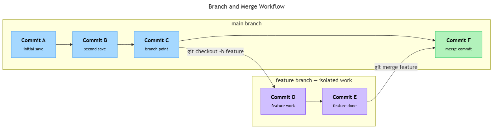

<!-- nav:top:start -->
[⬅ Previous: 13.10 — Why version control matters](../../13-10-why-version-control-matters-never-lose-working-code-track-wh/artifacts/reading.md)&emsp;·&emsp;[⬆ Table of Contents](../../../../../../../README.md#curriculum-topic-index)&emsp;·&emsp;[Next: 13.12 — GitHub workflow ➡](../../13-12-github-workflow-clone-add-commit-push/artifacts/reading.md)
<!-- nav:top:end -->

---

# Git fundamentals — repository, commit, branch, merge

## Overview

In topic 13.10 you learned why a version control system matters: it keeps your working code safe and gives you a full history of every change. Git is the version control system you will use in practice, and it organises that history using four building blocks — the **repository**, the **commit**, the **branch**, and the **merge**. Understanding these four concepts is the starting point for every real Git workflow. You will use all four of them every time you work on a project.

## Key Concepts

### Repository

**Repository** — the folder that Git manages. It contains your project files and a complete history of every saved snapshot [1].

A repository (often shortened to "repo") has two parts:

- **Working directory** — the files you can see and edit normally, such as your Python scripts.
- **`.git` folder** — a hidden database Git creates and manages automatically when you run `git init`. It stores every saved snapshot. You never open or edit it directly.

| Term | What it means |
|---|---|
| Repository | The whole managed project folder, including history |
| Working directory | The files you can see and edit |
| `.git` folder | Git's hidden database — leave it alone |

Without a repository, Git has nowhere to store history. Every other concept here — commits, branches, merges — only exists inside a repository.

### Commit

**Commit** — a permanent snapshot of all your project files at a specific moment in time [1].

Think of it like pressing "Save" in a document editor — except Git saves the complete state of every file, not just one, and it keeps every save permanently. You can always return to any earlier commit.

Each commit carries three things:

1. **A unique ID** — a long string of letters and numbers (called a hash) that Git generates automatically.
2. **A commit message** — a short note you write describing what changed and why.
3. **A pointer to the previous commit** — so Git can show the full history as a connected chain.

**Why does the message matter?** A message like `"fixed it"` tells your future self nothing. A message like `"Add input validation to the login function"` tells you exactly what changed and why [1][2].

| Quality | Example message |
|---|---|
| Poor | `"stuff"` |
| Poor | `"update"` |
| Good | `"Add chain-of-thought prompt to AI summary function"` |
| Good | `"Fix KeyError when API response is empty"` |

Commits chain together: each new commit points back to the one before it. This forms the **commit history** — the complete record of every saved checkpoint. `HEAD` is Git's label for the commit you are currently on — it usually points to the most recent commit.

```
commit A  →  commit B  →  commit C  →  (HEAD — most recent)
```

### Branch

**Branch** — a separate, independent line of development inside the same repository [1][2].

Every new repository starts with one branch called **`main`** (or `master` on older systems). Think of `main` as the official, clean copy of your project.

Creating a branch is like photocopying a manuscript so you can experiment without touching the original. The original does not change while you work on the copy.

**Why create a branch instead of working directly on `main`?**

- You might break something while experimenting. A branch contains the breakage; `main` stays clean.
- You might want to try two different approaches. Each gets its own branch.
- In a team, each developer works on their own branch so they do not overwrite each other's work [1][2].

When you create a branch, Git makes a new label pointing at the current commit. Any commits you make from that point forward go onto this branch only — `main` does not move.

```
main:    A → B → C
                  ↘
feature:            D → E
```

In this example, commits A, B, C are on `main`. You created `feature` after commit C. Commits D and E are on `feature` only. When you switch back to `main`, your working directory returns to the state at commit C. The D and E work is not lost — it waits on the feature branch.

### Merge

**Merge** — the act of combining the commits from one branch into another [1][2][3].

When your work on a branch is finished and tested, you merge it back into `main`. Git applies the branch's commits to `main`, so `main` now contains all the changes from both lines of development.


*The full branch-and-merge cycle: main commits A→B→C, a feature branch diverging at C with commits D→E, then recombining into main at merge commit F.*

Git compares three things during a merge:

1. The common starting point — the commit where the branch was created (C above).
2. Changes on `main` since that point.
3. Changes on the branch since that point (D and E).

In simple cases Git combines them automatically. The result is a **merge commit** — a special commit with two parents, one from each branch. If two branches changed the same line of a file in different ways, Git cannot decide which version to keep. This is called a merge conflict; you will learn to resolve these as you practise Git further.

## Worked Example

Here is a short, complete sequence — create a repository, commit, branch, and merge.

**Step 1 — Create a repository.**

```
git init
```

Run this once inside your project folder. Git creates the `.git` folder and begins tracking. Your folder is now a repository.

**Step 2 — Stage and commit changes.**

```
git add .
git commit -m "Add initial notes file"
```

- `git add .` tells Git which files to include in the next snapshot. The dot means "all changed files".
- `git commit -m "..."` saves the snapshot and attaches your message.

Run this pair every time you want to save a checkpoint.

**Step 3 — Create a new branch and switch to it.**

```
git checkout -b experiment
```

This creates a branch called `experiment` and moves you onto it in one step. Any commits you make now go on `experiment` only.

**Step 4 — Edit, then commit on the branch.**

Make a change to your file, then:

```
git add .
git commit -m "Try alternate approach in experiment branch"
```

`main` is unaffected — it still sits at your earlier commit.

**Step 5 — Switch back to `main` and merge.**

```
git checkout main
git merge experiment
```

Switch to `main` first, then run `merge`. Git brings in the commits from `experiment`. After the merge, `main` contains the work from both lines.

**Step 6 — Check status and history.**

```
git status
git log --oneline
```

- `git status` shows which branch you are on and which files have changed since the last commit.
- `git log --oneline` shows the commit history as one line per commit — ID and message.

> Working with GitHub — clone, push, pull — is the next topic and not covered here.

## In Practice

**Feature branches keep `main` clean.** When building an AI pipeline, a clean pattern is one branch per experiment:

- `main` holds the version that is working and tested.
- `experiment-few-shot` holds your few-shot prompting attempt.
- `experiment-chain-of-thought` holds your chain-of-thought version.

Commit progress on each branch. When one approach proves better, merge it into `main`. The others remain as archived branches you can return to at any time [2].

**Commit discipline — do's and don'ts.**

| Do | Don't |
|---|---|
| Commit one logical change at a time | Commit many unrelated changes at once |
| Write a clear, specific commit message | Write `"fix"` or `"update"` |
| Commit working code | Commit broken work to `main` — use a branch instead |

**Branch naming tips.**

- Use short, descriptive names: `add-validation`, `fix-api-error`, `experiment-rag-prompt`.
- Use hyphens between words. Avoid spaces and special characters.
- The name should say what the branch is *for*.

**When to merge.** Merge when the branch's goal is complete and the code works. Test on the branch first — do not merge broken code into `main`. After merging, you can safely delete the branch; its commits are now in `main` [1][2].

## Key Takeaways

- A **repository** is the folder Git manages. It holds your files (the working directory) and a hidden `.git` database storing every saved snapshot.
- A **commit** is a permanent snapshot of all your files at a point in time. Every commit carries a message you write — the human-readable record of what changed.
- A **branch** is a separate line of development inside the same repository. It lets you experiment or build a new feature without touching `main`.
- A **merge** combines the commits from one branch into another. After a merge, the target branch contains the work from both lines of development.
- The standard cycle is: create a branch → make commits → merge back into `main`. This cycle keeps `main` clean and gives you a safe space to work.

## References

1. Pro Git — Git Branching: Basic Branching and Merging. <https://git-scm.com/book/en/v2/Git-Branching-Basic-Branching-and-Merging>
2. Atlassian Git Tutorials — Git Merge. <https://www.atlassian.com/git/tutorials/using-branches/git-merge>
3. W3Schools — Git Branch Merge. <https://www.w3schools.com/git/git_branch_merge.asp>

---
<!-- nav:bottom:start -->
[⬅ Previous: 13.10 — Why version control matters](../../13-10-why-version-control-matters-never-lose-working-code-track-wh/artifacts/reading.md)&emsp;·&emsp;[⬆ Table of Contents](../../../../../../../README.md#curriculum-topic-index)&emsp;·&emsp;[Next: 13.12 — GitHub workflow ➡](../../13-12-github-workflow-clone-add-commit-push/artifacts/reading.md)
<!-- nav:bottom:end -->
