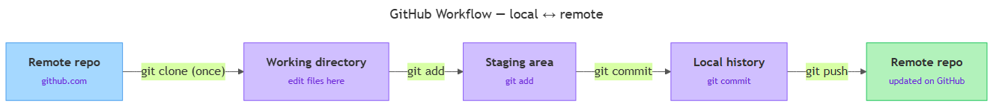

<!-- nav:top:start -->
[⬅ Previous: 13.11 — Git fundamentals](../../13-11-git-fundamentals-repository-commit-branch-merge/artifacts/reading.md)&emsp;·&emsp;[⬆ Table of Contents](../../../../../../../README.md#curriculum-topic-index)&emsp;·&emsp;[Next: 13.13 — Folder structure and README ➡](../../13-13-folder-structure-and-readme-how-to-organise-a-professional-c/artifacts/reading.md)
<!-- nav:top:end -->

---

# GitHub workflow — clone, add, commit, push

## Overview

You now know what a repository is and why version control matters. The next step is knowing *how* to move your work from your own computer up onto GitHub. Every developer follows the same four-command sequence to do this: **clone, add, commit, push**. Think of it like editing a shared document — you download a copy, mark the parts you changed, save a named version, and upload it back to the server. After those four steps, your changes are visible to anyone with access to the repository.

## Key Concepts

### 1. Local repository vs. remote repository

You already know that a **repository** is a folder that Git watches. What matters now is *where* that folder lives.

- **Local repository** — the repository that lives on *your* computer. Only you can see it until you share it. All your day-to-day editing and committing happens here [1].
- **Remote repository** — a copy of the same repository hosted on a server. In this course, that server is **GitHub** (github.com), a web platform owned by Microsoft that stores Git repositories and makes them accessible over the internet [1][2].

The two copies stay in sync through the four commands below. Your local copy is where you work; GitHub is where your work is published and backed up.

### 2. The four commands — how they connect

The commands always run in this order:

1. **`git clone`** — bring the repo from GitHub to your machine (done once per project).
2. **Edit** — change files in your working directory.
3. **`git add`** — stage the changes you want to save.
4. **`git commit`** — save a permanent snapshot locally.
5. **`git push`** — send that snapshot to GitHub.

Steps 2–5 repeat every time you complete a meaningful unit of work. Step 1 is a one-time setup.


*The diagram shows how clone, add, commit, and push move changes between your local machine and GitHub.*

### 3. `git clone` — copy a remote repository to your computer

**`git clone`** downloads a remote repository from GitHub and creates a new folder on your machine [1].

```bash
git clone <URL>
```

You get the `<URL>` from the green **Code** button on any GitHub repository page.

What clone does automatically:
1. Creates a local folder with the same name as the repository.
2. Downloads all files and the full commit history.
3. Records the remote address under the nickname **`origin`** — so Git always knows where to send future pushes [2].

You only run `git clone` once per project per machine. After that, your local folder remembers the connection.

### 4. `git add` — stage your changes

Editing a file does not automatically put it in the next commit. You must tell Git which changes to include. **`git add`** moves changed files into the **staging area** — a waiting area (also called the *index*) where you collect the changes that will form your next snapshot [1][2].

```bash
git add <filename>    # stage one file
git add .             # stage all changed files in the current folder
```

| Zone | What it means |
|---|---|
| Working directory | Files as they exist on your disk right now |
| Staging area | Changes you have told Git to include in the next commit |
| Commit history | Permanent snapshots already saved |

Why staging exists: you might have edited five files but only want to commit three of them together as one logical change. Staging lets you be precise [3].

### 5. `git commit` — save a snapshot

**`git commit`** takes everything in the staging area and saves it as a permanent snapshot in your *local* commit history [1][2].

```bash
git commit -m "Add README with project description"
```

The `-m` flag lets you write your **commit message** inline. When this runs, Git:
- Bundles all staged changes into one snapshot.
- Records who made the change, when, and the message you wrote.
- Generates a **commit hash** (also called a **SHA**) — a unique ID like `a3f9b21c` that identifies this snapshot forever [2].
- Moves HEAD forward to point at the new commit.

After committing, the staging area is empty and your working directory is "clean." The commit exists only on your computer at this point — GitHub does not know about it yet.

### 6. `git push` — upload your commits to GitHub

**`git push`** sends your local commits to the remote repository on GitHub [1][2][3].

```bash
git push origin main
```

- `origin` — the nickname Git assigned to the remote when you cloned.
- `main` — the name of the branch you are pushing (the default primary branch from 13.11).

After a successful push you can open github.com, refresh the page, and see your new commits listed there. If you made multiple commits locally before pushing, all of them arrive at once, each with its original message and timestamp.

## Worked Example

The following steps take you from a fresh GitHub repository to a confirmed push.

**Step 1 — Create a repository on GitHub**
1. Log in to github.com.
2. Click the **+** icon (top right) and select **New repository**.
3. Name it (e.g., `my-ai-portfolio`), check **Add a README file**, then click **Create repository**.

You now have one file (`README.md`) and one commit on GitHub.

**Step 2 — Clone to your computer**
1. On the repository page, click the green **Code** button and copy the HTTPS (HyperText Transfer Protocol Secure) URL — it looks like `https://github.com/your-username/my-ai-portfolio.git`.
2. Open a terminal. Navigate to where you want the project folder to live:
   ```bash
   cd Documents
   ```
3. Run clone:
   ```bash
   git clone https://github.com/your-username/my-ai-portfolio.git
   ```
4. Move into the new folder:
   ```bash
   cd my-ai-portfolio
   ```

**Step 3 — Edit a file**
1. Open `README.md` in VS Code or any text editor.
2. Add a line:
   ```
   ## About
   This repository contains my Python and Prompt Engineering work.
   ```
3. Save the file.

**Step 4 — Stage the change**
```bash
git add README.md
```

**Step 5 — Commit the change**
```bash
git commit -m "Update README with project description"
```

Git prints a short confirmation that includes the beginning of your commit hash:
```
[main 4c2a1b3] Update README with project description
 1 file changed, 3 insertions(+)
```

**Step 6 — Push to GitHub**
```bash
git push origin main
```

Git may ask for your GitHub username and a **personal access token (PAT)** — a password alternative you generate once in your GitHub account settings and use instead of your regular password when pushing from the command line [2][3].

**Step 7 — Confirm on GitHub**
Open your repository on github.com. Click **Commits** near the top of the file listing. You will see both commits: the original "Initial commit" and your new one. Your change is now on GitHub.

**Repeating the cycle**
Every future session, you only repeat steps 3–6 (edit, add, commit, push). You do not clone again — the folder already knows where `origin` is.

## In Practice

**Do:**
- Commit after every small, self-contained piece of work — a new function, a bug fix, an updated README section. Small commits make it easy to undo a mistake without losing hours of work [1].
- Write a meaningful commit message every time. Use the imperative mood and start with a capital letter:

  | Good | Avoid |
  |---|---|
  | `Add README with project overview` | `added readme` |
  | `Fix import error in main.py` | `fixed stuff` |
  | `Remove API key from config file` | `update` |

- Run `git status` any time to see which files are staged and which are not.

**Don't:**
- Commit large binary files (video, audio, trained model weights) — they bloat the repository and are hard to undo.
- Commit secrets such as API keys or passwords. Use a `.gitignore` file to block them (covered in topic 13.14).
- Use `git push --force` as a beginner — it can overwrite remote history. If you think you need it, ask your instructor first.

**Assessment A4 note:** Your Python and Prompt Engineering Portfolio requires a GitHub repository with a README, a `.gitignore`, and at least three meaningful commits. The worked example above gives you your first commit; repeating the add-commit-push cycle builds the rest [1].

**Looking ahead:** Once you are working with teammates on the same repository, you will also need `git pull` to bring their changes down before you push your own — you will see that command in a future topic.

## Key Takeaways

- **`git clone`:** Copies a GitHub repository to your computer. Run it once per project to create your local repository from the remote.
- **`git add`:** Stages the files you want in your next commit. Only staged changes become part of the snapshot — unstaged edits are left out.
- **`git commit`:** Creates a permanent, named snapshot in your local history. It does not touch GitHub until you push.
- **`git push`:** Sends your local commits to GitHub. After a successful push, your changes are visible on github.com to anyone with access.
- **The cycle is edit → add → commit → push, repeated.** Clone is the one-time setup; everything else forms the loop you will use every working session.

## References

1. University of Idaho Library — Get Git: Workflow. https://uidaholib.github.io/get-git/3workflow.html
2. Roger Dudler — git - the simple guide. https://rogerdudler.github.io/git-guide/
3. freeCodeCamp — Practical Git and Git Workflows. https://www.freecodecamp.org/news/practical-git-and-git-workflows/

---
<!-- nav:bottom:start -->
[⬅ Previous: 13.11 — Git fundamentals](../../13-11-git-fundamentals-repository-commit-branch-merge/artifacts/reading.md)&emsp;·&emsp;[⬆ Table of Contents](../../../../../../../README.md#curriculum-topic-index)&emsp;·&emsp;[Next: 13.13 — Folder structure and README ➡](../../13-13-folder-structure-and-readme-how-to-organise-a-professional-c/artifacts/reading.md)
<!-- nav:bottom:end -->
