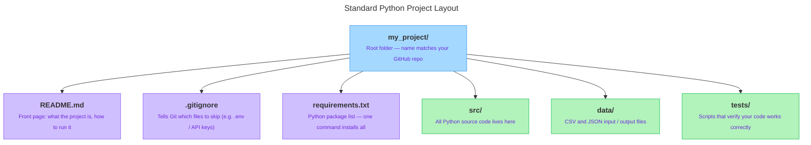

<!-- nav:top:start -->
[⬅ Previous: 13.12 — GitHub workflow](../../13-12-github-workflow-clone-add-commit-push/artifacts/reading.md)&emsp;·&emsp;[⬆ Table of Contents](../../../../../../../README.md#curriculum-topic-index)&emsp;·&emsp;[Next: 13.14 — .gitignore ➡](../../13-14-gitignore-keeping-api-keys-and-secrets-out-of-public-reposit/artifacts/reading.md)
<!-- nav:top:end -->

---

# Folder structure and README — how to organise a professional codebase

## Overview

When someone opens your GitHub repository, the first things they see are your folder layout and your README file. A well-organised project tells a reviewer you understand your own work before they read a single line of code. This topic shows you the standard folder layout used by Python developers, how to write a professional README, how to keep secrets out of GitHub, and how to record your project's dependencies — giving your Capstone repository a professional shape from day one. [1]

## Key Concepts

### What a folder structure is and why it matters

A **folder structure** — also called a project layout — is the arrangement of files and folders inside your project. Every file belongs to a category: code, data, configuration, or documentation. Placing each category in its own dedicated folder means related files are always together.

Think of a well-organised kitchen. Pots go in one cupboard, spices on a rack, knives in a knife block. You find what you need in seconds, even in someone else's kitchen. A messy kitchen where everything is piled on one counter costs you search time instead of cooking time. A software project works the same way. [1]

A disorganised project looks like this — everything in one flat pile:

```
my_project/
    script.py
    data.csv
    old_script.py
    final_script.py
    api_key.txt
    notes.txt
```

Problems this creates:

- A reviewer cannot tell which file is the main script.
- Files named `old_script.py` and `final_script.py` mean you used filenames to track versions instead of Git commits.
- `api_key.txt` sitting in plain sight will be committed and pushed to GitHub unless something stops it.
- There is no document explaining what the project does or how to run it.

### The standard Python project layout

The Hitchhiker's Guide to Python describes a project layout that professional teams across the industry follow. [1] Here is the standard structure with each part annotated:

```
my_project/               ← root folder — same name as your GitHub repo
├── README.md             ← front page: what the project is and how to run it
├── .gitignore            ← tells Git which files to skip (never push)
├── requirements.txt      ← list of Python packages this project needs
├── src/                  ← all Python code lives here
│   └── main.py           ← your main script
├── data/                 ← CSV, JSON, and other data files
└── tests/                ← scripts that verify your code works
```

The diagram below shows the same layout visually.



*Standard Python Project Layout — the root folder distributes to README.md, .gitignore, requirements.txt, src/, data/, and tests/, each labelled with its purpose.*

Take each part in turn:

- **Root folder** — the outermost container. Name it the same as your GitHub repository to avoid confusion.
- **`README.md`** — lives at the top level. GitHub displays this file as the formatted homepage of your repository. Every visitor sees it first.
- **`.gitignore`** — also at the top level. A hidden configuration file (the leading dot signals "hidden") that tells Git which files to skip entirely.
- **`requirements.txt`** — at the top level. A plain list of Python packages. One command installs them all.
- **`src/`** — short for "source". All your Python code goes here, separated from data and configuration. [2]
- **`data/`** — CSV (Comma-Separated Values) files, JSON (JavaScript Object Notation) files, and any other input or output data.
- **`tests/`** — scripts that verify your code produces correct results. You will explore testing in later courses; for your Capstone, you can leave this folder empty or omit it. [3]

You do not need every folder from the start. A minimal Capstone might look like this:

```
capstone-ai-tool/
├── README.md
├── .gitignore
├── requirements.txt
└── src/
    └── main.py
```

Add `data/` when you have data files. Add `tests/` if you write test scripts. Grow the structure as the project grows. [2]

### The README file

A **README** is a plain-text file, always named `README.md`, that sits at the root of your project. The `.md` extension stands for **Markdown** — a lightweight formatting language where a line starting with `#` becomes a heading and a line starting with `-` becomes a bullet point. You only need `#`, `##`, `-`, and backticks for a professional README.

GitHub automatically detects `README.md` and renders it as the formatted homepage of your repository. [1]

A README answers one central question: *What is this project and how do I use it?* Every professional README covers five sections:

1. **Title and description** — one or two sentences stating what the project does. "A Python script" is not a description; "A Python script that sends prompts to the OpenAI API and saves responses to a CSV file" is.
2. **Setup** — the exact steps a new person needs to take to run the project: clone the repo, install packages, configure any secret keys.
3. **Usage** — how to run the main script. Include the exact command, for example `python src/main.py`.
4. **File structure** — a brief listing of the main files and folders so the reviewer understands the layout at a glance.
5. **Author** — your name and cohort.

### The `.gitignore` file

A **`.gitignore` file** is a configuration file in the root folder that lists file names and patterns. Git reads it and treats every matching file as if it does not exist — Git will never stage it, commit it, or push it to GitHub. [1]

Three categories of files should almost always be excluded:

1. **Secret credentials** — API keys, passwords, database connection strings. These are private. Publishing them on GitHub exposes them to the entire internet.
2. **Generated files** — Python creates `.pyc` files automatically. They are large, numerous, and machine-specific; they add noise without value.
3. **Virtual environments** — the `venv/` folder can contain hundreds of megabytes of files that are hard-coded to your machine and will not work on anyone else's.

**Why API keys need special attention**

An **API key** is a secret string that identifies you to an external service. When your Python script calls an AI service's API (Application Programming Interface), it sends the API key with every request. The service uses it to confirm who you are and — for paid services — to bill you. API keys work like passwords. [1]

If you commit an API key to a public GitHub repository:

1. GitHub's automated security scanning detects patterns that look like API keys within seconds of your push.
2. Automated bots that scrape GitHub for credentials find the key almost immediately.

Many services revoke (permanently deactivate) the key the moment it appears publicly. You must then generate a new key, update your code, and check whether the key was misused. Prevention is one line in `.gitignore`.

**The safe pattern:**

- Store the key in a file named `.env`: `OPENAI_API_KEY=sk-your-key-here`
- Add `.env` to `.gitignore` before your first `git add`
- In your Python script, load the key at runtime using `os.getenv()`:

```python
import os
from dotenv import load_dotenv

load_dotenv()                            # reads .env and loads its values
api_key = os.getenv("OPENAI_API_KEY")   # retrieves the key by name
```

Your Python file never contains the key itself. [1]

**Critical ordering rule:** Create `.gitignore` before you run `git init` or before your first `git add`. If `.env` is committed even once, its value lives in Git history and is retrievable even after you delete the file.

### The `requirements.txt` file

A **`requirements.txt`** file is a plain-text list of Python packages (also called libraries or dependencies) that your project needs to run. [1]

When you install a package with `pip install openai`, it is installed on your computer — not stored inside your project folder. When someone clones your repository, they get your code but none of your packages. Without `requirements.txt`, they must guess what to install and will get errors until they guess correctly.

With a `requirements.txt`, they run one command:

```
pip install -r requirements.txt
```

The `-r` flag tells `pip` (Python's package installer) to read the list from a file and install everything on it. [2]

You can write it by hand (one package per line):

```
openai
python-dotenv
```

Or capture your current environment automatically:

```
pip freeze > requirements.txt
```

`pip freeze` lists every installed package with its exact version number. The `>` symbol redirects the output into the file. Version-pinned output looks like: `openai==1.30.1`. Either format is acceptable for a Capstone project.

## Worked Example

Here is a complete, professional README for a Capstone project — built from the five-section template:

```markdown
# AI Prompt Tester

<!-- nav:top:start -->
[⬅ Previous: 13.12 — GitHub workflow](../../13-12-github-workflow-clone-add-commit-push/artifacts/reading.md)&emsp;·&emsp;[⬆ Table of Contents](../../../../../../../README.md#curriculum-topic-index)&emsp;·&emsp;[Next: 13.14 — .gitignore ➡](../../13-14-gitignore-keeping-api-keys-and-secrets-out-of-public-reposit/artifacts/reading.md)
<!-- nav:top:end -->

---

A Python script that reads a list of prompts from a CSV file, sends each one
to the OpenAI API, and writes the responses back to a new CSV file.

## Setup

1. Clone this repository.
2. Install dependencies:

       pip install -r requirements.txt

3. Create a `.env` file in the root folder and add your API key:

       OPENAI_API_KEY=sk-your-key-here

## Usage

Run the main script from the project root:

    python src/main.py

The output file `data/responses.csv` is created automatically.

## File Structure

    capstone-ai-tool/
    ├── README.md             this file
    ├── .gitignore            files Git ignores (including .env)
    ├── requirements.txt      Python dependencies
    └── src/
        └── main.py           main script

## Author

Your Name — Revature CIT Cohort 2026
```

This README is concise, complete, and professional. A reviewer can read it in under two minutes and know exactly what the project does, how to set it up, and how to run it. [2]

Common README mistakes to avoid:

- Leaving the README as a placeholder with only the repository name.
- Writing vague descriptions like "This project does stuff with AI".
- Omitting the Setup section — a reviewer who cannot run your code cannot evaluate it.
- Not updating the README after adding features — a README describing a different project than what is in the repository is worse than no README.

## In Practice

| Situation | Correct approach | Common mistake |
|---|---|---|
| Storing an API key | `.env` file, listed in `.gitignore` | Pasted directly into `main.py` |
| Organising Python code | `src/main.py` | All files dumped in root folder |
| Describing the project | `README.md` with 5 sections | No README, or empty README |
| Recording dependencies | `requirements.txt` | Nothing — reviewer has to guess |
| Tracking version changes | Git commits with clear messages | `final.py`, `final_v2.py` filenames |
| Virtual environment | In `.gitignore`, never committed | Committed and pushed |

**Do:**

- Create `.gitignore` as the very first file in your project, before anything else.
- Run `git status` before every `git add .` to verify no secrets are staged.
- Name your root folder the same as your GitHub repository.
- Use lowercase letters and hyphens for folder names (`capstone-ai-tool`, not `Capstone AI Tool`).
- Write a README with all five sections before the project is considered complete.
- Update the README in the same commit as any code change that makes the old README wrong. [3]

**Don't:**

- Don't put all files in the root folder with no subfolders.
- Don't name files `final.py`, `final_v2.py`, or `FINAL_FINAL.py` — that is what commit history is for.
- Don't hardcode an API key in a `.py` file, not even in a comment — use `.env` and `os.getenv()`.
- Don't commit the `venv/` folder — it is large, machine-specific, and belongs in `.gitignore`. [1]

## Key Takeaways

- A **folder structure** organises your project files by purpose. Code goes in `src/`, data goes in `data/`, and root-level files (`README.md`, `.gitignore`, `requirements.txt`) describe and configure the project. A clear layout communicates professionalism before anyone reads your code.
- A **README** is the homepage of your repository. It must answer: what does this project do, how do I set it up, and how do I run it. The five-section template — title and description, setup, usage, file structure, author — is a reliable starting point.
- A **`.gitignore`** file tells Git which files to skip entirely. It must list `.env` and any secrets files and must be created before your first `git add` — once a secret is in Git history, it is very difficult to remove.
- An **API key** is a private credential that identifies you to an external service. Storing it in `.env`, loading it with `os.getenv()`, and listing `.env` in `.gitignore` is the only safe pattern.
- A **`requirements.txt`** file lets anyone clone your repository and replicate your Python environment with one command: `pip install -r requirements.txt`. Without it, collaborators and reviewers cannot run your code without guessing.

## References

[1] The Hitchhiker's Guide to Python. "Structuring Your Project." https://docs.python-guide.org/writing/structure/

[2] Real Python. "Python Project Layout Best Practices." https://realpython.com/ref/best-practices/project-layout/

[3] Denise Case. "Professional Python Guide — Project Structure." https://denisecase.github.io/pro-analytics-02/reference/python/project-structure/

---
<!-- nav:bottom:start -->
[⬅ Previous: 13.12 — GitHub workflow](../../13-12-github-workflow-clone-add-commit-push/artifacts/reading.md)&emsp;·&emsp;[⬆ Table of Contents](../../../../../../../README.md#curriculum-topic-index)&emsp;·&emsp;[Next: 13.14 — .gitignore ➡](../../13-14-gitignore-keeping-api-keys-and-secrets-out-of-public-reposit/artifacts/reading.md)
<!-- nav:bottom:end -->
