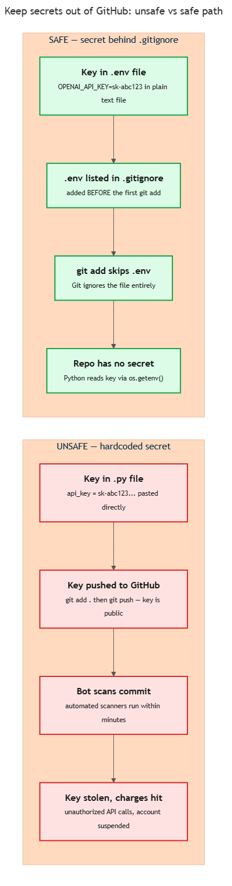

<!-- nav:top:start -->
[⬅ Previous: 13.13 — Folder structure and README](../../13-13-folder-structure-and-readme-how-to-organise-a-professional-c/artifacts/reading.md)&emsp;·&emsp;[⬆ Table of Contents](../../../../../../../README.md#curriculum-topic-index)&emsp;·&emsp;[Next: 13.15 — Commit discipline ➡](../../13-15-commit-discipline-one-logical-change-per-commit-meaningful-c/artifacts/reading.md)
<!-- nav:top:end -->

---

# .gitignore — keeping API keys and secrets out of public repositories

## Overview

When you push code to GitHub, every file Git is tracking becomes visible to anyone on the internet. If one of those files contains a password or an API key, automated bots can find it within minutes and use it to rack up charges on your account. This topic shows you exactly why that happens and gives you the three-step pattern — `.env`, `.gitignore`, and `os.getenv()` — that keeps your secrets out of the repository entirely.

## Key Concepts

### What a "secret" is

A **secret** is any piece of information that grants access to a resource and should be known only to you — not to anyone reading your code.

The secret you are most likely to handle in this course is an **API key** (Application Programming Interface key) — the token that authenticates your requests to an AI service like OpenAI or Anthropic. The key identifies your account. Anyone who has it can make requests billed to you [1].

Other common secrets follow the same rule:

| Secret type | What it unlocks |
|---|---|
| API key (`sk-abc123…`) | Calls to an AI service, billed to your account |
| Password | Access to a database |
| Token (`ghp_abc123`) | GitHub Personal Access Token — account actions |
| Connection string | Direct database access |

### What happens when a secret is committed

When you run `git push`, your commit history goes to GitHub. On a public repository, it is instantly readable by both human users and automated scanners — bots purpose-built to search every new commit for patterns that match API keys and passwords [1].

**Deletion does not help.** This is the most important thing to understand. If you commit a secret and then delete the file in a later commit, the secret is still in your commit history. Anyone can view old commits and recover the original file. Committing a deletion does NOT remove a value from history [1].

The only safe assumption once a secret is committed: treat it as fully public and compromised — even if you deleted it a minute later.

The consequences happen fast [1][2]:

1. **Unauthorized charges** — bots make thousands of API calls before you notice.
2. **Account suspension** — the API provider detects unusual usage and locks you out.
3. **Data exposure** — if the key unlocks a database, that data can be read or deleted.

### The correct pattern: `.env` + `.gitignore` + `os.getenv()`

The diagram below shows the unsafe path (key hardcoded in your `.py` file) versus the safe path (key stored in `.env`, blocked by `.gitignore`).


*Unsafe path: key hardcoded in source → pushed → bot finds it in minutes. Safe path: key in `.env` → `.gitignore` blocks it → Git never sees it.*

**Part 1 — Store the secret in a `.env` file.**

A `.env` file (the name starts with a dot and has no other extension) is a plain text file that holds key-value pairs:

```
OPENAI_API_KEY=sk-abc123XYZ
```

This file lives in your project folder but is never added to Git.

**Part 2 — Add `.env` to `.gitignore`.**

You learned in topic 13.13 that `.gitignore` lists files Git should ignore. Add this line:

```
.env
.env.*
```

Once that line is present, `git add .` skips the file entirely. It will never appear in a commit [3].

**Part 3 — Read the secret in Python using `os.getenv()`.**

An **environment variable** is a key-value pair the operating system holds in memory. Programs can read these values at runtime without the values being written into source files.

`python-dotenv` is a Python library that reads your `.env` file and loads its values into the environment. At the top of your script:

```python
import os
from dotenv import load_dotenv

load_dotenv()                                  # reads .env, loads values into environment
api_key = os.getenv("OPENAI_API_KEY")          # reads the value — never from source code
```

Your `.py` file contains only the variable name `"OPENAI_API_KEY"`, never the actual key. Someone reading your code on GitHub sees the name, not the secret [2].

### The critical ordering rule

`.gitignore` must list `.env` **before** you run `git add` for the first time.

`.gitignore` only prevents **untracked** files from being tracked. If you run `git add .` before the rule is in place, Git starts tracking `.env`. Adding the rule afterward does not un-track it [3].

### `.env.example` for teammates

There is a related problem: how does a teammate know which environment variables the project needs if `.env` is never committed?

The answer is a `.env.example` file — committed to Git, containing variable names and placeholder values only:

```
# copy this to .env and fill in your real values

<!-- nav:top:start -->
[⬅ Previous: 13.13 — Folder structure and README](../../13-13-folder-structure-and-readme-how-to-organise-a-professional-c/artifacts/reading.md)&emsp;·&emsp;[⬆ Table of Contents](../../../../../../../README.md#curriculum-topic-index)&emsp;·&emsp;[Next: 13.15 — Commit discipline ➡](../../13-15-commit-discipline-one-logical-change-per-commit-meaningful-c/artifacts/reading.md)
<!-- nav:top:end -->

---
OPENAI_API_KEY=your_key_here
```

**`.env.example` is committed (no secrets). `.env` is never committed (real secrets).**

## Worked Example

Setting up the secure pattern from scratch:

1. Create your project folder and run `git init`.
2. Create `.gitignore` immediately — before any other file — and add:
   ```
   .env
   .env.*
   ```
3. Create `.env` and add your API key:
   ```
   OPENAI_API_KEY=your_real_key_here
   ```
4. Create `.env.example` with placeholder values and commit it.
5. Install `python-dotenv`:
   ```
   pip install python-dotenv
   ```
6. In your Python script:
   ```python
   import os
   from dotenv import load_dotenv

   load_dotenv()
   api_key = os.getenv("OPENAI_API_KEY")
   ```
7. Run `git status` and confirm `.env` does **not** appear in untracked or staged files.
8. Commit and push. Browse your repository on GitHub — you should see `.gitignore` and `.env.example`, but **not** `.env`.

## In Practice

| Do | Don't |
|---|---|
| Store secrets in `.env` | Paste secrets directly in `.py` files |
| Add `.env` to `.gitignore` before the first `git add` | Add the rule after already staging the file |
| Use `os.getenv()` to read secrets in code | Use `print()` to debug a secret (it may appear in logs) |
| Commit `.env.example` with placeholder values only | Put real values into `.env.example` by mistake |
| Rotate a key immediately if it leaks | Assume deleting the file from the repo is enough |

**If you accidentally commit a secret:**

1. Rotate the key first — assume it is already compromised. Log in to the provider's dashboard, generate a new key, and revoke the old one.
2. Remove the file from tracking: `git rm --cached .env`, then commit and push.
3. The old value still exists in history, but rotating the key makes it worthless [1].

## Key Takeaways

- An API key pushed to a public GitHub repository can be stolen by automated bots within minutes, causing unauthorized charges or account suspension.
- Deleting a file after committing it does NOT remove the secret from commit history — the only safe response is to rotate (replace) the key immediately.
- The correct pattern is: store secrets in `.env`, list `.env` in `.gitignore`, and read values in Python using `os.getenv()` — no secret ever appears in source code.
- `.gitignore` must include `.env` before the first `git add` — adding the rule after Git is already tracking a file does not un-track it.
- A committed `.env.example` (with placeholder values only) tells teammates which variables they need without exposing any real secrets.

## References

1. GitGuardian, "Secrets and API Management." <https://blog.gitguardian.com/secrets-api-management/>
2. DeployHQ, "Protecting Your API Keys: A Quick Guide." <https://www.deployhq.com/blog/protecting-your-api-keys-a-quick-guide>
3. Consensys, "How to Avoid Uploading Your Private Key to GitHub." <https://consensys.io/blog/how-to-avoid-uploading-your-private-key-to-github-approaches-to-prevent-making-your-secrets-public>

---
<!-- nav:bottom:start -->
[⬅ Previous: 13.13 — Folder structure and README](../../13-13-folder-structure-and-readme-how-to-organise-a-professional-c/artifacts/reading.md)&emsp;·&emsp;[⬆ Table of Contents](../../../../../../../README.md#curriculum-topic-index)&emsp;·&emsp;[Next: 13.15 — Commit discipline ➡](../../13-15-commit-discipline-one-logical-change-per-commit-meaningful-c/artifacts/reading.md)
<!-- nav:bottom:end -->
