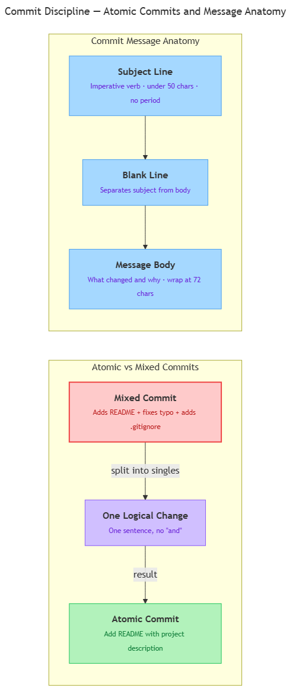

<!-- nav:top:start -->
[⬅ Previous: 13.14 — .gitignore](../../13-14-gitignore-keeping-api-keys-and-secrets-out-of-public-reposit/artifacts/reading.md)&emsp;·&emsp;[⬆ Table of Contents](../../../../../../../README.md#curriculum-topic-index)&emsp;·&emsp;[Next: 14.1 — Vector databases ➡](../../../../week-14/1-retrieval-augmented-generation-rag/14-1-vector-databases-storing-embeddings-and-enabling-similarity/artifacts/reading.md)
<!-- nav:top:end -->

---

# Commit discipline — one logical change per commit, meaningful commit messages

## Overview

Every time you run `git commit`, you add a permanent note to your project's history. That note — the **commit message** — is the label attached to a snapshot of your work. If the message says "stuff" or "changes," no one can tell what actually happened, including you six months from now. This topic teaches two habits that keep your project history readable: committing one focused change at a time, and writing a message that says exactly what changed and why.

## Key Concepts

### Atomic commits — one logical change per commit

**Atomic commit** — a commit that contains exactly one logical change and nothing else [1][2].

The word "atomic" means indivisible. An atomic commit cannot be split into smaller pieces without losing its meaning. Think of it like a single sentence in a diary entry: "Bought groceries." Clear, focused, complete. Compare that to "Bought groceries, fixed the car, called the dentist, reorganized the garage" — that is four separate events crammed into one line.

The diagram below shows the difference between a mixed commit and an atomic one, and illustrates how a commit message is structured.



*Left side: splitting a mixed commit into atomic ones. Right side: the three parts of a well-formed commit message.*

**What counts as one logical change?**

One logical change = one *reason* to change the code. Use this table to test yourself:

| Atomic (one reason) | Not atomic (multiple reasons) |
|---|---|
| Add a `README.md` with project description | Add README + fix a typo in `main.py` + add `.gitignore` |
| Fix bug where chatbot crashes on empty input | Fix the crash + refactor the response formatter |
| Add `.gitignore` to exclude the `.env` file | Add `.gitignore` + update requirements + rename a function |

**The quick test for atomicity:**

Ask yourself: "Can I describe this commit in one short sentence without the word 'and'?"

- `"Add .gitignore"` — passes.
- `"Add .gitignore and fix README typos and rename main function"` — fails. Split it.

**Why atomic commits matter:**

1. **Easier to understand.** One change = one clear story. A commit mixing five changes forces you to untangle them mentally before you can understand any of them [2].
2. **Easier to undo.** Git can reverse a single commit later. If a commit is atomic, reversing it undoes exactly one thing. If it mixes five changes, you undo all five — even the ones you want to keep [2].
3. **Cleaner history for reviewers.** A series of focused, labeled commits tells a clear story of how you built the project. A series of "misc changes" commits tells no story at all.

---

### Meaningful commit messages

A **commit message** is the text you supply when you run `git commit`. It is stored permanently in your commit history. Every collaborator — and every future version of you — will read it [1].

#### The two parts of a commit message

A well-formed commit message has two parts, separated by a blank line [1]:

```
<subject line>

<body>
```

**Subject line** — the short headline. Rules:

- Keep it under **50 characters** [1][3].
- Start with a **verb in the imperative (command) mood**: "Add", "Fix", "Remove", "Update", "Rename" — not "Added", "Fixes", or "I added".
- Do **not** end with a period.
- Capitalize the first word.

Why imperative mood? Because the subject line finishes the sentence: "If applied, this commit will \_\_\_\_." [1]
- "If applied, this commit will *Add login validation*" — reads naturally.
- "If applied, this commit will *Added login validation*" — does not.

**Body** — the explanation. Rules:

- Leave one blank line between the subject and the body [1].
- Wrap each line at **72 characters** [1][3].
- Explain **what changed and why** — not how (the code already shows how) [1].
- The body is optional for trivial changes ("Fix typo in README") but strongly encouraged whenever the reason is not obvious from the subject alone.

#### Good vs. poor message comparison

| Poor message | Good message |
|---|---|
| `fixed stuff` | `Fix crash when user submits empty prompt` |
| `update` | `Update README with setup instructions` |
| `wip` | `Add .gitignore to exclude .env and __pycache__` |
| `changes to main.py` | `Remove hardcoded API key from main.py` |
| `final version!!` | `Add requirements.txt with all project dependencies` |

Every good message starts with a verb, tells you what changed, and fits on one line [1][3].

---

## Worked Example

Here is a complete, real commit sequence for a small AI project — three separate commits, each atomic.

**Scenario:** You have just initialized a new project. You have three things to do: create a README, exclude secret files from Git, and record the project's Python packages.

**Step 1 — Check what you have changed.**

```bash
git status
```

Output shows three new files: `README.md`, `.gitignore`, and `requirements.txt`. Because these serve three different purposes, they belong in three separate commits.

**Step 2 — Stage and commit the README.**

```bash
git add README.md
git commit -m "Add README with project overview"
```

One file, one reason. Subject: 34 characters, imperative verb, no period.

**Step 3 — Stage and commit the `.gitignore`.**

```bash
git add .gitignore
git commit -m "Add .gitignore to exclude .env and __pycache__"
```

Notice: `git add .gitignore` stages only that file. You are not using `git add .` (add everything), because you still have `requirements.txt` uncommitted.

For a message with a body, omit `-m` and Git opens your default text editor:

```
Add .gitignore to exclude .env and __pycache__

.env contains API keys that must never be committed to a public
repository. __pycache__ is auto-generated by Python and adds no
value to version history.
```

Subject: 47 characters. Body: explains *why* — the information the code itself cannot show you.

**Step 4 — Stage and commit `requirements.txt`.**

```bash
git add requirements.txt
git commit -m "Add requirements.txt with project dependencies"
```

**Step 5 — Verify the history.**

```bash
git log --oneline
```

```
f9a0123 Add requirements.txt with project dependencies
d3e5678 Add .gitignore to exclude .env and __pycache__
abc1234 Add README with project overview
```

Three commits. Three clear sentences. Anyone reading this history immediately understands what was built and in what order.

---

## In Practice

Professional open-source projects treat commit discipline as a non-negotiable standard. The OpenStack project — a large cloud-computing platform used by major companies — publishes explicit commit message guidelines for all contributors. Their rules match what you learned here: imperative subject line, 50-character limit, 72-character body wrap, and one logical change per commit [2].

A clean commit history functions as a structured change log (a concept from topic 13.10). A teammate can scroll backward through hundreds of commits and understand what changed, when, and why — without reading any actual code.

**Do:**

- Write subject lines as commands: "Fix", "Add", "Remove", "Update", "Rename".
- Keep the subject under 50 characters.
- Add a body when the reason for the change is not obvious.
- Commit one logical change at a time.
- Stage files selectively with `git add <filename>` instead of `git add .` when you have mixed work.

**Avoid:**

- Vague messages: "fix", "update", "stuff", "wip", "final", "changes" — these destroy the value of your history [1][3].
- Mixing unrelated changes in one commit — they belong in separate commits [2].
- Ending the subject with a period.
- Committing everything at once at the end of a long session. Commit at logical stopping points as you go.

**The "squint test" [1]:** Imagine reading your commit history six months from now. Can you understand the project's story from subject lines alone? If yes — good commit discipline. If you have to open each commit to understand what it did — the messages need work.

---

## Key Takeaways

- An **atomic commit** holds exactly one logical change. Test it: can you describe the commit in one sentence without the word "and"? If not, split it.
- A **commit message subject line** should be under 50 characters, start with an imperative verb (Add, Fix, Remove), and not end with a period [1].
- Add a **body** (separated by a blank line, each line wrapped at 72 characters) when the reason for the change is not obvious from the subject alone [1].
- **Avoid vague messages** like "update", "fix", or "wip" — they erase the value of your commit history and make debugging harder [1][3].
- Good commit discipline makes your project history readable, makes individual changes easier to reverse, and signals professionalism to anyone who reads your work [2].

---

## References

1. Thoughtbot, "The Art of Writing Meaningful Git Commit Messages." <https://thoughtbot.com/blog/the-art-of-writing-meaningful-git-commit-messages>
2. OpenStack Wiki, "Git Commit Messages." <https://wiki.openstack.org/wiki/GitCommitMessages>
3. DataCamp, "Git Commit Message Tutorial." <https://www.datacamp.com/tutorial/git-commit-message>

---
<!-- nav:bottom:start -->
[⬅ Previous: 13.14 — .gitignore](../../13-14-gitignore-keeping-api-keys-and-secrets-out-of-public-reposit/artifacts/reading.md)&emsp;·&emsp;[⬆ Table of Contents](../../../../../../../README.md#curriculum-topic-index)&emsp;·&emsp;[Next: 14.1 — Vector databases ➡](../../../../week-14/1-retrieval-augmented-generation-rag/14-1-vector-databases-storing-embeddings-and-enabling-similarity/artifacts/reading.md)
<!-- nav:bottom:end -->
