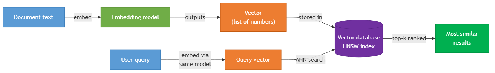

<!-- nav:top:start -->
[⬅ Previous: 13.15 — Commit discipline](../../../../week-13/4-version-control-with-git-and-github/13-15-commit-discipline-one-logical-change-per-commit-meaningful-c/artifacts/reading.md)&emsp;·&emsp;[⬆ Table of Contents](../../../../../../../README.md#curriculum-topic-index)&emsp;·&emsp;[Next: 14.2 — The RAG retrieval pipeline ➡](../../14-2-the-rag-retrieval-pipeline-query-embed-similarity-search-top/artifacts/reading.md)
<!-- nav:top:end -->

---

# Vector databases — storing embeddings and enabling similarity search at scale

## Overview

Keyword search matches words, not meaning — a search for "payment not going through" misses the ticket that says "card kept getting declined at checkout" [1]. A vector database solves this by storing text as lists of numbers that capture meaning, then finding records whose meaning is closest to your query. This topic explains what those numbers are, how the database searches them, and why the search stays fast even at millions of records.

## Key Concepts

### Embeddings — numbers that carry meaning

An **embedding** is a list of numbers that represents the meaning of a piece of text [1][3]. You feed a sentence into a specialised machine learning model called an **embedding model**, and it outputs a list — typically hundreds or thousands of numbers long. That list is also called a **vector**.

The critical property: **similar meanings produce numerically similar vectors**. Consider a simplified 3-number example:

| Input text | Embedding (3D, simplified) |
|---|---|
| "the battery dies too quickly" | [0.91, −0.43, 0.12] |
| "my phone barely lasts through the afternoon" | [0.89, −0.41, 0.14] |
| "chocolate cake recipe with buttercream" | [−0.67, 0.88, −0.54] |

The first two sentences share similar numbers because they describe the same problem. The recipe is completely different in meaning, so its numbers are completely different.

Real embedding models use 384 to 1536 numbers per vector. Mathematically, each vector is a point in very high-dimensional space — you cannot visualise it, but distance between points works exactly like distance on a flat map [1].

**Embedding models are separate from chat models.** When you called a language model via the API in week 12, you used a generative model. An embedding model is a different tool — it takes text as input and outputs a vector, not a text response [3]. Examples include OpenAI's `text-embedding-3-small` and Cohere's `embed-v3`.

*The pipeline from raw text through an embedding model to vector storage and similarity search.*

### What a vector database stores

A **vector database** is a purpose-built database for storing and searching over large collections of embeddings [1]. Unlike a regular SQL database that finds records by exact matches (`WHERE status = 'pending'`), a vector database finds records by *distance* — which stored vectors are geometrically closest to the query vector.

Each record in a vector database holds three things [1][2]:

1. **The vector** — the embedding produced by the embedding model
2. **A unique ID** — a reference back to the original document in your main data store
3. **Metadata** — optional fields like title, date, or category for filtering results

After a search, your application uses the returned IDs to fetch the full content from wherever you store it — a SQL database, a file store, and so on. The vector database answers "which items are most similar?" Your main data store answers "what is the full content of those items?" The two systems work together; neither replaces the other [1].

Popular options include Pinecone, Weaviate, Qdrant, Chroma, and pgvector.

### Similarity search and distance metrics

When you search a vector database, the steps are [2]:

1. Your query text is passed through the same embedding model used to index the data.
2. The model returns a **query vector** — the numerical representation of your query's meaning.
3. The database compares that query vector against every stored vector using a **distance metric**.
4. The database returns the **top-k** results — the k vectors with the smallest distance (most similar meaning) to your query.

The **k** is a number you choose. Top-5 returns the five most similar items; top-20 returns twenty.

Three distance metrics are commonly used [2]:

| Metric | What it measures | When to use it |
|---|---|---|
| **Cosine similarity** | The angle between two vectors — 1.0 = identical direction, 0 = unrelated | Default for text; ignores vector length, only direction matters |
| **Euclidean distance** | Straight-line distance between two points | When both direction and magnitude matter |
| **Dot product** | Combined score of direction and magnitude | When the embedding model was specifically trained for it |

For most text-based AI applications, **cosine similarity is the recommended default** [2]. Always check your embedding model's documentation — using the wrong metric gives poor results.

### The scale problem and ANN search

With 100 stored vectors, comparing every one against a query takes a fraction of a millisecond. With 100 million vectors — every paragraph in a company's document library — a one-by-one comparison would take seconds to minutes per query. That brute-force approach is called **exact nearest neighbour search (k-NN)**, and it does not scale [3].

The solution is **approximate nearest neighbour (ANN) search** — a family of algorithms that skip most comparisons and return results that are correct 90–99% of the time, in milliseconds [3]. The trade-off is that you might occasionally miss the single best match. For almost every AI application, "five highly relevant results in 10 milliseconds" is far more valuable than "five perfect results in 45 seconds."

### HNSW — the dominant ANN algorithm

The most widely used ANN algorithm in production vector databases is **HNSW (Hierarchical Navigable Small World)** [4]. You do not need to implement it; understanding what it does is enough.

HNSW builds a multi-layered graph over the stored vectors. Think of navigating to an address:

- **Top layer** — a sparse "highway" map connecting distant landmarks; few nodes, wide coverage
- **Middle layers** — progressively denser regional detail
- **Bottom layer** — the full neighbourhood graph connecting every vector to its actual nearest neighbours

A search starts at the top layer to find the right region quickly, then descends through layers, narrowing to the exact neighbourhood [4]. You never scan every street in the country — only the relevant neighbourhood.

This index is built once when data is loaded. Every search query then reuses it, making similarity search at scale practical [4].

## Worked Example

Here is the full query flow for a customer support search scenario, step by step.

**Setup (done once):**

1. A company has 50,000 support tickets stored in a SQL database.
2. Each ticket is passed through an embedding model (e.g., `text-embedding-3-small`), producing one vector per ticket.
3. Each vector is loaded into a vector database along with its ticket ID and metadata (date, product, status).
4. The vector database builds an HNSW index over the 50,000 vectors.

**At query time:**

1. A manager types: *"problems with the payment not going through"*
2. The application passes that text through the same embedding model. It returns a single query vector.
3. The application sends the query vector to the vector database with `top_k=5`.
4. The database runs ANN search using the HNSW index and returns 5 ticket IDs — the 5 tickets whose embeddings are closest in meaning to the query.
5. The application fetches the full text of those 5 tickets from the SQL database using the returned IDs.

The returned tickets may include "card kept getting declined at checkout" and "transaction failed every time I tried" — neither contains the manager's exact words, but both mean the same thing. Keyword search would have missed them.

## In Practice

Vector databases appear across AI applications wherever the core question is "what is most similar in meaning to this?" [1][2]:

- **Semantic document search** — a law firm finds liability clauses worded in dozens of different ways from a single plain-English query
- **Customer support automation** — a chatbot finds the three most relevant FAQ entries for a customer question, then injects them into an LLM prompt (this is the RAG pattern, covered in topic 14.2)
- **Product recommendations** — an e-commerce platform finds the 10 products most similar in description to one a user just purchased
- **Duplicate detection** — a content platform flags near-identical articles that use different wording
- **Code search** — a developer describes what they want in plain English and retrieves the most relevant existing function

**Key do/don't rules:**

- **Do** use the same embedding model at index time and query time [3]. Mixing models puts vectors in different mathematical spaces — results will be meaningless.
- **Do** store meaningful metadata with every vector [2]. At minimum: the source document ID, original text or summary, and date. Metadata enables filtering results (e.g., only tickets from the last 30 days).
- **Do** treat the vector database as a complement to your existing SQL database, not a replacement. It routes by semantic similarity; your SQL database handles structured queries [1].
- **Don't** try to embed very long documents as a single vector. Embedding models have a maximum input length. Split long documents into paragraphs or sections before embedding.

## Key Takeaways

- An **embedding** is a list of numbers produced by an embedding model that captures the meaning of text — similar meanings produce numerically close vectors. The embedding model is separate from the chat LLM you call via the API.
- A **vector database** stores (vector, ID, metadata) records and finds the most semantically similar ones to a query by measuring distance — cosine similarity is the default for text — not by matching exact words [1][2].
- The query flow is: embed the query with the same model used at index time → measure distance against stored vectors → return the top-k ranked results.
- **ANN (approximate nearest neighbour) search** makes this fast at millions of records by skipping most comparisons. **HNSW** is the dominant ANN algorithm; it navigates a multi-layer graph from coarse to fine, like zooming from a country map down to a street map [4].
- Vector databases work alongside regular databases: the vector database answers "what is similar?", the SQL database answers "what is the full record?" [1].

## References

1. IBM. *What Is a Vector Database?* https://www.ibm.com/think/topics/vector-database
2. IBM. *What is vector search?* https://www.ibm.com/think/topics/vector-search
3. Towards AI. *Vector Databases 101.* https://towardsai.net/p/artificial-intelligence/vector-databases-101-a-beginners-guide-to-vector-search-and-indexing
4. Zilliz. *Understanding HNSW.* https://zilliz.com/learn/hierarchical-navigable-small-worlds-HNSW

---
<!-- nav:bottom:start -->
[⬅ Previous: 13.15 — Commit discipline](../../../../week-13/4-version-control-with-git-and-github/13-15-commit-discipline-one-logical-change-per-commit-meaningful-c/artifacts/reading.md)&emsp;·&emsp;[⬆ Table of Contents](../../../../../../../README.md#curriculum-topic-index)&emsp;·&emsp;[Next: 14.2 — The RAG retrieval pipeline ➡](../../14-2-the-rag-retrieval-pipeline-query-embed-similarity-search-top/artifacts/reading.md)
<!-- nav:bottom:end -->
