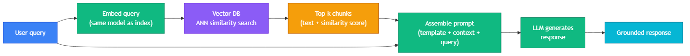

<!-- nav:top:start -->
[⬅ Previous: 14.1 — Vector databases](../../14-1-vector-databases-storing-embeddings-and-enabling-similarity/artifacts/reading.md)&emsp;·&emsp;[⬆ Table of Contents](../../../../../../../README.md#curriculum-topic-index)&emsp;·&emsp;[Next: 14.3 — Why RAG reduces hallucination ➡](../../14-3-why-rag-reduces-hallucination-ai-answers-from-retrieved-evid/artifacts/reading.md)
<!-- nav:top:end -->

---

# The RAG Retrieval Pipeline — Query → Embed → Similarity Search → Top-k → Inject into Prompt

## Overview

Language models answer from their training data — everything they learned before their knowledge cutoff date. They cannot answer questions about last week's announcements, your organisation's internal documents, or anything they were never shown during training.

**Retrieval-Augmented Generation (RAG)** fixes this without retraining the model. Instead of asking the model to answer from memory, the system first retrieves the most relevant documents from a knowledge base and hands them to the model as part of the prompt. The model reads those documents and bases its answer on them — not on training data alone [1].

This topic traces the five-step pipeline that runs every time a user submits a query to a RAG system: receive the query → embed it → search the vector database → retrieve the top-k chunks → assemble a prompt and generate the response. Knowing this pipeline lets you understand why RAG works, and — just as importantly — where it breaks [2].

## Key Concepts

### What RAG Is

**Retrieval-Augmented Generation (RAG)** is a system design pattern where a language model's input prompt is *augmented* with relevant documents retrieved from an external knowledge base before the model generates its response [1][3]. Three parts:

- **Retrieval** — finding relevant documents from a knowledge base using the vector database you studied in topic 14.1
- **Augmented** — adding those documents to the model's input (the prompt)
- **Generation** — the model producing its response using the retrieved documents and its own reasoning ability

RAG is not a model feature — it is a pattern you apply to *any* LLM by adding a retrieval step before the generation step. The model itself does not know it is in a RAG system; it only sees the prompt you hand it [3].

### The Five-Step Pipeline



The pipeline runs on every user query [2][4]:

1. **Receive the query.** The user types a question. Vague queries produce vague embeddings — the phrasing matters.
2. **Embed the query.** The query passes through the embedding model (the *same* model used at index time — see below) and becomes a vector representing its meaning [1][3].
3. **Similarity search.** The query vector is sent to the vector database, which uses ANN search to find stored vectors closest in meaning to the query — fast, even over millions of documents [2].
4. **Top-k retrieval.** The database returns the top-k most similar chunks. Each chunk carries its text, a similarity score, and metadata such as source URL and date [4].
5. **Inject into prompt and generate.** The retrieved texts are placed inside a prompt template alongside the original query. The LLM reads the assembled prompt and generates a response grounded in the retrieved context [1][3][4].

### What the LLM Actually Receives

In a standard (non-RAG) call, the model receives only the user's question. In a RAG call, it receives a structured prompt:

```
You are a helpful assistant. Answer using ONLY the context below.
If the context does not contain the answer, say "I don't know."

Context:
[Document 1, score 0.92]
Annual subscriptions may be refunded within 14 days of purchase...

User question: What are the refund terms for annual subscriptions?
```

The key distinction: **the model's training provides reasoning ability; the retrieved documents provide the facts** [1]. Two prompt instructions are critical: "answer from context only" (prevents mixing training knowledge with retrieved facts) and "say I don't know" (prevents hallucination when no relevant context was retrieved) [2][3].

### Two System Phases

A RAG system operates in two time phases [4]:

- **Index phase** (done once or periodically): documents are chunked → embedded → stored in the vector database → HNSW index built. Users never see this phase.
- **Query phase** (every user query, under 1 second): query → embed → ANN search → top-k → prompt assembly → LLM generation → response. This is what users experience.

The LLM is only involved in the query phase, only at the final generation step.

## Worked Example

**Scenario.** A customer asks a support chatbot: "What are the refund terms for annual subscriptions?"

**Step 1 — Receive query.** The chatbot receives the text string as-is.

**Step 2 — Embed.** The embedding model converts "What are the refund terms for annual subscriptions?" into a vector (e.g. `[0.12, -0.45, 0.87, …]`). Semantically similar phrases — "money back guarantee for yearly plan" — produce nearby vectors, so they retrieve the same documents.

**Step 3 — Similarity search.** The query vector is sent to the vector database. ANN search identifies the stored document chunks whose vectors are closest in meaning.

**Step 4 — Top-k retrieval (k=5).** The database returns five chunks. The top result (score 0.92) contains: *"Annual subscriptions may be refunded within 14 days of purchase. Contact support@example.com to initiate."* Score 0.50 on chunk 5 suggests only marginal relevance.

**Step 5 — Inject and generate.** The five chunks are placed into the prompt template. The LLM reads them, finds the answer in the top-scoring chunk, and responds: "Annual subscriptions can be refunded within 14 days of purchase. To start a refund, contact support@example.com."

The model's answer came from the retrieved document — not from whatever it learned about subscription policies during training.

## In Practice

RAG is the most widely deployed pattern for AI applications that need accurate, current, or private-domain answers [1][3].

**Customer support.** Help centre articles indexed → customer query → top relevant articles retrieved → LLM answers specifically from those articles. Reduces escalation to human agents.

**Internal knowledge search.** Policy documents, contracts, and engineering wikis indexed → employee asks a question → relevant sections retrieved → LLM summarises with a source link. No more manual keyword searching [1][2].

**Code documentation assistant.** API docs indexed → developer asks how to authenticate → LLM answers from the retrieved doc section, not from generalised training knowledge about a different API [2][3].

**Debugging checklist.** When a RAG system produces a wrong answer, check: Was the query too vague? Was the same embedding model used at index and query time? Is the answer actually in the knowledge base? Is top-k too small? Does the prompt template clearly instruct "from context only"? This is the five-step pipeline expressed as a fault-isolation guide [2][4].

## Key Takeaways

- **RAG** is a system design pattern: retrieve relevant documents from a knowledge base, inject them into the LLM prompt, let the model answer from retrieved context rather than training memory.
- The five steps: receive query → embed query (same model as index time) → ANN similarity search → top-k retrieval → inject into prompt and generate.
- The **LLM only sees the assembled prompt** — the application orchestrates retrieval; the model never directly accesses the vector database.
- A **prompt template** must include "answer from context only" and "say I don't know" — both are required to prevent the model from hallucinating when context is missing.
- Each step has a failure mode. The pipeline is also a debugging checklist.

## References

1. "What is Retrieval Augmented Generation (RAG)?" — Databricks. https://www.databricks.com/glossary/retrieval-augmented-generation-rag
2. Pakten, E. "What is RAG? A Beginner's Guide to Retrieval-Augmented Generation (With a Full Pipeline Walkthrough)" — DEV Community. https://dev.to/egepakten/what-is-rag-a-beginners-guide-to-retrieval-augmented-generation-with-a-full-pipeline-walkthrough-3djm
3. "Retrieval-Augmented Generation (RAG) for LLMs" — Prompt Engineering Guide. https://www.promptingguide.ai/research/rag
4. "Simple RAG Explained: A Beginner's Guide to Retrieval-Augmented Generation" — Machine Learning Plus. https://machinelearningplus.com/gen-ai/simple-rag-explained-a-beginners-guide-to-retrieval-augmented-generation/

---
<!-- nav:bottom:start -->
[⬅ Previous: 14.1 — Vector databases](../../14-1-vector-databases-storing-embeddings-and-enabling-similarity/artifacts/reading.md)&emsp;·&emsp;[⬆ Table of Contents](../../../../../../../README.md#curriculum-topic-index)&emsp;·&emsp;[Next: 14.3 — Why RAG reduces hallucination ➡](../../14-3-why-rag-reduces-hallucination-ai-answers-from-retrieved-evid/artifacts/reading.md)
<!-- nav:bottom:end -->
