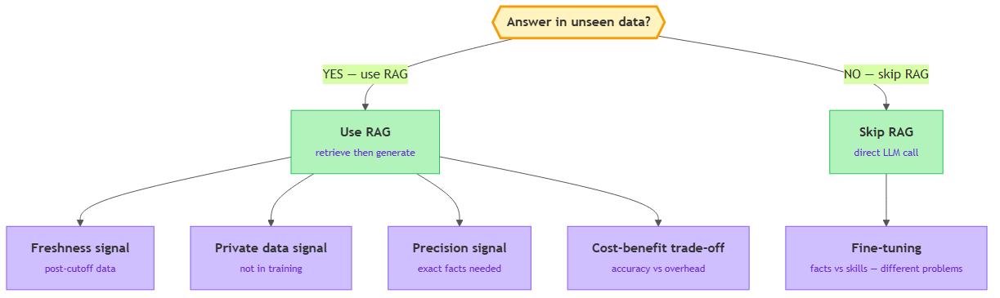

<!-- nav:top:start -->
[⬅ Previous: 14.3 — Why RAG reduces hallucination](../../14-3-why-rag-reduces-hallucination-ai-answers-from-retrieved-evid/artifacts/reading.md)&emsp;·&emsp;[⬆ Table of Contents](../../../../../../../README.md#curriculum-topic-index)&emsp;·&emsp;[Next: 14.5 — Agent anatomy ➡](../../../2-ai-agents/14-5-agent-anatomy-llm-plus-memory-tools-and-a-planning-loop/artifacts/reading.md)
<!-- nav:top:end -->

---

# When to use RAG — use it when the answer depends on data the model was not trained on

## Overview

RAG (Retrieval-Augmented Generation) is a powerful tool, but adding it to every AI system is a mistake. The decision comes down to one question: does the answer live in data the model was never trained on? If yes, RAG fills that gap by retrieving the right documents at query time. If no, RAG adds cost and complexity with no accuracy benefit.

## Key Concepts

### The core decision rule

Think of a language model like a very well-read graduate who studied everything on the public internet up until a fixed date — then went into a room with no phone, no news, and no access to your company's files. That graduate can answer questions brilliantly from memory. But they cannot tell you today's stock price, your company's leave policy, or the exact warranty on a product shipped last month.

RAG is the way you hand that graduate a relevant document right before they answer. The model itself does not change — you just put the right information in front of it at the moment it needs it [1].

The core rule, stated plainly: **use RAG when the answer lives in data the model was never trained on** [1].

That rule breaks into two parts:

- **"the answer lives in data"** — the question needs specific facts, not general reasoning. Examples: a product specification, a policy document, a recent news article.
- **"the model was never trained on"** — this data is private (never in any training corpus), newer than the model's knowledge cutoff, or so narrow that the model's memory of it is unreliable.

A quick test you can apply right now: *If you locked the model in a room with only its training data, could it still answer this question correctly?* If yes, skip RAG. If no, RAG is the right call.

### The four signals that point toward RAG

*The decision tree for when to use RAG: if the answer lives in data the model wasn't trained on, RAG; otherwise skip it. Under the YES branch, the four signals that point toward RAG.*

There are four situations where the core rule fires. Each is a different reason the answer lies outside the model's training [1][2][3].

**Signal 1 — Freshness**

**Freshness** means the answer depends on information that appeared after the model's knowledge cutoff.

The model's parametric memory (the knowledge baked into its weights, as you learned in 14.3) has a fixed cutoff date. Anything published after that date does not exist in that memory.

- Example: "What is the current interest rate?" A model trained in 2024 cannot know today's rate if it changed since then. A RAG system indexed against the central bank's current website answers accurately.

**Signal 2 — Private data**

**Private data** means the answer lives in documents your organisation owns but that were never part of any public training corpus.

Your company's employee handbook, contracts, support tickets, and project wikis are not on the public internet. The model has never seen them. There is no way for the model to answer questions about them from memory — the information simply does not exist inside it [1][2].

- Example: "What is the on-call rotation policy for the infrastructure team?" This exists only in the company's internal HR wiki. A RAG system over that wiki answers immediately.

**Signal 3 — Precision**

**Precision** means the answer must be an exact fact — exact wording, exact figure, exact specification — not a reasonable approximation [1][3].

Language models are good at understanding and generating language. They are not reliable fact stores for specific, low-frequency details. Parametric memory is fuzzy — trained on millions of documents, the model often returns a plausible approximation rather than the exact number or clause.

RAG retrieves the actual document and puts the precise text in front of the model before it generates. The model reads and reports the fact rather than approximating it.

- Example: "What is the exact warranty period for the Model 7 industrial pump?" A model answering from memory might say "typically one to two years." A RAG system that retrieves the spec sheet reports the actual number.

**Signal 4 — Cost-benefit**

RAG is not free. It adds:

1. **Latency** — an extra embedding call and a database search before every LLM (Large Language Model) call.
2. **Infrastructure cost** — a vector database to host, maintain, and keep current.
3. **Operational work** — you must keep indexed documents up to date.

These costs are worth paying when the accuracy benefit is large [2]. They are not worth paying when the model would answer correctly anyway. Always weigh the actual accuracy gap against the actual infrastructure cost before committing to RAG [2][3].

### When NOT to use RAG

Knowing when to skip RAG is just as important as knowing when to use it. Do not use RAG when:

- The question is conceptual. "Explain how a for-loop works." The model answers this reliably from training.
- The answer is stable, public, and well-known. Historical facts, established science, widely used programming patterns — these have been in millions of training documents for years.
- You are generating content, not retrieving facts. Drafting text, brainstorming, rephrasing — these use the model's language ability, not its fact recall.
- Latency matters more than the marginal accuracy gain. A real-time system that needs sub-100 ms responses may not be able to afford the retrieval step [1][2].

Adding RAG to a system that does not need it is over-engineering. It introduces new failure modes without improving outcomes.

### RAG vs. fine-tuning — two different problems

The most common confusion for new practitioners is mixing up RAG with **fine-tuning**. They are not alternatives for the same problem. They solve completely different problems [1][2][3].

**Fine-tuning** — continuing to train a model on a new specific dataset. This changes the model's weights: it teaches the model new *behaviour*, such as responding in a particular style, following a specific format, or reasoning the way experts in a narrow domain reason.

**RAG** — does not touch the model at all. It changes what information is placed in front of the model at query time. The weights stay fixed; you expand what the model can see right before it answers.

| | RAG | Fine-tuning |
|---|---|---|
| What it changes | The prompt (adds retrieved documents) | The model's weights |
| Best for | Current or private facts | New style, tone, or reasoning patterns |
| Data stays fresh? | Yes — update the vector database | No — model must be retrained |
| Solves knowledge cutoff? | Yes | No — fine-tuned model has its own cutoff |
| Private data problem? | Yes — documents stay in the database | Partly — data is baked into weights |
| When wrong, how to fix? | Update documents in the database | Retrain or fine-tune again |

The clearest way to remember the distinction: **use RAG when the answer is a matter of facts the model does not have; use fine-tuning when the task is a matter of skills or style the model does not have** [1].

Concrete examples:

- Company policy documents that change each quarter → **RAG.** Fine-tuning would bake in the policy as of training time and require retraining every quarter.
- Responding in a specific brand voice — short sentences, particular tone → **Fine-tuning.** This is a behaviour change, not a facts problem. RAG cannot teach style.
- Questions about documents published this week → **RAG.** Fine-tuning cannot solve freshness.
- Specialising in a narrow technical domain like radiology reporting → **Fine-tuning.** The model needs internalised reasoning patterns, not just document access [1][2].

## Worked Example

Here is how the decision framework plays out against a real scenario.

**Scenario: A retail company wants an AI assistant for customer enquiries.**

Step 1 — Write down the specific questions the system will answer:

1. "What is your return policy for electronics?"
2. "Is my order #45231 delivered?"
3. "Write a polite response to an angry customer email."
4. "Respond in a friendly, casual tone that matches our brand."

Step 2 — Apply the decision rule to each question:

| Question | Signals | Decision |
|---|---|---|
| Return policy | Private data + freshness + precision | RAG |
| Order status | Private + real-time data | RAG (or direct database lookup) |
| Drafting a reply | Generative task — no facts needed | No RAG |
| Brand tone | Style/behaviour requirement | Fine-tuning (or prompt engineering) |

Step 3 — Assess cost-benefit for the RAG use cases:

- Customer enquiries happen thousands of times per day. Wrong answers about return policies damage trust. The accuracy benefit is high. The infrastructure cost is justified. → **Build with RAG** [2][3].

This is the decision process in practice. The framework is not a formula — it is a checklist that forces you to think through each signal before committing to an architecture.

## In Practice

Real-world patterns where RAG is consistently the right call [1][2][3]:

- **Enterprise customer support.** A company's support team answers the same questions about products, policies, and procedures hundreds of times per day. The model cannot answer from training — the data is private, specific, and frequently updated. RAG over the support knowledge base solves this cleanly [1][2].
- **Legal and compliance Q&A.** Regulations change frequently. Exact wording matters — the precision signal is high. RAG retrieves the specific clause rather than asking the model to recall legislation it may have seen in an outdated version [3].
- **Internal IT and HR knowledge bases.** Employees ask about internal tools, security procedures, and HR policies. This is private data — definitionally not in any public training corpus. RAG over internal documentation is the standard solution [2].

A pattern practitioners have regretted: fine-tuning a model on company documents to "teach" it the company's knowledge. The problem — the knowledge was baked in as of training time. When policies changed, the model confidently gave outdated answers. Fixing it required another expensive training run. RAG avoids this by keeping the knowledge store separate from the model [1][3].

**Best practices:**

- Start with the question, not the tool. Write down the specific questions your system will answer, then apply the decision framework — not to the general category of application.
- Do not use RAG as a default. Overusing it adds cost and new failure modes without improving outcomes [2].
- If you choose RAG, commit to keeping the vector database current. A stale document store is the most common post-deployment failure mode [3].
- Prefer RAG over fine-tuning for private data. Documents stay in the database, where they can be versioned, audited, and deleted independently of the model [1][2].

## Key Takeaways

- **The core decision rule:** use RAG when the answer lives in data the model was never trained on — private documents, post-cutoff information, or precise domain-specific facts that parametric memory cannot reliably recall.
- **Four signals point toward RAG:** freshness (data newer than the model's cutoff), private data (documents the model never saw), precision (exact facts matter), and a favourable cost-benefit ratio (accuracy gain justifies retrieval overhead).
- **RAG and fine-tuning solve different problems.** RAG provides access to current and private facts at query time without changing the model. Fine-tuning changes how the model behaves — its style, tone, and domain reasoning. If the answer changes over time, RAG is almost always the right choice.
- **When the model's unassisted answer is correct, skip RAG.** Conceptual questions, generative tasks, and questions about stable public knowledge do not benefit from retrieval. Simpler is better.
- **A five-question check:** (1) Is the answer in documents the model has never seen? (2) Does precision matter? (3) Does the data change? (4) Is the need about facts or behaviour? (5) Does accuracy gain justify retrieval overhead? These questions cover the vast majority of real cases.

## References

1. IBM. "RAG vs Fine-Tuning." IBM Think. https://www.ibm.com/think/topics/rag-vs-fine-tuning
2. AWS. "RAG vs Fine-Tuning." AWS Prescriptive Guidance. https://docs.aws.amazon.com/prescriptive-guidance/latest/retrieval-augmented-generation-options/rag-vs-fine-tuning.html
3. Oracle. "RAG vs Fine-Tuning Decision Guide." Oracle AI. https://www.oracle.com/artificial-intelligence/generative-ai/retrieval-augmented-generation-rag/rag-fine-tuning/

---
<!-- nav:bottom:start -->
[⬅ Previous: 14.3 — Why RAG reduces hallucination](../../14-3-why-rag-reduces-hallucination-ai-answers-from-retrieved-evid/artifacts/reading.md)&emsp;·&emsp;[⬆ Table of Contents](../../../../../../../README.md#curriculum-topic-index)&emsp;·&emsp;[Next: 14.5 — Agent anatomy ➡](../../../2-ai-agents/14-5-agent-anatomy-llm-plus-memory-tools-and-a-planning-loop/artifacts/reading.md)
<!-- nav:bottom:end -->
