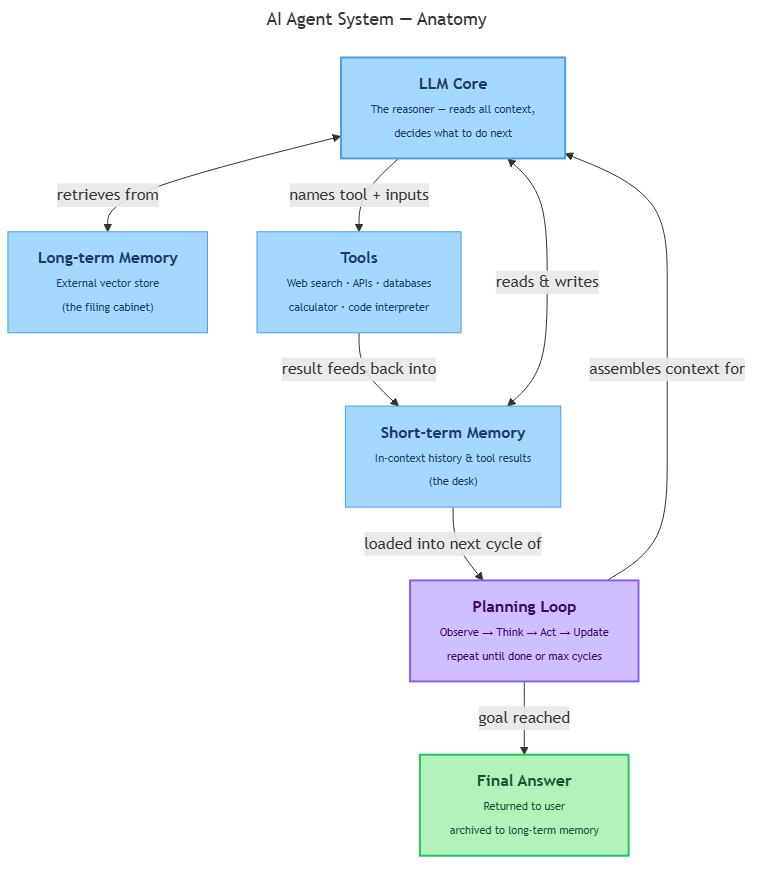

<!-- nav:top:start -->
[⬅ Previous: 14.4 — When to use RAG](../../../1-retrieval-augmented-generation-rag/14-4-when-to-use-rag-use-it-when-the-answer-depends-on-data-the-m/artifacts/reading.md)&emsp;·&emsp;[⬆ Table of Contents](../../../../../../../README.md#curriculum-topic-index)&emsp;·&emsp;[Next: 14.6 — The ReAct pattern ➡](../../14-6-the-react-pattern-reason-act-observe-repeat/artifacts/reading.md)
<!-- nav:top:end -->

---

# Agent anatomy — LLM plus memory, tools, and a planning loop

## Overview

A plain LLM takes a prompt and returns a response — one exchange, then done. That is powerful, but it cannot search the web, remember what it figured out three steps ago, or keep working until a task is finished. An **AI agent** is a system that wraps an LLM with three extra pieces — memory, tools, and a planning loop — so it can pursue a multi-step goal on its own [1]. This topic maps out each of those four pieces so you can recognise them and understand why every one of them is necessary.

## Key Concepts

*The four components of an AI agent — LLM core, memory, tools, and planning loop — working together in a continuous cycle.*

An AI agent always has the same four components, no matter how it is built [1][2]. Think of them as roles on a small team.

### Component 1 — The LLM Core

The **LLM core** is the language model at the centre of the agent. It is exactly the kind of model you have been working with throughout M5 — it reads a prompt and produces text. Its job inside an agent is to be the **reasoner**: it reads everything in front of it (the goal, the current situation, any tool results, any retrieved memory) and decides what should happen next.

One important limit: the LLM core can only generate text. It cannot browse the web, query a database, or run code by itself. Every real-world action happens through a tool. Every piece of remembered information comes from memory. The LLM core is the brain; the other components are the hands and the filing cabinet [2].

### Component 2 — Memory

**Memory** is how the agent holds onto information across multiple steps. Without it, the agent would start each step with a blank slate — forgetting everything it had already done.

There are two kinds:

- **Short-term memory** (also called working memory or context) — information kept *inside the current prompt*: the conversation so far, the goal, and the results of recent tool calls. Think of it as the agent's desk: fast to access, but limited in size by the model's context window.
- **Long-term memory** — information stored *outside the prompt* in an external system, often a vector database (which you studied in 14.1). The agent retrieves items from long-term memory when it needs them — like opening a filing cabinet. This allows the agent to remember facts from much earlier in a task, or even from a previous session [1][3].

A simple rule to tell them apart: short-term memory is *in the prompt right now*; long-term memory is *stored elsewhere and fetched on demand*.

### Component 3 — Tools

**Tools** are functions that let the agent act in the world or retrieve information from outside itself [1][2]. Because the LLM core can only produce text, tools are what turn that text into real actions.

Common examples:

| Tool | What it does |
|---|---|
| Web search | Queries a search engine; returns a summary of results |
| Calculator | Evaluates a maths expression; returns the answer |
| API caller | Sends a request to an external service (e.g. a weather API) |
| Database query | Looks up a record in a database |
| Email sender | Composes and sends an email |
| Code interpreter | Runs a snippet of code; returns the output |

When the LLM core decides a tool is needed, it outputs the tool name and inputs as structured text. The agent system then calls that tool, collects the result, and feeds it back to the LLM core. The model itself never directly runs code or touches the internet — it only says "call this tool with these arguments" [3].

### Component 4 — The Planning Loop

The **planning loop** (also called the agent loop or reasoning loop) is the repeating cycle that coordinates the other three components. Without it, the LLM core would produce one response and stop — regardless of how many steps the task still needed [1].

Each cycle follows four stages:

1. **Observe** — gather the current state: the goal, conversation history, and the result of the last tool call (if any).
2. **Think** — the LLM core reads everything and decides: call a tool, or is the task complete?
3. **Act** — if a tool is needed, call it and collect the result. If the task is done, produce the final answer.
4. **Update** — write the result (or final answer) into memory, then start the next cycle from step 1.

The loop keeps repeating until one of two stopping conditions is met: the LLM core produces a **final-answer signal** (it judges the task complete), or a **hard maximum cycle count** set by the developer is reached — a safety limit that prevents the agent from looping forever and burning unlimited API calls [1][3].

Note: the planning loop often follows a pattern called ReAct (covered in the next topic, 14.6).

## Worked Example

**Task:** "What is the population of the capital city of France, and is that number bigger than 5 million?"

**Setup:** The agent receives the goal. Short-term memory contains only the goal and any system instructions.

**Cycle 1**

1. *Observe* — the agent has the goal but no data yet.
2. *Think* — "I need the population of Paris. I will search for it."
3. *Act* — calls the `web_search` tool with the query "population of Paris, France."
4. *Update* — tool returns: *"City proper: ~2.1 million. Greater metropolitan area: ~12 million."* This result is added to short-term memory.

**Cycle 2**

1. *Observe* — the goal plus the tool result from cycle 1.
2. *Think* — "I have both figures. The city proper is 2.1 million (below 5 million); the metro area is 12 million (above 5 million). I have enough to answer."
3. *Act* — no tool call needed. The agent produces its final answer: *"The capital of France is Paris. The city proper has about 2.1 million people — smaller than 5 million. The greater metropolitan area has about 12 million — larger than 5 million."*
4. *Loop ends.*

Roles at work [1][2][3]:

- **LLM core** — did all the reasoning at each "Think" step.
- **Short-term memory** — carried the tool result from cycle 1 into cycle 2.
- **Tool** (web search) — fetched real data from outside the model.
- **Planning loop** — ran twice and stopped when the task was complete.

## In Practice

### Customer service agents

A user asks: "Where is my order, and can I change the delivery address?" Answering this requires three tool calls in sequence: look up the order (database query), check delivery status (logistics API), and — only if the package has not yet shipped — update the address (database write). Whether the address update step is needed at all depends on the status result. A fixed, one-shot LLM call cannot handle that conditional logic. The agent pattern handles it naturally: the LLM core decides what to do next based on what the previous tool returned, and memory carries the order ID across steps [1][3].

### Research and summarisation agents

Given a topic, a research agent searches the web, reads several pages, extracts key facts, and writes a summary. The number of searches needed is not known in advance — it depends on what is found. This is a textbook agent task: multi-step, decision-dependent, and requiring both retrieval tools and text generation [1][2]. Each search result lands in short-term memory, and the LLM core decides after each one whether to search again or move on to writing the summary.

### A note on when agents are the right choice

Agents add cost and complexity. A direct LLM call is faster, cheaper, and easier to debug. Reach for the agent pattern only when the task genuinely requires dynamic, multi-step decisions where each step depends on what the previous step returned. The decision signals for choosing between a direct call, a fixed chain, and a full agent are covered in topic 14.7.

## Key Takeaways

- An **AI agent** is an LLM core plus three additional components: memory, tools, and a planning loop — all four are necessary.
- The **LLM core** is the reasoner. It can only generate text; it relies on tools for real-world actions and on memory for information across steps.
- **Short-term memory** lives in the current prompt (fast, limited); **long-term memory** is stored externally and fetched when needed (large capacity, requires retrieval).
- **Tools** are callable functions (web search, database query, API caller, etc.) that let the agent act in the world — the LLM core triggers them by producing structured text.
- The **planning loop** runs Observe → Think → Act → Update repeatedly until the task is done or a safety cycle limit is hit.
- Use the simplest approach that works: direct LLM call → fixed chain of calls → agent. Agents are right only when a task requires dynamic, multi-step decisions based on intermediate results.

## References

[1] The Anatomy of an Agent. *Daily Dose of Data Science*. https://blog.dailydoseofds.com/p/the-anatomy-of-an-agent-harness

[2] LLM Agent Architecture Guide. *Leanware*. https://www.leanware.co/insights/llm-agent-architecture-guide

[3] LLM Agents Explained — Visual Guide to AI. *LangCopilot*. https://langcopilot.com/posts/2025-09-17-llm-agents-explained-visual-guide-ai

---
<!-- nav:bottom:start -->
[⬅ Previous: 14.4 — When to use RAG](../../../1-retrieval-augmented-generation-rag/14-4-when-to-use-rag-use-it-when-the-answer-depends-on-data-the-m/artifacts/reading.md)&emsp;·&emsp;[⬆ Table of Contents](../../../../../../../README.md#curriculum-topic-index)&emsp;·&emsp;[Next: 14.6 — The ReAct pattern ➡](../../14-6-the-react-pattern-reason-act-observe-repeat/artifacts/reading.md)
<!-- nav:bottom:end -->
