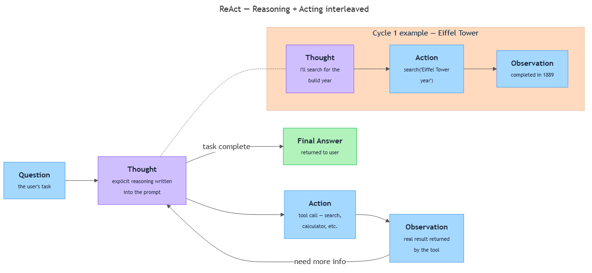

<!-- nav:top:start -->
[⬅ Previous: 14.5 — Agent anatomy](../../14-5-agent-anatomy-llm-plus-memory-tools-and-a-planning-loop/artifacts/reading.md)&emsp;·&emsp;[⬆ Table of Contents](../../../../../../../README.md#curriculum-topic-index)&emsp;·&emsp;[Next: 14.7 — Agent vs simpler flow ➡](../../14-7-agent-vs-simpler-flow-decision-matrix-direct-call-chained-ca/artifacts/reading.md)
<!-- nav:top:end -->

---

# The ReAct pattern — Reason, Act, Observe, Repeat

## Overview

The **ReAct pattern** — short for **Re**asoning + **Act**ing — is a loop structure for AI agents that interleaves explicit written reasoning with real tool calls and observed results [1][2]. Before every action, the agent writes out a one- or two-sentence thought; after every action, the agent reads back the real result from the tool. This back-and-forth continues until the agent has enough verified information to give a final answer. The pattern solves two problems at once: it stops agents from hallucinating confident-sounding guesses, and it creates a readable trace that makes debugging straightforward [3].

## Key Concepts

A ReAct cycle has four stages that repeat until the task is done [1][2].


*The ReAct cycle: Thought → Action → Observation, repeating until Final Answer.*

**Stage 1 — Thought**

**Thought** — a short line of explicit reasoning the agent writes before every action, answering "What do I know and what should I do next?" It starts with the label `Thought:` and becomes part of the conversation log. It is not a tool call; it is the agent thinking out loud [2][3].

Example: `Thought: I need to find out when the Eiffel Tower was built. I should search for that fact.`

**Stage 2 — Action**

**Action** — the concrete step the agent takes based on its Thought, almost always a tool call (a web search, a calculator, a database query). The agent system reads the `Action:` line, calls the actual tool, and waits for a result [1][4].

Example: `Action: search("Eiffel Tower construction year")`

**Stage 3 — Observation**

**Observation** — the real result that comes back from the tool, added to the log by the system (not invented by the model). Because the result comes from an external tool, it is a verified fact rather than a model estimate [2][5].

Example: `Observation: The Eiffel Tower was built between 1887 and 1889.`

**Stage 4 — Repeat or Final Answer**

After reading the Observation, the agent loops back to Stage 1 and writes another Thought. When the agent has gathered enough verified information, it produces a **Final Answer** — a closing statement returned to the user — and the loop ends [2][3].

### How ReAct compares to the generic planning loop from topic 14.5

In topic 14.5 you learned the Observe → Think → Act → Update cycle. ReAct is a specific, named version of that same idea with one critical refinement: the thinking step is made explicit and logged [1][2].

| Aspect | Generic loop (14.5) | ReAct |
|---|---|---|
| Reasoning step | "Think" — model reasons internally | "Thought:" — written into the prompt and logged |
| Visibility | Internal; not recorded | Every Thought is in the conversation log |
| Debugging | Hard — no trace of why actions were chosen | Easy — every decision has a matching Thought |
| Failure modes addressed | Not specified | Hallucination (via grounding) and opacity (via Thought logs) |

The key difference is **explicitness**: ReAct specifies *exactly how* to think before acting — write a `Thought:` line, make it part of the prompt, and keep it in the log permanently [3].

ReAct is primarily a **prompting strategy**: the model is instructed to produce `Thought:` lines before every action, and the agent system is built to process that structure. Any capable instruction-following LLM (Large Language Model) can run ReAct without special architecture [3][5].

## Worked Example

The best way to understand ReAct is to trace a complete example. Everything below comes from a real ReAct agent log.

**Task:** "What year was the Eiffel Tower built, and how many years ago was that from 2026?"

---

**Cycle 1 — finding the construction year**

```
Thought: I need to find out when the Eiffel Tower was built. I do not know this
         from memory with certainty, so I should search for it.
Action: search("Eiffel Tower construction year")
Observation: The Eiffel Tower was built between 1887 and 1889. It was completed
             and opened in March 1889.
```

The Thought explains *why* the agent searches instead of guessing. The Observation is a real result — not the model's memory.

---

**Cycle 2 — calculating the elapsed years**

```
Thought: The Eiffel Tower was completed in 1889. Now I need to calculate how
         many years ago that was from 2026. That is 2026 minus 1889.
Action: calculator("2026 - 1889")
Observation: 137
```

Notice the agent uses a calculator tool even for arithmetic it could probably estimate. The tool produces a *verified* number; a model estimate is still a guess [1][5].

---

**Cycle 3 — final answer**

```
Thought: I now have both pieces of information: the Eiffel Tower was completed
         in 1889, and that was 137 years ago from 2026. I have enough to answer.
Final Answer: The Eiffel Tower was completed in 1889. That is 137 years ago from 2026.
```

The loop ends. Notice the structure in each cycle:

1. The Thought names the goal for the next step.
2. The Action calls a real tool.
3. The Observation carries a verified fact from outside the model.

If the search in Cycle 1 had returned a wrong date, the Thought trail would show exactly where the error entered. Without the Thought lines, you would see two tool calls and a number — no explanation of why [2][3].

## In Practice

**LangChain as the default implementation**

LangChain — one of the most widely used Python frameworks for building LLM-powered applications — implements a ReAct agent as a first-class component [4]. When you create a LangChain agent and give it tools, the default behaviour is a ReAct loop: the framework instructs the LLM to produce `Thought:` + `Action:` pairs, calls the tool, appends the `Observation:`, and repeats. Developers see the Thought lines in their logs by default — no manual tracing setup needed.

**Customer support agents**

In a customer support deployment, an agent might need to look up an order (database tool), check a shipping carrier's API (API tool), and consult a policy document (retrieval tool) — each step depending on the previous result [3][4]. With a ReAct loop, the Thought log records why each tool was called and what was concluded. A supervisor auditing a resolved case can read the Thought trail exactly as they would read a case note, without guessing what the agent was trying to do.

Two practical rules follow from the pattern:

- **Keep Thought lines concise.** One or two sentences naming the next step and its reason. Verbose Thoughts inflate the context window and clutter the log [3][5].
- **Set a maximum cycle count.** An unconstrained ReAct loop can run indefinitely. A hard limit of 10–15 cycles is standard [1][5].

## Key Takeaways

- **ReAct** (Reasoning + Acting) is a prompting strategy that interleaves explicit `Thought:` lines with real tool calls (`Action:`) and verified results (`Observation:`) before producing a `Final Answer` [1][2].
- A ReAct cycle has four stages — **Thought**, **Action**, **Observation**, **repeat** — and the loop runs until the agent has enough verified information to answer [2][3].
- The critical difference from the generic planning loop is that the **Thought step is written into the prompt and logged**, making every decision traceable and every mistake findable [3][4].
- ReAct addresses two failure modes: **hallucination from reasoning without tool grounding** (each step is verified via an Observation) and **opacity from acting without reasoning** (every action has a matching Thought explaining why) [2][5].
- ReAct is the **default loop structure in major agent frameworks** such as LangChain and is the natural choice for tasks requiring multiple, sequentially dependent steps [4].

## References

1. ReAct: Synergizing Reasoning and Acting in Language Models — project page. https://react-lm.github.io
2. Yao et al. (2022). ReAct: Synergizing Reasoning and Acting in Language Models. arXiv:2210.03629. https://arxiv.org/abs/2210.03629
3. Prompting Guide — ReAct Prompting. https://www.promptingguide.ai/techniques/react
4. LangChain Blog — ReAct Agent. https://blog.langchain.dev/react-agent
5. Towards Data Science — The ReAct Agent Pattern. https://towardsdatascience.com/react-agent-pattern

---
<!-- nav:bottom:start -->
[⬅ Previous: 14.5 — Agent anatomy](../../14-5-agent-anatomy-llm-plus-memory-tools-and-a-planning-loop/artifacts/reading.md)&emsp;·&emsp;[⬆ Table of Contents](../../../../../../../README.md#curriculum-topic-index)&emsp;·&emsp;[Next: 14.7 — Agent vs simpler flow ➡](../../14-7-agent-vs-simpler-flow-decision-matrix-direct-call-chained-ca/artifacts/reading.md)
<!-- nav:bottom:end -->
