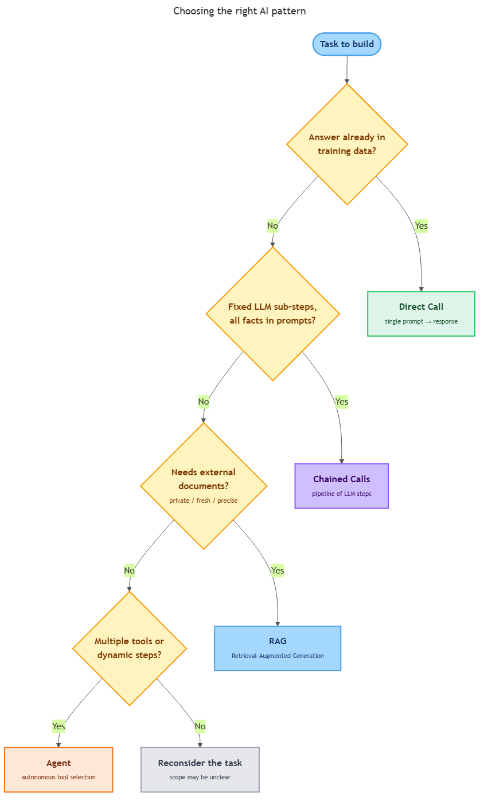

<!-- nav:top:start -->
[⬅ Previous: 14.6 — The ReAct pattern](../../14-6-the-react-pattern-reason-act-observe-repeat/artifacts/reading.md)&emsp;·&emsp;[⬆ Table of Contents](../../../../../../../README.md#curriculum-topic-index)&emsp;·&emsp;[Next: 14.8 — When NOT to use agents ➡](../../14-8-when-not-to-use-agents-high-stakes-or-irreversible-actions-r/artifacts/reading.md)
<!-- nav:top:end -->

---

# Agent vs simpler flow — decision matrix: direct call → chained calls → RAG → agent

## Overview

You know RAG and agents exist — but you do not always need them. The most common engineering mistake is reaching for the most powerful tool by default, without asking whether the task actually requires it. A four-tier decision matrix solves the "when" question: it walks you through four yes/no questions and points you to the correct tier — direct call, chained calls, RAG, or agent — for any given task [3][4]. Use the simplest tier that works; climb only when you have a specific reason to.

## Key Concepts

### The Four Tiers

Think of the four tiers as a ladder. Each rung adds capability, but also adds cost, latency, and extra failure points. The rule is to start at the bottom and only climb when a clear criterion is met [3][5].

- **Direct call** — one prompt sent to an LLM (Large Language Model), one response returned. No memory between calls, no external tools. The baseline for every AI system.
- **Chained calls** — two or more LLM calls in sequence, where the output of one call becomes the input of the next. No external data sources; just LLM → LLM → LLM.
- **RAG (Retrieval-Augmented Generation)** — the user's question is used to retrieve matching documents from a vector database, those documents are injected into the prompt, and then the LLM answers. Grounds answers in evidence outside the model's training data.
- **Agent (ReAct loop)** — an LLM that can use tools and loop: it reasons about what to do next, calls a tool, reads the result, reasons again, and repeats until done. Uses the Thought/Action/Observation cycle from the ReAct pattern [1][2].

| Tier | What it does | Added complexity |
|---|---|---|
| Direct call | One prompt, one response | — (baseline) |
| Chained calls | Multiple LLM calls in sequence; each result feeds the next | Prompt sequencing, passing results between steps |
| RAG | Retrieve documents, inject into prompt, call LLM | Vector database, embedding, retrieval pipeline |
| Agent | LLM + tools + multi-step planning loop | Tool integration, loop management, error handling |

### The Decision Matrix

The decision matrix is four yes/no questions answered in order. Stop at the first "yes" and use that tier.

*The decision matrix: four questions that route any task to the correct tier.*

**Q1 — Is the answer in the model's training data, with no need to pin it to an external source?**
- Yes → use a **direct call**. Stop.
- No → continue to Q2.

**Q2 — Is the task decomposable into fixed LLM sub-steps, with all facts already available in training data or in the prompts you send?**
- Yes → use **chained calls**. Stop.
- No → continue to Q3.

**Q3 — Does the task require grounding in external documents or data the model was not trained on — private data, fresh data, or high-precision citations?**
- Yes → use **RAG**. Stop.
- No → continue to Q4.

**Q4 — Does the task require multiple different types of tools, real-time data across several steps, or a dynamic number of steps that cannot be scripted in advance?**
- Yes → use an **agent**. Stop.
- No → reconsider whether an LLM-based system is the right solution at all [3][4].

Each tier has a clear trigger. Direct call handles anything self-contained. Chained calls handle multi-step work where all the needed facts are already in-hand. RAG handles the private/fresh/precision data problem you saw in topic 14.4. Agents handle tasks where the steps and tools cannot be fully planned ahead of time — the scenario that makes the ReAct planning loop from topic 14.6 necessary [5].

## Worked Example

### Scenario A — Direct call

A user asks: "What is the capital of France?"

Walk the matrix:
1. Q1 — Is the answer in the model's training data? Yes. "Paris" is general knowledge the LLM was trained on.

Result: **direct call**. One prompt, one answer. Adding retrieval or a planning loop would cost more and return the same answer.

---

### Scenario C — RAG

A customer support chatbot must answer questions about a company's 500-page internal product documentation — PDFs the LLM was never trained on.

Walk the matrix:
1. Q1 — Is the answer in training data? No. Specific product details are private documents the model has never seen.
2. Q2 — Fixed LLM sub-steps with all facts in the prompts? No — the bottleneck is that the model lacks the content entirely.
3. Q3 — Does the task need external documents the model was not trained on? Yes.

Result: **RAG**. Embed the PDFs, store their vectors in a vector database, retrieve the relevant passages on each user query, inject them into the prompt, and let the LLM answer with grounded citations [1][4].

Why not an agent? The task is single-turn retrieval followed by one LLM call. There is no multi-tool orchestration or dynamic step count. An agent would add latency and complexity for no benefit.

These two scenarios together show the full range: a task with a known, stable answer goes to Tier 1; a task blocked by missing private data goes to Tier 3. The same four-question walk resolves every case in between.

## In Practice

Real products use each tier deliberately [3][4][5]:

- **Direct call — FAQ chatbot.** A company embeds a 40-item FAQ directly into the instructions it sends to the LLM (the fixed instructions that shape the LLM's behavior for every conversation), then lets users ask questions. The LLM reads the FAQ from its input and answers. No database, no tools, no loop. If the FAQ grew to 10,000 items — too large to send in one go — the architecture would graduate to RAG. For 40 items, a direct call is simpler and cheaper.

- **Chained calls — Multi-step writing pipeline.** A content team prompts the LLM to create an outline, then passes the outline back for a draft, then passes the draft back for a polishing pass. All facts come from the model's training data or from the prompts themselves. No external data, no tools. Chained calls are correct; an agent would be wasteful.

- **RAG — Internal knowledge base assistant.** A company has years of internal policy documents and engineering runbooks — thousands of PDFs the LLM has never seen. Employees ask natural-language questions and need accurate, sourced answers. RAG is the right tier [1][4].

- **Agent — Automated order-fulfillment.** A system receives a complaint email, looks up the order in a database, checks a carrier's live tracking feed, decides whether to issue a refund or escalate, and sends a reply. The number of steps depends on what the lookups return — sometimes two tool calls, sometimes six. The step count is not scriptable in advance. This requires an agent with multiple different tools [2][3][5].

**The simplest-tier-first rule.** Prototype as a direct call. If the model hallucinates because it lacks current data, add RAG. If RAG is not enough because the task requires multi-tool orchestration, add an agent. One tier change at a time — this makes it easy to isolate what each change contributes.

Topic 14.8 covers what to do before an agent takes an irreversible action.

## Key Takeaways

- There are four tiers of AI system complexity — direct call, chained calls, RAG, and agent — and each one adds capability alongside cost and risk.
- The four-question decision matrix points you to the correct tier: walk the questions in order and stop at the first "yes."
- The cardinal rule is to use the simplest tier that works; an agent doing what a direct call could do is slower, costlier, and harder to debug [3][4].
- Over-engineering (reaching for agents by default) and under-engineering (sending every question to a bare LLM when the model lacks the relevant data) are both defects.
- RAG solves the private/fresh/precision data problem; agents solve the multi-tool, dynamic-step problem; neither is needed unless its specific criteria are met [1][2][5].

## References

1. LangChain — Agents documentation. https://python.langchain.com/docs/modules/agents/
2. Anthropic — Tool use with Claude. https://docs.anthropic.com/en/docs/build-with-claude/tool-use
3. Chip Huyen — *AI Engineering*. O'Reilly Media.
4. Google Cloud — What are AI agents? https://cloud.google.com/discover/what-are-ai-agents
5. Lilian Weng — LLM Powered Autonomous Agents. https://lilianweng.github.io/posts/2023-06-23-agent/

---
<!-- nav:bottom:start -->
[⬅ Previous: 14.6 — The ReAct pattern](../../14-6-the-react-pattern-reason-act-observe-repeat/artifacts/reading.md)&emsp;·&emsp;[⬆ Table of Contents](../../../../../../../README.md#curriculum-topic-index)&emsp;·&emsp;[Next: 14.8 — When NOT to use agents ➡](../../14-8-when-not-to-use-agents-high-stakes-or-irreversible-actions-r/artifacts/reading.md)
<!-- nav:bottom:end -->
