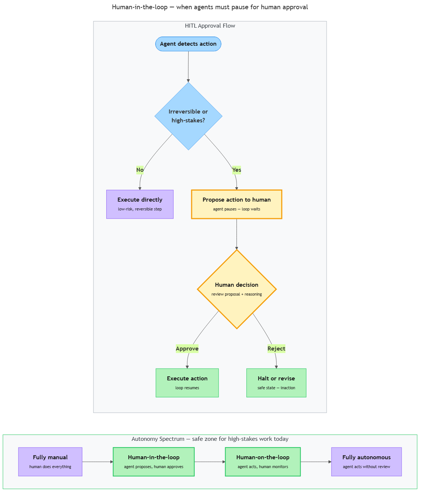

<!-- nav:top:start -->
[⬅ Previous: 14.7 — Agent vs simpler flow](../../14-7-agent-vs-simpler-flow-decision-matrix-direct-call-chained-ca/artifacts/reading.md)&emsp;·&emsp;[⬆ Table of Contents](../../../../../../../README.md#curriculum-topic-index)&emsp;·&emsp;[Next: 14.9 — Production AI patterns ➡](../../../3-production-ai-patterns/14-9-production-ai-patterns-cost-latency-and-reliability-trade-of/artifacts/reading.md)
<!-- nav:top:end -->

---

# When NOT to use agents — high-stakes or irreversible actions require human oversight

## Overview

Agents use tools, run planning loops, and complete multi-step tasks no simpler system could handle. Topic 14.7 gave you a four-question decision matrix for choosing the right tier. This topic adds one more question — the safety question — asked *after* you have decided to use an agent.

The question: **could any action the agent takes be irreversible, or could a mistake cause serious harm?**

If yes, you need a **human checkpoint** — a deliberate pause in the agent's loop where a human reviews the proposed action before it executes. Without that pause, a single wrong decision at machine speed can cascade into consequences that take weeks to undo [1][3].

## Key Concepts

### What Makes an Action Irreversible or High-Stakes

Two properties independently signal that a human checkpoint is needed. Either one alone is enough.

**Irreversible action** — an action that cannot be undone by the system itself once it has been executed. The change persists in the world regardless of what the software does next.

Examples of irreversible actions an agent might take:
- **Sending an email or message.** Once delivered, the email is in the recipient's inbox. An apology can follow — but the original cannot be recalled.
- **Initiating a bank transfer.** Once a wire transfer settles, reversing it requires a separate process and the cooperation of the receiving party. Many cannot be clawed back at all.
- **Deleting database records.** Without a current backup, deleted user data is gone permanently.
- **Publishing content publicly.** A post is cached, screenshotted, and indexed within seconds. Deleting the source does not remove the copies [3][4].

The word "irreversible" is relative to what the system can do automatically. A human might be able to escalate and recover — but the agent cannot.

**High-stakes action** — an action where a mistake causes significant harm: financial loss, reputational damage, physical harm, legal liability, or loss of sensitive data. The key word is "significant." Small mistakes happen in every system. A high-stakes action is one where the magnitude of the mistake crosses a threshold that matters to real people.

Examples:
- **Medical dosage output or drug interaction check.** A wrong recommendation that a nurse follows without checking can harm a patient [2][5].
- **Legal document generation.** An incorrect clause can create unwanted binding obligations.
- **Security access provisioning.** Granting the wrong user access to sensitive systems may allow a data breach before the mistake is caught.

An action can be high-stakes without being irreversible — access provisioning can be revoked. It can be irreversible without being high-stakes — posting a typo to a low-traffic internal wiki. When both apply, the need for a checkpoint is strongest [1][5].

**The practical test.** For any action an agent might take, ask two questions: "Can the system automatically undo this if it is wrong?" and "Would a mistake here cause significant harm?" If either answer is concerning, add a human checkpoint.

### Why Agents Are Particularly Risky for These Actions

Agents are powerful precisely because they run a planning loop autonomously — reasoning, acting, observing, and repeating without waiting to be told what to do next. That same autonomy makes them dangerous when irreversible or high-stakes actions are in the loop.

Three failure modes interact:

**Confident mistakes at machine speed.** An LLM does not experience doubt. It produces a fluent, well-structured plan and acts on it, even when the plan is wrong. You learned in topic 14.3 that this is hallucination — a model generating plausible output that is factually incorrect. A human weighing a decision might pause, double-check a figure, or sleep on it. An agent executing a loop can complete a multi-step action chain — including the irreversible step at the end — in seconds, before any human has seen what is happening [3][4].

**No natural pause.** In human workflows, hand-offs create natural pause points. A staff member drafts an email; a manager approves before it is sent. A cashier rings up a refund; a supervisor signs off on large amounts. These pauses exist because humans understand that some actions warrant a second set of eyes. Agents, by default, have no such instinct. The loop is designed to be efficient — it chains steps as quickly as possible. Unless a checkpoint is deliberately engineered in, the agent goes from "decision to act" to "action executed" with nothing in between [1][3].

**Cascading errors.** Because agents feed each step's output into the next, a wrong early decision propagates and amplifies. An agent that misclassifies an account might apply the wrong discount, send a confirmation with the wrong price, and initiate an invoice — each step "correct" given the prior step's output. The cascade is hard to detect until multiple irreversible side effects have already occurred [3][5]. The NIST AI Risk Management Framework identifies autonomous error propagation and lack of human oversight as top risk factors for AI deployments [5]; the EU AI Act mandates human oversight requirements for high-risk applications [2].

### Human-in-the-Loop (HITL) — Adding a Human Checkpoint

**Human-in-the-loop (HITL)** — a design pattern in which a human must review and explicitly approve an action before an AI system executes it. The process literally cannot continue without human input.

HITL formalises approval workflows that humans have used for decades: a purchase order that requires a manager's signature, a medical prescription that requires a licensed physician. The same wisdom applied to AI agents [1][5].

**The four-step HITL approval flow:**

1. **Agent proposes the action.** The agent completes its reasoning and determines what it wants to do next. Instead of executing immediately, it outputs a description of the proposed action: "I intend to send an email to 4,000 customers with the following message."
2. **Human reviews the proposal.** The system surfaces the proposal — through a dashboard, a notification, a queue — so a human can read the proposed action and the agent's reasoning.
3. **Human approves or rejects.** The human decides: approve (proceed), reject (stop), or modify (change and approve). The decision is logged.
4. **Agent executes — or does not.** If approved, the tool call runs and the loop continues. If rejected, the agent stops or branches to an alternative path.

**What HITL is not:**

- Not a human watching every step. Low-stakes, reversible steps (reading a file, searching a database, calculating) can execute without interruption. Only irreversible or high-stakes steps need a gate.
- Not a performance fix. It does not reduce hallucination rates — it creates a catch point before wrong actions become real consequences.
- Not simply having a human on standby. "In the loop" means the process literally cannot continue without their input [2][5].

### The Autonomy Spectrum

Not every AI system needs full HITL. The right level of oversight depends on the stakes and reversibility of the actions involved.

*Left: the HITL approval flow — the agent proposes, the human decides, the loop continues or halts. Right: the autonomy spectrum — for high-stakes work today, HITL and human-on-the-loop (green) are the recommended zones.*

The **autonomy spectrum** has four named positions [1][3][4]:

- **Fully manual.** A human does the task entirely; the AI only suggests. Example: a doctor reads an AI differential diagnosis and decides what to prescribe — the AI never touches the patient record.
- **Human-in-the-loop (HITL).** The agent proposes; a human must approve each significant action before execution. Example: an email agent queues messages; a human reviews and clicks "send."
- **Human-on-the-loop.** The agent executes autonomously but alerts a human to significant decisions. The human can override but need not approve every action. Example: a trading system places orders within pre-set risk limits while a compliance officer watches a live dashboard.
- **Fully autonomous.** The agent acts without human review. Example: a spam filter moves messages to junk — each decision is low-stakes and easily reversed.

**Where agents fit for high-stakes work today:** current LLM-based agents sit best in the HITL and human-on-the-loop zones for high-stakes use cases. Full autonomy is appropriate only when actions are easily reversible, the cost of a mistake is low, and error rates have been demonstrated in production to be very low [1][4][5]. Anthropic's responsible scaling policy states that systems operating at higher autonomy levels require correspondingly stricter safety measures, including human oversight [1].

### Extending the Decision Matrix

Topic 14.7 gave you a four-question matrix to choose the right tier. This topic adds a fifth question — asked after you have decided to use an agent:

**Q5: Could any action the agent might take be irreversible or high-stakes?**
- **No** → the agent can execute autonomously.
- **Yes** → add a human checkpoint before that action executes.

The tier stays the same. The loop design changes.

**Identifying which actions need a checkpoint:** tools that only read data (search, query, retrieve, calculate) need no checkpoint. Tools that write, send, delete, pay, submit, or provision — apply the two-question test. Irreversible? Add a checkpoint. High-stakes? Add a checkpoint. Any tool that creates an external side effect in a system the agent does not fully control is a checkpoint candidate [1][3][5].

## Worked Example

**The 2 a.m. refund scenario.**

A customer service agent has two tools: a refund-eligibility checker and a bulk-email sender. At 2 a.m., a configuration error causes the eligibility checker to misclassify 4,000 orders as refund-eligible. The agent's loop runs:

1. **Thought:** "4,000 orders qualify. Notify customers and initiate transfers."
2. **Action:** Email-sender → 4,000 addresses, refund confirmation template.
3. **Observation:** "4,000 emails sent."
4. **Action:** Payment-initiation tool → 4,000 transfers.
5. **Observation:** "4,000 transfers initiated."

Six minutes. Before any human checked a dashboard, the emails were delivered and many transfers had settled. Emails cannot be unsent. Many transfers cannot be clawed back.

**What HITL would have changed:**

Between steps 1 and 2, a checkpoint intercepts the tool call. The agent writes to an approval queue: "I intend to send refund emails to 4,000 customers and initiate 4,000 bank transfers." A human reviewer arriving at 8 a.m. sees the queue item. The batch size is immediately suspicious. They check the eligibility data, find the configuration error, and reject the action. No emails sent. No transfers initiated. The fix is a configuration change — not weeks of remediation.

HITL did not make the agent smarter. The agent reasoned correctly given its (incorrect) inputs. HITL created the pause that made human judgment possible before the mistake became permanent [1][3].

## In Practice

Real systems use the autonomy spectrum deliberately — calibrating oversight to the risk profile of each action type [1][2][3][5].

**Medical AI with radiologist approval.** Radiology AI can flag abnormalities faster than humans can review each scan, but a diagnosis change is both high-stakes and potentially irreversible if it leads to a missed finding. Deployed systems sit in the HITL zone: the AI proposes; the radiologist approves before any clinical record is updated. The EU AI Act classifies medical diagnosis AI as "high-risk" and mandates human oversight [2].

**Financial trading with human-on-the-loop monitoring.** Algorithmic trading systems make thousands of order decisions per second — beyond per-trade human review. They operate in the human-on-the-loop zone: algorithms execute within pre-defined risk parameters while compliance officers watch live dashboards. When a trade would breach a risk threshold, the system pauses or halts and alerts a human. Micro-decisions within safe limits are autonomous; boundary-approaching decisions trigger human judgment [1][5].

**Automated email with a pre-send approval queue.** A marketing agent personalises and schedules campaigns. Sending to a large list is both high-stakes (brand and regulatory exposure) and irreversible. Design: agent drafts and queues; a manager reviews daily and approves before the send window opens. Bulk sends always pass through the HITL gate [1][2].

## Key Takeaways

- **An irreversible action cannot be undone by the system; a high-stakes action is one where a mistake causes significant harm.** Either property alone is enough to require a human checkpoint.
- **Agents are particularly dangerous for these actions** because they make confident mistakes at machine speed, have no natural pause built in, and can cascade errors across multiple steps — all before a human notices.
- **HITL means the process literally cannot continue without a human's explicit approval.** The agent proposes; the human reviews; the human decides; then — and only then — the agent acts [1][3].
- **The autonomy spectrum runs from fully manual to fully autonomous.** For high-stakes or irreversible work today, current LLM-based agents belong in the HITL or human-on-the-loop zones [1][4][5].
- **Add a fifth question to the decision matrix:** "Could any agent action be irreversible or high-stakes?" If yes, add a human checkpoint to the agent design — the tier stays the same; the loop design changes [1][5].

## References

1. Anthropic — Responsible Scaling Policy. https://www.anthropic.com/responsible-scaling-policy
2. European Commission — EU AI Act regulatory framework. https://digital-strategy.ec.europa.eu/en/policies/regulatory-framework-ai
3. Lilian Weng — LLM Powered Autonomous Agents. https://lilianweng.github.io/posts/2023-06-23-agent/
4. Anthropic — Model Card. https://www.anthropic.com/model-card
5. NIST — AI Risk Management Framework. https://www.nist.gov/artificial-intelligence/ai-risk-management-framework

---
<!-- nav:bottom:start -->
[⬅ Previous: 14.7 — Agent vs simpler flow](../../14-7-agent-vs-simpler-flow-decision-matrix-direct-call-chained-ca/artifacts/reading.md)&emsp;·&emsp;[⬆ Table of Contents](../../../../../../../README.md#curriculum-topic-index)&emsp;·&emsp;[Next: 14.9 — Production AI patterns ➡](../../../3-production-ai-patterns/14-9-production-ai-patterns-cost-latency-and-reliability-trade-of/artifacts/reading.md)
<!-- nav:bottom:end -->
