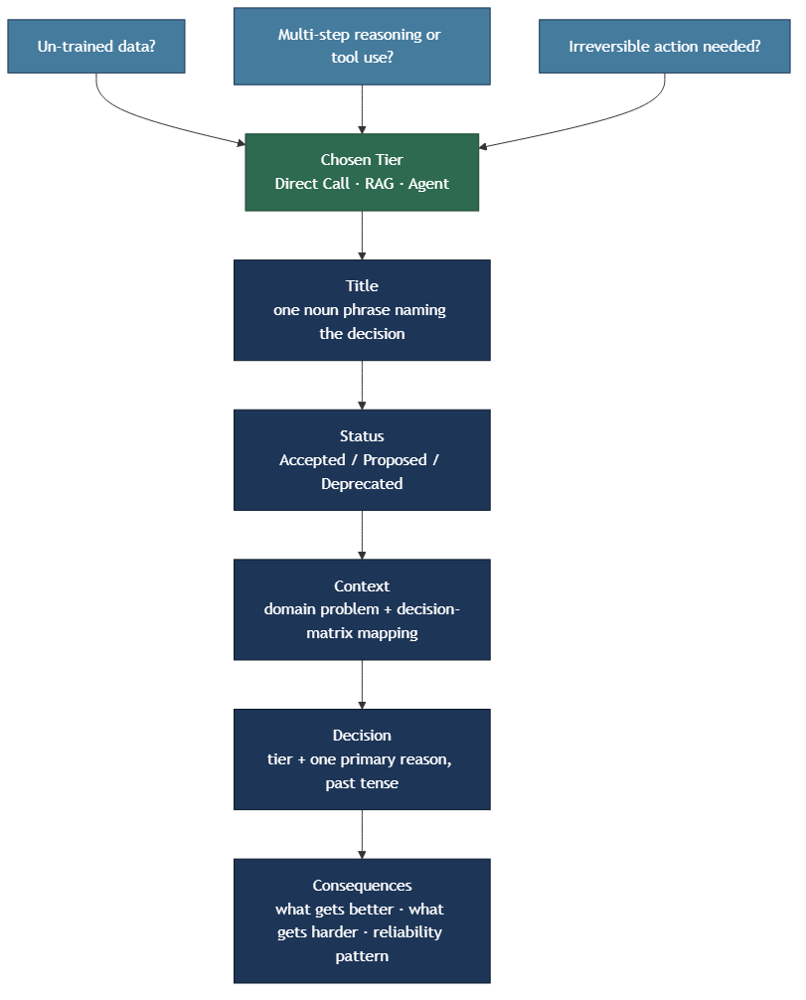

<!-- nav:top:start -->
[⬅ Previous: 14.9 — Production AI patterns](../../14-9-production-ai-patterns-cost-latency-and-reliability-trade-of/artifacts/reading.md)&emsp;·&emsp;[⬆ Table of Contents](../../../../../../../README.md#curriculum-topic-index)&emsp;·&emsp;[Next: 15.1 — Writing a formal problem statement and 1-page specification ➡](../../../../../m6-capstone-project/week-15/1-specification-and-build/15-1-writing-a-formal-problem-statement-and-1-page-specification)
<!-- nav:top:end -->

---

# Writing an architectural decision — choosing the right pattern for your system

## Overview

You have spent week 14 learning what RAG, agents, and direct LLM calls do, when each one fits, and what each one costs in tokens, latency, and complexity. That knowledge is useful only if you can record it in a form that survives after you leave the project. An **ADR (Architectural Decision Record)** is the professional standard for doing exactly that — a short, plain-text document that answers the question: "Why did we choose this AI pattern, and what does it cost us?" [4] This topic shows you how to write one.

## Key Concepts

### What is an ADR?

An **ADR (Architectural Decision Record)** is a short document that captures one significant design decision — what was chosen, why, and what the consequences are [4].

The format was created by Michael Nygard in 2011 [4]. The core insight: code shows you *what* a system does, but it rarely shows you *why* it was designed that way. When a new engineer joins six months later and asks "why are we using RAG here instead of just calling the model directly?", a good ADR answers that question in two minutes.

Three rules make ADRs useful:

- **One decision per record.** Each ADR covers exactly one design choice.
- **Plain text, version-controlled.** ADRs live in a folder (typically `docs/decisions/`) in your source-code repository, alongside the code [1].
- **Append-only.** When a decision changes, you write a new ADR that supersedes the old one — you never edit the original [4].

AWS recommends ADRs as mandatory for any component maintained by more than one engineer [2].

### The five-section template

Every ADR has five sections, always in this order [1][4]:

| Section | What it contains |
|---|---|
| **Title** | A short noun phrase naming the decision. |
| **Status** | One word: Proposed, Accepted, Deprecated, or Superseded. |
| **Context** | The problem you were facing and the constraints. |
| **Decision** | What you chose to do. Written in past tense: "We decided to…" |
| **Consequences** | What changes as a result — what gets better and what gets harder. |

*The three questions from the 14.7 decision matrix map onto the Context section; the chosen tier maps onto Decision; the cost–latency–quality trade-off maps onto Consequences.*

### Writing the Context section

The **Context section** describes the problem your system is solving and the constraints that ruled out other options [3][5].

For an AI system, answer these three questions from the decision matrix (topic 14.7):

1. What is the domain problem? (one sentence)
2. Is the answer in data the model was never trained on? If yes, RAG is a candidate.
3. Does answering require multi-step reasoning, tool use, or taking actions? If yes, an agent is a candidate.

Here is the difference between a weak and a strong Context:

- **Weak:** "We needed to pick an AI pattern."
- **Strong:** "The system must answer questions about our company's internal HR policies, which change quarterly and are not part of any public dataset. The system must not take actions — it only provides answers."

The strong version gives a future reader enough detail to understand why the other options were not chosen.

### Writing the Decision section

The **Decision section** names the tier you chose and gives the primary reason [3].

Structure: "We decided to use [tier name] because [primary reason in one sentence]."

Two rules:

- Use past tense. ADRs record completed decisions.
- Give one primary reason. If you list five reasons, the reader cannot tell which was decisive [5].

### Writing the Consequences section

The **Consequences section** names the trade-offs your choice introduces [2][3]. This section must name both what gets better *and* what gets harder — a Consequences section that only lists benefits is incomplete [5].

Use the cost–latency–quality triangle from topic 14.9 as your frame:

| Tier | What gets better | What gets harder |
|---|---|---|
| Direct call | Lowest cost and latency | No access to private or current data |
| RAG | Grounded answers, reduced hallucination | Higher cost per request, longer latency |
| Agent | Can complete multi-step tasks | Highest cost, unpredictable loop count, harder to test |

Name one reliability pattern you will need — streaming, prompt caching, circuit breaker, or HITL — depending on the tier chosen.

## Worked Example

The following is a complete ADR for a university FAQ chatbot. Read it section by section and match each part to the template above.

---

**ADR-001: Use RAG for university FAQ chatbot**

**Status:** Accepted

**Context:**
Students ask questions about university policies, admissions deadlines, course registration, and financial aid. These policies change each semester. The answers are not part of any publicly available training dataset. The system only needs to retrieve and present information — it does not take any actions on behalf of the student. Response time under 3 seconds is a requirement. The cost per question must stay below $0.01 to fit the department budget.

**Decision:**
We decided to use a RAG (Retrieval-Augmented Generation) pipeline backed by a vector database of university policy documents, with a mid-tier language model for generation. RAG was chosen because the answers depend on internal documents that no model has been trained on, and the system does not need multi-step reasoning or tool use.

**Consequences:**
Answers will be grounded in the actual policy documents, which reduces hallucination compared to a direct call. Each request will cost more than a direct call because it requires an embedding step and a similarity search before generation. To keep latency within the 3-second target, we will use streaming for the generation step. We will need to monitor retrieval quality and set up re-indexing when policy documents are updated.

---

Notice the pattern: Context answers the three decision-matrix questions. Decision names the tier in one sentence with one primary reason. Consequences names something better, something harder, and one reliability mechanism (streaming).

The side-by-side table below shows how the same template skeleton shifts when a different tier is chosen:

| Section | Direct call | RAG | Agent |
|---|---|---|---|
| Title | "Use direct LLM call for …" | "Use RAG for …" | "Use ReAct agent for …" |
| Context | Answer is in the model's trained knowledge; no private data; no actions needed. | Answer depends on un-trained private data; retrieval is the bottleneck. | Task requires multi-step reasoning, tool calls, or taking actions. |
| Decision | "…because the model already knows the domain and no retrieval is needed." | "…because the answers depend on internal documents the model was never trained on." | "…because completing the task requires calling external tools in sequence." |
| Consequences | Lowest cost and latency; risk of stale answers if domain changes. | Grounded answers; higher cost; must monitor retrieval quality and re-index when documents change. | Most capable; highest cost; must cap loop iterations; consider HITL for irreversible actions. |

## In Practice

Professional teams follow these conventions when managing ADRs [1][2]:

- **Store ADRs in source control.** A folder like `docs/decisions/` keeps the decision history version-controlled alongside the code. Tools like the `adr` CLI (adr.github.io) scaffold new records from a template [1].
- **Date and status every ADR.** Without a date, a reader cannot tell whether the decision is recent or five years old [2].
- **Never delete a superseded ADR.** Write a new record that says "This supersedes ADR-003" and mark the old one Superseded. The history is valuable.
- **AI-specific additions.** Some teams add a "model tier" field and an "estimated cost per request" field to their AI ADRs [3]. These are optional extensions on top of the five standard sections.
- **Write for the future teammate who was not in the room.** Every word in the ADR should help someone who has no context understand the decision [5].

## Key Takeaways

- An **ADR (Architectural Decision Record)** is a short plain-text document that records one design decision — what was chosen, why, and what it costs [4].
- Every ADR has five sections in order: **Title, Status, Context, Decision, Consequences** [1].
- The **Context section** maps the domain problem onto the decision matrix from topic 14.7 — answer whether private data is involved and whether multi-step actions are needed [3].
- The **Decision section** names the tier in one past-tense sentence with a single primary reason [5].
- The **Consequences section** must name both what gets better and what gets harder, using the cost–latency–quality triangle from topic 14.9, and must name one reliability pattern [2][3].

## References

1. adr.github.io — canonical ADR format and CLI tooling. https://adr.github.io
2. AWS Prescriptive Guidance — Architectural Decision Records. https://docs.aws.amazon.com/prescriptive-guidance/latest/architectural-decision-records/welcome.html
3. Chip Huyen — *AI Engineering* (O'Reilly) — AI system design decision records.
4. Michael Nygard — "Documenting Architecture Decisions" (Cognitect blog, 2011). https://cognitect.com/blog/2011/11/15/documenting-architecture-decisions
5. Martin Fowler — "Scaling Architecture Conversationally." https://martinfowler.com/articles/scaling-architecture-conversationally.html

---
<!-- nav:bottom:start -->
[⬅ Previous: 14.9 — Production AI patterns](../../14-9-production-ai-patterns-cost-latency-and-reliability-trade-of/artifacts/reading.md)&emsp;·&emsp;[⬆ Table of Contents](../../../../../../../README.md#curriculum-topic-index)&emsp;·&emsp;[Next: 15.1 — Writing a formal problem statement and 1-page specification ➡](../../../../../m6-capstone-project/week-15/1-specification-and-build/15-1-writing-a-formal-problem-statement-and-1-page-specification)
<!-- nav:bottom:end -->
