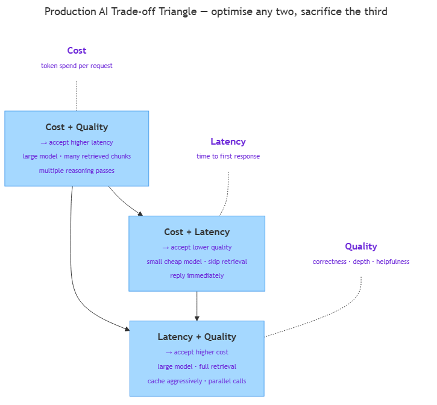

<!-- nav:top:start -->
[⬅ Previous: 14.8 — When NOT to use agents](../../../2-ai-agents/14-8-when-not-to-use-agents-high-stakes-or-irreversible-actions-r/artifacts/reading.md)&emsp;·&emsp;[⬆ Table of Contents](../../../../../../../README.md#curriculum-topic-index)&emsp;·&emsp;[Next: 14.10 — Writing an architectural decision ➡](../../14-10-writing-an-architectural-decision-choosing-the-right-pattern/artifacts/reading.md)
<!-- nav:top:end -->

---

# Production AI patterns — cost, latency, and reliability trade-offs

## Overview

A demo that works on your laptop is not the same as a product that works for thousands of users. When you move an AI system into production, three new questions appear: what does each request cost, how quickly does the user get an answer, and what happens when something goes wrong? This topic gives you the conceptual tools to answer all three — so that when you choose between a direct call, a RAG pipeline, and an agent loop, you understand the production implications, not just the capability ones [1][3].

## Key Concepts

### The token cost model

Every call to a commercial LLM is billed by **tokens** — the small chunks a model uses to read and write text. One token is roughly four characters, or about three-quarters of a word in English [1][2].

Two types of tokens appear on your bill:

- **Input tokens** — everything you send in the prompt: system instructions, retrieved documents, the user's question, and any prior conversation. These are the cheaper type.
- **Output tokens** — the words the model writes back. Because generating text requires more compute than reading it, output tokens cost 2×–5× more than input tokens [2][3].

The tier you choose directly determines how many tokens you spend per request:

| Tier | Token profile | Relative cost |
|---|---|---|
| Direct call | Short prompt + short answer | Cheapest (fractions of a cent) |
| RAG call | Short prompt + retrieved chunks (e.g. +5,000 tokens) + answer | Moderate — bounded by chunk count |
| Agent loop | Full history × number of loop iterations × N sequential calls | Most expensive — cost compounds |

**Model tiers** add a second cost lever. A smaller, cheaper model may cost 10–50× less per token than the largest model in a family. For tasks that do not need deep reasoning — classification, short-text summarisation — a small model is often good enough [2][3].

### Latency — TTFT and streaming

**Latency** is the time between sending a request and receiving a usable response. Two measures matter separately [1][2]:

- **TTFT (time to first token)** — how long until the very first word of the response arrives. This is what users feel as "response lag." A long TTFT makes the system feel frozen, even if the full answer is on its way.
- **Total completion time** — how long until the final word arrives. This matters for long responses (a full document, a multi-paragraph explanation).

**Streaming** narrows the gap between the two. Instead of waiting until the entire response is ready, the server sends tokens to the client as it generates them — like a typewriter printing one word at a time. TTFT stays the same, but the user starts reading immediately. The experience feels faster even though nothing about the underlying model changed [2][3].

Latency grows as you move up the tiers:

- **Direct call** — one LLM call; latency scales with output length and model size.
- **RAG call** — embedding the query + vector search + one (larger) LLM call. Embedding and search are fast (milliseconds); the bigger prompt makes inference slightly slower.
- **Agent loop** — N sequential LLM calls plus the latency of each tool call. Latencies add up; agent loops are the slowest tier [1][3].

### The cost–latency–quality triangle

*The triangle shows that optimising for any two of cost, latency, and quality typically requires accepting a trade-off on the third.*

The three axes of every production AI decision are cost, latency, and quality. The central constraint is: **you can optimise for any two, but rarely all three at once** [1][3].

| Priority pair | What you get | What you give up |
|---|---|---|
| Cost + Quality | Accurate, affordable answers | Slow — large model, full retrieval |
| Cost + Latency | Fast, cheap responses | Lower quality — small model, no retrieval |
| Latency + Quality | Fast and accurate | Expensive — large model, full caching and parallelism |

"Just use the biggest model" is not a production strategy. It answers the quality axis but ignores cost and latency — both of which matter the moment you have real users [1][3].

### Cost reduction strategies

Two strategies reduce token cost without changing what you build:

1. **Prompt caching** — LLM APIs let you cache the stable part of a prompt (system instructions, a fixed document corpus). Cached tokens are re-processed at a lower rate. For RAG systems where the same documents appear in many prompts, this cuts input costs significantly [2][3].

   *Trade-off:* the cached prefix must stay stable. If the prefix changes often, the cache misses and you pay the full rate anyway.

2. **Model tier routing** — route simple requests to a smaller, cheaper model and hard requests to the larger one. A lightweight classifier decides which tier to use for each request [1][3].

   *Trade-off:* the routing step adds a small latency and cost. Routing a hard question to the wrong (weak) model produces a bad answer.

### Reliability failure modes and patterns

Production AI systems fail in ways that never appear in demos. Three failure modes are especially common [1][3][4]:

**Rate limits.** APIs enforce a maximum number of requests and tokens per minute. Traffic spikes can push you over the limit; the API returns an error and the user sees silence.

- *Pattern — exponential backoff with jitter.* On a rate-limit error, wait before retrying. Double the wait on each failure (1 s → 2 s → 4 s → 8 s). Add a small random **jitter** (a slight random delay) to each wait time so that multiple clients do not all retry at the same instant — a problem called a **thundering herd** [3].

**Context window overflow.** Every LLM has a **context window** — the maximum tokens it can process in one call (input + output). If a RAG pipeline injects too many chunks, or an agent loop accumulates too much history, the token count exceeds the limit and the call fails [1][2][3].

- *Pattern — context window management.* Cap retrieved chunks at a safe number. For agent loops, keep only the most recent exchanges or periodically summarise older history into a compressed form.

**LLM service downtime.** External APIs experience outages. A system that depends on a single provider has a single point of failure.

- *Pattern — fallback model with circuit breaker.* Configure a secondary LLM from a different provider. A **circuit breaker** monitors failure counts: after a threshold of consecutive failures on the primary, it "opens" and routes all traffic to the fallback automatically — without retrying the failing primary on every request [3][4].

## Worked Example

A student asks an AI assistant: **"What are the current tuition fees at my university?"**

Here is how the same question plays out at each tier:

**Direct call**

1. The question goes straight to the LLM with a brief system prompt.
2. The model answers from its training data.
3. Tuition fees change yearly. The model's training data is months or years old.
4. Result: fast, cheap — but the answer may be stale. Quality is at risk.

**RAG call**

1. The query is embedded and similarity search finds the current tuition page in the university's document store.
2. The retrieved page (approximately 5,000 input tokens) is injected into the prompt.
3. The model now has current data and produces a correct answer.
4. Result: input token cost increases by roughly $0.005 for those extra tokens. Latency adds ~100–200 ms for embedding and vector search. Quality improves significantly [1][2].

**Agent loop**

1. The agent retrieves the tuition page (call 1), then decides to check the financial aid page too (call 2), then cross-references both to confirm the net cost (call 3).
2. Each call passes the full history of previous results as context — token count grows with each step.
3. Result: the most thorough answer, but 3× the LLM calls, 3× the latency, and compounding token cost.

**Mapping to the triangle:**

| Tier | Cost | Latency | Quality |
|---|---|---|---|
| Direct | Low | Fast | Risky (stale data) |
| RAG | Moderate | Moderate | Good |
| Agent | High | Slow | Best |

For a simple fee lookup, the RAG call hits the best cost–latency–quality balance. The agent loop is overkill for one factual question; it makes sense only when the task genuinely requires cross-referencing multiple sources [1][3].

## In Practice

**Enterprise chat assistants — tiered routing**

Large enterprise copilots route requests by complexity. Autocomplete and short factual queries go to a small model (response under one second, low cost). Complex document questions — "summarise this 40-page policy and flag the sections that changed since last quarter" — route to the large model. The routing logic might be a character-count heuristic or a lightweight classifier. Average cost drops significantly compared to sending everything to the most capable model [1][3].

**Long-running agents — context window management**

An agent that runs for many iterations accumulates tool results, observations, and prior reasoning steps. A well-designed agent pipeline monitors the running token count and, when it approaches the context window limit, summarises the oldest portion of the history before adding new observations. This keeps the agent functional across long tasks without hitting overflow errors [1][2].

**Production RAG — fallback chains**

A production RAG system may have three layers of defence when the primary LLM provider is down:

1. Retry against the primary with exponential backoff.
2. Fall back to a secondary provider if the primary is still failing.
3. Serve a cached response from the last successful request for the same query pattern.

Each level trades a little quality or freshness for availability. The goal is **graceful degradation** — the system keeps serving users at reduced quality rather than going completely offline [3][4].

**Best-practice checklist**

- Measure token cost per request before optimising — you cannot reduce what you have not measured [1][3].
- Default to streaming for any user-facing response; the perceived latency gain is significant for minimal engineering cost [2][3].
- Set hard context window limits in your RAG pipeline — a runtime overflow error is worse than a slightly less thorough answer [1][2].
- Use exponential backoff with jitter; most official SDK libraries implement this by default — use the library, not hand-rolled retry logic [3].

## Key Takeaways

- **Every LLM call is billed by input + output tokens.** Direct calls are cheapest; RAG calls are moderate (more input tokens); agent loops are the most expensive tier (multiple sequential calls plus accumulated history).
- **TTFT (time to first token) is what users feel as "response lag."** Streaming closes the gap between TTFT and total completion time and is the standard for user-facing production responses.
- **Prompt caching and model tier routing are the main cost reduction levers.** Caching requires a stable prompt prefix; routing requires a correct routing layer — both introduce a trade-off.
- **Three reliability patterns cover the most common production failure modes:** exponential backoff with jitter for rate limits, context window management for overflow, and fallback models with a circuit breaker for provider downtime.
- **Cost, latency, and quality form a triangle — you can optimise two, rarely all three.** Making these trade-offs explicit per user-facing flow is better engineering than letting them emerge by accident.

## References

[1] Chip Huyen — *AI Engineering* (O'Reilly). Chapters on production AI systems, cost modelling, and reliability patterns.

[2] Anthropic — *Build with Claude* documentation. https://docs.anthropic.com/en/docs/build-with-claude

[3] OpenAI — *Production best practices*. https://platform.openai.com/docs/guides/production-best-practices

[4] Google Cloud — *MLOps: Continuous delivery and automation pipelines in machine learning*. https://cloud.google.com/architecture/mlops-continuous-delivery-and-automation-pipelines

---
<!-- nav:bottom:start -->
[⬅ Previous: 14.8 — When NOT to use agents](../../../2-ai-agents/14-8-when-not-to-use-agents-high-stakes-or-irreversible-actions-r/artifacts/reading.md)&emsp;·&emsp;[⬆ Table of Contents](../../../../../../../README.md#curriculum-topic-index)&emsp;·&emsp;[Next: 14.10 — Writing an architectural decision ➡](../../14-10-writing-an-architectural-decision-choosing-the-right-pattern/artifacts/reading.md)
<!-- nav:bottom:end -->
