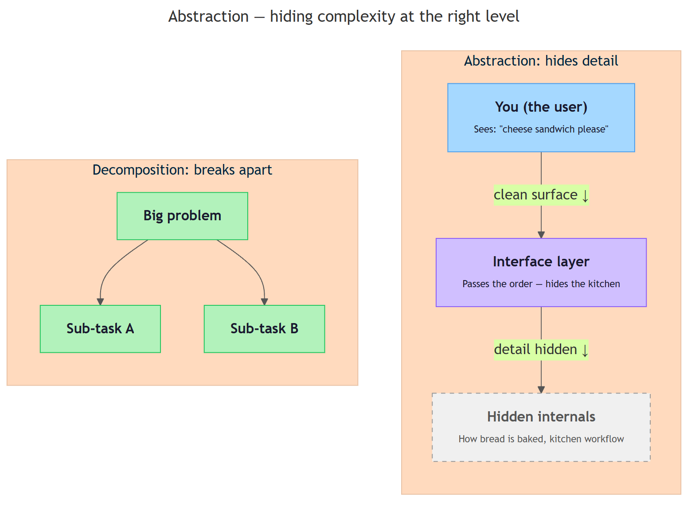

<!-- GENERATED FILE — DO NOT EDIT BY HAND.
     Cresent view of 9.1 — Core Computational Thinking Skills.
     Source of truth: CIT 1.5, CIT 1.6, CIT 2.4.
     Regenerate: python Cresent/Technical/tools/generate_shared_readings.py -->
<!-- nav:top:start -->
Previous: [⬅ 8.5 — Human vs Machine Problem-Solving](../../../week-8/1-computational-thinking-kickoff/8-5-human-vs-machine-problem-solving/reading.md)&emsp;·&emsp;[⬆ Table of Contents](../../../../../../README.md#part-b)&emsp;·&emsp;[9.2 — Expressing Logic ➡](../9-2-expressing-logic/reading.md)
<!-- nav:top:end -->

---

# Decomposition — breaking a big problem into smaller solvable parts

## Overview

When you are asked to "plan a party," those three words hide dozens of decisions and actions. Trying to think about all of them at once feels overwhelming — and a computer program faces an even bigger obstacle, because it cannot act on a vague instruction at all. Decomposition is the strategy of breaking a large, complex problem into smaller, focused, manageable parts so that each part can be solved on its own [1]. It is one of the four pillars of computational thinking, the problem-solving style you were introduced to in Topic 1.1 — and it is the bridge between a human idea and a set of defined steps a computer can follow.

## Key Concepts

### What decomposition means

**Decomposition** — breaking a large problem into smaller parts that are easier to understand, plan, and solve [1]. When every smaller part is completed, the original problem is solved. Each smaller part should be:

- **Focused** — it deals with one clear thing, not everything at once.
- **Manageable** — a person or program can work on it without holding the entire original problem in mind.
- **Completable** — when all parts are done, the big problem is fully solved.

### Why big problems are hard without decomposition

Think about trying to read every word on every page of a textbook at the same time — you cannot. You read one page, then the next. That is natural decomposition. Complex problems are hard for similar reasons [1][2]:

- Too many things to keep in mind at once.
- No clear starting point.
- One part becomes tangled with another.
- Errors spread, and tracing them back is difficult.

When you break a problem into parts, each part is small enough to focus on, you have a natural starting point, and if something goes wrong you know which part caused it [2][3].

### The task tree — showing decomposition visually

When you decompose a problem, the result is often drawn as a **task tree** — a diagram that looks like an upside-down tree [1]. The original problem sits at the top. Below it, the first level of smaller pieces branches out. Each piece can branch further until every item at the bottom is concrete and doable.


*Figure: A task tree for 'Plan a party'. Each level breaks the problem into smaller parts until every item at the bottom is concrete and doable.*

The terms used to describe a task tree are [1][2]:

| Term | Plain meaning |
|---|---|
| **Root** | The original, big problem at the top of the tree |
| **Sub-task** | A smaller part that the root or a higher-level task breaks into |
| **Leaf** | A task at the bottom with no further breakdown — something you can act on directly |
| **Level** | One row of the tree; tasks at the same level are roughly the same size |

### What makes a good decomposition

Not every breakdown of a problem is useful. A good decomposition [1][2][3]:

- **Covers everything.** No part of the original problem is left out. Completing every leaf task solves the whole problem.
- **Has no significant overlap.** Two sub-tasks should not both try to do the same thing.
- **Produces parts that are the right size.** Parts still too big need further breakdown; parts so tiny they are trivial probably do not need their own entry.
- **Makes dependencies visible.** Some parts must be done before others can start (you cannot write invitations before knowing the date).

A poor decomposition leaves gaps, uses vague sub-tasks that are barely clearer than the original problem, groups unrelated things together, or ignores the order in which parts depend on each other [2].

### Decomposition is iterative

**Iterative** means you do something, review the result, adjust, and repeat. You will rarely get a decomposition right on the first try — that is normal and expected [1][2]. Each pass, you ask whether each sub-task is clear enough to act on. If not, you break it down further. Even experienced engineers revise their decomposition as they learn more about a problem [1][3].

### Why computers need decomposition

You saw in Topic 1.1 that computation requires defined steps. A program cannot act on "plan a party" — it needs every step to be precise and unambiguous. Decomposition is the thinking work that produces those steps before any code is written [1][2]. This is why decomposition is taught before programming: if you cannot describe a problem in small, clear pieces, you cannot write a program to solve it.

## Worked Example

**Problem: "Build a simple website for a local library."** [2]

Follow these six steps:

1. **Write the problem in one sentence.**
   > Build a simple website for a local library.

2. **List the two to five major parts.**
   - Decide what the website needs to do
   - Design the layout and look
   - Write the content (text and images)
   - Build the site technically
   - Test and publish the site

3. **Check each part — is it small enough to act on directly?**
   "Decide what the website needs to do" is still large. Break it further:
   - Talk to library staff about what they need
   - List the features the site must have
   - Decide what the site will NOT include

4. **Check for completeness.** Does completing all parts result in a published, working library website? Yes [1].

5. **Check for overlap.** "Write the content" and "Design the layout" might overlap on images. Clarify: design handles placement; content writing handles what text and which images to use [2].

6. **Order the tasks.** "Decide what the website needs to do" must happen first. "Test and publish" must happen last. The others can proceed in parallel [1].

You now have a decomposed plan you could hand to a team — or use as the structure for a program [1][2].

## In Practice

Decomposition appears across many fields, not just software [3]:

- **Software development.** Projects are broken into features, features into user stories, user stories into tasks — the entire practice of software project management is applied decomposition [1][2].
- **Recipes.** "Make a chocolate cake" becomes: make the batter, bake it, make the frosting, assemble. Each step at the bottom is a concrete, doable action [3].
- **Medical procedures.** A complex operation is staged: anaesthesia, incision, repair, closure, recovery plan — each with its own specialist and checklist [2][3].
- **AI system design.** Engineers decompose an AI build into: data collection, cleaning, training, evaluation, deployment, monitoring. The final system is the result of completing every part [1][3].

**Best practices to remember:**

- Start with the problem statement, not the solution — a vague problem gives a vague decomposition [1].
- Stop decomposing when a task is concrete and doable; over-decomposing adds noise without clarity [2][3].
- Name tasks with verbs: "Choose a venue," not "Venue" — verb-first naming makes it clear what must be done [2].
- Make dependencies explicit so you can avoid bottlenecks [1][3].
- Revisit and revise as you learn more about a problem; decomposition is a working document, not a contract [1].

## Key Takeaways

- **Decomposition is the strategy of breaking a large problem into smaller parts.** Each part is focused, manageable, and solvable on its own — completing all the parts solves the original problem [1][2].
- **Task trees make decomposition visible.** The original problem sits at the root; sub-tasks branch below it; leaf tasks at the bottom are concrete enough to act on directly [1][3].
- **A good decomposition covers everything, avoids overlap, and makes dependencies clear.** A poor decomposition leaves gaps, uses vague sub-tasks, or ignores order [2].
- **Decomposition is iterative.** Refining it as you learn more is normal and expected [1][2].
- **Computers require defined steps.** Decomposition is the thinking work that produces those steps before any program is written [1].

## References

1. OpenStax. *Introduction to Computer Science*, Section 2.1 — Computational Thinking. https://openstax.org/books/introduction-computer-science/pages/2-1-computational-thinking
2. GeeksforGeeks. *What is Decomposition in Computational Thinking?* https://www.geeksforgeeks.org/computer-science-fundamentals/what-is-decomposition-computational-thinking/
3. Learning.com. *Decomposition in Computational Thinking.* https://www.learning.com/blog/decomposition-in-computational-thinking/

---

# Abstraction — hiding complexity at the right level

## Overview

When you press the accelerator in a car, the car speeds up. You do not need to know anything about fuel injectors, pistons, or exhaust valves. The designers hid all of that detail behind a single pedal. That hiding of unnecessary detail is called **abstraction** — and it is one of the four pillars of computational thinking. Abstraction works alongside decomposition (Topic 1.5): decomposition breaks a problem into parts, and abstraction keeps each part simple enough to work with by hiding the detail you do not need right now [1][3].


*Abstraction — hiding complexity at the right level*

## Key Concepts

### What abstraction means

**Abstraction** — the practice of removing or hiding details that are not needed for a particular purpose, so you can focus on what matters [1].

The key phrase is "for a particular purpose." There is no single right level of detail. The level that is right depends on who is asking and what they need to do [2][3].

Here is a plain test you can use: ask yourself, "What does this person need to know to do their job? What would slow them down or confuse them?" Hide the second thing. Show the first [1].

### Why layers of abstraction make complex systems manageable

Real systems are complicated. A modern city has millions of pipes, cables, and roads. A large software system has millions of lines of code. No one can hold all of that in mind at once.

Abstraction solves this by creating **layers**. Each layer hides the detail of the one below it and exposes only a clean, simple surface to the layer above [1][2].

The diagram below shows how this works — and how it differs from decomposition.

```mermaid
---
title: "Abstraction — hiding complexity at the right level"
config:
  theme: base
  themeVariables:
    primaryColor: "#a5d8ff"
    primaryBorderColor: "#4a9eed"
    lineColor: "#555"
  flowchart:
    htmlLabels: true
    curve: basis
---
flowchart TB

  subgraph LAYERS["Abstraction: hides detail"]
    direction TB
    USER["<b>You (the user)</b><br/><span style='font-size:11px;color:#6d28d9'>Sees: "cheese sandwich please"</span>"]
    IFACE["<b>Interface layer</b><br/><span style='font-size:11px;color:#6d28d9'>Passes the order — hides the kitchen</span>"]
    INTERN["<b>Hidden internals</b><br/><span style='font-size:11px;color:#6d28d9'>How bread is baked, kitchen workflow</span>"]

    USER -->|"clean surface ↓"| IFACE
    IFACE -->|"detail hidden ↓"| INTERN
  end

  subgraph DECOMP["Decomposition: breaks apart"]
    direction TB
    ROOT["<b>Big problem</b>"]
    SUBA["<b>Sub-task A</b>"]
    SUBB["<b>Sub-task B</b>"]

    ROOT --> SUBA
    ROOT --> SUBB
  end

  classDef primary fill:#a5d8ff,stroke:#4a9eed,color:#1a1a2e
  classDef secondary fill:#d0bfff,stroke:#8b5cf6,color:#1a1a2e
  classDef hidden fill:#F0F0F0,stroke:#999,color:#555,stroke-dasharray: 5 5
  classDef done fill:#b2f2bb,stroke:#22c55e,color:#1a1a2e

  class USER primary
  class IFACE secondary
  class INTERN hidden
  class ROOT,SUBA,SUBB done
```

*Abstraction stacks layers — each layer hides detail from the one above it — while decomposition splits a problem sideways into sub-tasks.*

### The "right level" — not too much detail, not too little

Choosing the right level is the hardest part of abstraction. Both extremes cause problems.

| Situation | What goes wrong |
|---|---|
| **Too much detail** | You explain semiconductor physics to a driver who just wants to know when to stop. Accurate, but useless. |
| **Too little detail** | You tell an electrical engineer "red means stop, green means go." They needed circuit diagrams and fault conditions. |
| **Right level** | You match the detail you show to the question being asked and the person asking it [1][3]. |

### How abstraction produces a model

A useful way to think about what abstraction creates: it produces a **model**.

**Model** — a simplified version of something real, built to be useful for a particular purpose.

A map is a model of a city. It does not show every tree or drainpipe. It shows what you need to navigate. A weather forecast is a model of the atmosphere — it cannot predict every gust of wind, but it can tell you to bring an umbrella [1][3].

A model hides detail on purpose. That is not a flaw — it is the model's job. The test of a good model is whether it is useful for its stated purpose, not whether it is complete [2].

### What a leaky abstraction looks like

**Leaky abstraction** — an abstraction that promises to hide detail but forces that detail back on the user in practice.

Here is an everyday example. A travel booking site promises "one-click booking." You click once. Then it asks for your passport number, seat preference, meal choice, emergency contact, and frequent flyer number — one page at a time. The promise ("one click") did not hold. The hidden complexity leaked back through.

A good abstraction hides details the user genuinely does not need. It does not hide things the user will immediately need to supply anyway [1][3].

### How abstraction and decomposition work together

You met **decomposition** in Topic 1.5. The two ideas do different jobs and work best together [1][2].

| | Decomposition | Abstraction |
|---|---|---|
| **The question it answers** | "What are the parts of this problem?" | "What details matter for this purpose?" |
| **The output** | A task tree — a list of sub-tasks | A model — fewer details, same essential shape |
| **When you use it** | To understand the structure of a problem | To manage the complexity of each part |

Decompose first, then abstract. Before you have broken the problem into parts, you do not yet know what the parts are — and you cannot hide detail inside a part you have not identified yet [1][2].

## Worked Example

Here is a step-by-step example of choosing the right level of abstraction [1][2][3].

**Situation:** You are writing a guide to using a library's online catalogue.

1. **Name the user and the task.** A student who wants to find a book by title and check whether it is available.

2. **List all the details involved.** The database query language, how records are indexed, what "on loan" means, how to reserve a book, how late fees work, the library's acquisition process.

3. **For each detail, ask: "Does the user need this to complete their task?"**
   - "What does 'on loan' mean?" — yes, the student needs this. Keep it.
   - "Database query language" — no. Hide it.
   - "How to reserve a book" — yes. Keep it.
   - "How late fees work" — a short summary is useful. Keep a summary.
   - "Library's acquisition process" — no. Hide it.

4. **Write the abstraction.** A guide that shows how to search by title, read availability status, and place a hold request. No mention of database internals.

5. **Check for leaks.** Walk through the guide as the student. Is there any moment you reach for a hidden detail? If not, the abstraction holds.

6. **Revisit when the audience changes.** If the audience were a librarian configuring the system, the right level would be completely different [1][2][3].

## In Practice

Abstraction shows up everywhere — not just in computing.

- **Maps.** A road map hides building floor-plans and underground utilities. A tube or metro map distorts distances deliberately, because what a passenger needs is the sequence of stations, not exact geography [1][3].
- **Recipes.** "Bring to a boil" hides the molecular physics of water at 100°C. It shows the cook exactly what they need: a visual cue and an action [3].
- **App buttons.** The "Delete" button hides a sequence of background operations. The designer chose the right level so you can use the app without being a software engineer [1][2].
- **Scientific models.** The school-level model of the atom — nucleus with electrons orbiting it — is an abstraction. It is not physically complete, but it is useful for understanding chemical bonding at a beginner level. Advanced chemistry requires a more detailed model [1][3].

When you design any abstraction — a guide, a form, a checklist — ask yourself:

- Am I truly hiding detail the user does not need?
- Or am I just deferring it until they hit a wall?

If you find yourself hiding something the user will immediately need, that is a leak to fix [2].

## Key Takeaways

- **Abstraction means hiding detail that is not needed for the current purpose.** It is not oversimplifying — it is focusing on what matters for a specific task and audience [1][2].
- **The "right level" depends on who is asking and what they need to do.** Too much detail overwhelms; too little leaves people unable to act [1][3].
- **Abstraction produces a model.** A model is intentionally incomplete — its job is to be useful for its stated purpose, not to be a complete replica [2][3].
- **Abstraction and decomposition work together.** Decomposition identifies the parts; abstraction keeps each part manageable by hiding unnecessary internal detail [1][2].
- **A leaky abstraction forces hidden details back on the user.** Good abstractions hold — users never need to reach behind the curtain to get their job done [1][2].

## References

1. Learning.com, "Abstraction in Computational Thinking." <https://www.learning.com/blog/abstraction-in-computational-thinking/>
2. ERIC / Journal of Computer Science Education, "Abstraction as a threshold concept in CS education." <https://files.eric.ed.gov/fulltext/EJ1329311.pdf>
3. Teaching London Computing (CAS London), "Abstraction — Developing Computational Thinking." <https://teachinglondoncomputing.org/resources/developing-computational-thinking/abstraction/>

---

# Pattern recognition — how machines find rules in repeated data

## Overview

You already know that pattern recognition means finding regularities — noticing that something keeps happening the same way. In Week 1 the example was a human looking at many images of cats and noticing what makes a cat a cat. Now ask a harder question: how does a *machine* do the same thing, without a human hand-coding every rule? The answer is that it studies thousands of repeated examples and extracts the rules itself — a process called training. Understanding how that works matters right now, because an AI system that learns from examples gives you a different kind of output than a calculator does, and writing a good specification for it requires you to understand exactly what kind of output to expect [1].

## Key Concepts

### 1. Two ways to get a rule: rule-based vs pattern-recognition systems

Before AI, programmers handled decisions by writing rules by hand. A **rule-based system** — also called an expert system — is a program where a human expert writes every decision as an explicit IF/THEN instruction [3].

Here is a hand-written rule for a spam filter:

> IF the email contains the word "lottery" AND the sender is unknown → mark as spam.

This works well until spammers start spelling it "l0ttery". Nobody updated the rule, so it fails immediately. Writing complete rules for a complex real-world problem turns out to be extremely hard [1].

A **pattern-recognition system** takes a completely different approach. Instead of hand-writing rules, you show the system thousands of examples. The machine studies those examples and figures out the rules itself. The rules are not written by a human — they are *discovered* from data [1][3].

The diagram below shows this contrast side by side.


*On the left, a human writes the rule and the output is always the same. On the right, the machine finds the rule from many repeated examples and the output is a likelihood, not a certainty.*

Here is a summary of the key differences:

| | Rule-based system | Pattern-recognition system |
|---|---|---|
| Who writes the rules? | A human programmer | The machine, from examples |
| What if the world changes? | A human must update the rules | The system can be retrained on new data |
| Can it handle messy real-world inputs? | Only what the rules cover | Yes — it generalises from what it has seen |
| Type of output | Deterministic (same input → same answer, always) | Probabilistic (same input → a confidence score) |

**Deterministic** means the system always produces exactly the same output for the same input — no uncertainty. A calculator is deterministic: 6 × 7 is always 42 [3].

**Probabilistic** means the system produces a confidence score rather than a guaranteed answer. The machine might say internally: "I am 87% confident this email is spam." That is a fundamentally different kind of output, and it changes the way you must write specifications [3].

### 2. How machines learn: training on labeled data

The process by which a machine learns rules from examples is called **training** [2].

Training needs two things:

1. **Examples** — a large collection of inputs, usually called the **training data** or **dataset**. For a spam filter, this is a large collection of emails.
2. **Labels** — the correct answer for each example, provided by a human in advance.

A **label** is the tag that tells the machine what an example actually is [2]. Every email in the training dataset is labeled either "spam" or "not spam". Every image of a handwritten digit is labeled "0", "1", "2", up to "9".

The machine studies the labeled examples over and over. This repetition is the "repeated data" in the topic title. Each time it looks at an example, it adjusts its internal understanding to fit what the label says. After enough examples, the machine has built up a set of internal rules that generally match the labels it was shown [2].

Here is the key insight: the machine was never *told* "spam emails tend to mention money". It discovered a version of that rule itself, by observing thousands of examples where money-related words and the label "spam" appeared together.

### 3. Features: what the machine actually looks at

A machine cannot look at a raw email or image the way you do. It needs the information broken into measurable pieces. A **feature** is one measurable property of an input that the machine can examine [1][2].

Examples of features for different kinds of inputs:

- **For an email:** the number of times the word "free" appears; the sender's domain; whether the email contains a link.
- **For a photo:** the brightness of each pixel; whether a horizontal edge appears at a certain location.
- **For a bank transaction:** the amount in dollars; the hour of day; the country the transaction was made in.

The machine looks at many features at once and learns which features tend to predict which label [1]. Features that consistently appear with a particular label get weighted more heavily. Features that appear randomly get weighted less. The system of weights the machine builds up is what we informally call the rules it has learned.

Choosing which features to measure is an important design decision made *before* training begins. This step is called **feature extraction** [2]. Measuring things that do not matter — or leaving out things that do — makes the learned rules unreliable.

### 4. Classification: assigning a new input to a category

Once the machine has trained on labeled examples, it can look at a *new* example it has never seen before and decide which label fits best. This decision is called **classification** [1][2].

**Classification** — deciding which category a new input belongs to, based on the rules the machine learned during training.

For example: after training on 50,000 labeled emails, the machine sees a brand-new email. It measures the features, applies the learned rules, and outputs a classification: "spam" or "not spam".

Not every classification task is binary (two categories). A digit-recognition system classifies into 10 categories (0–9). A product-recommendation system might classify customer interests into hundreds of categories [1][3].

The key point is that classification is always a comparison against patterns the machine has seen before. It cannot handle situations that are completely unlike anything in its training data. This is one reason why the quality and coverage of training data matters so much [2].

### 5. Why outputs are probabilistic — and why this changes how you write specifications

This is the most important concept in this topic.

Because the machine is generalising from examples it has seen to inputs it has *not* seen before, there will always be cases where the learned rules are ambiguous. A new email might have features that sit somewhere between "spam" and "not spam". The machine cannot be 100% certain — so it reports a confidence score instead.

When a spam filter says "spam", what it means internally is: "I am 87% confident this is spam." If the threshold is set at 80%, it marks the email as spam. Another email might score 52% — it could go either way [3].

This is not a flaw. It is an honest reflection of how learning from data works: the machine is matching inputs to patterns, not solving equations. Uncertainty is inherent [1][2].

Now consider what this means when you write a specification. A specification that works fine for a calculator breaks badly when applied to a pattern-recognition system:

| Type of specification | Works for a calculator? | Works for a pattern-recognition system? |
|---|---|---|
| "Output must always be exactly 42 when input is 6 × 7" | Yes | No — probabilistic outputs cannot be guaranteed |
| "System must always classify this email correctly" | N/A | No — "correctly" against what ground truth? |
| "System must classify spam with precision of at least 90% on a labeled validation set of 1,000 emails" | N/A | Yes — testable, bounded, accounts for uncertainty |

A **validation set** is a separate batch of examples (in this case emails) not used during training — it is set aside specifically to test how well the trained model performs on data it has never seen. Naming the validation set in a specification is what makes the performance claim testable [2].

The second row in the table above fails the testable-and-bounded test from topic 2.1. The third row passes it. The only difference is acknowledging that AI outputs are probabilistic and specifying the exact conditions under which the performance claim holds.

### 6. The training–deployment gap

One practical consequence of probabilistic outputs is that a machine trained on past data may perform differently on future data. If the pattern of spam emails changes after training — spammers adopt new tactics, new keywords — the machine's learned rules become less accurate over time. This is called **model drift** and is covered in a later module [2][3].

For now, the key point is: a specification for an AI system should always state *when* and *on what test data* a performance claim applies. "Achieves 95% accuracy" means very little without specifying the test set and the date it was measured.

## Worked Example

Here is how the pattern-recognition pipeline works end to end, using a spam filter as the running example. The five steps below are the same steps every pattern-recognition system follows.

**Step 1 — Collect examples.**
A team gathers 100,000 emails from real inboxes. The larger the collection and the more it represents the real world, the better the eventual rules will be [2].

**Step 2 — Label the examples.**
Human reviewers read each email and tag it: "spam" or "not spam". This is slow and expensive work. It is also the most common source of errors — if a reviewer mislabels an email, the machine learns from the mistake [2].

**Step 3 — Extract features.**
The team decides which measurable properties to give the machine. For each email they extract: the count of money-related words; the sender domain; whether the email has an unsubscribe link; the time it was sent; the presence of misspellings. Each email is now represented as a row of numbers, not as raw text [1][2].

**Step 4 — Train the model.**
The machine is shown the labeled, feature-extracted rows thousands of times. After each pass, it adjusts its internal weights to fit the labels better. After enough passes, it can classify the training emails with high accuracy [2].

**Step 5 — Classify new inputs.**
The trained model is put into production. A new email arrives. The system extracts its features, applies the learned weights, and outputs a classification — "spam (confidence: 91%)" or "not spam (confidence: 73%)" — along with a confidence score [1][2][3].

When you write a specification for an AI task, you are almost always specifying the behaviour of Step 5. But Steps 1–4 affect whether Step 5 is reliable. A good specification acknowledges this by stating the conditions under which the performance claim holds.

**Putting it together — from worked example to specification.**

Here is how the spam-filter example translates into a well-formed specification that covers the probabilistic output:

> "The spam-detection model must classify emails as 'spam' or 'not spam' with a precision of at least 85%, measured on a held-out validation set of 1,000 labeled emails not used during training. If precision falls below 75% on a re-evaluation run, flagged emails must be routed to human review rather than automatic deletion."

Notice what this specification does:

- It names the output type (classification: spam or not spam).
- It sets a measurable threshold (85% precision), not a guarantee.
- It identifies the test conditions (1,000 held-out labeled emails).
- It provides a failure condition (below 75% → human review).

Every one of those four moves comes directly from understanding that the output is probabilistic, not deterministic.

## In Practice

Pattern recognition sits at the core of almost every AI product you already use [1][3]:

- **Email spam filters.** Train on labeled spam and non-spam, extract features (words, sender behaviour), classify new emails [3].
- **Face unlock on your phone.** Train on labeled images of your face, extract features (distances between facial landmarks), classify at unlock time: "this face matches" or "it does not" [1][2].
- **Fraud detection.** Banks train on labeled past transactions (fraud / not fraud) and watch for patterns in new transactions that resemble the fraud examples [3].
- **Voice assistants.** When you say "Hey Siri" or "OK Google", the device classifies your audio against a pattern it learned from thousands of recorded examples [1].
- **Medical diagnosis support.** A model trained on labeled medical images flags patterns that may indicate disease — with a confidence score for the doctor to review, not as a definitive answer [3].

In every case the structure is identical: labeled training data → features → learned rules → probabilistic classification on new inputs.

**When writing specifications for AI pattern-recognition systems, do this:**

- State the expected output as a rate or threshold, not a guarantee. Example: "The system must achieve spam-detection precision of at least 85%."
- Name the test dataset. Example: "…measured on a held-out validation set of 500 labeled emails not seen during training."
- Include a failure condition. Example: "If precision falls below 75%, the system must route flagged emails to human review rather than automatic deletion."
- State success criteria in observable, measurable terms. Example: "A batch of 100 manually labeled test emails is run; at least 85 of the 100 spam emails are correctly classified."

**Avoid these common mistakes:**

- "The system must always correctly identify spam." — Not testable for a probabilistic system.
- "The AI must be accurate." — "Accurate" is undefined. Accurate to what level? On what data?
- "The system must never make a mistake." — Impossible to guarantee for any pattern-recognition system.

**Short-answer practice.** After reading this topic, try answering these questions in your own words (two to three sentences each):

1. What is the difference between a rule-based system and a pattern-recognition system? Where do the rules come from in each case?
2. A classmate writes this specification: "The face-recognition system must always correctly identify the user." Identify one specific problem with this specification and rewrite it as a testable, bounded alternative.
3. Explain why labeling errors in Step 2 of the pipeline are a bigger concern than errors in Step 4.

## Key Takeaways

- A pattern-recognition system discovers rules from labeled examples; a rule-based system has rules written in by a human. The key difference is where the rules come from.
- Training means showing a machine thousands of labeled examples repeatedly so it can build its own internal rules. Features are the measurable properties the machine uses to learn.
- Classification is the machine's output: assigning a new input to the category whose learned pattern it most closely matches.
- Pattern-recognition systems give probabilistic outputs — a confidence score, not a guarantee. This is not a bug; it is how learning from data works.
- Because outputs are probabilistic, specifications for AI systems must state performance thresholds, test conditions, and fallback behaviours — not absolute guarantees.

## References

1. SAM Solutions, "Pattern Recognition in AI: A Comprehensive Guide." <https://sam-solutions.com/blog/pattern-recognition-in-ai/>
2. Viso.ai, "Mastering AI: Pattern Recognition Techniques." <https://viso.ai/deep-learning/pattern-recognition/>
3. Saiwa.ai, "AI for Pattern Recognition — Revolutionizing Data Analysis." <https://saiwa.ai/blog/ai-for-pattern-recognition/>

---
<!-- nav:bottom:start -->
Previous: [⬅ 8.5 — Human vs Machine Problem-Solving](../../../week-8/1-computational-thinking-kickoff/8-5-human-vs-machine-problem-solving/reading.md)&emsp;·&emsp;[⬆ Table of Contents](../../../../../../README.md#part-b)&emsp;·&emsp;[9.2 — Expressing Logic ➡](../9-2-expressing-logic/reading.md)
<!-- nav:bottom:end -->
