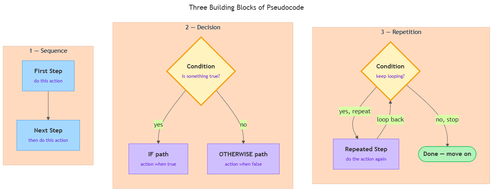
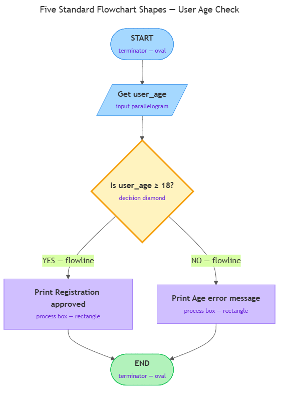

<!-- GENERATED FILE — DO NOT EDIT BY HAND.
     Cresent view of 9.2 — Expressing Logic.
     Source of truth: CIT 1.7, CIT 1.8.
     Regenerate: python Cresent/Technical/tools/generate_shared_readings.py -->
<!-- nav:top:start -->
Previous: [⬅ 9.1 — Core Computational Thinking Skills](../9-1-core-computational-thinking-skills/reading.md)&emsp;·&emsp;[⬆ Table of Contents](../../../../../../README.md#part-b)&emsp;·&emsp;[9.3 — Specifying for AI ➡](../9-3-specifying-for-ai/reading.md)
<!-- nav:top:end -->

---

# Pseudocode — writing logic in plain English before writing code

## Overview

Before you write a single line of code, you need a clear plan for what that code should do. Pseudocode is a way of writing that plan in plain, structured English — step by step, without the strict rules any real programming language imposes. In earlier topics you learned that computation means taking input, processing it through defined steps, and producing output; and that decomposition breaks a big problem into smaller sub-tasks. Pseudocode is where you write those sub-tasks out clearly, so you can check your logic before committing to any language.

## Key Concepts

### What pseudocode is

**Pseudocode** — a structured, step-by-step description of a process written in plain human-readable language, not in any specific programming language.

The word "pseudo" means "not real." So pseudocode is "fake code" — it looks a bit like code because it is ordered and precise, but a computer cannot run it directly. It is a plan, written for humans to read and check first [1].

Why does this matter? Because every programming language has **syntax** — the specific punctuation and keyword rules that language requires. One misplaced colon or missing bracket can break the whole program. If you try to write real code while simultaneously figuring out your logic AND learning the language's syntax rules, you are juggling two hard problems at once. Pseudocode lets you solve one problem at a time: logic first, syntax second [2].

Here is a simple everyday example — pseudocode for making a cup of tea:

```
START
  Boil water
  Place teabag in cup
  Pour boiling water into cup
  Wait 3 minutes
  Remove teabag
  Add milk if desired
END
```

That is pseudocode. It is structured, ordered, and readable by any person — no coding knowledge needed [1].

### The three building blocks of pseudocode

Every piece of pseudocode — and every program in every language — is built from exactly three patterns. These are the **building blocks of logic**.

**Building Block 1 — Sequence**

**Sequence** — doing steps one after another, in a fixed order. This is the simplest pattern: Step 1 happens, then Step 2, then Step 3. No skipping, no branching. Just a straight line of instructions.

Example:
```
GET the user's name
PRINT "Hello, " followed by the name
```

**Building Block 2 — Decision**

**Decision** — choosing between two or more paths based on a test. A decision is also called a **conditional** or a **branch**.

The test you check is called the **condition** — for example, "is the temperature above 30 degrees?" Depending on whether the condition is true or false, a different set of steps runs.

Example:
```
IF temperature is above 30 degrees
  PRINT "It is hot outside"
OTHERWISE
  PRINT "It is not that hot"
END IF
```

**Building Block 3 — Repetition**

**Repetition** — doing a step, or a group of steps, multiple times until a condition is met.

Example:
```
WHILE there are items in the shopping cart
  Calculate the price of the next item
  Add it to the running total
END WHILE
PRINT total cost
```

The steps inside the WHILE block repeat as long as the condition is true. When no items remain, the repetition stops [2].

These three building blocks — **sequence, decision, repetition** — are the skeleton of almost every program ever written [1].



### Pseudocode vs. real code — a direct comparison

It helps to see both forms side by side. Here is the same logic — "check whether a number is positive" — written two ways [2][3]:

| | Pseudocode | Python (one real language) |
|---|---|---|
| Get input | `GET a number from the user` | `number = int(input("Enter a number: "))` |
| Decision | `IF the number is greater than 0` | `if number > 0:` |
| Output (true) | `PRINT "The number is positive"` | `print("The number is positive")` |
| Output (false) | `OTHERWISE PRINT "Not positive"` | `else: print("Not positive")` |

Notice: pseudocode uses plain English ("GET a number from the user"). Python uses a specific built-in (`input()`) with required syntax — the colon after `if number > 0` is not optional. The logic is identical in both; pseudocode just captures the logic without the language-specific rules.

The same pseudocode could be translated into Python, JavaScript, Java, or any other language. You write the plan once; you choose the language later [1].

### Writing conventions

There is no single official pseudocode standard. Different textbooks and teams use slightly different keywords. What matters is that your pseudocode is readable, precise, ordered, and consistent — use the same keyword for the same thing throughout.

A few widely-used conventions [1][2]:

| Concept | Common keywords |
|---|---|
| Start / end a block | `START` / `END` |
| Decision | `IF … THEN … OTHERWISE …` |
| Repeat while condition is true | `WHILE … DO … END WHILE` |
| Repeat over a collection | `FOR EACH … DO … END FOR` |
| Assign a value | `SET x TO 5` |
| Show output | `PRINT`, `DISPLAY`, `OUTPUT` |
| Get input | `GET`, `READ`, `INPUT` |

You do not need to memorise this table now. Pick a consistent set and use it throughout one document [3].

## Worked Example

Here is a complete pseudocode example that uses all three building blocks together. The problem: find the highest score in a list of exam results.

**Step 1 — State the problem in one sentence.**
Find the highest score from a list of five exam results.

**Step 2 — Identify the inputs and output.**
- Input: a list of exam scores
- Output: the single highest score

**Step 3 — Write the pseudocode.**

```
START
  SET highest_score TO 0
  FOR EACH score IN the list of exam scores
    IF score > highest_score
      SET highest_score TO score
    END IF
  END FOR
  PRINT "The highest score is: " followed by highest_score
END
```

**Step 4 — Trace through it with a real example.**

Suppose the list is: 45, 72, 61, 88, 55.

1. `highest_score` starts at 0.
2. First score: 45 > 0? Yes — set `highest_score` to 45.
3. Second score: 72 > 45? Yes — set `highest_score` to 72.
4. Third score: 61 > 72? No — `highest_score` stays 72.
5. Fourth score: 88 > 72? Yes — set `highest_score` to 88.
6. Fifth score: 55 > 88? No — `highest_score` stays 88.
7. Loop ends. Print: "The highest score is: 88." — correct.

**Where each building block appears:**

- **Sequence** — `SET`, then `FOR EACH` loop, then `PRINT` happen in that fixed order.
- **Repetition** — the `FOR EACH` block repeats once for every score in the list.
- **Decision** — the `IF` inside the loop checks whether the current score beats the stored highest.

No knowledge of Python or any other language is needed to follow this logic. That is the point [2][3].

## In Practice

Pseudocode is not just a beginner exercise. It appears regularly in professional work [3]:

- **Software design.** Before writing a feature, developers write the logic as pseudocode so the team can agree on the approach before anyone writes production code.
- **Technical interviews.** Many engineering interviews ask candidates to explain their thinking in pseudocode first. Interviewers care about your logic, not whether you remember the exact syntax of a language.
- **Cross-team communication.** A non-technical colleague can describe a business rule — for example, "if a customer has more than three failed payments, flag the account" — in pseudocode, and a developer can implement it. Both parties only need to agree on the logic [1].
- **Documentation.** Pseudocode appears in technical documents when explaining how a process works, because it is readable without knowing the implementation language.

All of these uses share one thing: pseudocode lets you communicate the *what* and *how* of a process without getting stuck on *which language* to use.

**Do and avoid — a quick reference:**

| Do | Avoid |
|---|---|
| Write pseudocode before writing code | Writing pseudocode after coding to document it (defeats the purpose) |
| One action per line | Multiple actions crammed into one line |
| Use consistent keywords throughout | Mixing keywords (IF/OTHERWISE in one place, if/else in another) |
| Indent nested blocks to show structure | Flat indentation that hides which steps belong together |
| Trace through with a real example | Assuming it works without checking |
| Stay language-independent | Using language-specific syntax (e.g., a Python colon) in pseudocode |

You will encounter flowcharts as another way to visualise logic — you will cover that in the next topic [2].

## Key Takeaways

- **Pseudocode is structured plain English** that describes the logic of a process step by step — without using any specific programming language's syntax rules.
- **The three building blocks are sequence, decision, and repetition.** Every program in any language is built from combinations of these three patterns.
- **Pseudocode separates logic from syntax.** You solve "what should happen and in what order?" first, then answer "how do I write this in Python?" second.
- **There is no single official standard**, but good pseudocode is always readable, precise, ordered, and consistent within a document.
- **Writing pseudocode before code saves time.** A logic mistake caught in pseudocode is far cheaper to fix than the same mistake found after writing a full program [1].

## References

1. Codecademy, "Pseudocode and Flowchart: Complete Beginners Guide." <https://www.codecademy.com/article/pseudocode-and-flowchart-complete-beginners-guide>
2. GeeksforGeeks, "What is Pseudocode? A Complete Tutorial." <https://www.geeksforgeeks.org/dsa/what-is-pseudocode-a-complete-tutorial/>
3. Built In, "Pseudocode." <https://builtin.com/data-science/pseudocode>

---

# Flowcharts — Visualising Logic with Standard Shapes and Arrows

## Overview

In topic 1.7 you wrote logic out in plain English using pseudocode. A flowchart shows the exact same logic as a picture. Each step is drawn as a specific shape, and arrows connect the shapes to show what happens next. Flowcharts make it easy to see every possible path through a process at a glance — including branches and loops — before a single line of code is written [1].

## Key Concepts

### What a flowchart is

**Flowchart** — a diagram that represents a process as a set of steps drawn as shapes, connected by directed arrows [1].

Every flowchart has three things:

1. **Shapes** — each shape type has one fixed meaning.
2. **Flowlines** — arrows that show which step comes next.
3. **A clear start and a clear end.**

The shapes described below follow an internationally recognised convention. When you use them, anyone trained in computing can read your diagram straight away — no explanation needed [3].

### The five standard shapes

There are dozens of flowchart symbols in the full standard. These five cover almost every process you will draw as a beginner [1][3].

**Shape 1 — Terminator (oval)**

**Terminator** — an oval that marks the start or end of a process.

Every flowchart has exactly two: one labelled **START** at the top and one labelled **END** at the bottom. No arrows enter START from above; no arrows leave END.

**Shape 2 — Process box (rectangle)**

**Process box** — a rectangle that represents a single action or step.

This is the most common shape. Any step that does something — a calculation, an assignment — goes in a rectangle. Examples: "Set total to 0", "Multiply length by width".

One rule: one action per box. If you find yourself writing two actions separated by "then", split into two rectangles [1][3].

**Shape 3 — Decision diamond**

**Decision diamond** — a diamond shape that represents a yes/no question.

The diamond has one arrow entering it and two arrows leaving it. The two outgoing arrows are labelled **YES** and **NO**. Each label points to a different next step [1][2].

This shape is the visual form of the IF/OTHERWISE building block from topic 1.7. Example: the diamond contains "Is score ≥ 50?" — the YES arrow leads to a "Print Pass" box; the NO arrow leads to a "Print Fail" box.

**Shape 4 — Input/output parallelogram**

**Input/output parallelogram** — a slanted four-sided shape that represents data coming into the process (input) or results going out (output).

Use it when the process receives something from the user ("Get the user's name") or delivers a result ("Print the total cost"). It is a different shape from the rectangle because reading a value and calculating a value are different kinds of operations [1][3].

**Shape 5 — Flowline (arrow)**

**Flowline** — a directed arrow that connects two shapes and shows the direction of flow [2][3].

Rules for flowlines:

1. Every shape except END must have at least one outgoing arrow.
2. Every shape except START must have at least one incoming arrow.
3. A decision diamond must have exactly two outgoing arrows, each labelled.
4. Avoid crossing arrows — re-route to keep the diagram readable.

### Shapes at a glance

| Shape | Name | What it represents |
|---|---|---|
| Oval | Terminator | Start or End of the process |
| Rectangle | Process box | An action or step |
| Diamond | Decision diamond | A yes/no question (branch) |
| Parallelogram | Input/output parallelogram | Data entering or leaving |
| Arrow | Flowline | Direction of flow |

### The diagram below shows all five shapes labelled in a worked flowchart


*The user age check flowchart with each standard shape labelled: terminator (oval), input parallelogram, decision diamond, process boxes (rectangles), and flowlines (arrows).*

### Pseudocode and flowcharts — same logic, different medium

The three building blocks you learned in topic 1.7 — sequence, decision, and repetition — map directly onto flowchart shapes:

| Pseudocode building block | Flowchart equivalent |
|---|---|
| Sequence — steps in order | Rectangles and parallelograms stacked top-to-bottom, connected by flowlines |
| Decision (IF/OTHERWISE) | A decision diamond with a YES path and a NO path diverging, then rejoining |
| Repetition | A flowline pointing back up to a decision diamond already visited |

The logic is identical in both forms. The choice between them depends on your audience. A developer skimming logic alone may prefer pseudocode. A stakeholder in a meeting may find a flowchart easier to follow at a glance [2].

### How to read (trace) a flowchart

Tracing is how you verify a flowchart is correct. Follow these steps:

1. Find the START oval — that is where you begin.
2. Follow the first flowline to the next shape.
3. If the shape is a **process box or parallelogram**, carry out the action mentally, then follow the outgoing arrow.
4. If the shape is a **decision diamond**, check the condition. Follow YES if the condition is true; follow NO if it is false.
5. Continue until you reach the END oval.

Try it with the student-pass example, score = 45:

- START → "Get student score" (parallelogram, value = 45)
- "Is score ≥ 50?" (diamond) → 45 is NOT ≥ 50, follow NO
- "Print Fail" (rectangle) → END

Now trace with score = 72:

- START → "Get student score" (parallelogram, value = 72)
- "Is score ≥ 50?" (diamond) → 72 IS ≥ 50, follow YES
- "Print Pass" (rectangle) → END

The diagram is identical both times. The path through it changes with the input. That is what makes flowcharts useful: one picture shows every possible outcome [2][3].

### Loops in flowcharts

A **loop** in a flowchart is a path where one or more arrows point back up to a shape already visited. Loops represent the repetition building block [1][2].

A typical loop works like this:

1. A decision diamond checks a condition.
2. If YES, flowlines move forward through one or more process boxes.
3. After the last box in the loop body, a flowline curves back up to the same decision diamond.
4. When the condition becomes NO, the flowline exits the loop and moves on.

Example — adding up items in a shopping cart: "Are there more items?" → YES leads to "Add item price to total", which loops back to the diamond. NO leads to "Print total", then END.

The decision diamond does not move. The looping flowline is the only visual sign that repetition is happening [1][2].

## Worked Example

**Process:** a user types in their age. If the age is 18 or above, registration proceeds. If not, an error message appears.

**Pseudocode (building blocks from topic 1.7):**

```
START
  GET user_age
  IF user_age >= 18
    PRINT "Registration approved"
  OTHERWISE
    PRINT "You must be 18 or older"
  END IF
END
```

**Equivalent flowchart — step by step:**

1. Oval: START
2. Parallelogram: "Get user age" (input)
3. Decision diamond: "Is user age ≥ 18?"
   - YES path → Rectangle: "Print Registration approved" → Oval: END
   - NO path → Rectangle: "Print You must be 18 or older" → Oval: END

Both forms contain exactly the same logic. The flowchart makes the two paths visually obvious. The pseudocode is faster to type. You choose the form that fits the context [1][2].

To verify the flowchart, trace it twice — once with age = 20, once with age = 15. You should reach END both times, through different boxes.

## In Practice

Flowcharts appear across computing and business wherever a process needs to be communicated to a mixed audience [1][2][3]:

- **Troubleshooting guides** — "Is the device powered on? YES → proceed. NO → plug it in." Technical support documentation follows this pattern.
- **Customer service scripts** — call centre agents follow flowcharts (often without knowing that is what they are) to handle different customer scenarios.
- **Software design reviews** — teams draw a flowchart to explain feature logic to non-technical stakeholders before writing any code.
- **Business process documentation** — organisations document approval workflows as flowcharts so new staff can follow them without asking.

The common thread: a flowchart communicates process logic faster than a block of text or code to a mixed audience [3].

**Key rules to follow every time:**

- Use standard shapes only — do not invent your own. A diamond means decision to every reader [3].
- One action per process box — if a box contains two actions separated by "and", split it.
- Label both exits from every decision diamond — an unlabelled arrow on a diamond is ambiguous [1].
- Every loop must have an exit condition — a loop with no NO path can never reach END.
- Trace with at least two test cases before calling a flowchart done.

**Common mistakes to avoid:**

| Mistake | Why it matters |
|---|---|
| Using a rectangle for a decision | Misleads every reader expecting a YES/NO branch |
| Leaving a decision diamond with one exit | A question with no NO path is not a decision |
| A loop with no exit condition | The process can never reach END — an infinite loop |
| Multiple actions in one process box | Hides detail; makes tracing unreliable |

## Key Takeaways

- **A flowchart is a visual diagram** — the same logic as pseudocode, drawn as shapes and arrows instead of written steps [1].
- **The five standard shapes are:** terminator (oval) for START/END, process box (rectangle) for actions, decision diamond for yes/no questions, input/output parallelogram for data crossing the system boundary, and flowline (arrow) for direction of flow [1][3].
- **Decision diamonds always have two labelled exits: YES and NO.** This is the visual form of the IF/OTHERWISE building block from topic 1.7 [2].
- **Loops are shown by a flowline pointing back up to a decision diamond.** When the condition is false, the flow exits — without this exit, the process never ends [1][2].
- **Pseudocode and flowcharts are interchangeable.** Choose the form that best communicates to your audience [2].

## References

1. Visual Paradigm, "Flowchart Tutorial." <https://www.visual-paradigm.com/tutorials/flowchart-tutorial/>
2. GeeksforGeeks, "An Introduction to Flowcharts." <https://www.geeksforgeeks.org/dsa/an-introduction-to-flowcharts/>
3. SmartDraw, "Flowchart Symbols." <https://www.smartdraw.com/flowchart/flowchart-symbols.htm>

---
<!-- nav:bottom:start -->
Previous: [⬅ 9.1 — Core Computational Thinking Skills](../9-1-core-computational-thinking-skills/reading.md)&emsp;·&emsp;[⬆ Table of Contents](../../../../../../README.md#part-b)&emsp;·&emsp;[9.3 — Specifying for AI ➡](../9-3-specifying-for-ai/reading.md)
<!-- nav:bottom:end -->
