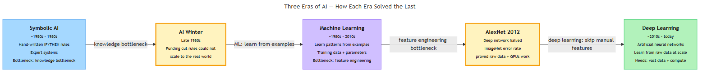
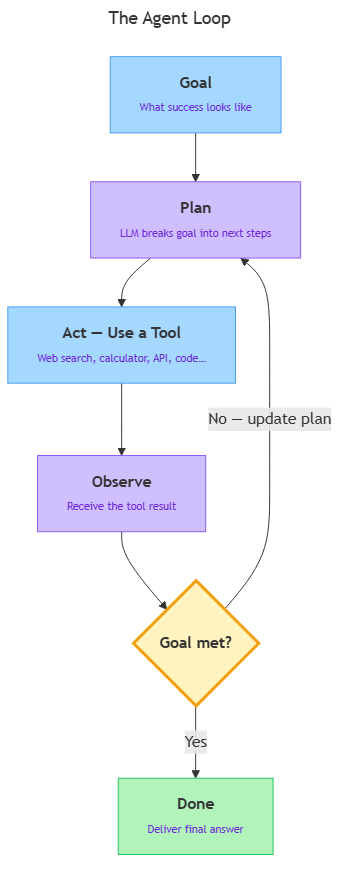

<!-- GENERATED FILE — DO NOT EDIT BY HAND.
     Cresent view of 10.1 — History of AI.
     Source of truth: CIT 3.1, CIT 3.2, CIT 3.3.
     Regenerate: python Cresent/Technical/tools/generate_shared_readings.py -->
<!-- nav:top:start -->
Previous: [⬅ 9.3 — Specifying for AI](../../../../m1-computational-thinking/week-9/1-computational-thinking/9-3-specifying-for-ai/reading.md)&emsp;·&emsp;[⬆ Table of Contents](../../../../../../README.md#part-b)&emsp;·&emsp;[10.2 — How LLMs Work ➡](../10-2-how-llms-work/reading.md)
<!-- nav:top:end -->

---

# History of AI — Symbolic AI to Machine Learning to Deep Learning

## Overview

This reading traces how artificial intelligence (AI) went from hand-written rules in the 1950s to systems that learn directly from massive amounts of raw data today. You will meet three distinct eras — symbolic AI, machine learning, and deep learning — each of which grew out of the limits of the one before it. Understanding this progression is the foundation for everything else in this course about how modern AI systems work [1][2].

*Three Eras of AI — How Each Era Solved the Last*

## Key Concepts

### The three eras at a glance

Each era answered the same question differently: *how do you get a machine to behave intelligently?*

| | Symbolic AI | Machine Learning | Deep Learning |
|---|---|---|---|
| **How rules are created** | Written by hand | Learned from labelled examples | Learned from raw data, no hand-picking |
| **Best suited for** | Logic puzzles, narrow rule-based tasks | Structured data (emails, numbers, records) | Images, audio, language, complex patterns |
| **Main weakness** | Breaks on exceptions; knowledge bottleneck | Humans must still choose features | Needs enormous data and compute |

---

### Era 1 — Symbolic AI (roughly 1950s to 1980s)

**Symbolic AI** is an approach to AI where programmers write the rules directly, using human-readable symbols — words, numbers, and logical statements — and the computer follows those rules exactly [3].

Think of it as a very elaborate checklist: a programmer sits down, thinks hard about every possible situation, and codes it in.

The flagship product of this era was the **expert system** — a program that stores human expert knowledge as IF/THEN rules. A medical expert system might contain thousands of entries like these:

- IF the patient has a fever AND a cough THEN consider flu.
- IF the patient has a fever AND a rash AND recent tropical travel THEN consider malaria.

Expert systems genuinely impressed people and could answer narrow questions as reliably as a specialist — sometimes better, because computers never forget a rule [3].

**Why symbolic AI hit a wall.** Two problems ended the era [1][3]:

1. **The knowledge bottleneck.** Writing rules by hand is slow and expensive. Understanding plain English, for instance, requires millions of rules — more than any team can write.
2. **Brittleness.** A rule-based system breaks the moment it meets something the rule-writer did not anticipate. It has no way to gracefully handle exceptions.

By the late 1980s, funding agencies had cut AI research budgets sharply. Historians call this period the **AI Winter** — a time when interest in AI collapsed because the early promises had not been met [2].

---

### Era 2 — Machine Learning (roughly 1980s to 2010s)

**Machine learning (ML)** is a fundamentally different idea: instead of writing rules, let the computer figure out the rules itself by studying many examples [1].

The key term here is **training data** — the collection of labelled examples the algorithm learns from. Without training data, there is nothing for the system to learn.

Here is how learning actually works. The algorithm starts with a set of internal numbers called **parameters**. It looks at each labelled example, makes a guess, checks how wrong it was, and nudges the parameters to do better next time. After thousands of these adjustments, the parameters settle into values that produce good answers.

A well-trained system can then **generalise** — apply what it learned to new examples it has never seen before. A system that only memorises its training examples without generalising is called **over-fitted**: it aces the practice problems but fails on anything new.

One important human task remained in this era: **feature engineering** — deciding which properties of the data (called **features**) to hand to the algorithm. For a spam email detector, a human might choose: number of exclamation marks, presence of the word "winner," sender address. Choosing good features required a lot of expertise [3].

By the 1990s and 2000s, ML algorithms were producing real results: credit card fraud detection, spam filters, and voice recognition on early smartphones [2].

---

### Era 3 — Deep Learning (roughly 2010s to today)

**Deep learning** is a specific type of machine learning that uses structures loosely inspired by the human brain. These structures are called **artificial neural networks (ANNs)** [1][3].

Do not let the word "brain" mislead you. A neural network is a mathematical construction — a large collection of numbers arranged in **layers** and connected by arithmetic. A **layer** is one stage of processing. The word "deep" refers to having many layers — modern networks can have hundreds.

Each layer learns to detect progressively more abstract patterns. For face recognition:

1. The first layer detects edges (light/dark boundaries).
2. The next combines edges into shapes (circles, lines).
3. A deeper layer combines shapes into features (eyes, nose).
4. The deepest layer combines features into a face.

No human wrote the rule "eyes + nose + mouth = face" — the network discovered that hierarchy by studying millions of labelled photos [3].

**The diagram below shows the full arc from Era 1 to Era 3, including the two transition moments.**

```mermaid
---
title: "Three Eras of AI — How Each Era Solved the Last"
theme: base
themeVariables:
  primaryColor: "#a5d8ff"
  primaryBorderColor: "#4a9eed"
  lineColor: "#555"
flowchart:
  htmlLabels: true
  curve: basis
---
flowchart LR
    era1["<b>Symbolic AI</b><br/><span style='font-size:12px;color:#6d28d9'>~1950s – 1980s<br/>Hand-written IF/THEN rules<br/>Expert systems<br/>Bottleneck: knowledge bottleneck</span>"]:::start

    bridge1["<b>AI Winter</b><br/><span style='font-size:12px;color:#6d28d9'>Late 1980s<br/>Funding cut; rules could not<br/>scale to the real world</span>"]:::hitl

    era2["<b>Machine Learning</b><br/><span style='font-size:12px;color:#6d28d9'>~1980s – 2010s<br/>Learn patterns from examples<br/>Training data + parameters<br/>Bottleneck: feature engineering</span>"]:::auto

    bridge2["<b>AlexNet 2012</b><br/><span style='font-size:12px;color:#6d28d9'>Deep network halved<br/>ImageNet error rate;<br/>proved raw data + GPUs work</span>"]:::hitl

    era3["<b>Deep Learning</b><br/><span style='font-size:12px;color:#6d28d9'>~2010s – today<br/>Artificial neural networks<br/>Learn from raw data at scale<br/>Needs: vast data + compute</span>"]:::done

    era1 -->|knowledge bottleneck| bridge1
    bridge1 -->|ML: learn from examples| era2
    era2 -->|feature engineering bottleneck| bridge2
    bridge2 -->|deep learning: skip manual features| era3

    classDef start fill:#a5d8ff,stroke:#4a9eed,color:#111
    classDef hitl fill:#fff3bf,stroke:#f59e0b,stroke-width:3px,color:#111
    classDef auto fill:#d0bfff,stroke:#8b5cf6,color:#111
    classDef done fill:#b2f2bb,stroke:#22c55e,color:#111
```

*Render this Mermaid block to see the timeline.*

**The milestone that changed everything: AlexNet (2012).**

In 2012, a deep neural network called AlexNet entered the ImageNet competition — an annual challenge to classify photographs from a large labelled dataset. AlexNet cut the error rate nearly in half compared to the previous best system, a margin so large that most researchers had not thought possible [1][2].

Three things came together to make it work:

1. **More data.** The internet had produced vast collections of labelled images.
2. **More compute.** Graphics processing units (GPUs) — chips originally designed for video games — turned out to be extremely efficient at the arithmetic neural networks require.
3. **Better algorithms.** Researchers had refined training techniques over the previous decade [1][2][3].

This "ImageNet moment" persuaded the research community to shift towards deep learning en masse. Later milestones followed: AlphaGo beating the world Go champion in 2016, and conversational AI going mainstream with ChatGPT in 2022. Large language models are introduced in topic 3.2.

**Why deep learning could not have happened in 1990.** The core ideas existed in the 1980s. What was missing was data (the internet did not yet exist at scale), compute (GPUs had not been repurposed for neural networks), and refined training techniques [1][2].

## Worked Example

**A spam filter across all three eras.**

The same task — deciding whether an email is spam — illustrates how each era approached the problem differently.

**Symbolic AI approach:**

1. A programmer interviews email administrators and lists known spam patterns.
2. Rules are written: IF "winner" is in the subject AND sender is unknown THEN mark spam.
3. Rules are tested on sample emails and corrected manually.
4. Each new spam trick (changing "winner" to "w1nner") forces another rule to be added by hand.
5. Eventually the rulebook grows unwieldy and spammers keep finding gaps.

**Machine learning approach:**

1. Thousands of emails already labelled "spam" or "not spam" are collected as training data.
2. A human expert chooses features: word frequencies, number of exclamation marks, sender reputation score.
3. The algorithm adjusts its parameters until it correctly classifies most of the labelled examples.
4. Tested on new emails it has never seen — if it generalises well, it is deployed.
5. When spammers shift tactics, the model is retrained on new examples rather than re-coded by hand.

**Deep learning approach:**

1. Millions of raw emails are collected — no feature list is hand-crafted.
2. A neural network with many layers is defined.
3. Raw text is fed directly into the network; each layer learns progressively more abstract patterns (individual words → phrases → writing style → intent).
4. Parameters are adjusted over many passes through the data.
5. The trained network can catch subtle patterns — such as mimicking a trusted sender's writing style — that neither rule lists nor hand-picked features would capture.

Each step removed one more piece of human hand-work: first the rule-writing, then the feature selection. What grew in its place was the need for more data and more computing power.

## In Practice

**Where symbolic AI still lives.**

Symbolic AI did not disappear. Rule-based systems still power many everyday tools [3]:

- Spreadsheet formulas and tax-calculation software.
- Traffic-light controllers.
- Legal contract analysis tools.

When the rules can be fully and reliably specified, a rule-based system is predictable, auditable, and cheap to run.

**Where machine learning is standard.**

Most recommendation systems — what to watch next on a streaming platform, which search results to show — are ML systems trained on user behaviour data. Fraud detection at banks, credit scoring, and disease prediction from medical records are also core ML applications [1][2].

**Where deep learning dominates.**

Deep learning is now the standard approach for any task involving images, audio, or natural language [1]:

- Face unlock on a smartphone.
- Voice assistants that transcribe speech to text.
- Medical imaging tools that detect tumours in X-rays.
- Translation between languages.
- AI models screening for diabetic retinopathy in rural clinics where specialists are scarce [2].

**One important caution: AI is uneven.**

Current AI can outperform humans at image recognition while failing on simple common-sense questions. This "jagged frontier" is a direct result of how deep learning works: it learns patterns from data, not general understanding. This theme returns throughout the course.

## Key Takeaways

- **Three eras, three philosophies.** Symbolic AI relied on hand-written rules. Machine learning replaced those rules with patterns learned from labelled examples. Deep learning removed even the need to hand-pick features, learning directly from raw data at scale.
- **Each era solved its predecessor's bottleneck.** Symbolic AI stalled at the knowledge bottleneck. Machine learning still required humans to choose features. Deep learning needed vast data and compute — which only became widely available in the 2010s.
- **AlexNet (2012) is the turning point most researchers cite.** It demonstrated that deep learning could outperform decades of hand-crafted methods on image recognition, triggering a rapid shift across the whole field [1][2].
- **Modern AI is a product of infrastructure, not just ideas.** The deep learning revolution was enabled by the internet (data), GPUs (compute), and accumulated algorithmic research. The ideas existed earlier; the infrastructure did not.
- **AI capability is uneven.** Today's AI systems can be superhuman on specific tasks and surprisingly fragile on others — a consequence of learning from data patterns rather than from general understanding.

## References

[1] IEEE Xplore — Academic paper covering the full arc from classical ML to modern AI systems. https://ieeexplore.ieee.org/document/11202920

[2] Toloka AI — Comprehensive chronological timeline of AI history, 1950–2026. https://toloka.ai/blog/history-of-llms/

[3] Machine Mindscape — Educational explainer covering symbolic AI to deep learning. https://machinemindscape.com/artificial-intelligence-to-deep-learning-history-concepts/

---

# The Rise of Large Language Models (LLMs)

## Overview

For most of computing history, machines could not produce fluent, relevant text in natural language — the everyday language people speak and write. That changed around 2018, when a new kind of AI model began answering questions, writing paragraphs, and translating between languages in ways that felt surprisingly human. These models are called **Large Language Models**, or **LLMs**, and they are the technology behind tools like ChatGPT, Google Gemini, and Claude. [1]

This topic tells the story of how LLMs came to exist — from early research on teaching machines to understand words, through a chain of breakthroughs, to the general-purpose language tools that are now used across industries worldwide. It does not go deep into how LLMs work internally; that comes in later topics.

## Key Concepts

### What is a Large Language Model?

A **Large Language Model (LLM)** is a type of deep-learning model — the kind introduced in Topic 3.1 — trained on enormous quantities of text. After training, it can generate, summarise, translate, and answer questions in natural language. [1]

The name has three parts:

| Part | What it means |
|---|---|
| **Large** | The model has billions of learned parameters — numbers adjusted during training so the model captures language patterns. |
| **Language** | Its input and output are text: sentences, questions, code, translations, or answers. |
| **Model** | It is a mathematical pattern-matcher built from an artificial neural network, not a lookup table or hand-written rules. |

The word "large" matters most. Earlier language models existed but were small enough that their vocabulary and reasoning were limited. The jump to billions of parameters — made possible by more data and far more powerful hardware — is what makes LLMs qualitatively different from what came before. [1] [2]

### The Road to LLMs: A Milestone Timeline

LLMs did not appear from nowhere. They sit at the end of a chain of research steps, each solving a problem the previous approach could not handle.

*The six milestones from deep learning to the LLM scaling era: each step solved a problem the previous one left open.*

**Step 1 — Early neural-network language work (1980s–2000s)**

Researchers noticed early on that artificial neural networks could learn patterns in sequences of words. The challenge: language is sequential. The word "bank" means something different in "river bank" and "bank account." A model has to track context across many words to understand meaning.

Early neural-network language models could handle short phrases but struggled with long sentences, and the hardware of the era made them slow to train. [2]

**Step 2 — Word embeddings: giving words a location in space (2013)**

A major breakthrough came with **word embeddings** — a technique for turning each word into a list of numbers so that words with similar meanings end up numerically close together. (The mathematical details of how a list of numbers represents meaning are formally covered in topic 6.3.)

- Think of it as giving each word a coordinate on a map: words with similar meanings land near each other.
- The landmark tool was **Word2Vec** (2013, Google). After training, Word2Vec learned that "king" and "queen" are close in its numerical space, and that the relationship "king minus man plus woman" points toward "queen" — it captured something about meaning without being told what meaning was. [2]

Word embeddings became a building block that every later, larger model would reuse and extend.

**Step 3 — Sequence models: reading text in order (2014–2017)**

Even with good word embeddings, a model still needs to read words in sequence and remember what it read earlier.

- **Recurrent Neural Network (RNN)** — a type of neural network that processes inputs one step at a time and passes a summary of earlier steps forward, so later steps know something about what came before.
- A refinement called **LSTMs (Long Short-Term Memory networks)** improved this memory mechanism further. [2]

RNNs and LSTMs powered the first serious neural machine-translation systems, including early versions of Google Translate. But they had a key weakness: the further back in a sentence a word appeared, the harder it was to remember. A 100-word sentence caused the model to effectively "forget" the opening clause by the time it reached the end. [2]

**Step 4 — The Transformer: the architecture that changed everything (2017)**

In 2017, a team at Google published a research paper titled "Attention Is All You Need." It introduced the **Transformer architecture** — the design that every major LLM today is built on. [1] [2]

**Transformer** — an artificial neural network architecture that can process all words in a text simultaneously and connect any two words to each other regardless of their distance in the sentence.

The key innovation inside the Transformer is a mechanism called **attention** (covered in detail in topic 3.4). The result: **the Transformer solved the long-range memory problem** that held back RNNs and LSTMs, and it made it practical to train far larger models on far more data. [1] [2]

**Step 5 — BERT and GPT: the first large Transformer models (2018–2019)**

With the Transformer in place, two landmark models arrived:

**BERT (Bidirectional Encoder Representations from Transformers)**, released by Google in 2018, reads text in both directions at once. This made it excellent at *understanding* a passage — useful for search engines and question answering. [2]

**GPT (Generative Pre-trained Transformer)**, released by OpenAI in 2018, was trained to predict the next word in a sequence. This made it excellent at *generating* text — completing sentences, answering prompts, writing paragraphs. [1] [2]

| Model | Organisation | Year | Primary strength |
|---|---|---|---|
| BERT | Google | 2018 | Understanding text (search, question answering) |
| GPT-1 | OpenAI | 2018 | Generating text (completions, answers) |
| GPT-2 | OpenAI | 2019 | Larger; fluent multi-paragraph text |
| GPT-3 | OpenAI | 2020 | 175 billion parameters; few-shot task performance |
| GPT-4 | OpenAI | 2023 | Multimodal — text and image input (multimodal AI is covered in topic 4.6); near-human on many benchmarks |

**Few-shot** — the ability to perform a new task after seeing only a handful of examples, without any retraining. GPT-3 demonstrated this at scale for the first time. [1]

**Step 6 — Scale and the "pre-train then fine-tune" pattern**

What makes a language model "large" is the combination of three things:

1. A massive training dataset — hundreds of billions of words from the web, books, and code repositories.
2. A very large number of parameters — GPT-3 has 175 billion; some 2024–2025 models exceed a trillion.
3. Enormous compute — thousands of specialised GPUs running for weeks or months.

The **pre-train then fine-tune** pattern emerged as the standard approach: [1] [3]

- **Pre-training** — the initial phase where an LLM learns general language patterns from a very large text corpus. This is expensive and slow.
- **Fine-tuning** — a follow-on phase where the pre-trained model is adapted to a specific task or domain using a smaller, focused dataset. This is relatively cheap compared to pre-training.

This pattern is why the same base model can be adapted into a coding assistant, a medical-information chatbot, or a translation tool without starting from scratch each time. [3]

### What LLMs Can and Cannot Do

LLMs are genuinely impressive at some tasks and unreliable at others. Knowing the difference is a core skill for responsible AI use.

**What LLMs are good at:**

- **Fluent text generation** — writing emails, summaries, explanations, and code drafts that read naturally. [1]
- **Multilingual tasks** — translating between languages, including languages with limited prior tool support. [3]
- **Summarisation** — condensing a long document into a short paragraph while keeping the main points.
- **Question answering** — drawing on knowledge learned during training to answer factual questions.
- **Few-shot adaptation** — doing new tasks from just a few examples in the prompt, without retraining.

**What LLMs struggle with:**

| Weakness | What it looks like |
|---|---|
| **Hallucination** | The model produces a fluent, confident-sounding answer that is factually wrong or entirely invented. |
| **Arithmetic and precise reasoning** | LLMs were not built as calculators; they often make errors in multi-step maths. |
| **Up-to-date knowledge** | Training data has a cut-off date. The model does not know about events after that date unless the information is provided in the prompt. |
| **Consistency** | Asking the same question twice may produce different answers. |
| **Verification** | The model cannot check whether its answer is true; it generates what looks plausible, not what is factually verified. |

**Hallucination** — when an LLM generates text that sounds correct and fluent but is factually wrong, invented, or misleading. [1] [3]

The unevenness of LLM performance across task types — why it excels at some and fails at others — is examined in depth in topic 3.8.

### How LLMs Differ from Earlier AI Approaches

Topic 3.1 covered two earlier paradigms. Here is how LLMs compare:

| Approach | How knowledge is encoded | Who does the work |
|---|---|---|
| **Symbolic AI / Expert systems** (1950s–1980s) | Explicit rules written by humans | Human experts encode all knowledge as rules |
| **Classic machine learning** (1980s–2010s) | Statistical patterns; humans engineer features | Humans choose features; algorithm learns weights |
| **Deep learning** (2012–2017) | Patterns from raw data via many-layer networks | Architecture chosen by humans; patterns learned from data |
| **LLMs** (2018–present) | Language patterns from internet-scale text; fine-tuned for tasks | Pre-trained by large organisations; adapted by practitioners |

The critical shift with LLMs is **scale and generality**. Earlier systems were built for one task: a chess engine plays chess; a spam filter detects spam. LLMs are general-purpose language reasoners — the same pre-trained model can write an essay, translate a sentence, explain a recipe, and sketch a business plan. [1] [2]

## Worked Example

Here is the practical workflow of using a pre-trained LLM, from first training to a practitioner getting a response. Think of it as three roles passing a baton.

1. **A large organisation pre-trains a base LLM** on internet-scale text — billions of documents, websites, and books. This phase costs millions of dollars and takes months. The result is a model with general language knowledge. [1]
2. **The base model is fine-tuned** on a smaller, task-specific dataset (for example, customer-support conversations, or medical notes). The model adapts its general knowledge to a specific purpose without being retrained from scratch. [1]
3. **The fine-tuned model is deployed behind an API** — a service interface that applications can send text to and receive text back from. [1]
4. **A practitioner writes a prompt** — the text input — and sends it to the API. They receive the model's response.

**Prompt** — the text you send to an LLM to get a response. It can be a question, an instruction, a partial sentence, or a detailed description of what you want.

A concrete example:

> **Prompt:** "Summarise this paragraph in two sentences for a non-technical audience: [paragraph text]"
>
> **Response:** The LLM returns a short, plain-language summary drawn from the pattern knowledge it learned during training.

The key insight: from a practitioner's perspective, using an LLM means writing a clear text input (a prompt) and reading text output (a response). The billions of parameters and the terabytes of training data are managed by the provider, invisible behind the API. [1]

## In Practice

**Where LLMs are used today:**

- **Global translation and transcription** — LLMs now power translation services that work across hundreds of languages, including languages that older automated tools handled poorly due to limited training data. [3]
- **Regional language tools in India** — India has 22 scheduled languages. LLMs fine-tuned on Indian-language corpora have opened practical translation, transcription, and content generation for Kannada, Tamil, Telugu, Hindi, Marathi, and others at scale — a task that earlier rule-based systems required enormous manual effort per language pair to handle. [3]
- **Healthcare documentation** — hospitals use LLM-based tools to convert clinician notes into structured medical records, reducing paperwork time. [1] [3]
- **Software development** — developers use LLM-based code-completion tools (for example, GitHub Copilot) to accelerate writing and debugging code. [1]
- **Search engines** — major search engines now use LLMs to provide direct answers to natural-language queries, not just a list of links. [1]

**Do:**
- Verify important factual claims independently — LLMs hallucinate; trust but check.
- Treat LLM output as a first draft, not a final product.
- Be specific in prompts — a vague instruction produces a vague answer.
- Note the training data cut-off date when asking about recent events.

**Avoid:**
- Using LLM output uncritically for high-stakes decisions (medical diagnoses, legal advice, financial plans) without expert review.
- Confusing fluency with correctness — a confident, well-written sentence can still be factually wrong.
- Assuming the model understood your intent; it is predicting plausible text, not reasoning about your goals. [3]

## Key Takeaways

- A **Large Language Model (LLM)** is a deep-learning model trained on vast quantities of text; it can generate, summarise, translate, and answer questions in natural language. [1]
- LLMs emerged from a chain of milestones: word embeddings (2013) → sequence models / RNNs (2014–2017) → the **Transformer architecture** (2017) → BERT and GPT (2018–2019) → massive scaling (2020–present). [2]
- The **Transformer** was the enabling breakthrough: it processes all words at once and connects words regardless of distance, solving the long-range memory problem that limited earlier sequence models. [1] [2]
- LLMs are **general-purpose**: the same pre-trained model can be fine-tuned for many different tasks — a major shift from the single-task AI systems of earlier eras. [1]
- LLMs have real limitations: they **hallucinate**, carry a training data cut-off date, and their performance is uneven — excellent at some tasks, surprisingly poor at others. [1] [3]

## References

[1] IBM Think. "Large Language Models." IBM. https://www.ibm.com/think/topics/large-language-models

[2] Minaee, S. et al. "Large Language Models: A Survey." arXiv:2402.06853v3. https://arxiv.org/html/2402.06853v3

[3] Snorkel AI. "Large Language Models." Snorkel.ai. https://snorkel.ai/large-language-models/

---

# The Move to AI Agents

## Overview

You have already met the LLM (Large Language Model) — you send it a prompt and it sends back a response. That is powerful, but it has a hard limit: one question, one answer, then it forgets everything. An **AI agent** breaks that limit by giving the LLM a *goal* to pursue across many steps, tools to act on the world, and memory to keep track of progress. Understanding agents is the bridge from "AI as a chatbot" to "AI as an autonomous assistant."

## Key Concepts

### Standalone LLM vs. AI Agent

Think of a plain LLM as a brilliant expert locked in a room with no phone, no notebook, and no internet. They answer your questions brilliantly — but they cannot look anything up, and they forget the conversation the moment you leave. An **AI agent** gives that same expert a phone, a notebook, a computer, and a goal to work toward [1].

The table below captures the key differences:

| | LLM (standalone) | AI agent |
|---|---|---|
| **Input** | A single prompt | A goal (desired end-state) |
| **Output** | One response | A sequence of actions + final result |
| **Steps** | One | Many — planned and executed by the system |
| **Tools** | None | Web search, calculators, API calls, file access |
| **Memory** | None between calls | Can carry information across steps |

The LLM is still the engine inside the agent. What changes is everything *surrounding* it [1].

### The Five Components of an Agent Loop

Most AI agent architectures share five building blocks. Each one solves a specific limitation of the plain LLM [1][2].

**1. Goal**
The **goal** is a description of what the agent is supposed to accomplish — specific enough that the system can judge when it is done. Without a clear goal, the agent has no way to decide when to stop.

- Example: "Find the three cheapest flights from Mumbai to London in July and return them as a table."

**2. Planning**
**Planning** is how the agent breaks a big goal into smaller steps it can actually take. The LLM reads the goal and writes a plan: "First, search for flights. Then filter by price. Then format the results." The LLM's ability to reason in language makes this possible [2]. Plans can also be revised as the agent learns new information mid-run.

**3. Tool use**
**Tool use** is the agent's ability to call external functions or services. An LLM alone can only produce text — tools let it take real actions [1]:

- **Web search** — look something up in real time
- **Calculator** — perform arithmetic reliably
- **API (Application Programming Interface) call** — talk to an external service (book a flight, send an email, read a database). An API is a standardised way for one software system to request something from another.
- **File access** — read or write documents
- **Code execution** — run a snippet of code and receive the output

The agent decides *when* to use each tool and *what to pass to it*, based on its current plan.

**4. Memory**
**Memory** lets the agent carry information across steps. Two types matter here:

- **Short-term memory** — everything the agent has seen so far in the current run, held in the LLM's context window. This is temporary and vanishes when the session ends.
- **Long-term memory** — facts written to a file or database that persist across separate sessions [2].

Without memory, an agent would forget what it found in step 1 by the time it reaches step 3.

**5. Feedback loop**
The **feedback loop** is the mechanism that keeps the agent running. After each action the agent receives an *observation* — the result of what it just did. That observation goes back into the LLM, which decides what to do next. This continues until the goal is reached [2][3].

Here is the loop in outline:

1. Receive goal
2. Make a plan
3. Execute next action (use a tool, write text, call an API)
4. Observe the result
5. Update the plan if needed
6. Repeat from step 3 until goal is reached

The diagram below shows how these five components connect:

*The agent loop: Goal feeds into Planning, which drives tool-based Action, which produces an Observation that either closes the loop (goal met) or updates the Plan for the next cycle.*

### Capabilities and Limitations

Today's agents are genuinely useful — but they are not magic. Here is an honest picture.

**What agents do well:**
- Breaking large tasks into sub-tasks and working through them step by step [1]
- Using well-defined tools reliably when the goal is clear
- Summarising and transforming information from multiple sources
- Running long, repetitive research tasks that would take a human hours [3]

**What agents still struggle with:**
- **Hallucination propagates.** The agent's reasoning core is still an LLM, so it can still produce confident but incorrect plans — and then act on them [2].
- **Goal ambiguity.** A vague goal produces unpredictable behaviour. Precise goal-writing is a skill in itself.
- **Error compounding.** Each step can introduce a small mistake. Over 20 steps, small errors grow into large failures.
- **Cost.** Every step calls the LLM, which uses computing time and money [1].

Because of these limitations, most real-world agents today are **supervised** — a human reviews the plan or the result at key checkpoints. Fully autonomous agents are rare outside of narrow, well-tested tasks [3].

## Worked Example

This example shows the five components in action for a concrete task: "Given a company name, find its current stock price and write a one-paragraph summary of recent news about it."

**Step 1 — Define the goal clearly.**
The goal must be specific enough that the agent can recognise when it is done. "Find the current stock price of Company X and summarise 3 recent news headlines about it" gives the agent a clear finish condition. Vague goals produce unpredictable results.

**Step 2 — Equip the agent with tools.**
For this task, the agent needs:
- A stock-price API tool (to retrieve live price data)
- A web-search tool (to find current news)

The practitioner connects these tools to the agent. The agent does not use them automatically — it calls them when its plan requires it [1][2].

**Step 3 — Write a system prompt.**
The **system prompt** is a set of instructions the LLM receives before the user's goal. It tells the agent its role, which tools it has, what format to output in, and any constraints — for example: "Only report what the tools return; do not make up information" [3].

**Step 4 — Run the agent loop.**
The agent:
1. Plans: "I need the stock price, then recent news."
2. Calls the stock-price tool — receives a number.
3. Calls the web-search tool with the company name — receives headlines.
4. Drafts a summary paragraph from the tool results.
5. Decides the goal is met and returns the output.

**Step 5 — A human reviews the result.**
Is the stock price correct? Does the summary match the actual headlines? If the agent used the wrong ticker symbol or cited stale news, the practitioner refines the goal or the tools and runs again.

This five-step pattern — define, equip, instruct, loop, review — is the core of most agent deployments in use today [1].

## In Practice

AI agents are already at work across industries. The common thread is always the same: the agent handles repetitive, multi-step information work so a human can focus on judgement and decision-making.

**Customer support** — Many companies use agents to handle queries end-to-end: the agent reads the complaint, checks account data via an API call, drafts a response, and sends it (or routes it to a human with a summary already written if it is not confident) [1].

**Research and reporting** — Financial analysts use agents to gather data from regulatory filings and news sources, synthesise findings, and draft a first-version report. The analyst reviews and edits rather than starting from scratch [3].

**Software development** — Developer tools now include agent-mode features: given a task description, the agent reads relevant code files, writes new code, runs it, reads error output, fixes mistakes, and repeats — without hand-holding at each step [2].

**Best practices for using agents safely:**

- **Be precise about the goal.** Write it as if briefing a new employee — include what success looks like, required output format, and hard constraints [1].
- **Give the agent only the tools it needs.** Every extra tool is an extra way the agent can take an unintended action [2].
- **Keep humans in the loop for irreversible actions.** If the agent can send emails, move money, or delete files, build in a human-approval checkpoint before those actions execute [1][3].
- **Log everything.** Record what the agent planned, what tool it called, what the tool returned, and what it concluded. Without logs, debugging a failure in a 20-step chain is nearly impossible.

## Key Takeaways

- An **AI agent** uses an LLM as its reasoning core and surrounds it with a goal, planning, tools, memory, and a feedback loop — enabling it to pursue multi-step objectives autonomously rather than responding to a single prompt [1][2].
- The five core components of an agent loop are: **goal** (what to achieve), **planning** (how to get there), **tool use** (taking real-world actions via APIs and other services), **memory** (carrying information across steps), and the **feedback loop** (observe, reason, act — then repeat) [2][3].
- The move from LLM to agent does not change the underlying model — it changes what surrounds it. The LLM becomes a decision-maker inside a larger system rather than a one-shot responder [3].
- Today's agents are powerful for multi-step information tasks but are still prone to hallucination, goal ambiguity, and compounding errors over long chains — making human oversight essential in most real-world settings [1][2].
- The core practitioner pattern is: define a precise goal, equip the agent with the minimum necessary tools, instruct it via a system prompt, run the loop, and review the output before acting on it [1].
- This topic introduced the agent loop in action — the five components as they run. Topic 4.4 builds on this foundation with the architectural view: how goal, LLM core, memory, tools, and planning layer are structured inside a production agent system.

## References

1. Apideck. "AI Agents Explained: Everything You Need to Know in 2025." https://www.apideck.com/blog/ai-agents-explained-everything-you-need-to-know-in-2025
2. Data Science Dojo. "Agentic LLM in 2025." https://datasciencedojo.com/blog/agentic-llm-in-2025/
3. Proactive Management. "2025: The Year of the Agent — Building on the Foundation of LLMs." https://proactivemgmt.com/blog/2025/01/22/2025-the-year-of-the-agent-building-on-the-foundation-of-llms/

---
<!-- nav:bottom:start -->
Previous: [⬅ 9.3 — Specifying for AI](../../../../m1-computational-thinking/week-9/1-computational-thinking/9-3-specifying-for-ai/reading.md)&emsp;·&emsp;[⬆ Table of Contents](../../../../../../README.md#part-b)&emsp;·&emsp;[10.2 — How LLMs Work ➡](../10-2-how-llms-work/reading.md)
<!-- nav:bottom:end -->
