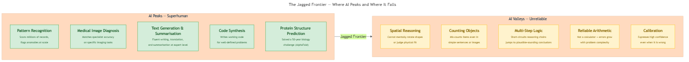

<!-- GENERATED FILE — DO NOT EDIT BY HAND.
     Cresent view of 10.3 — The Jagged Frontier.
     Source of truth: CIT 3.8.
     Regenerate: python Cresent/Technical/tools/generate_shared_readings.py -->
<!-- nav:top:start -->
Previous: [⬅ 10.2 — How LLMs Work](../10-2-how-llms-work/reading.md)&emsp;·&emsp;[⬆ Table of Contents](../../../../../../README.md#part-b)&emsp;·&emsp;[10.4 — AI Today (Global and India) ➡](../10-4-ai-today-global-and-india/reading.md)
<!-- nav:top:end -->

---

# The Jagged Frontier — Tasks AI Is Superhuman at vs Tasks Where It Is Unreliable

## Overview

Here is a real paradox: the same AI system that passes a bar exam can fail to count the number of times the letter "r" appears in the word "strawberry." It can write a polished legal brief but struggle to tell you whether a chair fits through a doorway. This is not a glitch — it is the normal behaviour of today's LLMs. Ethan Mollick, a professor at the Wharton School who studies AI in the workplace, named this pattern the **jagged frontier** [1]. Understanding it is one of the most practical skills you can build as an AI practitioner.

## Key Concepts

### The Jagged Frontier

The **jagged frontier** is the uneven boundary between what AI systems do reliably well and what they do unreliably or poorly [1]. The key word is *jagged*. If AI capability were uniform, you would expect a smooth line: good at easy tasks, worse at harder ones. Instead, the line zigzags in ways that are hard to predict from the outside [1].

Think of it as a landscape with peaks and deep valleys sitting right next to each other. An AI system might be at a peak (performing at or above expert human level) on one task, then drop into a valley (producing embarrassing errors) on a task that seems almost identical.

A closely related idea is the **capability cliff**: the phenomenon where an AI performs well up to a point, then drops suddenly and steeply when the task is changed even slightly [2]. This cliff is why the frontier is jagged rather than gently sloped. You cannot safely assume that because the AI handled one version of a task, it will handle a slightly harder version.

### Where AI Is at the Peaks

Several task categories sit consistently at or above expert human level for modern LLMs [1][2].

- **Pattern recognition at scale.** AI can scan millions of records — transactions, molecular candidates, sensor readings — and flag anomalies far faster than any human team. This drives fraud detection, drug discovery screening, and recommendation systems.
- **Medical image diagnosis.** AI models trained on labelled X-rays, retinal scans, and skin photographs have matched or exceeded specialist accuracy on specific, well-defined imaging tasks [2]. The critical word is *specific*: the model was trained on that image type, in controlled conditions.
- **Text generation, summarisation, and translation.** On formal **benchmarks** — standardised tests with defined correct answers and scoring rules used to measure and compare AI performance — LLMs score at or above professional writer and translator level on many measures [1].
- **Code synthesis.** LLMs write working code in dozens of programming languages for well-specified problems. On public coding benchmarks they score at expert-human level for standard algorithmic challenges [1].

The common thread: tasks with large, clean training data, a well-defined output, and a ground truth the model could learn from during pre-training. Pattern matching within a known distribution is where AI excels.

### Where AI Is in the Valleys

The valleys are less intuitive because they often involve tasks that feel simple to a human [1][2].

- **Spatial reasoning.** **Spatial reasoning** is the ability to mentally manipulate objects in space — imagining a shape rotated, checking whether one object fits inside another. LLMs process language tokens, not spatial representations. When asked "If I rotate this L-shaped piece 90 degrees clockwise, does it fit in this slot?", the model works from words alone — with no real spatial model — and frequently gets it wrong [2].
- **Counting.** Ask an LLM how many letter "r"s are in "strawberry" and it will often say two instead of three. The model predicts likely next tokens; it does not run a counting algorithm.
- **Reliable arithmetic.** LLMs are not calculators. For simple operations (2 + 2), patterns are so dense in training data that results are correct. For multi-digit arithmetic without a code execution tool, errors are common — a textbook capability cliff [2].
- **Multi-step logical deduction.** A **reasoning task** in AI is any problem where the correct answer requires following a chain of steps, each depending on the previous one. LLMs can appear to reason fluently but often jump to a plausible-sounding conclusion without tracking the full chain.
- **Calibration.** **Calibration** in AI means the match between how confident a model sounds and how often it is actually correct [1][2]. A perfectly calibrated model that says "I am 90% sure" is correct 90% of the time. LLMs are often poorly calibrated: they express high confidence even when they are wrong. This is the mechanism behind hallucination — the model generates the most statistically likely next token regardless of whether it is grounded in fact.

### Why the Frontier Is Jagged

The jagged shape has specific causes, not random noise [1][2].

- **Training data density.** Tasks that appear millions of times in training data — writing emails, translating common language pairs, explaining popular code patterns — benefit from dense examples. Rare tasks receive little learning signal.
- **Interpolation vs extrapolation.** When an LLM answers a question that closely resembles its training data, it is *interpolating* — reliably filling in between known examples. When it must tackle a genuinely novel reasoning chain, it is *extrapolating* — going beyond its training — and LLMs do this poorly. Most valleys are extrapolation zones.
- **Emergent capabilities are uneven.** As you learned in topic 3.5, scaling to more parameters causes capabilities to appear suddenly. But emergence is patchy: some abilities appear at 7 billion parameters, others at 70 billion, some not yet at any scale. This creates a frontier that spikes in some areas while staying flat in others, and emergent capabilities can fail at edge cases that look similar to cases where they work — producing the capability cliff [2].

### Diagram

*The jagged frontier: AI peaks (tasks where performance is at or above expert human level) sit directly alongside valleys (tasks where the same system is unreliable), with capability cliffs marking the sudden drops between them.*

## Worked Example

**Scenario:** A developer uses an AI coding assistant on a new project.

**Step 1 — Task at the peak.** The developer asks the assistant to write a function that sorts a list of user records by date and removes duplicates. The AI produces clean, working Python in seconds. This is a well-specified algorithmic task heavily represented in training data — a clear peak.

**Step 2 — Moving toward the valley.** Encouraged, the developer asks the AI a different question: "Looking at these three files — `auth.py`, `session.py`, and `middleware.py` — is the edge case where a session token expires mid-request handled correctly?"

**Step 3 — The valley in action.** The AI replies confidently: "Yes, the session expiry edge case is handled in `middleware.py` at line 47 via the `check_token_validity` function." The developer ships the feature.

**Step 4 — The real outcome.** In production, the edge case triggers a crash. On inspection, `check_token_validity` only covers one expiry scenario; the mid-request case was never handled. The AI did not maliciously lie — it generated the most plausible-sounding description of what *should* be there. Poor calibration meant it flagged no uncertainty.

**Why this happened:** Verifying a security property across three interacting files requires multi-step logical deduction — tracking state changes across module boundaries and reasoning about which code paths are reachable. That is an extrapolation zone, deep in the valley. The AI's confidence was high; its accuracy was not [1][2].

**The takeaway:** The capability cliff appeared between "write well-specified code" (peak) and "verify a cross-file logical property" (valley). The task *looked* similar from the outside. The frontier made it very different.

## In Practice

**A 5-step approach to probing the frontier for any new task** [1][2][3]:

1. **Choose task categories deliberately.** Select tasks that span the frontier — creative writing (likely peak), factual recall on an obscure topic (mixed), logical deduction (likely valley), spatial description (likely valley), code synthesis for a well-specified problem (likely peak). Observing the jagged shape requires testing both ends.
2. **Run the AI without coaching.** Give the task as you would give it to a knowledgeable human. Do not add special prompting tricks yet. Record the response verbatim.
3. **Evaluate correctness independently.** Use a source that is not the AI — a textbook, a calculator, your own verified knowledge. Do not ask "does it sound confident?"; ask "is it right?" This is calibration testing.
4. **Find the capability cliff.** After a successful result, try a small variation: add one step to a logical chain, make the arithmetic slightly larger, ask the spatial question from a different angle. Document where performance drops suddenly.
5. **Document your frontier map.** For each task type, record: (a) was it reliable?, (b) where did it fail?, (c) did the model flag uncertainty or state wrong answers confidently? Update this map when new model versions are released.

**Key do/don'ts:**

- **Do not use expressed confidence as a green light.** Poor calibration means a confident answer is not evidence of a correct answer. On unusual questions, high confidence should prompt closer scrutiny, not less [1].
- **Do treat AI output as a first draft** for any task in a valley — arithmetic, factual citations, multi-step logic, spatial reasoning. Build a human review step into your workflow [1].
- **Do not assume benchmark scores transfer to your use case.** A benchmark measures performance on a specific standardised test; real-world tasks can differ in subtle ways that shift them from peak to valley [1][3].
- **Do refresh your frontier map.** Newer models — including OpenAI's o3 and Google's Gemini 2.5 — have closed some valleys that were deep in 2023 [3]. What was unreliable may become workable; what seemed reliable may expose new gaps as use cases expand. The frontier moves; practitioner knowledge must move with it [3].

## Key Takeaways

- The **jagged frontier** is the uneven boundary of AI capability: the same system can be superhuman on one task and fail on a superficially similar one, with no smooth gradient between the two [1].
- AI peaks occur where training data is dense and outputs are well-defined; AI valleys appear where tasks require extrapolation, spatial reasoning, reliable arithmetic, or multi-step logical deduction [1][2].
- **Capability cliffs** mean a small change to a task the AI handles well can cause performance to drop suddenly — never assume a nearby task is equally reliable [2].
- **Calibration** is poor in current LLMs: confident answers can be wrong, and hallucination is a structural consequence of how token prediction works, not a fixable bug [1].
- The frontier is moving — 2025 models have closed some known valleys — but human oversight remains essential, and a 95%-accurate system still needs a review step when a 5% error rate is unacceptable [3].

## References

[1] Mollick, E. "Generative AI: What Comes Next." *Insight Partners*. https://www.insightpartners.com/ideas/generative-ai-ethan-mollick/

[2] "Jagged AGI: Superhuman AI and Its Flaws." *Ikangai*. https://www.ikangai.com/jagged-agi-superhuman-ai-flaws/

[3] Mollick, E. "On Jagged AGI: o3, Gemini 2.5, and Everything." *One Useful Thing*. https://www.oneusefulthing.org/p/on-jagged-agi-o3-gemini-25-and-everything

---
<!-- nav:bottom:start -->
Previous: [⬅ 10.2 — How LLMs Work](../10-2-how-llms-work/reading.md)&emsp;·&emsp;[⬆ Table of Contents](../../../../../../README.md#part-b)&emsp;·&emsp;[10.4 — AI Today (Global and India) ➡](../10-4-ai-today-global-and-india/reading.md)
<!-- nav:bottom:end -->
