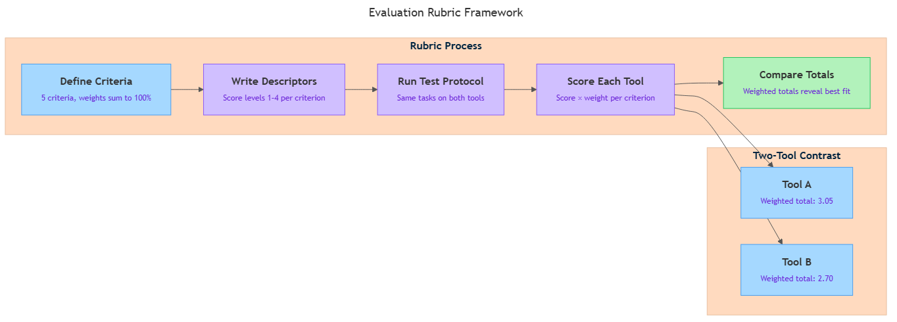
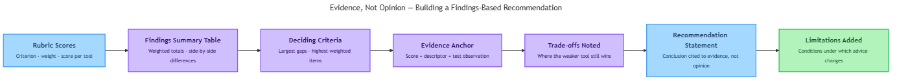

<!-- GENERATED FILE — DO NOT EDIT BY HAND.
     Cresent view of 10.5 — Capability vs Hype.
     Source of truth: CIT 3.10, CIT 4.7, CIT 4.8.
     Regenerate: python Cresent/Technical/tools/generate_shared_readings.py -->
<!-- nav:top:start -->
Previous: [⬅ 10.4 — AI Today (Global and India)](../10-4-ai-today-global-and-india/reading.md)&emsp;·&emsp;[⬆ Table of Contents](../../../../../../README.md#part-b)&emsp;·&emsp;[11.1 — Foundation Models ➡](../../../week-11/1-the-2026-ai-stack/11-1-foundation-models/reading.md)
<!-- nav:top:end -->

---

# How to Evaluate AI Output Across Five Task Types

## Overview

Ask an AI to write a poem, explain a historical event, and fix a bug — and you get three very different kinds of output. Judging all three by the same standard leads to bad decisions: a factual report is not improved by being poetic, and a poem is not broken by lacking citations. This topic gives you a structured way to evaluate AI output by matching the right criteria to the right kind of task.

## Key Concepts

### What "evaluation" means here

**Evaluation** means a human examining an AI output and making a structured judgment about its quality, correctness, and fit for the task given. This is not an automated process — you are the evaluator [3].

The key tool is an **evaluation rubric**: a checklist of specific criteria you score one at a time before reaching an overall judgment. Without a rubric, most people fall back on "does this sound convincing?" — an unreliable standard. As you saw in topic 3.9, an AI can hallucinate with full confidence, producing fluent text that is entirely wrong [1]. A rubric replaces gut feel with explicit, repeatable criteria [2].

Each criterion is rated separately — for example, Pass / Partial / Fail. This matters because AI output is often uneven: one dimension can pass while another fails, and a single overall score hides that pattern.

### Why task types need different rubrics

A **task type** is a category of what the AI was asked to produce — creative writing, factual explanation, logical reasoning, ethical commentary, or code. Quality means something different in each category [1]:

- A creative output does not need to be factually true.
- A factual output is not improved by being surprising or original.
- A logical argument can sound polished while containing a hidden gap.
- An ethical response that reflects only one cultural perspective fails even if it is well-written.
- Code that crashes on real input fails even if it looks plausible.

Applying the wrong rubric produces two errors: false confidence ("this factual report sounds engaging — it must be accurate!") and false failure ("this poem has no citations — terrible!"). Both lead to poor decisions about when to trust AI output [1][2].

### The five rubrics

**Task type 1 — Creative output**

Creative tasks ask for something original in expression: a poem, a story, a slogan, a brainstorm. Factual accuracy is not a criterion here — fiction and poetry are not expected to be true [1].

| Criterion | What to check |
|---|---|
| **Originality** | Does it bring a fresh angle or voice, or is it generic and formulaic? |
| **Coherence** | Do the ideas, images, or characters connect in a way that holds together? |
| **Prompt adherence** | Did the AI follow the creative brief — tone, length, format? |
| **Stylistic consistency** | Does the writing maintain a consistent voice and register throughout? |

**Task type 2 — Factual output**

Factual tasks ask the AI to retrieve, summarise, or explain real-world information. This is the task type most exposed to hallucination — an AI can generate a fluent, confident summary that contains errors, invented references, or distorted evidence [1].

| Criterion | What to check |
|---|---|
| **Accuracy** | Can each key claim be verified against a reliable source? |
| **Citation integrity** | If references are given, do they actually exist and say what the AI claims? |
| **Completeness** | Are important facts missing that would change the overall picture? |
| **Source provenance** | Can you trace where the information came from? "Studies show…" without naming any study is a provenance failure (topic 3.9). |

**Task type 3 — Logical output**

Logical tasks ask the AI to reason toward a conclusion — evaluating an argument, checking consistency, or inferring what follows from a set of conditions. Each step in the chain should follow validly from the step before it [1].

| Criterion | What to check |
|---|---|
| **Step validity** | Does each reasoning step follow from what came just before it? |
| **No unwarranted leaps** | Does the argument skip from an early premise to a distant conclusion without the intermediate steps? |
| **Correct conclusion from premises** | Does the final conclusion follow from the starting premises, not just from how confident the text sounds? |
| **Acknowledgment of uncertainty** | Where reasoning depends on assumptions, does the output say so? Overconfidence here is a calibration failure (topic 3.8). |

**Task type 4 — Ethical output**

Ethical tasks ask the AI to comment on questions of right and wrong, fairness, or social impact. These are sensitive because genuinely competing values may exist, and there is often no single correct answer [1]. AI trained on large text datasets may embed cultural biases or present one viewpoint as universal [3].

| Criterion | What to check |
|---|---|
| **Balance of perspectives** | Does the output represent more than one legitimate viewpoint on a contested question? |
| **Absence of harmful stereotypes** | Does the output avoid generalisations about groups that could reinforce stereotypes? |
| **Appropriate caveats** | Does the output acknowledge the limits of its own perspective, especially across cultural contexts? |
| **AI values not presented as universal** | Does the output acknowledge that other ethical frameworks exist, rather than treating one as the obvious answer? |

**Task type 5 — Coding output**

Coding tasks ask the AI to write, fix, or explain code. Unlike the other four types, code has a direct, testable relationship with correctness — you run it and see what happens. But running without crashing is only the floor, not the ceiling [1].

| Criterion | What to check |
|---|---|
| **Runs without error** | Does it execute without syntax or runtime errors? |
| **Meets stated requirements** | Does it actually do what was asked — not just something related? |
| **Handles edge cases** | What happens with empty input, null values, or boundary conditions? AI code frequently handles the happy path and breaks on edge cases. |
| **Readability** | Are variable names, structure, and comments clear enough for a reader to understand what the code does? |

### Quick-reference summary

| Task type | Primary question | Do NOT use as the primary bar |
|---|---|---|
| Creative | Is it original, coherent, and faithful to the brief? | Factual accuracy |
| Factual | Is it accurate, and do the sources actually exist? | Originality or novelty |
| Logical | Does each step follow validly from the last? | Fluency or confident tone |
| Ethical | Are all affected perspectives represented fairly? | Whether you personally agree |
| Coding | Does it run, meet requirements, and handle edge cases? | Whether it sounds plausible |

*Comparison matrix showing the five task types and their primary evaluation criteria — use this as a quick reference when selecting your rubric.*

## Worked Example

A student asks an AI to write a paragraph about the causes of climate change for their portfolio. The output is three sentences long, fluently written, and mentions rising CO2 levels, deforestation, and "a 2021 study by Carter et al. in the Journal of Climate Science."

This is a **factual task**, so the student applies the factual rubric:

1. **Accuracy** — The student checks the two main claims (CO2 and deforestation as causes). Both check out against reliable sources. *Pass.*

2. **Citation integrity** — The student searches Google Scholar and the Journal of Climate Science's archive for "Carter et al. 2021." The paper does not appear anywhere. The citation sounds real — plausible authors, a real journal name, a recent year — but it does not exist. This is attributional hallucination (topic 3.9): the AI invented a reference. *Fail.*

3. **Completeness** — The paragraph omits industrial agriculture and methane emissions, which are significant contributors. A reader would come away with an incomplete picture. *Partial.*

4. **Source provenance** — Apart from the invented citation, the other claims have no attributed source at all. The paragraph asserts facts without grounding them. *Fail.*

**Decision:** The student cannot accept this output as-is. Two criteria failed outright. The invented citation is the most serious problem — using it in a portfolio would be citing a source that does not exist. The student rejects the output, regenerates without the citation, and manually adds a real reference they verified. They document what went wrong and why they regenerated [1][2].

## In Practice

Use this five-step workflow on any AI output [2][3]:

1. **Identify the task type** before you read the output carefully. If the task crosses types (a factual argument with ethical implications), note both and apply both rubrics to the relevant sections.
2. **Select the rubric before reading the output.** Committing to criteria in advance protects your judgment from the output's surface quality — if you read first, the fluency anchors your expectations.
3. **Apply each criterion independently.** Assign a rating (Pass / Partial / Fail) and write one sentence of evidence per criterion. Do not let a strong score on one dimension hide a failure on another.
4. **Identify the most serious failure.** A hallucinated citation in a factual report is more serious than a minor stylistic inconsistency in a brainstorm. Prioritise what to address first [3].
5. **Document your decision.** Record ratings, your overall decision (accept / accept with edits / reject), and what prompted it. Undocumented acceptance of flawed output is a quality risk; documented acceptance with clear reasoning is an informed professional decision [2].

**Key do/don't:**

- **Do** commit to your rubric before reading the output — reading first anchors your judgment to surface fluency [2].
- **Do** verify factual claims and citations against a source you trust that was not produced by the same AI [3].
- **Don't** treat "sounds convincing" as a passing criterion for any task type — overconfidence bias (topic 3.9) means AI systems can be wrong with full confidence [1].
- **Don't** collapse all criteria into a single overall impression — AI output is commonly uneven across dimensions [1][2].

## Key Takeaways

- **Fluency is not quality.** An AI can produce polished, confident-sounding text that is factually wrong, logically broken, or ethically lopsided. "Sounds right" is not a verification method [1].
- **Match the rubric to the task type.** There are five types — creative, factual, logical, ethical, coding — and each requires genuinely different criteria. Applying the wrong rubric produces meaningless results [1][2].
- **Rate criteria independently.** AI output is often uneven: a creative output can be coherent but unoriginal; a factual output can be accurate but miss a key fact; code can run correctly on expected input and fail on edge cases [2][3].
- **The five-step workflow is repeatable.** Identify task type → select rubric first → apply criteria independently → name the worst failure → document and decide. This process scales from a quick mental check to a written rubric with documented ratings [2][3].
- **Invented citations are invisible without verification.** Attributional hallucination (topic 3.9) produces references that look real. The only way to catch them is to check — paste the citation into a search engine or database and confirm it exists [1].

## References

1. Walturn. "Evaluating AI-Generated Content." https://www.walturn.com/insights/evaluating-ai-generated-content
2. Encord. "Rubric Evaluation: Generative AI Assessment." https://encord.com/rubric-evaluation-generative-ai-assessment/
3. Mind the Product. "How to Implement Effective AI Evaluations." https://www.mindtheproduct.com/how-to-implement-effective-ai-evaluations/

---

# How to Compare Two AI Tools — Designing a Measurable Evaluation Rubric

## Overview

When two people try the same AI tool and reach different conclusions, the problem is usually not the tool — it is the lack of a shared standard for judging it. A **rubric** is that standard: a scoring guide that turns a personal impression into a measurable, repeatable comparison. This topic shows you how to build one from scratch. By the end, you will be able to compare any two AI tools and defend your conclusion with evidence rather than opinion [1].

## Key Concepts

### What Is an Evaluation Rubric?

In topic 3.10 you applied a rubric to judge the quality of AI *outputs* across five task types — creative, factual, logical, ethical, and coding. This topic applies the same scoring logic at a larger scale: judging the AI *tool* that produces those outputs.

An **evaluation rubric** is a structured scoring guide used to judge something against a fixed set of criteria. Every rubric has three essential parts [1]:

1. **Criteria** — the specific qualities you are judging (e.g., "accuracy of outputs")
2. **Performance levels** — the range of possible scores for each criterion (e.g., 1 = poor, 4 = excellent)
3. **Descriptors** — plain-language statements explaining what each score means

Descriptors are the most important part. Without them, "score 3" means something different to every person who uses the rubric. With good descriptors, two separate evaluators looking at the same tool output should award the same score — because they are matching what they see to the same written description.

**Quick example — one criterion, three levels:**

| Score | Level | Descriptor |
|---|---|---|
| 1 | Poor | Outputs contain frequent factual errors that would mislead a user |
| 2 | Acceptable | Outputs are mostly correct but contain noticeable gaps or vague statements |
| 3 | Excellent | Outputs are accurate, specific, and verifiable against a known source |

### Why a Rubric Instead of Just Trying the Tool?

Most people test an AI tool by trying it once and forming an impression. The problem: impressions are shaped by mood, the task you happened to choose, and the exact wording of your prompt. They are not repeatable, and someone else cannot check your work [2].

A rubric fixes three things at once:

- **Inconsistency** — both tools are tested against the exact same criteria, so the comparison is fair
- **Non-transferability** — another person can run the same rubric and reach a similar result
- **Indefensibility** — every score points to specific evidence, not a gut feeling [1][3]

The shift is from "I think Tool A is better" to "Tool A scored 4/5 on accuracy and 3/5 on privacy; Tool B scored 3/5 on accuracy and 4/5 on privacy — here is the evidence."

### The Five Common Criteria

A well-designed AI tool rubric draws from five broad areas that appear consistently across practitioner and academic frameworks [1][2][3]:

**1. Functionality** — What does the tool do, and how well?
- Does it complete the task you give it (summarise a document, answer a question, generate an image)?
- Is the output relevant to the input?
- Does it handle unusual requests without failing?

**2. Accuracy and Reliability** — How correct are the outputs?
- Are factual claims verifiable against a known source?
- Does the tool give consistent answers to the same question, or does it vary widely?
- Does it acknowledge uncertainty, or does it invent an answer? This is the hallucination risk you saw in topic 3.9.

**3. Privacy and Data Handling** — What happens to the data you provide?
- Is your input stored or used to train future versions of the model?
- Does the tool ask for sensitive information it does not need?
- Is there a readable privacy policy?

**4. Accessibility and Ease of Use** — Can the people who need it actually use it?
- Is the interface clear for a first-time user with no training?
- Does it work on the devices your users have (mobile, low-bandwidth)?
- Are there accessibility features for users with disabilities?

**5. Ethics and Bias** — Does the tool behave fairly and responsibly?
- Does it produce outputs that favour certain groups over others?
- Does it generate harmful or misleading content?
- Is it transparent about being an AI, not a human?

Practitioners sometimes add a sixth area — **cost and licensing** — covering whether the tool is free, freemium, or paid, and what usage limits apply [3].

### The Rubric Process

*The five-step process for comparing two AI tools: from defining criteria to comparing weighted totals.*

The diagram shows the sequence you follow every time you build a comparison rubric. Each step feeds the next; skipping one weakens the whole comparison.

### Writing Scoring Levels and Descriptors

Choosing criteria is the first step; writing clear descriptors is the harder one. A common scale is 1–4 (an even number forces a decision — no neutral middle score). The number of levels matters less than the quality of the descriptions [3].

**Rules for good descriptors:**

- Describe *observable behaviour* — something you can see in the output or documentation, not something you have to guess at
- Make adjacent levels clearly distinguishable — if levels 2 and 3 look the same, the rubric is not working
- Use consistent language across criteria so "level 3" means roughly the same standard everywhere
- Replace vague words like "good" or "adequate" with specific statements

**Example — Accuracy criterion, 4-level scale:**

| Score | Descriptor |
|---|---|
| 4 | Every factual claim is correct and verifiable; the tool explicitly flags uncertainty |
| 3 | Most claims are correct; minor errors present but do not affect usefulness |
| 2 | Several errors present; a user relying on the output without checking would be misled |
| 1 | Major factual errors or fabricated information that could cause harm if acted upon |

### Weighting Criteria

Not all criteria matter equally in every situation. A rubric can assign **weights** — numbers that reflect how much each criterion contributes to the final score. Weights must sum to 100% [1][3].

**Example — a 5-criterion weighted rubric:**

| Criterion | Weight | Score (1–4) | Weighted Score |
|---|---|---|---|
| Functionality | 30% | 3 | 0.90 |
| Accuracy and Reliability | 25% | 4 | 1.00 |
| Privacy and Data Handling | 20% | 2 | 0.40 |
| Accessibility and Ease of Use | 15% | 3 | 0.45 |
| Ethics and Bias | 10% | 3 | 0.30 |
| **Total** | **100%** | — | **3.05 / 4.00** |

Set your weights before you score. Adjusting weights after you have seen the results — to favour the tool you already preferred — is not evaluation; it is a disguised opinion.

### Collecting Comparable Evidence

A rubric scores evidence. Before you score, you need to collect that evidence by running the same set of test tasks on both tools under the same conditions.

A **test protocol** is a short written plan describing [2][3]:

- The exact tasks or prompts you will run (e.g., "Ask the tool to summarise this 300-word article")
- How many times you will run each task (three runs gives a more representative picture than one)
- The conditions: same device, same account tier, same time of day

Even a simple five-task protocol makes your evidence far stronger than a single casual test.

## Worked Example

Here is a complete walkthrough comparing two AI writing assistants — Tool A and Tool B — using a three-criteria rubric.

**Step 1 — Choose criteria and assign weights.**

The evaluator decides the comparison is for a student writing context, so accuracy and privacy matter most:

| Criterion | Weight |
|---|---|
| Accuracy and Reliability | 40% |
| Privacy and Data Handling | 35% |
| Accessibility and Ease of Use | 25% |

**Step 2 — Write descriptors (done before testing).**

For Accuracy, the evaluator writes the 4-level table shown in the Key Concepts section above. Similar tables are written for Privacy and Accessibility.

**Step 3 — Design the test protocol.**

The evaluator lists three specific tasks: (a) summarise a 200-word news paragraph, (b) answer a factual question about a historical event, (c) rewrite a sentence in formal English. Both tools receive the same prompts in the same order.

**Step 4 — Run the protocol and record raw output.**

Screenshots are taken for each task on each tool. Nothing is scored yet.

**Step 5 — Score each tool on each criterion.**

Matching the saved outputs to the descriptor tables:

| Criterion | Weight | Tool A Score | Tool B Score |
|---|---|---|---|
| Accuracy | 40% | 4 | 3 |
| Privacy | 35% | 2 | 4 |
| Accessibility | 25% | 3 | 3 |

**Step 6 — Calculate weighted totals.**

- Tool A: (4 × 0.40) + (2 × 0.35) + (3 × 0.25) = 1.60 + 0.70 + 0.75 = **3.05**
- Tool B: (3 × 0.40) + (4 × 0.35) + (3 × 0.25) = 1.20 + 1.40 + 0.75 = **3.35**

**Step 7 — Write the finding.**

Tool B scores higher overall (3.35 vs 3.05). Tool A is more accurate, but its low Privacy score (2/4) is a significant concern for a student context where personal writing is uploaded. Given the weights chosen, Tool B is the better fit — though the evaluator notes the comparison used only three prompts per task, and a larger test might narrow the gap.

## In Practice

Real organisations evaluating AI tools at scale — universities, hospitals, government agencies — use structured evaluation frameworks that closely mirror the rubric process above. They do not select tools based on vendor demos [1].

A university technology committee evaluating AI writing tools, for example, might run every candidate tool through criteria covering academic integrity risk, student data privacy, accessibility, and output quality. Each committee member scores independently; the group then compares scores and discusses gaps [1][2].

**Practical do's:**

- Write descriptors *before* you test. Writing them after unconsciously favours the tool you already prefer.
- Use the same prompts on both tools. Different prompts make the comparison meaningless.
- Keep raw evidence — screenshots, copied outputs. Anyone reviewing your work may ask to see it.
- State your weights and justify them. "I weighted Privacy at 35% because students upload personal writing" is a defensible statement.
- Acknowledge limitations. No five-task test is exhaustive; be honest about what your rubric does and does not cover.

**Practical don'ts:**

- Adjust weights after seeing the scores.
- Use vague language in descriptors — replace "performs adequately" with a specific statement.
- Rely on a single test run for criteria where randomness matters (accuracy, consistency).
- Compare tools at different pricing tiers without noting it — the free version of Tool A versus the paid version of Tool B is not a fair comparison.
- Ignore a critically low score because the overall total looks acceptable. A tool that scores 1/4 on Privacy is not rescued by high marks on everything else [3].

Practitioners also track evaluation over time. A tool that scores well today may score differently in six months if the underlying model is updated or its privacy policy changes. A rubric makes re-evaluation straightforward — run the same protocol again and compare the new score to the old one [3].

## Key Takeaways

- A **rubric** is a scoring guide with three parts — criteria, performance levels, and descriptors. It turns personal opinion about an AI tool into a measurable, repeatable comparison.
- The five common criteria for AI tool rubrics are **functionality**, **accuracy and reliability**, **privacy and data handling**, **accessibility and ease of use**, and **ethics and bias**.
- **Descriptors** — plain-language statements describing what each score level looks like in observable behaviour — are what make a rubric consistent; vague descriptors produce inconsistent scores.
- **Weights** reflect what matters most in your specific context; they must be set before scoring, never adjusted afterward to favour a preferred tool.
- A **test protocol** — the same tasks, same conditions, run on both tools — is what connects your rubric criteria to real evidence you can point to.

## References

[1] Academic Senate for California Community Colleges. *Criteria for Evaluating AI Tools: 2024 Rubric*. https://www.asccc.org/sites/default/files/Criteria_for_evaluating_AI_tools_2024_rubric_r.pdf

[2] eCampusOntario / McMaster University. "Evaluating AI Tools." *A Practical Guide to AI*. https://ecampusontario.pressbooks.pub/mcmasterpracticalaiguide/chapter/evaluating-ai-tools/

[3] Encord. "Rubric Evaluation of Generative AI: A Practical Assessment Framework." https://encord.com/rubric-evaluation-generative-ai-assessment/

---

# Presenting a Findings-Based Recommendation — Evidence, Not Opinion

## Overview

You have designed a rubric, weighted the criteria, run a test protocol, and scored two AI tools. You now have a table of numbers. This topic teaches you how to turn those numbers into a short written recommendation that another person can read, check, and act on. The key shift is moving from "I think Tool A is better" — which no one can verify — to "Tool A scored 3.2 out of 4, and here is the specific evidence that explains why" — which anyone can trace [1].

## Key Concepts

### Opinion vs Evidence

When someone asks which tool is better, the natural impulse is to say how it felt. That is not wrong as a starting point, but it is not a recommendation. An **opinion** is a personal preference or feeling that another person cannot independently check — for example, "Tool A seemed smarter." An **evidence statement** is a specific, recorded result tied to your rubric, test protocol, or documented observation — for example, "Tool A scored 4 out of 5 on the accuracy criterion across three test runs" [1].

The practical difference matters. An opinion can be dismissed with a counter-opinion. Evidence can only be challenged by questioning the rubric design or the test protocol, both of which you have on record [1].

Use this quick filter before writing any sentence:

| Statement | Can another person check it? | Type |
|---|---|---|
| "Tool A felt more natural to use." | No — it is a feeling | Opinion |
| "Tool A scored 4/5 on ease-of-use in all three test runs." | Yes — score sheet is on record | Evidence |
| "I think Tool B is better for our team." | No — it is a belief | Opinion |
| "Tool B scored highest on the collaboration criterion (weight: 20%)." | Yes — rubric and scores are on record | Evidence |

Every sentence in a findings-based recommendation should pass the "can another person check this?" test [1].

### The Three-Part Structure

A **findings-based recommendation** is a short written statement that presents what your evaluation found, anchors the conclusion in specific evidence, and states a clear recommendation with any conditions attached [1][2].

It has three parts, presented in this order:

**Part 1 — Findings summary.** One or two sentences stating what the evaluation found overall. Name both tools, reference the rubric, and give the weighted totals.

> Example: "Using a five-criteria rubric weighted toward accuracy and accessibility, Tool A scored 3.2 out of 4 and Tool B scored 2.6 out of 4 across ten test tasks."

**Part 2 — Evidence anchor.** Two or three specific results — criterion name, score for each tool, and a concrete observation from the test — that explain why the totals landed where they did.

> Example: "Tool A's lead came from functionality (4/4 versus 2/4) and accuracy (3/4 versus 2/4). In three of the five test tasks, Tool B produced outputs containing factual errors; Tool A's outputs on the same tasks required no correction."

**Part 3 — Recommendation statement.** A clear conclusion tied directly to the findings, with any conditions or limitations named.

> Example: "We recommend Tool A for student coursework support. If this tool will be used with sensitive personal data, the privacy criterion — where both tools scored equally — should be re-evaluated with a stricter protocol before a final decision."

These three parts depend on each other. A recommendation without a findings summary looks arbitrary. A findings summary without an evidence anchor is just a number. An evidence anchor without a recommendation statement leaves the reader unsure what to do [1][2].

*How rubric scores move through a findings summary table, deciding criteria, evidence anchor, and trade-offs to reach a cited recommendation statement.*

### Translating Scores into Evidence

Rubric scores are your evidence, but a bare score is too thin on its own. A score of 2/4 on accuracy tells the reader a tool underperformed; it does not show what you actually observed. The evidence anchor must do two things: name the **descriptor level** (the written description of what that score means, from your rubric) that matched your observation, and point to a specific moment in your test [2][3].

A reliable format for each piece of cited evidence:

1. State the tool name and the criterion score.
2. Name the descriptor level that matched what you observed.
3. Give a specific example from the test showing why that descriptor applies.

> Example: "Tool B scored 2/4 on accuracy. This matches descriptor level 2 ('Several factual errors are present; a user relying on the output without checking would be misled on at least one point'). In Task 3, Tool B stated that a named AI system was released in 2022; the confirmed release date is 2023."

You do not need to do this for every criterion. Focus on the criteria that drove the conclusion. If Tool A won primarily on functionality and accuracy, those two criteria deserve full evidence citations. Others can be summarised briefly in the findings summary [1].

Before writing any prose, build a **findings summary table** — a five-column table that collects all your scores in one place:

| Criterion | Weight | Tool A score | Tool B score | Difference |
|---|---|---|---|---|
| Functionality | 30% | 4/4 | 2/4 | +2 Tool A |
| Accuracy | 25% | 3/4 | 2/4 | +1 Tool A |
| Privacy | 20% | 3/4 | 3/4 | Tie |
| Accessibility | 15% | 3/4 | 4/4 | +1 Tool B |
| Ethics and Bias | 10% | 3/4 | 3/4 | Tie |
| **Weighted total** | 100% | **3.20/4** | **2.60/4** | **+0.60 Tool A** |

The table does not make the decision — you do. But it makes the decision transparent. Anyone reading your recommendation can verify the totals and trace each number back to the rubric [2].

### Trade-offs and Limitations

**Trade-off** — a criterion where the tool you are not recommending actually scored higher than the one you are recommending. A strong recommendation names these directly, not to weaken the conclusion, but to show you analysed the full picture [2][3].

> Example: "Tool B scored 4/4 on accessibility, compared to Tool A's 3/4. For contexts where the tool will be used by learners with disabilities or on low-bandwidth connections, this difference is significant and should be factored back into the rubric before a final decision."

Readers who notice a lower score will trust your recommendation far more if you address it head-on rather than skip over it [1][2].

**Limitations** are gaps in your test design that might affect the conclusion. Stating them briefly is standard practice in evidence-based reasoning [2][3]. Common ones to name:

- **Test sample size:** "Five test tasks is a starter evaluation. A full review would use a larger, more varied set."
- **Single scorer:** "This rubric was scored by one person. A multi-scorer approach would test whether different evaluators reach the same conclusion."
- **Version and timing:** "Both tools were tested in June 2026. Both are updated regularly; scores may change with new versions."
- **Context specificity:** "The weights reflect a student audience. A professional legal-drafting context would require different weights."

Limitations bound your recommendation — they do not undermine it. Stating them is a sign of honest analysis, not weakness [3].

### Three Common Weaknesses

These patterns appear regularly in first drafts [1][2]:

**Weakness 1 — Vague claims without evidence.** The word "better" alone is not evidence.

| Weak | Stronger |
|---|---|
| "Tool A produced better outputs overall." | "Tool A's outputs required no editing in 4 of 5 tasks; Tool B required editing in all 5." |
| "Tool B felt harder to use." | "Tool B scored 2/4 on accessibility; Task 1 took 8 minutes on Tool B versus 2 minutes on Tool A." |

**Weakness 2 — Unsupported assertions.** A claim not backed by any score or observation.

| Weak | Stronger |
|---|---|
| "Tool B is more ethical." | "Tool B scored 4/4 on Ethics and Bias — no output used exclusionary language in any task, matching descriptor level 4." |

**Weakness 3 — Ignored trade-offs.** If the recommended tool scored lower on a criterion, naming it and explaining why it did not change the conclusion is essential.

| Weak | Stronger |
|---|---|
| "Therefore we recommend Tool A." (when Tool A scored lower on accessibility) | "We recommend Tool A. Tool B outperformed on accessibility (4/4 versus 3/4). If this tool will be used by a population with accessibility needs, that criterion should be reweighted before a final decision." |

## Worked Example

This example takes rubric scores from a completed evaluation and builds a full three-part recommendation, step by step.

**Scenario:** Two AI writing assistants — Tool A and Tool B — were evaluated on a five-criteria rubric (functionality 30%, accuracy 25%, privacy 20%, accessibility 15%, ethics and bias 10%) across five test tasks. Weighted totals: Tool A 3.20/4, Tool B 2.60/4.

**Step 1 — Build the findings summary table** (as shown in Key Concepts above). The table confirms Tool A leads on functionality and accuracy; Tool B leads on accessibility.

**Step 2 — Identify the deciding criteria.** The largest gaps are on functionality (+2 Tool A) and accuracy (+1 Tool A), both high-weighted criteria. These become the evidence anchor.

**Step 3 — Write Part 1 (findings summary):**
> "Using a five-criteria rubric weighted toward accuracy and functionality, Tool A scored 3.20 out of 4 and Tool B scored 2.60 out of 4 across five test tasks."

**Step 4 — Write Part 2 (evidence anchor):**
> "Tool A's lead came from functionality (4/4 versus 2/4) and accuracy (3/4 versus 2/4). On functionality, Tool A completed all five test tasks without error; Tool B failed two tasks entirely, matching descriptor level 2 ('Tool completes fewer than 60% of test tasks'). On accuracy, Tool B produced factual errors in three tasks — in Task 3, it reported an incorrect release date for a named AI system; Tool A's outputs required no factual correction."

**Step 5 — Identify the trade-off:**
Tool B scored 4/4 on accessibility; Tool A scored 3/4.

**Step 6 — Write Part 3 (recommendation statement with trade-off and limitation):**
> "We recommend Tool A for student coursework support. Tool B outperformed on accessibility (4/4 versus 3/4); if this tool will be used by learners with disabilities or on low-bandwidth connections, the accessibility criterion should be reweighted before a final decision. This evaluation used five test tasks scored by one evaluator in June 2026; a larger multi-evaluator review is recommended before any institutional adoption."

**Step 7 — Read aloud and remove opinion language.** Check for "felt," "seemed," "I think," "probably," "better" used without a score. None appear in the above — each claim traces to a rubric score, a descriptor level, or a test observation.

The result is a recommendation that a sceptical reader can follow from conclusion back to evidence without needing to trust the author's judgement [1][2].

## In Practice

The three-part structure — findings summary, evidence anchor, recommendation statement — is not unique to AI evaluation. It appears wherever a structured comparison leads to a decision [3].

**Technology procurement.** A university committee evaluating AI writing tools for student use produces a recommendation document before any purchase. The committee applies a rubric covering privacy, accessibility, accuracy, and academic-integrity risk. Each evaluator scores independently; the group resolves disagreements; the final recommendation follows the same pattern taught here [1][3].

**Research summaries for non-technical audiences.** When a technical team presents findings to a leadership group, the evidence anchor does the critical work: it selects the two or three most important results and explains why they matter, without requiring the audience to interpret a full scoring table [2][3].

**AI tool adoption in 2026.** As AI tools multiply, organisations need documented, auditable justifications for the tools they adopt. A structured recommendation grounded in rubric scores gives decision-makers something they can review, challenge, and revisit if conditions change [1][2].

**Common do/don't:**

- Do build the findings summary table before writing a single sentence of prose.
- Do name the criterion, score, and descriptor level in every evidence statement.
- Do address trade-offs directly — readers who notice a lower score will trust you more if you acknowledge it.
- Do not adjust weights after scoring to favour a tool you already prefer. That is fabrication, not evaluation.
- Do not use opinion language — "felt," "seemed," "I believe" — anywhere in the recommendation.
- Do not present an overall total without identifying which criteria drove it.
- Do not recommend both tools simultaneously. "Both have their strengths" is a deferral, not a recommendation.
- Do not over-claim: "Based on this evaluation, we recommend Tool A for this context" is honest and defensible; "This tool is definitively better" is not [1][2].

## Key Takeaways

- An **evidence-based recommendation** ties every claim to a rubric score, a descriptor match, or a recorded test observation. Opinion language ("felt," "seemed," "probably") is replaced by traceable evidence.
- A well-formed recommendation has three parts in order: **findings summary** (overall scores), **evidence anchor** (the two or three criteria that drove the result, with specific observations), and **recommendation statement** (a clear conclusion with any conditions or trade-offs named).
- **Trade-offs** — criteria where the recommended tool scored lower — must be named, not ignored. Acknowledging them demonstrates honest analysis and makes the recommendation more trustworthy.
- **Limitations** — test sample size, single-evaluator scoring, version and timing — should be stated briefly. They define the boundary of the recommendation; they do not invalidate it.
- The same three-part structure applies in professional contexts: technology procurement, research summaries for non-technical audiences, and AI tool adoption decisions all use findings, evidence anchor, and recommendation statement.

## References

1. ReadWriteThink. *Developing Evidence-Based Arguments — Strategy Guide.* https://www.readwritethink.org/professional-development/strategy-guides/developing-evidence-based-arguments
2. Scribbr. *How to Write Recommendations in Research.* https://www.scribbr.com/dissertation/recommendations-in-research/
3. Public Administration Institute. *Effective Structures for Presenting Research Findings.* https://pubadmin.institute/research-methodologies/effective-structures-presenting-research-findings

---
<!-- nav:bottom:start -->
Previous: [⬅ 10.4 — AI Today (Global and India)](../10-4-ai-today-global-and-india/reading.md)&emsp;·&emsp;[⬆ Table of Contents](../../../../../../README.md#part-b)&emsp;·&emsp;[11.1 — Foundation Models ➡](../../../week-11/1-the-2026-ai-stack/11-1-foundation-models/reading.md)
<!-- nav:bottom:end -->
