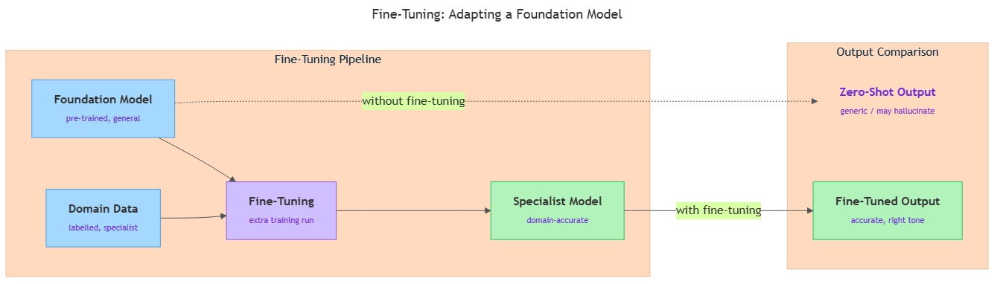

<!-- GENERATED FILE — DO NOT EDIT BY HAND.
     Cresent view of 11.2 — Fine-Tuning.
     Source of truth: CIT 4.2.
     Regenerate: python Cresent/Technical/tools/generate_shared_readings.py -->
<!-- nav:top:start -->
Previous: [⬅ 11.1 — Foundation Models](../11-1-foundation-models/reading.md)&emsp;·&emsp;[⬆ Table of Contents](../../../../../../README.md#part-b)&emsp;·&emsp;[11.3 — RAG (Concept) ➡](../11-3-rag-concept/reading.md)
<!-- nav:top:end -->

---

# Fine-tuning — adapting a foundation model on domain-specific data

## Overview

A foundation model is trained once on enormous, general data — it knows a great deal about language and the world in broad terms. But "broad" is not always enough. A hospital, a law firm, or a software team often needs a model that speaks their specific language, follows their exact formats, and produces the kinds of outputs their domain demands. Fine-tuning is the process that closes that gap: you take an existing foundation model and continue its training on a small, focused dataset from your domain. The result keeps the model's broad knowledge while adding a specialist layer on top — without the cost of training a new model from scratch.

## Key Concepts

### What fine-tuning is

**Fine-tuning** — the process of taking a foundation model that already exists and continuing its training on a smaller, domain-specific dataset so that the model's behaviour is adjusted to suit a particular task or domain. [1]

Think of it like this. You hire a highly educated generalist — someone who has read widely across law, medicine, finance, and technology. On day one they can hold a conversation on almost any topic. But if you need them to handle your hospital's patient intake process, there is a gap: they do not know your hospital's terminology, your specific forms, or the way your staff communicates. You do not send them back to university. You give them a focused training period — your procedures, your document templates, your FAQs — and after a few weeks they are effective in your specific context. Fine-tuning works the same way for AI models. [2]

To understand fine-tuning it helps to recall how a foundation model was originally built (from topic 4.1). During that original training — called **pre-training** — the model was exposed to billions of web pages, books, and other text. Its internal numerical settings (called parameters) were adjusted repeatedly until the model got good at predicting patterns in that data. That process ran for weeks on specialised hardware and cost millions of dollars.

**Pre-trained model** — a foundation model as it exists after its original large-scale training; the starting point for fine-tuning. The word "pre-trained" simply means "already trained before you started working with it."

Fine-tuning does not repeat that enormous process. It picks up the already-trained model and runs additional training on a new, much smaller dataset. Because the model already has a strong general foundation, this additional training is far shorter, cheaper, and requires far less data. [1][2]

### Domain-specific data — the central ingredient

**Domain** — a specific area of knowledge or activity, such as healthcare, legal services, finance, or software engineering.

Rather than listing all three related terms at once, it helps to build up to them. You start with a domain — say, healthcare. Within that domain you collect examples of real inputs and the correct outputs you want: clinical notes paired with correct diagnoses, or medical questions paired with expert answers. That collection is your **domain-specific data** — training examples drawn from one area of expertise that show the model what "correct" looks like in that context. [1]

A key property of good fine-tuning data: it is **labelled**. Each example shows not just an input, but a correct or preferred output. The model learns by comparing what it produces to the labelled answer and adjusting its parameters to reduce the gap. [2]

**Labelled data** — training examples where a human (or a trusted process) has already provided the correct answer or desired output. For example: a customer question paired with the correct answer, or a medical note paired with the correct diagnostic category.

Data quality is the single biggest factor in whether fine-tuning succeeds. A few thousand high-quality, well-labelled examples will outperform tens of thousands of noisy, inconsistent ones. [2][3]

### The fine-tuning flow — before and after

The diagram below captures the central idea: a pre-trained model plus domain-specific data enters the fine-tuning process and produces a specialist model. That specialist model handles domain tasks far better than a zero-shot call to the original would.

*Fine-tuning flow: pre-trained model + domain data → fine-tuning → specialist model (vs. zero-shot output)*

**Zero-shot use** — prompting a foundation model with a task it was never specifically trained or adapted for, relying entirely on the general knowledge from pre-training. [2] Zero-shot use works well for general tasks, but in specialist domains the model may not know the right terminology, may use the wrong tone, or may produce plausible-sounding but inaccurate content — a failure mode called **hallucination**.

**Hallucination** — when an AI model produces output that sounds confident and fluent but is factually incorrect or fabricated. Hallucinations are more common in specialist domains where the model's general training data was sparse. Fine-tuning on accurate domain data can reduce (but not eliminate) hallucinations in that domain.

Fine-tuning directly addresses zero-shot limitations by teaching the model the domain's specific language, preferred formats, and correct outputs. [1][3]

### How fine-tuning improves performance without erasing general knowledge

Why does continuing training on a small dataset improve specialist performance without destroying what the model already knows?

The model does not start from a blank state — its parameters already encode broad knowledge. Fine-tuning adjusts those parameters in ways that emphasise domain-relevant patterns without overwriting the rest. Think of it as recalibrating an instrument, not rebuilding it from parts. [2]

There is, however, a real risk called **catastrophic forgetting** — a phenomenon where a model trained heavily on new data loses some of its previously learned general abilities.

**Catastrophic forgetting** — the tendency of a model to partially overwrite previously learned knowledge when trained intensively on new data. Fine-tuning mitigates this by keeping the new dataset small and targeted.

Good fine-tuning practice keeps the dataset small and targeted, which minimises this risk. This is why fine-tuning is not simply "more training" — it requires care. [2]

### Fine-tuning vs. pre-training — a clear comparison

It is easy to confuse fine-tuning with training a model from scratch. The table below makes the contrast clear:

| Aspect | Pre-training (original training) | Fine-tuning |
|---|---|---|
| Starting point | Random parameters — model knows nothing | A fully trained foundation model |
| Dataset size | Massive — trillions of words or equivalent | Small to medium — thousands to millions of examples |
| Time and cost | Weeks of compute, tens of millions of dollars | Hours to days, a fraction of the cost |
| Who does it | Large technology companies, research labs | Businesses, developers, domain experts |
| Goal | Teach language, concepts, and general knowledge | Adjust behaviour for a specific domain or task |

[1][2]

The key insight: fine-tuning is only possible because pre-training happened first. The foundation is what makes fine-tuning fast and affordable.

## Worked Example

### Fine-tuning a customer support model

Imagine a mid-sized e-commerce company. Their foundation model can answer general questions well, but when customers ask about the company's return policy, specific product details, or internal ticket categories, the model gives generic or wrong answers.

Here is how fine-tuning would work for them, step by step:

1. **Choose a base model.** The team selects a pre-trained LLM (Large Language Model) — a type of foundation model trained primarily on text — that handles language tasks well. [1]

2. **Assemble labelled domain data.** The team exports three years of resolved support tickets: each ticket contains the customer's original question and the approved agent response. They clean the data, remove duplicates, and check that the answers are accurate. The result is 8,000 question-answer pairs. This is often the most time-consuming step. [2][3]

3. **Run additional training.** The labelled dataset is fed into the pre-trained model and additional training rounds begin. The model processes each example, compares its output to the labelled answer, and adjusts its parameters slightly. It runs through the dataset several times — each complete pass through the dataset is called an **epoch**.

   **Epoch** — one complete pass through a training dataset. Fine-tuning typically uses a small number of epochs (often 3–10) to avoid catastrophic forgetting and overfitting.

4. **Evaluate on held-out examples.** The team keeps a separate set of 1,000 examples — called a held-out test set (a portion of the data set aside specifically for testing, never used in training) — that the model has never seen. They test the fine-tuned model on this set and compare its answers to the labelled correct answers. Performance is clearly better than the original model on company-specific questions.

   **Overfitting** — when a model learns the training examples too precisely and performs well on those specific examples but poorly on new, unseen inputs. Using a held-out test set helps detect overfitting.

5. **Deploy.** Once satisfied, the fine-tuned model is made available through an API (Application Programming Interface — a connection point that lets other software send requests and receive responses) that the company's support platform calls. [1]

The company now has a model that knows their product catalogue, their return policy wording, and their tone — things no general model could know without this process.

## In Practice

Fine-tuning is already in widespread use across industries. The pattern is consistent: an organisation has domain-specific data, a clear use case, and accuracy requirements that zero-shot use alone cannot meet. [1]

**Common real-world scenarios:**

- **Healthcare.** Hospitals fine-tune LLMs on clinical notes, medical literature, and diagnostic guidelines to build tools that assist clinicians. A model trained on radiology reports can help draft preliminary interpretations — while the radiologist retains final sign-off. [3]
- **Legal services.** Law firms fine-tune models on contracts, legislation, and case law to summarise documents, flag unusual clauses, or answer questions about jurisdiction-specific rules. A zero-shot model would lack the required specialist vocabulary. [2][3]
- **Customer support.** Companies fine-tune models on their own support ticket history so the model knows their products, policies, and preferred tone — far better than a general model could. [1]
- **Software development.** Technology teams fine-tune models on their internal codebases and style guides to build coding assistants that understand company-specific frameworks and naming conventions. [2]

**Best-practice principles:**

- **Start with a strong base model.** The quality of the fine-tuned model is bounded by the quality of the starting foundation model. Begin with the best base model you can access. [1]
- **Invest in data quality over data quantity.** Accurate, representative, well-labelled examples consistently outperform large volumes of noisy data. [2][3]
- **Keep the dataset targeted.** The domain-specific data should closely reflect the real inputs the deployed model will receive. Loosely related data produces a loosely adapted model. [1]
- **Always evaluate on held-out data.** Never judge quality by performance on training examples — that will always look good even if the model is overfitting. Test on data that was kept separate from training. [2]
- **Monitor after deployment.** Domain language evolves. New products, new regulations, and new terminology can make a fine-tuned model go stale. Build in a process for periodic re-evaluation and re-fine-tuning. [1][3]
- **Know when fine-tuning is not the right tool.** Fine-tuning requires labelled data and works best when the task and domain are stable. If requirements change frequently or the model needs access to information that post-dates its training, other adaptation methods — covered in topics 4.3–4.5 — may be more appropriate. [2]

## Key Takeaways

- **Fine-tuning** is the process of continuing a foundation model's training on a smaller, domain-specific dataset. It is adaptation, not starting over — the expensive pre-training is already done; fine-tuning builds a specialist layer on top. [1]
- **Domain-specific labelled data** is the central ingredient. Data quality matters more than data quantity — accurate, well-labelled examples produce better results than large volumes of noisy ones. [2][3]
- Fine-tuning follows a consistent sequence: choose a base model, assemble labelled data, run additional training, evaluate on held-out examples, and deploy. Cloud platforms such as AWS SageMaker JumpStart make this workflow accessible to teams that are not AI specialists. [1]
- Fine-tuning outperforms zero-shot use in specialist domains because it teaches the model the domain's specific language, tone, and correct outputs — reducing generic responses and domain hallucinations. [2][3]
- Fine-tuning has limits: it requires labelled data, works best for stable tasks, and carries risks such as catastrophic forgetting and overfitting if not done carefully. When requirements change frequently or up-to-date information is needed, other adaptation methods covered in topics 4.3–4.5 may be more appropriate. [2]

## References

[1] Amazon Web Services. "Domain Adaptation Fine-Tuning." *AWS SageMaker Developer Guide*. https://docs.aws.amazon.com/sagemaker/latest/dg/jumpstart-foundation-models-fine-tuning-domain-adaptation.html

[2] Outlier AI. "Fine-Tuning LLMs: A Complete Guide." *Outlier Blog*. https://outlier.ai/blog/fine-tuning-llm

[3] Open Source For You. "How to Fine-Tune LLMs for Domain-Specific Adaptation." *Open Source For You*, April 2026. https://www.opensourceforu.com/2026/04/how-to-fine-tune-llms-for-domain-specific-adaptation/

---
<!-- nav:bottom:start -->
Previous: [⬅ 11.1 — Foundation Models](../11-1-foundation-models/reading.md)&emsp;·&emsp;[⬆ Table of Contents](../../../../../../README.md#part-b)&emsp;·&emsp;[11.3 — RAG (Concept) ➡](../11-3-rag-concept/reading.md)
<!-- nav:bottom:end -->
