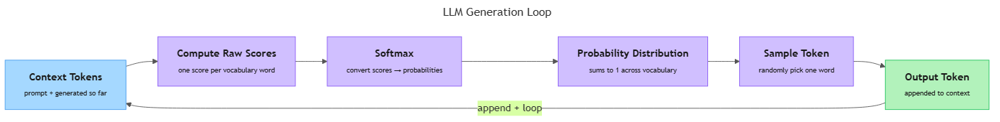

<!-- GENERATED FILE — DO NOT EDIT BY HAND.
     Cresent view of 12.3 — Probability Distributions.
     Source of truth: CIT 7.4.
     Regenerate: python Cresent/Technical/tools/generate_shared_readings.py -->
<!-- nav:top:start -->
Previous: [⬅ 12.2 — Temperature](../12-2-temperature/reading.md)&emsp;·&emsp;[⬆ Table of Contents](../../../../../../README.md#part-b)&emsp;·&emsp;[12.4 — Hallucination ➡](../12-4-hallucination/reading.md)
<!-- nav:top:end -->

---

# Why LLMs Output a Probability Distribution, Not a Single Fixed Answer

## Overview

Have you ever asked an AI chatbot the same question twice and received two different answers? That is not a glitch. It is exactly how an LLM (Large Language Model) is designed to work [1]. At every step of writing a response, the model does not look up a fixed answer — it computes a list of possible next words, each with a score, and then picks one at random. This topic explains what that list is, how it is built, and why the picking step makes LLM outputs variable by design.

Understanding this process will help you make better use of AI tools — and it will also explain why a confident-sounding answer is not the same as a correct one.

## Key Concepts

### Tokens — what the model reads and writes

An LLM does not read whole sentences at once. It reads and writes one **token** at a time.

**Token** — a chunk of text the model treats as a single unit. In English, a token is roughly a word or part of a word. "Running" is usually one token. "Unbelievable" might become two tokens: "un" and "believable." A space, a punctuation mark, and a common short word like "the" are each one token [1][2].

Why tokens and not whole words? Because a fixed list of every possible word in every language would be unmanageably large. Tokens are a practical middle ground: a **vocabulary** of roughly 50,000 to 100,000 tokens covers virtually any English text by combining parts [2].

**Vocabulary** — the complete, fixed list of all tokens the model knows. Think of it as the model's alphabet, except instead of 26 letters it has tens of thousands of entries. The vocabulary is locked at training time; the model cannot invent new tokens.

### Probability distribution over the vocabulary

At each step of generating a response, the LLM assigns a score to every single token in its vocabulary. The result is a **probability distribution over the vocabulary**.

A probability distribution is a list where:

- every token in the vocabulary has an entry,
- each entry's score is a number between 0 and 1 representing how likely that token is to come next, and
- all the scores add up to exactly 1.0 [1][2].

This is the same idea you met in topic 7.1: a complete set of outcomes, each with a probability, that sum to 1. Here the outcomes are tokens, and the "event" is "which token comes next."

Here is a small example. The model has just seen the text "The sky is" and is choosing the next token. A slice of the distribution might look like this:

| Next token | Probability |
|---|---|
| "blue" | 0.55 |
| "clear" | 0.18 |
| "dark" | 0.12 |
| "grey" | 0.08 |
| "falling" | 0.04 |
| (all other tokens combined) | 0.03 |

Every token in the full vocabulary has a score. "Blue" scores highest — but all the others are non-zero [1].

### Softmax — turning raw scores into probabilities

The model does not start with a tidy list of probabilities. It starts with **raw scores** — one number per token, which can be any value: positive, negative, large, or tiny. These raw scores are not yet probabilities because they do not sum to 1.

To convert them, the model applies a function called **softmax**.

**Softmax** — a function that takes a list of raw scores and converts them into probabilities that sum to 1. Tokens with higher raw scores get higher probabilities; tokens with lower scores get lower probabilities. No probability is forced to zero [2].

You do not need to memorise the formula. The intuition is:

1. The model's internal calculations produce one raw score per token based on the current context.
2. Softmax converts those scores into a fair competition — every token gets a probability.
3. The result is a proper probability distribution, exactly as defined in topic 7.1.

Softmax is the bridge between the model's internal arithmetic and the probability language you already know [1][2].

### The diagram below shows how these pieces fit into the full loop

*The LLM generation loop: context tokens feed in on the left, raw scores become a probability distribution via softmax, one token is sampled, and the output token is appended back to the context for the next iteration.*

### Sampling — why the same prompt gives different answers

Once the model has a probability distribution, it needs to choose exactly one token. It does this through **sampling**.

**Sampling** — picking one item from a list at random, where each item's chance of being picked equals its probability in the distribution. Higher-probability items are more likely to be chosen, but they are not guaranteed to be chosen every time [3].

Think of it as a weighted lottery. In topic 7.1 you studied equally likely outcomes where each has probability 1 divided by the total number of outcomes. Sampling from a probability distribution is the generalised version: outcomes are not equally likely, but the chance of picking each one matches its assigned weight.

Using the example from above: if the model samples from that distribution, "blue" will be chosen roughly 55% of the time. The other 45% of the time, something else is picked — "clear," "dark," "grey," and so on. Run the same prompt twice, and you might get "The sky is blue" once and "The sky is clear" the next time [3].

This is why LLMs are **stochastic** systems, not **deterministic** ones.

| Property | Deterministic system | Stochastic system |
|---|---|---|
| Definition | Same input always gives same output | Same input can give different outputs |
| Example | A calculator computing 2 + 2 | An LLM generating a response |
| Source of variation | None | Randomness in the sampling step |
| Predictability | Fully predictable | High-probability outcomes are likely but not certain |

The randomness in sampling is not a bug — it is a deliberate design choice that produces more varied, natural-sounding language [1][3].

### The generation loop — one token at a time

An LLM does not write a complete response all at once. It generates text one token at a time, in a loop. Each pass through the loop produces one token, that token is added to the context, and the loop runs again [1][2].

Each iteration has three steps:

1. **Take in the context.** The model reads all tokens so far — your original prompt plus every token generated in earlier iterations.
2. **Compute a probability distribution.** Using that full context, the model produces a fresh distribution over all tokens in the vocabulary via softmax. The context shapes the distribution — this is conditional probability from topic 7.2 in action: the probability of the next token depends on all previous tokens [1][2].
3. **Sample one token.** The model picks one token from the distribution. That token is appended to the growing output.

The loop continues until the model samples a special end-of-sequence token, or until a maximum length is reached.

## Worked Example

Here is a trace of the generation loop producing the phrase "The sky is blue today."

| Iteration | Context fed to model | Top token in distribution | Token sampled |
|---|---|---|---|
| 1 | "The sky is" | "blue" (0.55) | "blue" |
| 2 | "The sky is blue" | "today" (0.42) | "today" |
| 3 | "The sky is blue today" | [END] (0.81) | [END] — stop |

Now trace what would happen if the sampling at iteration 1 had landed on "clear" instead of "blue":

- Iteration 2 would start from the context "The sky is clear" — a different context produces a different distribution.
- The word "today" might not score highly from that new context; a word like "and" or "tonight" might dominate instead.
- By iteration 3, the entire response would look different from the original.

This is the **cascade effect**: one different choice early in the loop ripples forward through every subsequent step [3]. It explains why two runs of the same prompt can diverge substantially after just a few tokens — even when the initial probabilities were similar.

**Step-by-step summary of the full procedure:**

1. Split the user's prompt into tokens using the model's vocabulary.
2. Pass the token sequence to the model; it processes the full context.
3. The model produces one raw score per token in the vocabulary.
4. Apply softmax to convert raw scores into a probability distribution.
5. Sample one token from the distribution.
6. Append the sampled token to the context.
7. If the sampled token is the end-of-sequence signal, or the maximum length is reached, stop. Otherwise, return to step 3.

A 100-token response means the loop ran 100 times [1][2].

## In Practice

**Chat assistants.** When you ask a chat assistant a question, the model runs the generation loop until it produces a complete response. Because each token is sampled, asking the same question twice can yield different wording, different emphasis, or even different information [1][3].

**Phone keyboard autocomplete.** Your phone's keyboard shows you the three most likely next words. That shortlist comes from a small model doing exactly this process: taking your last few words as context, computing a distribution, and displaying the top entries. The full distribution runs in the background — you only see the surface [2].

**AI writing tools.** A tool that "continues" a paragraph is running the generation loop until it reaches a paragraph boundary. Clicking "regenerate" produces a different continuation from the same starting text — the stochastic sampling step in direct action [3].

**High-stakes settings — a caution.** Because LLMs sample from a distribution rather than look up verified facts, the model can and does sample low-probability but plausible-sounding tokens — including incorrect claims that fit the language context well. A high-probability output fits the model's training data patterns; it does not mean the output is factually true. Human review remains important in medical, legal, and other high-stakes settings [1][3].

**Do:**

- Expect variation. Different answers to the same prompt are the stochastic system working as designed — not an error.
- Run the same prompt several times when accuracy matters. Consistent answers across runs are a stronger signal than a single answer.
- Remember that a confident-sounding output and a correct output are different things.

**Don't:**

- Assume the model "knows" the answer and is choosing how to phrase it. It assigns probabilities based on language patterns in training data.
- Treat two different responses as evidence of a broken system. Variation is a property of stochastic systems.
- Confuse high probability with certainty. A 0.90 probability token is chosen 90% of the time — but 10% of the time something else is chosen.

## Key Takeaways

- **At every step, an LLM computes a probability distribution over its entire vocabulary — not a fixed answer.** Every token gets a score; all scores sum to 1.
- **Softmax converts the model's raw scores into a valid probability distribution.** It is the step that turns internal arithmetic into the probability language from topic 7.1.
- **Sampling introduces randomness.** The model does not always pick the highest-scoring token. It draws from the distribution, so the same prompt can produce different outputs on different runs.
- **The generation loop runs one token at a time.** Each iteration takes the full context, recomputes the distribution, and samples one token. Early sampling choices cascade forward through every later iteration.
- **LLMs are stochastic systems, not deterministic ones.** This is by design — sampling from the distribution produces more varied, natural language than always picking the top token would. How much randomness is injected is controlled by a setting you will explore in the next topic.

## References

[1] PromptQuorum. "How LLMs Actually Work." *Prompt Engineering*. https://www.promptquorum.com/prompt-engineering/how-llms-actually-work

[2] Ozerdem, H. "The Anatomy of an LLM — Tokenization, Attention, and the Art of Probability." *Medium*. https://hakanozerdem.medium.com/the-anatomy-of-an-llm-tokenization-attention-and-the-art-of-probability-d3a68a4e0fc7

[3] Lucas, N. "LLMs Do Know What They're Going to Say." *DEV Community*. https://dev.to/nicklucas/llms-do-know-what-theyre-going-to-say-54mh

---
<!-- nav:bottom:start -->
Previous: [⬅ 12.2 — Temperature](../12-2-temperature/reading.md)&emsp;·&emsp;[⬆ Table of Contents](../../../../../../README.md#part-b)&emsp;·&emsp;[12.4 — Hallucination ➡](../12-4-hallucination/reading.md)
<!-- nav:bottom:end -->
