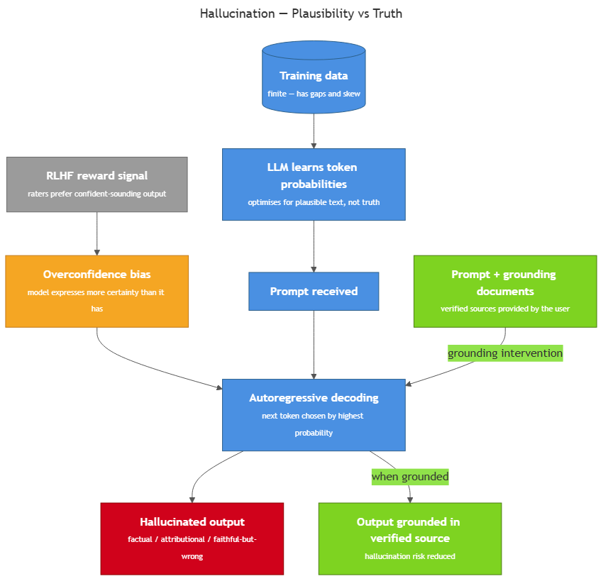
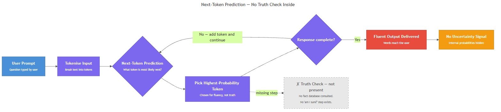
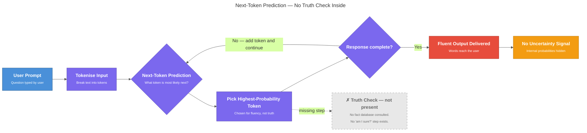

<!-- GENERATED FILE — DO NOT EDIT BY HAND.
     Cresent view of 12.4 — Hallucination.
     Source of truth: CIT 3.9, CIT 5.2.
     Regenerate: python Cresent/Technical/tools/generate_shared_readings.py -->
<!-- nav:top:start -->
Previous: [⬅ 12.3 — Probability Distributions](../12-3-probability-distributions/reading.md)&emsp;·&emsp;[⬆ Table of Contents](../../../../../../README.md#part-b)&emsp;·&emsp;[12.5 — Context and Prompting Basics ➡](../12-5-context-and-prompting-basics/reading.md)
<!-- nav:top:end -->

---

# Hallucination — What It Is and Why It Happens

## Overview

In topic 3.2 you were introduced to the idea that an LLM (Large Language Model) can produce output that sounds plausible but is false — this is called **hallucination**. This topic goes deeper: you will learn what hallucination actually looks like, why it is built into the way LLMs work, and what you can do to reduce its impact. Understanding hallucination is one of the most practically important things you can know before using any AI tool on real work.

## Key Concepts

### Three Types of Hallucination

Not all hallucinations are the same. Three distinct types appear in practice, and each requires a different kind of check [2][3]:

| Type | What it means | Quick example |
|---|---|---|
| **Factual hallucination** | The model states a fact that is simply wrong | "The Eiffel Tower was built in 1901." (It was 1889.) |
| **Attributional hallucination** | The model correctly describes something but credits the wrong source | "Case Smith v. Jones, 2019, ruled that …" — the case does not exist. |
| **Faithful-but-wrong hallucination** | The model follows the logic of an incorrect premise and produces a coherent but wrong conclusion | A user provides wrong project dates; the model calculates milestones that are internally consistent but wrong in the real world. |

All three types share one critical feature: the model's tone, phrasing, and punctuation look identical whether the content is accurate or fabricated. There is no obvious "tells you something is wrong" signal in the output itself.

### The Structural Mechanism — Why Hallucination Cannot Be Patched Away

To understand why hallucination is not a fixable bug, return to what you learned in topics 3.2 and 3.4. An LLM does one thing at its core: **given the tokens it has seen so far, it predicts the most plausible next token.** This process — autoregressive decoding — repeats token by token to build the full response.

Here is the critical point: **"most plausible" is not the same as "most true."**

The model has no internal fact-checking system. It has no database it queries before answering. It cannot distinguish between a statement it has seen many times in training data (and therefore assigns a high probability) and a statement that is objectively correct [1].

Consider a simple case. When the model sees "The capital of France is ___", the word "Paris" has an extremely high probability because that pattern appeared thousands of times in training data. The model produces "Paris" — and it is correct. But when someone asks "What did researcher X say in paper Y from 2023?", the model has no direct access to that paper. It generates a plausible-sounding answer by combining patterns from related text it has seen. If those patterns do not contain the exact truth, the model invents a plausible substitute — and delivers it with the same confident tone as the Paris answer.

A peer-reviewed analysis confirmed this formally: because LLMs are trained to optimise for text that resembles their training data, any model trained on a finite dataset will inevitably produce false statements for some inputs. Hallucination is not a failure of implementation; it is a consequence of the architecture [1]. Scale reduces hallucination frequency — it does not eliminate it [1].

*How token-by-token prediction leads to hallucination: the model optimises for plausibility, not truth, and grounding or RAG can intervene to reduce that gap.*

### Contributing Cause 1 — Training Data Gaps

**Training data** is the large collection of text the model learned from during pre-training. Three problems arise from that data [2]:

- **Gap.** The training set does not contain everything. Events after the training cut-off date, obscure local facts, and niche technical details are under-represented or absent. When a user asks about a gap, the model has no true answer — but it generates one anyway, drawn from related patterns.
- **Skew.** Popular misconceptions that circulate widely online can be over-represented relative to the actual truth. The model may assign a high probability to the wrong answer precisely because many people wrote it down.
- **No provenance tracking.** **Provenance** — the record of where a piece of information came from — is something LLMs do not store. A claim from a peer-reviewed paper and a claim from a random blog post may have received exactly the same weight during training. The model cannot tell you where a fact came from, because it never stored that connection.

### Contributing Cause 2 — RLHF and Overconfidence Bias

**RLHF (Reinforcement Learning from Human Feedback)** is a technique where human raters score model outputs and the model is updated to produce higher-rated responses. It is widely used to make LLMs more helpful and polite.

But RLHF creates a subtle pressure toward hallucination [2]:

1. Human raters often prefer responses that sound confident and complete.
2. A response that says "I am not certain, but the answer might be X" is frequently rated lower than one that says "The answer is X" — even when X is wrong.
3. Over many training rounds, the model learns that confident-sounding output earns better ratings.

The result is **overconfidence bias** — the model's expressed certainty does not match the reliability of its output [2]. Confidence becomes a stylistic feature, not a signal of accuracy. This matters because it means the model will state a hallucinated fact with exactly the same assured tone as a correct one.

### Mitigation Strategies

Hallucination cannot be eliminated, but three strategies reduce its impact [2]:

| Strategy | What you do | Limitation |
|---|---|---|
| **Verification** | Check every factual claim independently against a reliable source | Time-intensive; you must know where to look |
| **Grounding** | Paste verified source documents into the prompt so the model works from known text | Only helps for content the documents cover |
| **RAG (Retrieval-Augmented Generation)** | A system automatically retrieves verified documents before generating | Requires technical setup; covered in a later topic |
| **Calibration signals** | Use systems that flag uncertainty explicitly | Not all systems provide these; topic 3.8 covers calibration |

**Grounding** means tying the model's output to specific documents you provide — instead of asking "What does the research say about X?", you paste the actual research text into the prompt and ask the model to answer from that text only. **RAG** is a technical architecture that automates this process; you will encounter it in a later topic.

## Worked Example

**Scenario:** A student asks an AI assistant for a citation to include in a psychology paper.

**Prompt:** "Give me a published academic paper on cognitive load theory from 2022. Include the full citation — title, authors, journal, and year."

**AI response:** "Here is a relevant paper: *Cognitive Load and Working Memory in Digital Learning Environments* by Sweller, J. & Kalyuga, S. (2022). *Journal of Educational Psychology*, 114(3), 412–428."

The response looks exactly like a real citation. The author names are real researchers in this field. The journal is real. The year, volume, and page numbers are formatted correctly.

**The student submits it.** Their professor attempts to locate the paper. It does not exist. The volume, issue, and pages do not correspond to any real article. The authors are real, but they did not write this paper.

**Why did this happen?**

1. The model had seen many thousands of psychology citations in its training data. It learned that a citation matching the pattern *[Author], [Year], [Journal], [Volume]* is "plausible text" in this context.
2. It had no access to a journal database. It generated token by token, picking the most plausible continuation at each step — a real-sounding author name, a real journal name, plausible numbers.
3. RLHF trained the model to provide complete, confident answers. Saying "I cannot verify that this paper exists" would likely have been rated lower by human raters than providing a well-formatted citation.
4. The model had no provenance record. It could not flag that this specific combination of author, title, and journal was never actually in its training data — it simply combined familiar patterns into a new, plausible-looking whole.

The student would not have known anything was wrong without independently verifying the source. The format of a hallucinated citation is indistinguishable from the format of a real one.

## In Practice

### A Five-Step Hallucination Check

Use this process whenever an AI provides a factual claim that matters [2]:

1. **Request a specific, verifiable claim.** Ask the AI for a fact, citation, statistic, or name. Specific, narrow claims are easier to check than broad summaries.
2. **Record the claim exactly.** Copy the AI's output verbatim — the title, author name, date, or statistic. You want to check what the AI actually said, not your paraphrase of it.
3. **Search for the source independently.** Use a search engine, library database, or official record. Do not ask the AI to verify its own output — a model that hallucinated a claim will typically affirm it when asked to double-check.
4. **Compare the AI claim to what you found.** Four outcomes are possible:
   - Source exists and matches — no hallucination detected here.
   - Source exists but the claim is wrong (wrong date, wrong author) — attributional or factual hallucination.
   - Source does not exist at all — fabrication hallucination.
   - Source cannot be found — treat as suspected hallucination; flag for review.
5. **Document your finding.** Record what the AI said, what you found, and the discrepancy. This turns checking into a repeatable habit.

### Do and Don't

**Do:**
- Treat every AI-generated factual claim as unverified until you have checked it independently.
- Use grounding — paste source documents into the prompt — when accuracy matters and you have access to reliable sources.
- Check citations character by character: exact title, exact author spelling, year, journal name.

**Do not:**
- Ask the AI to verify its own output. A model that hallucinated a claim will typically affirm it when asked to double-check [2].
- Assume that confident tone equals accurate content. Confidence is a trained style, not a reliability signal [2].
- Assume that larger or newer models do not hallucinate. Scale reduces frequency; it does not eliminate hallucination [1].
- Use AI-generated citations in any formal document without independent verification [3].

## Key Takeaways

- **Hallucination is structural, not incidental.** Because LLMs predict the most plausible next token rather than the most true statement, generating false content is a built-in property of the architecture — not a bug that can be patched [1].
- **Three distinct types exist, each requiring its own check.** Factual hallucination (wrong facts), attributional hallucination (right content, wrong source), and faithful-but-wrong hallucination (coherent but built on a bad premise) can each appear in the same response [2][3].
- **Training data gaps and RLHF overconfidence bias amplify the problem.** Under-represented facts get fabricated; confident-sounding output gets rewarded by raters, training models to overstate certainty [2].
- **Mitigation is possible but requires discipline.** Verification, grounding, and retrieval-augmented generation reduce risk; no current technique eliminates hallucination entirely [2].
- **Format is not a reliability signal.** Hallucinated output looks identical to correct output — a fabricated citation is formatted exactly like a real one. Always verify independently before using AI-generated facts in consequential work [3].

## References

[1] Huang, L., et al. (2024). "A Survey on Hallucination in Large Language Models: Principles, Taxonomy, Challenges, and Open Questions." *arXiv*. https://arxiv.org/abs/2401.11817

[2] Lakera. "A Guide to Hallucinations in Large Language Models." https://www.lakera.ai/blog/guide-to-hallucinations-in-large-language-models

[3] MorphLLM. "AI Hallucination Examples." https://www.morphllm.com/ai-hallucination-examples

---

# Hallucination — why AI states falsehoods confidently

## Overview

Large Language Models (LLMs) sometimes produce false information written in fluent, authoritative prose — and show no sign that anything is wrong. This specific failure is called **hallucination**. You already know from topic 3.9 that it exists, and from topic 5.1 that it causes real harm. This topic goes one level deeper: it explains the exact mechanism that makes an LLM state falsehoods confidently, and why the model cannot simply say "I don't know."

*Next-Token Prediction — No Truth Check Inside*

## Key Concepts

### Next-token prediction — the engine behind every word

Every word an LLM writes comes from one repeated action: **next-token prediction** — looking at all the text so far and picking the most statistically likely next token [1].

Here is how that works, step by step:

1. You type: "Who wrote the play Hamlet?"
2. The model looks at those tokens and asks: *What token is most likely to come next?*
3. It picks "William."
4. Now the context is your question plus "William." It asks again.
5. It picks "Shakespeare."
6. This continues — one token at a time — until the response is complete.

There is no separate step where the model checks a database of facts. There is no step where it asks itself "am I sure this is true?" It is always, only, asking: **what text is most likely to come next?** [1]

This means correct answers and hallucinated answers come from exactly the same mechanism. The only difference is whether the patterns the model learned happened to match something true in the world.

*Figure: The next-token prediction loop — no truth-check step inside.*

### No built-in uncertainty signal

When a human is unsure of something, they feel it. They say "I think" or "I'm not certain." An LLM has no equivalent internal state [1].

The model does produce internal probability scores — a mathematical ranking of how likely each next word is. But those numbers are hidden from you. What you receive is only the words the model chose: fluent, coherent-sounding prose [2].

**Calibration** — whether a model's internal confidence scores actually reflect how often it is correct — is a key concept here. A well-calibrated model would assign high confidence to answers it usually gets right, and low confidence to answers it often gets wrong. Current LLMs are frequently **miscalibrated**: they can assign high probability to tokens that produce false statements [2].

The result: the model's internal maths can be very confident about a wrong answer, and that shows up on your screen as authoritative-sounding text.

### Two types of hallucination

Researchers distinguish two types [2][3]:

| Type | What happened | Quick signal |
|---|---|---|
| **Intrinsic** | Model contradicts source material it was given | Check the source you provided |
| **Extrinsic** | Model invents content with no supporting source | Content cannot be verified anywhere |

- **Intrinsic hallucination** — the AI produces output that directly contradicts information provided in the prompt or training data. *Example: you paste in a report and ask for a summary. The summary says the report recommends Option A. The document actually recommends Option B.*
- **Extrinsic hallucination** — the AI produces output that cannot be verified against any source. The fabricated legal citations in the next section are a classic example [3].

Both types appear as confident, fluent text. On the surface, they are indistinguishable from correct output.

> **Taxonomy note:** Topic 3.9 introduced a three-type system — factual, attributional, and faithful-but-wrong. Both frameworks describe the same failures: intrinsic hallucinations map to attributional errors (the model contradicts a provided source); extrinsic hallucinations cover factual invention and faithful-but-wrong cases (the model produces plausible but unsupported content). Which taxonomy you encounter depends on the source — both are in active use.

### Why the model cannot just say "I don't know"

This surprises most beginners. The short answer: the model was not built to track what it knows versus what it does not. It was built to produce fluent text that continues a prompt.

"I don't know" is just another possible sequence of tokens. Whether the model outputs those tokens depends on whether its training included examples of saying "I don't know" in contexts that match your prompt — not on whether the model has a genuine assessment of its own knowledge [1].

There is a deeper issue. The model learned from human-written text. Humans mostly write text that asserts things — explains facts, tells stories, states conclusions. The web contains far more confident assertions than admissions of uncertainty. So the model learned a style that matches that distribution: confident, assertive, helpful-sounding prose [2].

This is why the phenomenon is called hallucination rather than simply "errors." The model does not know it is wrong. It is doing exactly what it was trained to do — and that process generates false statements with the same fluency it uses for true ones.

## Worked Example

In a published evaluation of an LLM-based clinical information tool, researchers asked the system for current treatment guidelines on a common autoimmune condition. The model returned a response citing a specific clinical study — journal name, publication year, author list, and a paraphrased conclusion, all formatted exactly like a valid medical reference. The study did not exist. A search of the journal's actual archive found no such publication [2].

Walk through why this happened using next-token prediction:

1. The clinician asked for evidence-based treatment guidance.
2. The model had seen large amounts of medical literature during training — clinical citations appear in a consistent, learnable pattern.
3. At each step, the model asked: *what token is most likely next given the context of a medical citation?*
4. It generated a journal name, author names, a publication year, and a conclusion that were statistically plausible — they matched the surface patterns of real citations.
5. At no step did the model check whether that specific study actually exists in any database.
6. The output was extrinsic hallucination: content invented with no supporting source.

The model showed no hesitation and no warning. It presented the fabricated citation with the same confident tone it uses for information drawn directly from its training data — indistinguishable from a correct reference to a clinician who did not independently verify it [2].

## In Practice

Hallucination happens across all types of LLM use — but the harm depends on the domain.

**Where hallucination is most dangerous** — the high-stakes domains from topic 5.1:

- **Healthcare** — hallucinated drug dosages, contraindications, or patient history details can cause direct patient harm [1][2].
- **Legal** — fabricated case citations, wrong statutes, incorrect case law.
- **Finance** — invented contract terms, hallucinated figures, wrong regulatory rules.
- **News and information** — false statements spread at scale before anyone checks [2].

**Why confidence makes it worse.** Consider two possible AI outputs:

- *Output A:* "I think the author may have been born around 1820, but you should verify this."
- *Output B:* "The author was born on 14 March 1820 in Edinburgh."

Output B looks more authoritative. Most users trust it more. If both are hallucinations, Output B causes more harm — because a user is far more likely to act on it without checking. LLMs tend to produce Output B [2].

**Pattern to watch for.** Hallucinated content frequently has suspicious precision — exact dates, exact case numbers, exact statistics. These are common in human text, so the model generates them fluently from pattern alone, even when it has no real basis for the specific value [1].

**Name-and-defer.** Researchers have developed approaches to reduce hallucination — including RAG, grounding, and RLHF. These are named here only so you know that solutions exist; they are covered in later topics.

## Key Takeaways

- LLMs produce every word by **next-token prediction** — picking the most statistically likely next token. This process has no built-in truth-checking step. Correct outputs and hallucinated outputs are generated by exactly the same mechanism.
- The model has no internal uncertainty signal it can share with you. The fluent, confident prose it produces is an artifact of training on confident human text — not evidence of accuracy.
- **Intrinsic hallucination** contradicts information the model was given. **Extrinsic hallucination** invents content with no source. Both appear as confident, fluent text — indistinguishable from correct output on the surface.
- The harm from hallucination scales with the stakes of the domain. A hallucinated blog title is harmless. A hallucinated drug dosage or legal citation can cause serious real-world harm.
- The most dangerous aspect of hallucination is not the error itself — it is the confidence that wraps it. Users trust confident outputs, and that trust, when misplaced, is what allows hallucination to cause harm at scale [1].

## References

[1] Atlan. "LLM Hallucinations — What They Are and How They Happen." https://atlan.com/know/llm-hallucinations/

[2] SuperAnnotate. "AI Hallucinations — Causes, Types, and Examples." https://www.superannotate.com/blog/ai-hallucinations

[3] Ji, Z. et al. (2023). "Survey of Hallucination in Natural Language Generation." *arXiv*. https://arxiv.org/pdf/2401.06796

---
<!-- nav:bottom:start -->
Previous: [⬅ 12.3 — Probability Distributions](../12-3-probability-distributions/reading.md)&emsp;·&emsp;[⬆ Table of Contents](../../../../../../README.md#part-b)&emsp;·&emsp;[12.5 — Context and Prompting Basics ➡](../12-5-context-and-prompting-basics/reading.md)
<!-- nav:bottom:end -->
