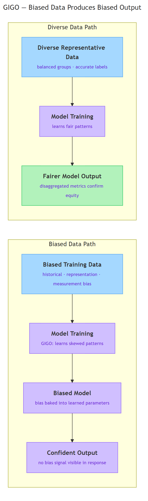

<!-- GENERATED FILE — DO NOT EDIT BY HAND.
     Cresent view of 13.2 — Data Bias.
     Source of truth: CIT 5.3.
     Regenerate: python Cresent/Technical/tools/generate_shared_readings.py -->
<!-- nav:top:start -->
Previous: [⬅ 13.1 — Real Failure Cases](../13-1-real-failure-cases/reading.md)&emsp;·&emsp;[⬆ Table of Contents](../../../../../../README.md#part-b)&emsp;·&emsp;[13.3 — The Four Pillars ➡](../13-3-the-four-pillars/reading.md)
<!-- nav:top:end -->

---

# Data Bias — How Biased Training Data Produces Biased Model Output

## Overview

An AI model learns everything it knows from the data it is trained on. When that data reflects past unfairness or leaves out entire groups of people, the model learns those gaps as if they were facts about the world. The result is **data bias** — a systematic flaw in training data that causes an AI to produce outputs that are consistently skewed or unfair for certain groups. Understanding data bias matters because a biased model delivers its flawed outputs with complete confidence, giving no signal that anything is wrong.

## Key Concepts

### What data bias means and why it sticks

**Data bias** — a consistent pattern in a dataset that causes an AI model trained on it to produce unfair or inaccurate outputs for specific groups, every time, in the same direction [1].

Notice the word "consistent." A few wrong labels in a dataset are random noise — they cancel out. Bias goes in the same direction across thousands of examples. The model learns that skewed pattern and treats it as normal.

Why can't the model just notice and correct the flaw? Because the model has no window onto the real world beyond its training data. It processes examples, adjusts its internal numbers, and learns whatever patterns the data contains. There is no outside check [1].

This is captured by the principle **GIGO (Garbage In, Garbage Out)** — if the data going into the model is flawed, the outputs coming out will be flawed too. The model has no mechanism to fix what it was never shown.

### Three types of data bias

Researchers who study AI fairness have identified several types of data bias. Three are especially important for understanding real-world failures [3].

**Historical bias** — bias that enters training data because the data reflects past human decisions that were themselves discriminatory or unfair [3].

The discrimination happened earlier — in the decisions that generated the data — and the model learns to replicate it. No one at training time needs to act with bad intent. Example: Amazon trained a hiring model on ten years of its own hiring decisions. The technology industry had historically hired fewer women than equally qualified men. The model learned that pattern and ranked women lower going forward — not because anyone programmed it to, but because that is what "successful" hiring looked like in the data [2].

**Representation bias** — bias that enters training data because certain groups are underrepresented or absent, even when no explicit past discrimination caused it [3].

With historical bias, data reflects past unfair decisions. With representation bias, certain groups simply were not included. Consider a facial recognition system trained on datasets where most photos show people with lighter skin tones. The system learns to recognize those faces better. The harm is real: higher rates of misidentification for darker-skinned individuals in consequential settings [1].

**Measurement bias** — bias that enters training data because the way something is measured or labeled works less accurately for some groups than others [3].

The idea is straightforward: if the measuring tool itself is unequal, the data it produces is biased before any model sees it. One documented example: some patient-care AI systems used healthcare spending as a proxy for healthcare need. But patients with lower incomes often spend less even when their health needs are equal or greater, because they have less access to care. A model trained on spending data systematically underestimates the needs of these patients [3].

### Two paths, one mechanism

*The diagram shows two training paths side-by-side: biased input produces a model with bias baked in, delivering confident outputs with no visible bias signal; diverse representative data produces a fairer model whose outputs can be checked across groups.*

Follow the top path in the diagram: biased training data enters model training, the model learns skewed patterns, and those patterns appear in every output — with no label saying "this result may be unfair." The bottom path shows the alternative: when training data is diverse and representative, the resulting model produces fairer outputs [1] [3].

### Why bias is structural, not a bug you can patch

When a model trains, it does not store its training data. It processes millions of examples and adjusts its internal parameters — the numerical weights that determine how it responds to new inputs [1]. By the time training is complete, those biased patterns are distributed across the entire learned structure. There is no single parameter to correct.

This is what researchers mean when they say bias is **structural** — it is baked into the model's learned patterns, not stored in one editable location [1] [3].

This is also why AI can "amplify" bias. A human making biased decisions is limited by how many decisions they can make per day. A model trained on biased data applies those patterns to millions of cases per hour — hiring applications, loan approvals, medical assessments — consistently, at a scale no individual could match [2].

### Why biased output feels objective

There is a specific danger in how AI delivers outputs that makes data bias especially hard to spot.

You saw in topic 5.2 that AI models produce outputs with a consistent, confident tone regardless of accuracy. The same applies here. A hiring model gives candidates scores. A medical tool gives risk ratings. Those outputs arrive as plain numbers — with no note saying "this group was underrepresented in training data" [2].

This creates the **objectivity illusion** — the assumption that because a machine produced the output, it must be neutral and unbiased. Human decision-makers are obviously fallible; machines appear to be above human prejudice. But a model trained on human decisions inherits human prejudice — and delivers it in a form that looks more authoritative [1] [2].

The model's confidence does not drop when operating on groups it has seen less of. Detecting bias therefore requires **disaggregated metrics** — performance figures calculated separately for different demographic groups — rather than trusting overall accuracy [1] [3]. Why? An overall accuracy of 95% can mask a 30% failure rate for a specific group if that group is a small fraction of the test data.

## Worked Example

Consider a hiring tool trained on five years of a company's recruitment decisions.

1. **The data.** Ten thousand past applications, each labeled "hired" or "not hired."
2. **The hidden pattern.** The company hired mostly men for technical roles — not because women were less qualified, but because the industry had a long history of doing so.
3. **What the model learns.** Applications from men correlate with "hired" labels. The model learns this as a predictive pattern.
4. **The output.** A woman and a man submit identical CVs. The model scores the man higher — not because of anything on the CV, but because of a pattern absorbed from historical decisions [2].
5. **The invisible harm.** The rejected applicant receives a low score with no explanation. The organization sees an "objective" ranking. No individual decision looks wrong — the discrimination is in the aggregate pattern.

This is the Amazon hiring case from topic 5.1, stepped through as a mechanism. The company eventually shut the tool down, but only after an internal review revealed the pattern [2].

## In Practice

Data bias appears wherever AI systems are trained on historical data and then deployed to affect people's lives.

| Domain | How bias enters | Documented harm |
|---|---|---|
| Hiring | Models trained on past decisions replicate past discrimination by gender, race, or age [2] | Qualified candidates filtered out before human review |
| Healthcare | Diagnostic tools trained on non-diverse data; flawed proxies such as spending = need [1] [3] | Worse accuracy and underestimated care needs for underrepresented patients |
| Facial recognition | Training datasets underrepresent certain skin tones [1] | Higher misidentification rates in consequential uses |
| Credit and finance | Historical loan data reflects past discriminatory denial patterns [2] | Models perpetuate those patterns in new credit decisions |
| Content recommendation | Algorithms trained on engagement data that reflects existing inequalities [3] | Certain perspectives surfaced less; feedback loops narrow diversity over time |

**What can be done — an orientation.** Approaches include collecting more diverse training data, measuring model performance separately for each demographic subgroup, applying debiasing techniques, and requiring independent audits. The technical mechanics and regulatory frameworks are covered in later topics. The key point now: addressing data bias requires deliberate effort before, during, and after training — it does not resolve itself [1] [2] [3].

**Anti-pattern to avoid.** Assuming that because a model applies the same formula to every input it is therefore fair. Equal treatment of unequally represented groups produces unequal outcomes.

## Key Takeaways

- **Data bias** is a systematic flaw in training data that causes an AI model to produce outputs consistently skewed or unfair for certain groups. The model treats whatever patterns are in the data as ground truth.
- Three types matter most: **historical bias** (data reflects past discrimination), **representation bias** (certain groups are absent or underrepresented), and **measurement bias** (the measurement tool itself encodes inequality).
- **GIGO (Garbage In, Garbage Out)** explains why bias is structural. Bias is distributed across the model's entire learned structure; there is no single parameter to correct.
- Biased AI outputs arrive with the same confident tone as accurate ones. The **objectivity illusion** — the assumption that machine output is neutral — makes data bias harder to challenge than equivalent human bias.
- Addressing data bias requires deliberate, ongoing effort: diverse data collection, disaggregated audits, and regulatory oversight. The technical methods are introduced in later coursework.

## References

[1] IBM Think. "Data Bias." https://www.ibm.com/think/topics/data-bias

[2] SAP Resources. "What Is AI Bias?" https://www.sap.com/resources/what-is-ai-bias

[3] Arxiv. "Fairness and Bias in AI — A Survey." https://arxiv.org/pdf/2304.07683

---
<!-- nav:bottom:start -->
Previous: [⬅ 13.1 — Real Failure Cases](../13-1-real-failure-cases/reading.md)&emsp;·&emsp;[⬆ Table of Contents](../../../../../../README.md#part-b)&emsp;·&emsp;[13.3 — The Four Pillars ➡](../13-3-the-four-pillars/reading.md)
<!-- nav:bottom:end -->
