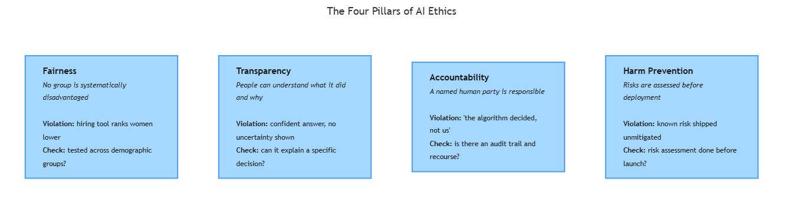

<!-- GENERATED FILE — DO NOT EDIT BY HAND.
     Cresent view of 13.3 — The Four Pillars.
     Source of truth: CIT 5.4.
     Regenerate: python Cresent/Technical/tools/generate_shared_readings.py -->
<!-- nav:top:start -->
Previous: [⬅ 13.2 — Data Bias](../13-2-data-bias/reading.md)&emsp;·&emsp;[⬆ Table of Contents](../../../../../../README.md#part-b)&emsp;·&emsp;[13.4 — Red-Teaming ➡](../13-4-red-teaming/reading.md)
<!-- nav:top:end -->

---

# The four pillars — fairness, transparency, accountability, harm prevention

## Overview

In the last three topics you saw three different AI systems go wrong: a hiring tool that ranked women lower, a diagnostic AI that worked worse on darker-skinned patients, and AI that states falsehoods with total confidence. Each failed for a different technical reason. But all three share one cause — someone built a powerful system without asking a few basic ethical questions first.

Those questions are simple. What is a fair outcome for everyone using this system? Can people understand how it works? Who is responsible when it goes wrong? Could it cause harm — and have we acted to prevent that?

Those four questions map onto four ideas that researchers, governments, and standards bodies agree are essential for responsible AI [1]. They are called the **four pillars of AI ethics**: fairness, transparency, accountability, and harm prevention [2] [3].

This reading defines each pillar in plain words, shows what a missing pillar looks like, and explains why an AI system needs all four — not three. The payoff for you: a simple checklist you can hold up against any AI system you meet, before harm has already happened.

## Key Concepts

The four pillars are four questions you ask about any AI system. The diagram below names each one, gives a real example of it being broken, and shows the practical check that tells you whether the pillar is met.

*Each pillar with its plain meaning, a real-world violation, and the practical check that tests whether a system meets it.*

Here is what each pillar means, with the term defined before the detail.

- **Fairness in AI** — the system does not systematically disadvantage people because of traits like race, gender, age, or disability [1]. A fair hiring manager applies the same job-relevant criteria to every candidate; an unfair one quietly applies stricter scrutiny to one group.
- **Transparency in AI** — the people who use, are affected by, or are responsible for the system can understand what it did and why, including its limits and how confident it is [1] [2].
- **Accountability in AI** — specific, named parties (developers, companies, deployers) are responsible for what the system does and can be held to account when it causes harm [1] [3].
- **Harm prevention in AI** — the people who build and deploy the system take active steps to anticipate and reduce the harm it could cause [1] [2].

### Fairness is harder than it sounds

**Why is fairness harder than it sounds?** Because just deleting race or gender from the data does not make a system fair. In topic 5.3 you met historical bias — past discriminatory human decisions baked into training data. A model learns that pattern even with no demographic labels present, because the bias is spread across thousands of records.

There is also **proxy discrimination** — the system avoids using race or gender directly, but leans on a stand-in variable like ZIP code or university name that closely tracks them [1]. Discrimination arrives through a back door.

Fairness even has competing definitions. "Equal treatment" means applying the same rule to everyone. "Equal outcome" means aiming for comparable results across groups. These can point in opposite directions, and which one fits depends on the context and the people affected [2]. So a system that was never tested for fairness cannot be called fair — absence of evidence is not evidence of fairness [2] [3].

### Transparency has two parts

Transparency breaks into two everyday parts [2] [3]:

- **Explainability** — being able to say, in plain language, *why* the system produced a specific output. Can a doctor learn why a medical AI recommended a treatment? Can HR see what drove a candidate's ranking?
- **Discoverability** — being able to find out an AI was involved at all. If an algorithm silently removed your post, were you even told a machine decided?

**The black box problem** is the obstacle here: a deep-learning model (which you met in topic 5.1) reaches an output by combining millions of numerical weights, so there is no single rule you can point at to explain a decision [1]. This makes transparency harder, not impossible — researchers build XAI (Explainable AI) techniques that approximate the reasoning, which you will study later.

Transparency also links straight to topic 5.2. An AI that delivers a false answer in the same confident tone as a true one is hiding the one thing you needed — how reliable the answer is [2]. A transparent system would flag its uncertainty instead.

### Accountability needs a named owner

For accountability, think about a car crash. The driver, the mechanic, and the manufacturer can all share blame — responsibility does not vanish because a machine was involved. Someone still made the decisions that led to the outcome.

AI adds the **accountability gap**: harm happens, but everyone deflects [1]. "The algorithm decided, not us." "We just built the tool — the deployer is responsible." "We only deployed it — blame the vendor." These deflections leave harmed people with no recourse.

The accountability pillar closes that gap by demanding one documented answer before launch: who is responsible when this system causes harm? In practice that means audit trails — which model, trained on what data, deployed when, last audited when — plus human review at high-stakes decision points like medical, legal, or employment decisions [2] [3].

### Harm prevention is proactive

Harm prevention recognizes something uncomfortable: **an AI can cause harm even while working exactly as designed** [1]. A deepfake generator that produces realistic fake video is doing its job — and harming someone. A face-recognition system that is 99% accurate overall but 80% accurate for darker-skinned people is meeting its target — and discriminating.

So prevention is not bug-fixing. It is asking, before launch, how this system could be misused or fail for specific groups, even when its outputs are technically "correct." Researchers sort the harm into categories [1] [2]:

| Harm type | Example |
|---|---|
| Physical | A medical AI recommends the wrong medication dose |
| Psychological | A feed amplifies depressing content to vulnerable users |
| Economic | A credit model denies loans to creditworthy applicants |
| Reputational | AI falsely attributes statements to a real person |
| Societal | Disinformation at scale erodes trust in institutions |

The word "prevention" means acting *before* harm, through risk assessment — systematically asking what could go wrong, and for whom [3]. One technique teams use to probe their own system for failures, red-teaming, is the subject of topic 5.5. Harm prevention that only reacts after documented harm is not prevention; it is damage limitation.

### Why all four, together

**Why state all four together?** Because removing any one weakens the rest [1] [2].

- Without transparency, an accountable team cannot see what the system is getting wrong, so accountability has nothing to grip.
- Without accountability, no one is obliged to act on what transparency reveals.
- Without harm prevention, a fair, transparent, accountable system can still ship a capability whose misuse was never assessed.

A framework with three of four is not three-quarters ethical [1] [3]. And these pillars are not one company's invention — a 2021 review of 84 AI ethics documents found transparency, fairness, non-maleficence (harm prevention), and accountability recurring across the most-cited guidelines worldwide [1]. Sources like the EU Ethics Guidelines for Trustworthy AI and the NIST AI Risk Management Framework, both covered later in the course, point the same way [3].

## Worked Example

Take Amazon's hiring algorithm from topic 5.1 and walk it through all four pillars. This shows how a single real failure breaks several pillars at once.

1. **Fairness — violated.** The tool systematically ranked female candidates lower, because it learned from a decade of resumes that skewed male.
2. **Transparency — violated.** Applicants were never told an algorithm was scoring them, and no one could explain *why* a given candidate was downgraded.
3. **Accountability — violated.** The bias was only caught after years of use; there was no standing process and no named owner auditing the tool for fairness.
4. **Harm prevention — violated.** No pre-deployment risk assessment asked the obvious question: what happens if the training data carries historical gender bias?

The lesson: real AI failures rarely break just one pillar. They break several together, which is exactly why you evaluate the four as a set, not one at a time.

## In Practice

Each pillar turns into a short checklist a team can run against a system [2] [3].

- **Fairness:** Was performance tested across demographic groups? Was the training data audited for historical and representation bias? Were proxy variables identified? Was the right definition of fairness chosen and documented?
- **Transparency:** Are users told an AI is involved? Can an affected person get an explanation of a specific decision? Are limits and uncertainty surfaced, not hidden?
- **Accountability:** Is there a named owner for outcomes? Are decisions and data sources documented? Is there human review and a recourse path for people who are harmed?
- **Harm prevention:** Was a risk assessment done? Was the system tested against misuse, not just intended use? Are failure-rate limits set per group? Is there a response plan for harm found after launch?

A few firm do's and don'ts [1] [2] [3]:

- **Do** treat the pillars as design requirements applied before build — retrofitting fairness into a live system is far harder than designing for it.
- **Do** keep records as you go; documentation written during development is more credible than notes created after an incident.
- **Don't** treat transparency as marketing — a one-paragraph website blurb is not a meaningful explanation of a decision that affected someone.
- **Don't** accept "the algorithm decided" as an answer; the existence of an algorithm transfers human responsibility, it does not erase it.
- **Don't** confuse "not illegal" with "ethical." Law in most places is still catching up, and a legal system can still violate all four pillars.

## Key Takeaways

- The four pillars — **fairness, transparency, accountability, harm prevention** — are the shared vocabulary across major AI ethics frameworks and academic research worldwide [1] [3].
- **Fairness** means outputs do not systematically disadvantage people by trait, and it requires active testing and data auditing — never assumption.
- **Transparency** means affected people can understand what a system did and why, including its limits and uncertainty.
- **Accountability** means named human parties own the outcomes, with documented decision trails and recourse for people who are harmed.
- **Harm prevention** is proactive: assess misuse and vulnerable-group failure before launch, and treat unacceptable failure rates as a blocking issue.
- The pillars are interdependent — three out of four is not three-quarters ethical; dropping any one undermines the others [1] [2].

## References

[1] "AI Ethics Principles and Challenges: A Systematic Literature Review." arXiv. https://arxiv.org/pdf/2109.07906

[2] "Transparency, Fairness, and Privacy in AI Development." *Applied Artificial Intelligence* (2025). https://www.tandfonline.com/doi/full/10.1080/08839514.2025.2463722

[3] "Ethics and Guidelines for Trustworthy AI." Nemko Digital. https://digital.nemko.com/regulations/ethics-and-guidelines-for-trustworthy-ai

---
<!-- nav:bottom:start -->
Previous: [⬅ 13.2 — Data Bias](../13-2-data-bias/reading.md)&emsp;·&emsp;[⬆ Table of Contents](../../../../../../README.md#part-b)&emsp;·&emsp;[13.4 — Red-Teaming ➡](../13-4-red-teaming/reading.md)
<!-- nav:bottom:end -->
