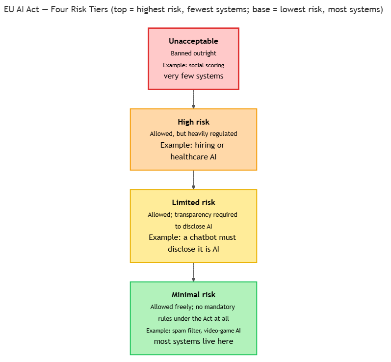
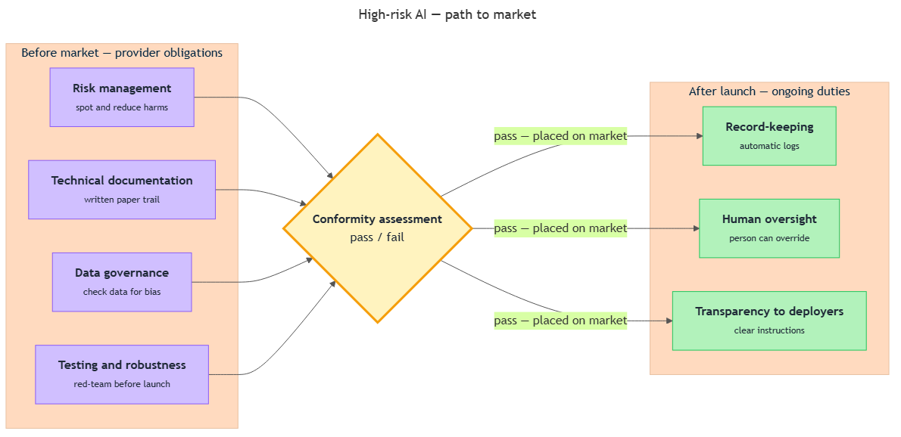
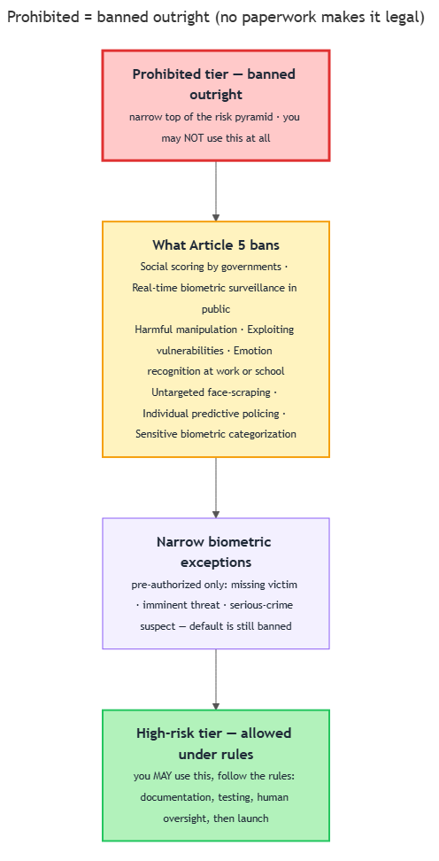
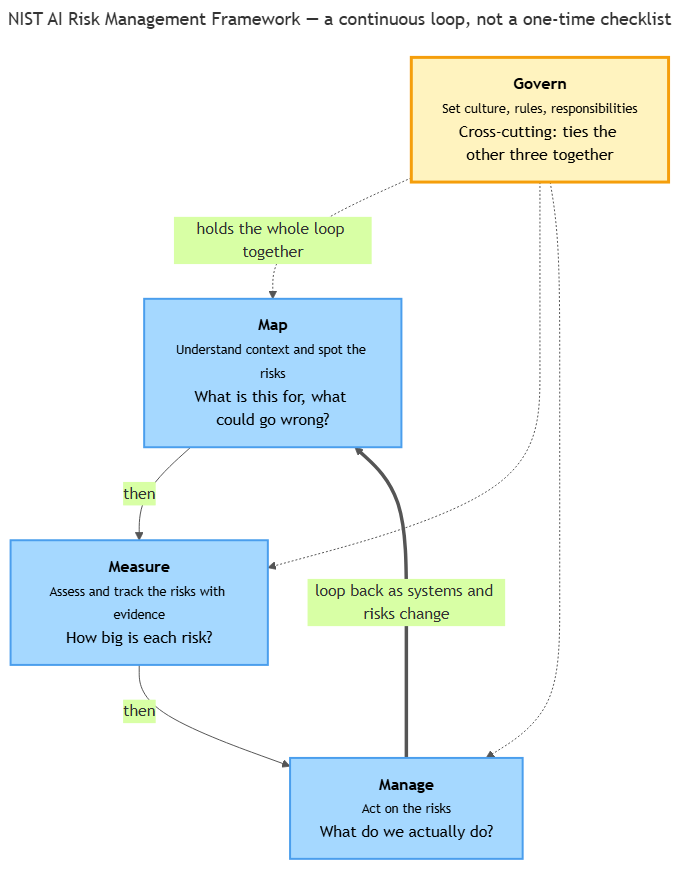
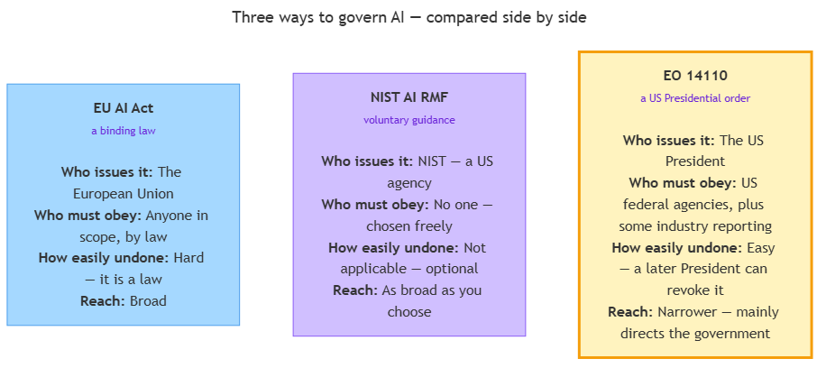
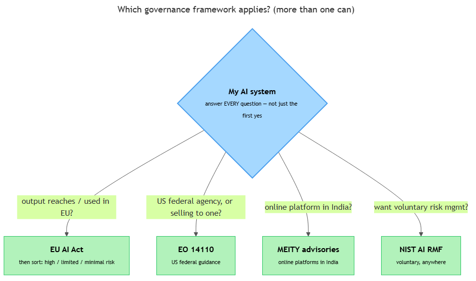

<!-- GENERATED FILE — DO NOT EDIT BY HAND.
     Cresent view of 13.6 — Governance Frameworks.
     Source of truth: CIT 5.7, CIT 5.8, CIT 5.9, CIT 5.10, CIT 5.11, CIT 5.12, CIT 5.13.
     Regenerate: python Cresent/Technical/tools/generate_shared_readings.py -->
<!-- nav:top:start -->
Previous: [⬅ 13.5 — Prompt Injection](../13-5-prompt-injection/reading.md)&emsp;·&emsp;[⬆ Table of Contents](../../../../../../README.md#part-b)&emsp;·&emsp;[13.7 — Engineering Takeaway ➡](../13-7-engineering-takeaway/reading.md)
<!-- nav:top:end -->

---

# EU AI Act — risk tiers (unacceptable / high / limited / minimal risk)

## Overview

In earlier topics you saw AI go wrong in the real world: a hiring tool that downgraded women, AI that misread medical scans, and deepfakes that fooled people. Those harms were serious enough that governments decided rules were needed. The European Union answered with the **EU AI Act (European Union Artificial Intelligence Act)** — the first broad law in the world written specifically to govern artificial intelligence [1][2].

This topic teaches the one big idea behind that law: it does not treat every AI system the same way. Instead, it sorts systems by how much risk they pose to people, then applies heavier rules to higher risk [1]. Learn those tiers and you understand the heart of the law.

## Key Concepts

First, a plain definition. A **regulation** — here — is an official, legally binding rule set by a government that organizations must follow. The EU AI Act is one such regulation, aimed only at AI systems.

The Act's central choice is to be **risk-based**. Think of two systems: a chess-playing app and a system that decides who gets hired. They carry very different stakes. It would be wasteful to regulate the chess app like the hiring system, and dangerous to regulate the hiring system like the chess app.

So the Act asks one question of every AI system: how much could this harm people if it goes wrong? The answer places the system into one of four tiers, and the tier decides the rules [1][2]. The higher the risk, the stricter the obligations.

A natural way to picture this is a **pyramid**. A few dangerous systems sit at the narrow top with the most rules; most ordinary systems sit at the wide bottom with almost none.

*The four risk tiers, from the banned apex down to the unregulated base — width shows how many systems fall in each tier.*

Reading the pyramid from top to bottom, the four tiers and the law's response look like this:

| Tier | What the law does | Example |
|---|---|---|
| **Unacceptable** | Bans it outright | Government social scoring |
| **High** | Allows it under strict obligations | Hiring or healthcare AI |
| **Limited** | Requires transparency (disclose it is AI) | Chatbots, labeled deepfakes |
| **Minimal** | No mandatory rules | Spam filter, game AI |

A few terms in that table need unpacking, tier by tier.

**Unacceptable risk — banned.** At the very top are uses considered such a clear threat to people's safety or rights that they are simply not allowed at all [1][2]. One example is government social scoring: rating citizens by their behavior, then granting or denying them services based on the score. Another is real-time biometric surveillance in public spaces. **Biometric** means identifying a person from a body trait such as their face or fingerprint, and "real-time" means scanning crowds live as people walk by. The full list of banned uses is its own later topic — here you only need to know the top tier means *banned*.

**High risk — heavily regulated.** Just below sit high-risk systems. These are allowed, but only under strict conditions, because they make decisions that seriously affect people's lives or safety [1][3]. Typical examples are hiring software, AI in medical diagnosis, police tools that score suspects, and AI controlling critical infrastructure like power or water.

What does "heavily regulated" mean in plain terms? Before such a system can be used, its provider must do serious homework [1][3]:

- **Keep documentation** — written records of how the system was built and tested.
- **Test the system** — including the adversarial testing you met as red-teaming earlier.
- **Provide human oversight** — a person must be able to review and override the AI's decisions.
- **Pass a conformity assessment.** A **conformity assessment** is an official check, before launch, that the system meets the law's requirements — like the safety inspection a car must pass before it can be sold.

The detailed high-risk obligations are covered in upcoming topics; here you only need the headline — high risk means *allowed but tightly controlled*.

**Limited risk — transparency obligations.** Next down, the main duty is simple: be honest that AI is involved [1][2]. This is a **transparency** obligation — telling people plainly when they are dealing with AI, which is one of the four pillars from 5.4. Two everyday cases: a chatbot must tell you it is an AI so you are not fooled into thinking it is human, and a deepfake (AI-generated or AI-altered images, audio, or video) must be labeled as artificial. The rule is light — you can use these systems freely, you just cannot hide that they are AI [2].

**Minimal risk — no mandatory rules.** At the wide bottom sit minimal-risk systems — the vast majority of everyday AI [1][2]. Spam filters, recommendation features, and AI in video games all live here. The Act imposes no mandatory rules on them; providers may follow good practices voluntarily, but the law does not force special obligations.

Why this shape? Very few systems are banned, a manageable set are high-risk, and most are minimal-risk [1]. The law concentrates its effort where the danger is greatest.

The Act also connects straight back to the four pillars from 5.4 — it puts those ethical principles into law. Harm prevention becomes the banned tier. Accountability and fairness become the high-risk tier's documentation, testing, and oversight. Transparency becomes the limited-risk tier's disclosure duty [1][2]. The Act does not invent new ethics; it gives ethics you already know legal teeth.

## Worked Example

Suppose you have four AI systems and want to guess each one's tier. Work from the harm, not the technology — ask "who gets hurt if this fails, and how badly?"

1. **A movie recommender.** If it fails, you get a bad film suggestion. Low stakes, so this is **minimal risk** — no mandatory rules.
2. **An AI that scores loan applicants.** If it fails, someone is wrongly denied money that affects their life. That makes it **high risk** — documentation, testing, human oversight, and a conformity assessment all apply.
3. **A customer-service chatbot.** Low direct harm, but you should not be tricked into thinking it is a person. That is **limited risk** — it must disclose it is AI.
4. **A government system that ranks citizens by social behavior.** This strikes at dignity and freedom, so it is **unacceptable risk** — banned outright.

Notice the pattern: the tier follows the use and the potential harm, never how advanced the model is.

## In Practice

When you meet a new AI system and want to place it on the pyramid, a few habits help:

- **Start from the harm, not the technology.** Ask who gets hurt if it fails — not how clever the model is.
- **"High risk" is about the use, not the cleverness.** A simple model used in hiring can be high-risk; a sophisticated model in a game is minimal-risk.
- **Banned is rare on purpose.** Most AI is minimal-risk, so do not assume every system is heavily regulated.
- **Transparency is cheap and almost always wise.** Even when the law does not require it, telling users they are dealing with AI builds trust.

The EU AI Act is only one framework among several. Other approaches — the NIST AI Risk Management Framework, the US White House Executive Order on AI, and India's MEITY advisory guidelines — are covered in upcoming topics and are not part of this one.

## Key Takeaways

- The **EU AI Act** is the first broad law written to govern AI, and it is **risk-based**: heavier rules apply to higher-risk systems [1].
- There are **four tiers** — unacceptable (banned), high (heavily regulated), limited (transparency required), and minimal (no mandatory rules) [1][2].
- A system's tier is set by how much it could harm people, judged by its *use*, not by how advanced the technology is.
- High-risk systems must keep documentation, be tested, provide human oversight, and pass a **conformity assessment** before launch [1][3].
- The Act turns the four pillars from 5.4 — fairness, transparency, accountability, harm prevention — into enforceable law [1].

## References

1. European Commission — Regulatory framework for AI. https://digital-strategy.ec.europa.eu/en/policies/regulatory-framework-ai
2. European Parliament — EU AI Act: first regulation on artificial intelligence. https://www.europarl.europa.eu/topics/en/article/20230601STO93804/eu-ai-act-first-regulation-on-artificial-intelligence
3. EU AI Act compliance checker. https://artificialintelligenceact.eu/assessment/eu-ai-act-compliance-checker/

---

# EU AI Act — obligations for high-risk systems (documentation, testing, human oversight)

## Overview

In 5.7 you met the four risk tiers the **EU AI Act (European Union Artificial Intelligence Act)** uses to sort AI, and you learned that **high-risk** systems are allowed but tightly controlled. This topic explains what "tightly controlled" actually means. The answer is a short, fixed list of duties the law places on these systems before they reach people and while they keep running [1]. Learn that list and you understand the working core of how the Act governs high-risk AI.

## Key Concepts

Think of a high-risk AI system like a car. A car is allowed on the road, but only after it passes safety checks — working brakes, crash testing, and a paper trail proving all of it. High-risk AI works the same way: it is permitted, but its makers must do real safety homework first, and keep doing it afterward [1][2].

### Who has to obey — provider vs deployer

Before the duties, you need to know *who* they fall on. The Act splits responsibility between two roles [2]:

- **Provider** — the organization that **builds** the AI system and puts it on the market under its own name. Example: the company that develops a hiring-screening tool and sells it.
- **Deployer** — the organization that **uses** the system in its own work. Example: the HR department that buys that hiring tool and runs it on real applicants.

Why the split? Because the provider made the system and knows it best, so it carries most of the heavy duties. The deployer carries lighter, use-time duties — mainly using the system as instructed and keeping a human in the loop [2][3].

| Role | Plain meaning | Main responsibility |
|---|---|---|
| Provider | Builds and sells the system | Do the safety homework before launch and document it |
| Deployer | Buys and uses the system | Use it as instructed and keep human oversight running |

### The path to market

The diagram below shows the shape of the whole obligation set: the provider does its safety work, that work must pass an official gate, and only then can the system be sold — after which some duties keep running.

*A high-risk system's journey: provider safety duties → the conformity-assessment gate → placed on market → ongoing duties. Most work happens before launch; some duties continue afterward.*

The official gate in the middle is the **conformity assessment** — a check, *before* the system goes on the market, that it meets all the requirements. A **conformity assessment** is like the safety inspection a car must pass before it can be sold: no pass, no market [1][2].

### The obligations themselves

These are the duties the Act attaches to a high-risk system. The provider sets up most of them before the system is sold [1][2]:

- **Risk management** — an ongoing process to spot and reduce the ways the system could harm people, across its whole life. *Example:* a medical-AI maker keeps asking "where could this misread a scan?" and fixes those weak spots over time.
- **Technical documentation** — a written paper trail describing how the system was built, what data it used, how it was tested, and how it works. *Example:* a folder a regulator could open and follow to understand the whole system.
- **Data governance** — making sure the data used to train and test the system is relevant, as complete as possible, and checked for bias. *Example:* before training a hiring tool, the team checks the data is not skewed against women — the data-bias problem from 5.3.
- **Record-keeping (logging)** — the system automatically keeps **logs**, a running record of what it did and when. *Example:* a loan-scoring system saves each decision so people can later trace why an applicant was rejected.
- **Transparency to deployers** — giving the people who use the system clear instructions on what it does, its limits, and how to run it safely. *Example:* a plain-language guide telling HR staff what the tool can and cannot reliably judge.
- **Human oversight** — designing the system so a person can monitor it and step in or override it when needed. *Example:* a doctor reviews the AI's diagnosis suggestion and can reject it, rather than the AI deciding alone [3].
- **Accuracy, robustness, and cybersecurity** — the system must perform reliably and resist attacks. **Robustness** means the system keeps working sensibly even when conditions are messy or someone tries to trip it up. *Example:* testing the system against the red-teaming attacks from 5.5 to confirm it does not break or leak.

### Why these duties, and why before the market

Notice the pattern: most duties are done *before* the system is sold, then *kept up* while it runs. That ordering is deliberate — the Act tries to catch harm early, at the design stage, instead of reacting after a failure [1]. The conformity assessment is the gate that enforces it; after launch, risk management, logging, and human oversight keep going [2][3].

These duties are not new ethics. They are the four pillars from 5.4 turned into concrete tasks: risk management and robustness serve **harm prevention**; human oversight, documentation, and logging serve **accountability**; clear instructions serve **transparency**; data governance serves **fairness**.

The detailed list of prohibited uses (5.9) and the other governance frameworks — the NIST AI RMF, the US Executive Order on AI, and India's MEITY guidelines — are covered in upcoming topics, not here.

## Worked Example

Take one high-risk system from 5.7: an AI tool that scores loan applicants. Here is how its maker satisfies four of the obligations, and who is responsible for each.

1. **Technical documentation (provider)** — the maker writes up how the tool was built, what applicant data it learned from, and how it was tested, so a regulator could follow it.
2. **Data governance (provider)** — before training, the maker checks the loan-history data is relevant and not skewed against any group, then records that check.
3. **Testing / robustness (provider)** — the maker red-teams the tool, feeding it odd and hostile inputs to confirm it keeps scoring sensibly and does not break.
4. **Human oversight (deployer)** — the bank using the tool keeps a loan officer in the loop, able to review and override any score before a customer is rejected.

The first three fall on the **provider**, who builds the tool. The fourth is a use-time duty the **deployer** runs. Together they show the "before, then ongoing" split: the provider's homework clears the conformity-assessment gate, and oversight continues once the tool is live.

## In Practice

For a beginner, the goal is to *recognize* these obligations, not to apply the law. A few simple heuristics:

- **Match each obligation to a pillar.** If you can name which of the four pillars (5.4) a duty serves, you understand why it exists.
- **Remember "before, then ongoing."** Most duties are done before market entry and then maintained — the conformity assessment is the gate, not the finish line.
- **Provider builds, deployer uses.** When asked who is responsible, ask first whether the duty is about *making* the system (provider) or *using* it (deployer).
- **Testing is not optional theater.** The robustness duty is real work — it is exactly the red-teaming from 5.5 you already met.

## Key Takeaways

- High-risk systems from 5.7 are allowed but carry a fixed set of obligations: risk management, technical documentation, data governance, record-keeping, transparency to deployers, human oversight, and accuracy/robustness/cybersecurity [1][2].
- The **provider** (who builds the system) carries most duties; the **deployer** (who uses it) mainly follows instructions and keeps human oversight running [2][3].
- A **conformity assessment** is an official pre-market check — like a car safety inspection — that the system meets all requirements before it can be sold [1][2].
- **Human oversight** means a person can monitor and override the AI, making the accountability pillar from 5.4 concrete [3].
- Most duties happen *before* the market and are then maintained — the testing/robustness duty is where red-teaming (5.5) fits [1].

## References

1. The EU AI Act: High-Level Summary. <https://artificialintelligenceact.eu/high-level-summary/>
2. EU AI Act — Obligations of Providers of High-Risk AI Systems. <https://artificialintelligenceact.eu/article/16/>
3. European Commission AI Act Service Desk — Human Oversight. <https://ai-act-service-desk.ec.europa.eu/en/ai-act/article-14>

---

# EU AI Act — prohibited uses including social scoring and real-time biometric surveillance

## Overview

In topic 5.7 you met the EU AI Act's (European Union Artificial Intelligence Act's) pyramid of risk: four tiers, with heavier rules as the risk climbs. The very top of that pyramid is the **unacceptable-risk** tier. This topic looks at that tier up close.

These are uses the law does not regulate — it forbids them. Picture a camera that scans every face in a crowd live and checks it against a watchlist. Picture a government scoring citizens by their everyday behaviour and then deciding who gets a loan. The Act draws a hard line against exactly these uses [1][2]. Knowing where that line sits is how you spot the worst AI harms before they happen — and it is why this tier matters even though very few systems ever fall into it.

## Key Concepts

Everything in this topic is one idea seen from different angles: some AI uses are so harmful that the law bans them outright. We will start with what "banned" means, then look at the two headline cases, then list the rest.

### What "prohibited" means (and how it differs from "high-risk")

- **Prohibited use** — an AI use the law bans completely. There is no permit, no paperwork, no checklist that makes it legal. It is simply off-limits [1].
- These bans live in **Article 5** of the Act. "Article 5" is just the numbered section of the law where the banned list is written down [2].

The Act sorts AI by how much it could harm people. Most tiers say *"you may use this, but follow these rules."* The top tier is different. It says *"you may not use this at all"* [1].

*The prohibited tier sits at the narrow top of the risk pyramid — banned outright — while the high-risk tier below is allowed if providers follow the rules.*

**Why ban instead of regulate?** Think of the difference between a speed limit and a no-entry sign. A speed limit lets you drive if you follow the rules; a no-entry sign means you simply do not go there. For these uses the harm is judged so severe — a direct attack on human dignity, freedom, or safety — that no amount of paperwork could make them safe [1][3]. This is the **harm-prevention pillar** from 5.4 taken to its limit: when a harm is unacceptable, you prevent it by forbidding the practice entirely.

### Social scoring by governments

**Social scoring** — using AI to rate people based on their behaviour or personal traits over time, then treating them well or badly because of that score [1][2].

Here is a concrete example. A government system watches what citizens buy, who they spend time with, and whether they pay bills on time. It rolls all of that into a single "trust score." A high score gets you faster loans and better services. A low score gets you turned away from things that have nothing to do with the original behaviour [2].

The Act bans this because it produces two specific harms [2]:

- **Unfair treatment in unrelated situations** — being denied a job because of something you did in a completely different part of your life.
- **Treatment that is out of all proportion** — a small misstep leading to a large, lasting penalty.

Why is this so dangerous? Because it turns your whole life into a permanent grade that follows you everywhere. That strikes directly at fairness and dignity, which is why it sits in the banned tier [1].

### Real-time biometric surveillance in public spaces

First, two plain definitions:

- **Biometric** — identifying a person from a body trait, such as their face, fingerprint, or the way they walk.
- **Real-time** — happening live, as it occurs. The camera matches faces *in the moment* people walk past, not hours later from a saved recording.

So **real-time remote biometric identification in public spaces** means using AI to scan people live — for example, face-scanning a crowd in a train station and instantly matching faces against a database [1][2].

The Act bans this when it is done by law enforcement in publicly accessible spaces. Live mass face-scanning means everyone in the crowd is identified just for being there — not because they are suspected of anything. That is a sweeping loss of privacy for ordinary people who have done nothing wrong [1][2].

### The narrow exceptions to the biometric ban

The biometric ban is not absolute. The Act allows a few **narrow exceptions** — and the word *narrow* is the whole point. These are not loopholes. They are short, specific situations, each needing approval in advance [2][3]. The allowed cases are limited to things like:

1. Searching for specific victims, such as a missing child or a kidnapping victim.
2. Preventing a specific, imminent threat to life, such as a foreseeable terror attack.
3. Locating a suspect in a serious crime defined by the law.

Even then, the use must be authorized in advance and limited in time and place [3]. The default is still **banned**. A system that scans crowds live for general policing is on the banned side of that line [1][3].

### The other prohibited practices

Social scoring and real-time biometric surveillance are the two headline bans, but Article 5 lists several more. You only need to recognize them, not memorize legal detail [1][2]:

- **Manipulation that causes harm** — AI that uses hidden or deceptive techniques to push people into decisions they would not otherwise make, in a way that hurts them.
- **Exploiting vulnerabilities** — AI that takes advantage of someone's age, disability, or difficult situation to distort their behaviour.
- **Emotion recognition at work or school** — AI that claims to read people's emotions in workplaces or classrooms (with limited safety and medical exceptions).
- **Untargeted face-scraping** — building face databases by mass-collecting images from the internet or street cameras.
- **Predictive policing of individuals** — AI that predicts a person will commit a crime based purely on profiling them, not on real evidence.
- **Biometric categorization of sensitive traits** — sorting people by sensitive characteristics such as race or beliefs using their body data.

The common thread: each is a use where the harm to people's rights is judged too great to allow under any conditions [1][2].

## Worked Example

Suppose you are handed four AI systems and asked, for each one, "Is this **prohibited** (banned) or merely **high-risk** (allowed under rules)?" Walk through them using the sections above.

1. **A government "citizen trust score" that affects loan access.** This rates people by behaviour and then penalizes them in an unrelated situation (loans). That is **social scoring** — *prohibited* [2].
2. **A hiring tool that screens résumés.** It judges job applicants, which is serious, but it is not banned outright. It sits in the **high-risk** tier: allowed if the provider follows the rules. *Not prohibited.*
3. **Live face-scanning of a shopping street for general policing.** This is real-time biometric surveillance of a public space for everyday policing — exactly the banned case. *Prohibited* [1].
4. **Face-scanning authorized in advance to find a specific kidnapping victim.** This is one of the **narrow exceptions** — a specific victim, pre-authorized. It falls on the allowed side of the line [3].

Notice the pattern: cases 1 and 3 attack dignity or privacy so directly that no checklist could fix them, so they are banned. Cases 2 and 4 are controlled, not forbidden. The difference between case 3 and case 4 is not the technology — it is *why* and *how narrowly* it is used.

## In Practice

For a beginner, the goal is to *recognize a prohibited use when you see one*, not to apply the law. A few useful habits:

- **Ask "does this judge or watch people for who they are?"** Social scoring judges people; live biometric surveillance watches them. Both are red flags for the banned tier.
- **Remember "banned" is rare and deliberate.** Most AI is minimal-risk. Only a short, specific list is prohibited — do not assume every worrying AI is banned.
- **Watch the word "narrow."** The biometric exceptions are tiny and pre-authorized. If someone describes broad, everyday live face-scanning as "an exception," that is a red flag, not a real exception.
- **Trace it back to harm.** If a use attacks dignity, freedom, or fairness so directly that no checklist could fix it, that is why it sits in the banned tier rather than the high-risk one.

## Key Takeaways

- A **prohibited use** is an AI use the EU AI Act bans completely — it is the **unacceptable-risk** tier from 5.7, and it lives in **Article 5** [1][2].
- **Social scoring by governments** — rating people by behaviour and then treating them unfairly in unrelated situations — is banned because it attacks fairness and dignity [2].
- **Real-time biometric surveillance** — live face-scanning of people in public spaces — is banned, with only **narrow, pre-authorized exceptions** like finding a missing child or stopping an imminent attack [1][3].
- Article 5 also bans harmful **manipulation**, **exploiting vulnerabilities**, **emotion recognition at work or school**, untargeted **face-scraping**, individual **predictive policing**, and sensitive **biometric categorization** [1][2].
- These uses are **banned rather than regulated** because the harm is too severe for any safeguard to fix — the **harm-prevention pillar** from 5.4 at its limit [1][3].

## References

[1] European Commission. "What systems are prohibited under Article 5 AI Act (e.g. social scoring, emotion recognition)?" *AI Act Service Desk FAQ*. https://ai-act-service-desk.ec.europa.eu/en/ai-act/faq/what-systems-are-prohibited-under-article-5-ai-act-eg-social-scoring-emotion-recognition

[2] Future of Life Institute. "Article 5 — Prohibited AI Practices." *EU Artificial Intelligence Act*. https://artificialintelligenceact.eu/article/5/

[3] European Commission. "Commission publishes guidelines on prohibited artificial intelligence (AI) practices defined by the AI Act." *Shaping Europe's Digital Future*. https://digital-strategy.ec.europa.eu/en/library/commission-publishes-guidelines-prohibited-artificial-intelligence-ai-practices-defined-ai-act

---

# NIST AI Risk Management Framework — four functions: Govern, Map, Measure, Manage

## Overview

In 5.7 you met the EU AI Act — a binding law that sorts AI by risk. A binding law tells you the line you must not cross, but it does not tell you what to actually *do* day to day to keep your AI safe. That routine is what a **framework** gives you. This topic introduces the most widely used one — the **NIST AI Risk Management Framework** — and its four simple jobs: Govern, Map, Measure, and Manage. Learn those four words and you understand the spine of how organizations manage AI risk.

## Key Concepts

### What the AI RMF is, and what "voluntary" means

- **Framework** — a structured, reusable set of steps an organization follows to handle a problem. Here, the problem is AI risk.
- **NIST** — the **National Institute of Standards and Technology**, a US government agency that writes technical standards and guidance (it also defines things like official time and measurement units) [3].
- **AI RMF (AI Risk Management Framework)** — NIST's guide that helps any organization building or using AI to find, understand, reduce, and keep watching the risks AI can create [1]. NIST published version 1.0 in January 2023, working with industry, universities, and the public [1].

One thing to note up front: NIST does not police anyone. It writes guidance and publishes it; organizations then decide for themselves whether to follow it.

The single most important fact about the AI RMF is one word: **voluntary**.

**Voluntary** means no law forces you to use it. An organization adopts the AI RMF because it chooses to, not because a regulator will punish it for ignoring it [3]. That is the sharp contrast with the EU AI Act from 5.7:

| | EU AI Act (5.7) | NIST AI RMF (this topic) |
|---|---|---|
| What it is | A binding law | Voluntary guidance |
| Who issues it | The European Union | NIST, a US agency |
| If you ignore it | You can be penalized | No legal penalty |
| What it tells you | The risk line you must not cross | A routine for managing risk yourself |

So why follow guidance nobody forces on you? Because it is genuinely useful, and because customers, partners, and government buyers increasingly *expect* it. The framework gives everyone a common, trusted vocabulary for talking about AI risk [3]. Saying "we follow the NIST AI RMF" tells a customer something concrete about how carefully you build.

### What "AI risk" means here

Before the four functions make sense, fix what they act on. **Risk** — the chance that something goes wrong, combined with how bad it would be if it did [1]. For AI, that "something going wrong" is exactly the failures you already studied:

- A model that confidently states a falsehood (hallucination, 5.2).
- A model that treats a group unfairly because its training data was skewed (data bias, 5.3).
- The real harms of 5.1 — a misdiagnosis, a biased hiring screen.

The AI RMF's job is to make an organization deal with these possibilities on purpose, in an organized way, instead of hoping they never happen [1].

### The four functions as a continuous loop

NIST organizes the whole job of managing AI risk into **four functions** — a function here just means a group of related activities, a "job to be done" [1][2]. The four are **Govern, Map, Measure, and Manage**.

A useful first picture: three of the functions form a working cycle, and the fourth sits in the middle holding it all together.

*Govern sits at the center as the cross-cutting function; Map → Measure → Manage repeat as an ongoing loop, not a one-time checklist.*

- **Govern** is the center — the culture, rules, and responsibilities that make the other three actually happen.
- **Map → Measure → Manage** is the working cycle you repeat: first understand the context, then assess the risks, then act on them.

A beginner's trap is to read this as a checklist you finish once. It is not. AI systems and the world around them keep changing — new users, new data, new ways to misuse them. So an organization keeps cycling: Map the context, Measure the risks, Manage them, then loop back and Map again as things change — all the while held together by Govern at the center [1].

### The four functions, one at a time

- **Govern — set up the culture and rules.** Govern puts the right people, policies, and responsibilities in place so managing AI risk is an ongoing habit, not an afterthought [1][2]. It answers: *Who is responsible? What are our rules?* For example, writing down a company policy for how AI may be used, and naming who is accountable when a system causes harm (the accountability pillar from 5.4). Govern **cuts across the other three** — you cannot Map, Measure, or Manage well if no one is responsible and there are no rules. That is why it sits at the center: it is the soil the other three grow in [2].
- **Map — understand the context and spot the risks.** Map is about understanding the situation your AI system lives in, so you can see what could go wrong [1][2]. It answers: *What is this for? Who could it affect? Where might it cause harm?* For example, listing who a hiring tool could help or hurt, and where biased outputs (5.3) might appear. Think of it as drawing the map *before* the journey — you note the cliffs and rough roads so the later steps know where to look [2].
- **Measure — assess and track the risks.** Measure analyzes and tracks the risks you mapped, using tests and numbers wherever possible [1][2]. It answers: *How big is each risk, really? Is the system actually behaving well?* For example, testing whether a system performs equally across different groups, running the adversarial testing you met as **red-teaming** in 5.5, or tracking error rates over time. Measure turns a vague worry ("it might be biased") into evidence ("it is wrong 3 times more often for this group") [1].
- **Manage — act on the risks.** Manage acts on what you measured: reducing the biggest risks first, deciding what to do about the rest, and responding when something goes wrong [1][2]. It answers: *Given what we found, what do we actually do?* For example, retraining a biased model, adding human oversight for high-stakes decisions, or deciding a small risk is acceptable and writing that decision down. Manage is where the framework finally changes the real system [1].

## Worked Example

Suppose your team is building a **résumé-screening tool** that ranks job applicants. Here is one sentence per function, walked through in order.

1. **Govern** — Write down who owns this tool and set one rule: *no candidate is rejected by the AI alone without a human review.* This names responsibility before any code ships.
2. **Map** — Ask who this could hurt. The risk: the tool could quietly favor one group over another if past hiring data was skewed (the data bias of 5.3). You write that risk down so the next step knows to look for it.
3. **Measure** — Test it. You check whether the tool scores equally qualified applicants the same across different groups, and you find it ranks one group lower 3 times more often. Now you have evidence, not a worry.
4. **Manage** — Act on the evidence. You retrain the model on better-balanced data, keep the human-review rule, and write down the decision.

Then you loop back: months later, new applicants arrive and the data shifts, so you **Map** the changed context and run the cycle again. That loop — not a one-time pass — is the whole point.

## In Practice

- **Remember the four words in order: Govern, Map, Measure, Manage.** Map before Measure before Manage; Govern wraps all three.
- **"Voluntary" is not "weak."** Plenty of serious organizations follow the AI RMF by choice because customers and government buyers expect it [3].
- **It is a loop, not a checklist.** If someone treats AI risk as "done" after one pass, that is the mistake the framework is built to prevent.
- **Pair it with the law — do not confuse them.** The EU AI Act (5.7) says what you must not do; the AI RMF helps you do the rest well.
- **It is the four pillars, made practical.** Govern names who is responsible (accountability, 5.4); Map and Measure find harms before users do; Measure tests for the fairness gaps of 5.3; documenting each step makes the organization's choices transparent [1][2].

## Key Takeaways

- The **NIST AI Risk Management Framework (AI RMF)** is voluntary guidance from **NIST** (a US government agency) for finding and reducing the risks AI can create [1][3].
- It is **voluntary** — no law forces it — which contrasts sharply with the EU AI Act (5.7) being binding law; yet it is widely adopted because it is trusted and expected [3].
- Its spine is **four functions: Govern, Map, Measure, Manage** [1][2].
- **Govern** sets culture and ties the rest together; **Map** spots risks; **Measure** assesses them with evidence; **Manage** acts on them [1][2].
- The four functions form a **continuous loop**, not a one-time checklist, because AI systems and their risks keep changing [1].

## References

[1] National Institute of Standards and Technology. *Artificial Intelligence Risk Management Framework (AI RMF 1.0)*, NIST AI 100-1, January 2023. https://nvlpubs.nist.gov/nistpubs/ai/nist.ai.100-1.pdf
[2] NIST AI Resource Center. "AI RMF Core — Govern, Map, Measure, Manage." https://airc.nist.gov/airmf-resources/airmf/5-sec-core/
[3] National Institute of Standards and Technology. "AI Risk Management Framework" (program page). https://www.nist.gov/itl/ai-risk-management-framework

---

# White House Executive Order on AI (2023) — key provisions

## Overview

In 5.7 you met the EU AI Act, a binding law. In 5.10 you met the NIST AI RMF, voluntary guidance. This topic is a third way a government can act on AI risk: a **US Presidential executive order**. On October 30, 2023, the US President signed one about artificial intelligence, and learning its key provisions shows you what executive action can — and cannot — do.

## Key Concepts

### What an executive order is

Imagine the most senior official in a government wants to act quickly, without waiting for the legislature to pass a new law. In the United States, the President can do this by signing an executive order.

- **Executive order** — a signed, written instruction from the US President that tells **federal agencies** what to do [2].
- **Federal agencies** — the parts of the government that carry out its work, such as the Department of Commerce [2].

Two plain facts make an executive order different from a law:

- **It is not made by the legislature.** A law in the US is passed by Congress. An executive order is signed by the President alone, so it mainly commands the agencies the President controls — it cannot bind private citizens the way a full law can [2].
- **It can be undone by the next President.** Because one President signs it, a later President can cancel it with another order [2]. To **revoke** an order means to cancel it. A law is much harder to undo.

Hold onto those two facts. They are why this order is narrower and more easily reversed than the EU AI Act of 5.7.

### The order itself, and the big picture

The order's formal name is **Executive Order 14110 (EO 14110)**, titled "Safe, Secure, and Trustworthy Development and Use of Artificial Intelligence" [1]. People shorten it to EO 14110 or "the 2023 AI Executive Order."

EO 14110 did not write detailed rules itself. Instead it set goals and gave tasks to federal agencies — telling each one what to produce and by when [1][3]. Think of it as the President assigning homework across the government: NIST gets one assignment, another agency gets another [3].

For a beginner, four key provisions capture the order. The next sections take them one at a time.

### Provision 1 — Safety testing for the most powerful models

This was the order's headline. It focused on the most powerful, general-purpose AI models, which the order called **dual-use foundation models**. **Dual-use** means a thing useful for good purposes could also be misused for serious harm [1].

The order required the companies building these top-tier models to do two things:

- **Run safety tests, including red-team testing** — the deliberate attempt to make a system fail that you met in 5.5 [1].
- **Report the results to the federal government** — share what those safety tests found as the most capable models are built [1].

How can an order require this of private companies, when an order normally cannot bind private citizens? It leaned on an existing law as its legal footing, so the order reached private companies *through* that law, not on its own [1][3]. The order also gave **NIST** (the agency from 5.10) a new job: develop standards and tests for what counts as safe, trustworthy AI, so that "safety testing" means something consistent [1][3].

### Provision 2 — Transparency and reporting

The order pushed for **transparency** — making AI activity visible rather than hidden, the same pillar you met in 5.4 [1]. Two provisions aimed at this:

- **Reporting from frontier developers** — companies training the most powerful models had to report on those efforts and their safety testing [1].
- **Helping people tell AI-generated content apart** — agencies were directed to develop guidance for labeling and detecting AI-made content, so people are less easily deceived [1][3].

The goal was simple: reduce the cases where powerful AI, or its outputs, operate in the dark [1].

### Provision 3 — Civil-rights and equity protections

The order treated AI fairness as a civil-rights matter. **Civil rights** are the basic legal protections that guard people from unfair treatment — for example, in hiring, housing, lending, or policing [1].

You know from 5.3 that biased data can make an AI treat a group unfairly. EO 14110 directed agencies to prevent AI from being used to discriminate in those high-stakes areas, and to use existing anti-discrimination law against AI-driven unfairness [1][3]. This is the fairness and harm-prevention pillars of 5.4, applied through people's legal rights.

### Provision 4 — Governance of the government's own AI use

The last provision pointed inward, at the government itself. The order set out guidance for how federal agencies buy and use AI in their own work — for example, requiring safeguards when an agency uses AI in ways that affect people's rights or safety [1][3].

Why does this matter? Governments are large AI users, not just rule-setters. By governing its own AI use, the federal government aimed to model responsible practice and protect the public from harms caused by government systems [1][3].

### Where EO 14110 sits beside the EU AI Act and the NIST RMF

You have now seen three approaches. The clearest way to hold them is side by side.

*The three governance approaches compared across four axes: who issues it, who must obey, how easily it is undone, and how far it reaches.*

| | EU AI Act (5.7) | NIST AI RMF (5.10) | EO 14110 (this topic) |
|---|---|---|---|
| What it is | A binding law | Voluntary guidance | A US executive order |
| Who issues it | The European Union | NIST (a US agency) | The US President |
| Who must obey | Anyone in scope, by law | No one — chosen freely | US federal agencies (plus some industry reporting via an existing law) |
| How easily undone | Hard — it's a law | N/A — it's optional | Easy — a later President can revoke it |
| Reach | Broad | As broad as you choose | Narrower — mainly directs the government |

The takeaway: EO 14110 was **stronger than voluntary guidance** (it commanded agencies and required some industry reporting) but **weaker and narrower than a full law** (it mostly steered the government, and could be cancelled by the next President) [1][2][3].

### One important fact: it was reversed

EO 14110 was signed on October 30, 2023, and was revoked in January 2025 by a later administration [1]. Other US executive actions on AI followed after 2023; those exist but are not covered here.

So treat the order's provisions as a *historical, illustrative* example of US executive AI governance — the clearest single case of how a US President can act on AI risk — not as currently-in-force law [1][2].

## Worked Example

Walk through how the order's first provision was meant to work, step by step, for a company building one of the most powerful AI models.

1. **The model is in scope.** The model is general-purpose and could be misused for serious harm, so it counts as a dual-use foundation model the order targets [1].
2. **The company runs safety tests.** This includes red-team testing — deliberately trying to make the model fail or produce harmful output (5.5) [1].
3. **The company reports the results.** It shares what the safety tests found with the federal government, using the existing law that gave the order its legal footing [1][3].
4. **NIST writes the standard.** In parallel, NIST develops the safety-testing standards, so "safety testing" means the same consistent thing across companies (5.10) [1][3].

That chain — scope the model, test it, report, standardize — is the order's headline provision in action.

## In Practice

- **Remember the four provisions in plain words:** test the most powerful models, be transparent, protect civil rights, govern the government's own AI use.
- **Know the one-line difference from the others:** the EU AI Act is a *law*, the NIST RMF is *optional guidance*, and EO 14110 was a *Presidential order* — in between in strength and reach.
- **"Order" does not mean "permanent."** An executive order can be revoked by a later President; this one was. That reversibility is a feature of the tool, not a detail to skip.
- **Same agency, new job.** When you see NIST here, connect it to 5.10 — the President tasked NIST with writing the safety-testing standards.

## Key Takeaways

- An **executive order** is a signed instruction from the US President to federal agencies; it is not a law passed by the legislature, and a later President can revoke it [2].
- **EO 14110** (Oct 30, 2023), "Safe, Secure, and Trustworthy AI," was the United States' main 2023 executive action on AI, directing agencies to act on AI risk [1].
- Its **key provisions** were: safety testing and red-team reporting for the most powerful ("dual-use foundation") models, transparency and reporting rules, civil-rights protections, and guidance for the government's own AI use [1][3].
- It tasked **NIST** (from 5.10) with developing AI safety-testing standards, tying it directly to the framework you just studied [1][3].
- It sits **between** the binding EU AI Act (5.7) and the voluntary NIST RMF (5.10) — stronger than optional guidance, narrower and more reversible than a law — and was revoked in January 2025, so it is studied here as a historical example [1][2].

## References

[1] The White House. *Executive Order 14110: Safe, Secure, and Trustworthy Development and Use of Artificial Intelligence*, October 30, 2023. https://www.federalregister.gov/documents/2023/11/01/2023-24283/safe-secure-and-trustworthy-development-and-use-of-artificial-intelligence
[2] Congressional Research Service. *Highlights of the 2023 Executive Order on Artificial Intelligence*, R47843. https://www.congress.gov/crs-product/R47843
[3] Center for Security and Emerging Technology (CSET), Georgetown University. "EO 14110 on Safe, Secure, and Trustworthy AI — Trackers." https://cset.georgetown.edu/article/eo-14410-on-safe-secure-and-trustworthy-ai-trackers/

---

# India AI governance — MEITY advisory guidelines

## Overview

You have now seen three ways a government can act on AI: a binding law (the EU AI Act, 5.7), voluntary guidance (the NIST framework, 5.10), and a Presidential order (the 2023 executive order, 5.11). India offers a fourth flavor, and it is the softest of the four so far. In 2024, India's technology ministry issued written guidance about AI, rather than passing a single AI law [1]. Learning it shows you what governing AI through soft guidance looks like, and how India lines up with the global picture.

## Key Concepts

### Who MEITY is, and what an "advisory" is

In 2024, **MEITY** issued guidance about artificial intelligence [1].

- **MEITY (Ministry of Electronics and Information Technology)** — the part of India's central government responsible for technology and the internet [1].

The tool it used here is called an advisory.

- **Advisory** — written government guidance that tells companies what the government expects them to do [1][2].

Two plain facts make an advisory different from a law:

- **It is guidance, not statute.** A law is passed by a legislature and carries the full force of statute. An advisory is issued by a ministry and is softer; it explains how the government reads the existing rules and what it wants platforms to do under them [1][2].
- **It can change fast.** Because no legislature has to vote, a ministry can revise an advisory in days. You will see this happen in the Worked Example [2].

The advisories were aimed mainly at platforms, which the rules call intermediaries.

- **Intermediary (platform)** — an online service that hosts or carries other people's content, such as a social-media site or a search engine [1].

The advisories build on India's existing IT Rules (2021), an earlier set of online-platform rules. You do not need their detail. Just note the advisories sit on top of rules that were already there [1].

### What the advisories actually ask for

Stripped to the essentials, the MEITY AI advisories make two kinds of ask [1][2].

- **Label unreliable or AI-generated output.** Platforms should clearly label AI models or outputs that are still under testing or unreliable, so users know the result may be wrong [1][2]. The same idea applies to AI-made content that could mislead, such as a deepfake.
  - **Deepfake** — a fake image, audio, or video made by AI to look real [1].
  - Labeling lets a user tell unreliable AI output apart from genuine human content [1].
- **Exercise due diligence as a platform.** Platforms must take reasonable care so their AI does not produce unlawful content or amplify bias and misinformation [1][2].
  - **Due diligence** — making a sincere, documented effort to prevent foreseeable harm [1][2].

Notice what these two asks are reaching for: transparency (label it so it is not hidden) and harm prevention (stop the foreseeable damage), the very pillars from 5.4 [1][2]. India is pursuing familiar goals; the novelty is the tool, an advisory rather than a law.

### "Directionally aligned with global frameworks"

India is **directionally aligned** with the frameworks you have studied, meaning it is steering toward the same destination, even if by a different road [3].

- **Same goals.** Transparency about AI, prevention of misinformation and deepfake harm, and care from platforms are the same aims behind the EU AI Act (5.7) and the US measures (5.10, 5.11) [3].
- **Different tool, so far.** The EU has one big binding law; the US has used voluntary guidance and an executive order. India, for now, is using advisories layered on existing platform rules, rather than a single dedicated AI law [3].

So "directionally aligned" is an honest, careful phrase: the direction matches the global trend, even though the legal form is softer and still settling [3].

### Keeping this honest

Two facts keep this topic accurate [3]:

- **These are 2024 advisories, not settled law.** Treat them as evolving soft-law guidance, not a finished statute. India has not, as of this writing, passed a single dedicated AI law [3].
- **More may follow.** India has discussed broader future technology legislation; such future measures are named here only so you know they exist, and are not covered in this topic.

## Worked Example

The clearest sign that this guidance is still evolving is what happened over two weeks in March 2024 [2]. Walk through it step by step.

1. **March 1, 2024 — the first advisory.** It asked platforms to get prior government permission before deploying AI models that were still under-tested or unreliable in India [2].
2. **The industry pushes back.** Many companies worried this would slow down releasing new AI [2].
3. **March 15, 2024 — the revision.** Just two weeks later, MEITY dropped the prior-permission requirement [2].
4. **What stayed.** The softer core remained: label under-tested or unreliable models and their output, and exercise due diligence [2].

That two-week turnaround is the whole point in miniature. Because an advisory is guidance, not statute, the government could revise it almost immediately in response to feedback [2]. A binding law like the EU AI Act (5.7) cannot be re-written that quickly. This is the concrete evidence that India's approach is still evolving, version by version [2].

## In Practice

- **Lead with the one word: advisory.** It is guidance, not law, so it is softer and quick to change.
- **Remember the two asks:** label unreliable or AI-generated output (including deepfakes), and exercise due diligence as a platform.
- **Use the March 2024 story as your "evolving" proof:** prior permission asked on March 1, dropped on March 15.
- **Hold the softness scale in mind.** The MEITY advisories are firmer than purely opt-in advice, because they signal what the government expects of platforms, but far softer and more changeable than a binding law [1][2][3].

Here is where the four approaches sit, from softest to hardest:

| | NIST AI RMF (5.10) | MEITY advisories (this topic) | EO 14110 (5.11) | EU AI Act (5.7) |
|---|---|---|---|---|
| What it is | Voluntary guidance | Government advisory | A US executive order | A binding law |
| Who issues it | NIST (a US agency) | MEITY (an Indian ministry) | The US President | The European Union |
| How binding | Not at all — opt-in | Soft — guidance under existing rules | Commands agencies; some industry reporting | Fully binding by law |
| How fast it changes | Anytime, by choice | Fast — revised in days (Mar 2024) | A later President can revoke it | Slow — it is a law |

## Key Takeaways

- **MEITY** is India's Ministry of Electronics and Information Technology; in 2024 it issued AI **advisories** — government guidance, not binding law — to online platforms [1].
- The advisories' core asks are to **label** AI-generated, under-tested, or unreliable output (including deepfakes) and to exercise **due diligence** to prevent harm [1][2].
- The guidance is **evolving**: the March 1, 2024 advisory required prior government permission for under-tested models; the March 15, 2024 revision dropped that and kept disclosure and labeling [2].
- India is **directionally aligned with global frameworks** — chasing the same transparency and harm-prevention goals as the EU AI Act (5.7) and US measures (5.10, 5.11), but via advisories rather than a single AI law so far [3].
- On the softness scale, MEITY advisories sit between voluntary guidance (NIST, 5.10) and a binding law (EU AI Act, 5.7) — soft, signal-of-expectation guidance that can be revised quickly [1][2][3].

## References

[1] Ministry of Electronics and Information Technology (MEITY), Government of India. *Advisory on Due Diligence by Intermediaries / Platforms under the IT Rules — Artificial Intelligence*, 2024. https://www.meity.gov.in/static/uploads/2024/02/9f6e99572739a3024c9cdaec53a0a0ef.pdf
[2] Lakshmikumaran & Sridharan. "MEITY Advisory on AI: The March 2024 revisions." https://www.lakshmisri.com/insights/articles/meity-advisory/
[3] Economic Laws Practice (ELP). "Navigating AI Regulation in India — Unpacking the MEITY Advisory on AI in a Global Context." https://elplaw.in/leadership/navigating-ai-regulation-in-india-unpacking-the-meity-advisory-on-ai-in-a-global-context/

---

# Knowing which governance framework applies to your system

## Overview

This week you met four ways the world governs AI: a binding law (the EU AI Act, 5.7), voluntary guidance (the NIST AI RMF, 5.10), a US Presidential order (EO 14110, 5.11), and soft government advisories (India's MEITY guidelines, 5.12). A fair question now is: which of these actually applies to the thing you are building? This topic does not re-teach those four frameworks. It teaches you to *decide* between them, because picking the right one is part of the engineering job, not just an ethics conversation [3].

## Key Concepts

Here is the headline idea, and it is the takeaway for the whole week: **knowing which framework applies is a design-time engineering decision.** It is like choosing a database or a security standard before you write code. Get it wrong and you build the wrong documentation, skip the wrong tests, and leave out the human-oversight controls the rules require [3].

You do not need to memorize legal text to make this decision. Two plain questions get you most of the way [1][2][3].

1. **Where does your system operate — whose users does it touch?** This is about **jurisdiction**. **Jurisdiction — the area a government's rules cover, usually a country or region.** The rules of a place can reach your system when your system reaches that place.
2. **What does your system do — how risky is it?** A spam filter and a tool that screens job applicants carry very different stakes. The riskier the use, the heavier the rules.

Work them in that order: Question 1 tells you *which* frameworks are in play; Question 2 tells you *how hard* they bite.

*Start at your AI system, answer the jurisdiction and use questions on each branch, and follow them to the EU AI Act, EO 14110, MEITY advisories, or NIST AI RMF. More than one branch can apply to the same system.*

### Question 1 — where does it operate?

Match your situation to a framework. These are not exclusive, so read every row, not just the first that fits [1][2]:

- **Does your system reach the EU market, or are its outputs used in the EU?** Then the **EU AI Act** (5.7) may apply. Here is the surprising part: the Act has **extraterritorial reach**. **Extraterritorial reach — a law that can apply to you even when you and your company sit outside the place that wrote it.** The EU AI Act can apply as long as your system is placed on the EU market or its **output is used in the EU** [1]. So a team in another country whose AI produces results that land in front of EU users can still be in scope. Do not assume "we're not in Europe" makes the Act irrelevant [1].
- **Are you a US federal agency, or selling AI to one?** Then US federal guidance, of the kind in **EO 14110** (5.11), is the relevant lens. That order steered how agencies buy and use AI.
- **Are you operating an online platform in India?** Then India's **MEITY advisories** (5.12) speak to you, with labeling and due-diligence expectations for platforms.
- **Do you want a best-practice way to manage AI risk anywhere, with no law forcing it?** Then the **NIST AI RMF** (5.10) is the voluntary choice — you can adopt it wherever you operate.

The pattern is simple: a *place* (or the place your output lands) pulls in a *framework*. The EU AI Act stands out because its reach follows your output, not just your address [1].

### Question 2 — what does it do?

Once you know a framework is in play, its strength depends on what your system does. The clearest case is the EU AI Act, because you already know its risk tiers from 5.7:

- An **unacceptable**-tier system is banned.
- A **high-risk** system (hiring, healthcare, law enforcement) is allowed only with documentation, testing, and human oversight.
- A **limited-risk** system (like a chatbot) mainly owes transparency.
- A **minimal-risk** system (a spam filter) carries almost no special rules.

So classification is a two-step move: first confirm a framework applies (Question 1), then place your system in its risk levels to see how heavy the obligations are (Question 2) [1][2].

### Frameworks are not mutually exclusive

A common beginner mistake is to assume exactly one framework applies. It does not work that way. **More than one framework can apply to the same system at the same time** — they are **not mutually exclusive** [2][3]. Check every framework against your system, not just the first that fits. The worked example below makes this concrete.

## Worked Example

Imagine a startup based in India that builds an AI hiring tool. Run the two questions on it:

1. **It is an online service in India.** So the **MEITY advisories** (5.12) about platform due diligence speak to it.
2. **It is sold to employers in the EU.** So its **output is used in the EU**, which means the **EU AI Act** (5.7) applies through extraterritorial reach [1].
3. **Hiring is high-risk.** Under the EU AI Act, that triggers the heavier obligations — documentation, testing, and human oversight [1].
4. **The team also chooses NIST.** It follows the **NIST AI RMF** (5.10) voluntarily to organize its risk work, even though no law forces it.

That is three frameworks touching one product at once: a binding law, an advisory, and a voluntary standard. Recognizing the overlap *is* the skill this topic teaches.

## In Practice

This is where ethics becomes a build decision. You met the four pillars in 5.4 as ethical goals; knowing the applicable framework turns them into things you must engineer [3]:

- **Documentation.** A high-risk system under the EU AI Act needs written records of how it was built and tested. Those are files you create at design time, not an afterthought.
- **Testing.** The framework tells you what testing to plan, including the red-teaming from 5.5 for the most-watched systems.
- **Human oversight.** High-risk rules require a person who can review and override the AI. That is a feature you architect in, not bolt on later.

A few habits keep you honest:

- **Ask "where does it operate?" before "what does it do?"** Jurisdiction picks the frameworks; risk level sets how hard they bite.
- **Never assume being outside the EU lets you off** — if your system's output is used in the EU, the EU AI Act can still apply [1].
- **Expect overlap.** Check every framework against your system, not just the first.
- **Decide at design time**, like a security standard, because documentation, testing, and oversight all flow from the framework.

Two limits are worth naming. First, the soft frameworks are reversible or quickly changed: EO 14110 (5.11) was an order a later President revoked, and MEITY advisories (5.12) are guidance a ministry can revise — unlike the binding EU AI Act (5.7). Second, "applies to" is not the same as "fully compliant." The detailed legal compliance procedures and the certification bodies that sign off on conformity are specialist work — named here only so you know they exist. Engineers identify the applicable framework; lawyers confirm the fine print.

## Key Takeaways

- Choosing the applicable governance framework is a **design-time engineering decision**, not just an ethics discussion — it shapes the documentation, testing, and human oversight you must build [3].
- Two questions do most of the work: **where does your system operate / whose users does it touch** (jurisdiction), and **what does it do** (risk level) [1][2].
- The **EU AI Act** has **extraterritorial reach** — it can apply even if you are based outside the EU, as long as your system's output is used in the EU [1].
- Frameworks are **not mutually exclusive**: a single system can fall under a binding law (EU AI Act, 5.7), an advisory (MEITY, 5.12), and a voluntary standard (NIST, 5.10) all at once [2][3].
- The EU AI Act is the binding end of the scale; EO 14110 (5.11) and MEITY advisories (5.12) are the soft, reversible end, and NIST (5.10) is opt-in anywhere.

## References

[1] European Union. *EU Artificial Intelligence Act, Article 2 (Scope)*. https://artificialintelligenceact.eu/article/2/
[2] European Commission. *Regulatory framework on AI*. https://digital-strategy.ec.europa.eu/en/policies/regulatory-framework-ai
[3] Legiscope. *EU AI Act Compliance Guide*. https://www.legiscope.com/blog/eu-ai-act-compliance-guide.html

---
<!-- nav:bottom:start -->
Previous: [⬅ 13.5 — Prompt Injection](../13-5-prompt-injection/reading.md)&emsp;·&emsp;[⬆ Table of Contents](../../../../../../README.md#part-b)&emsp;·&emsp;[13.7 — Engineering Takeaway ➡](../13-7-engineering-takeaway/reading.md)
<!-- nav:bottom:end -->
