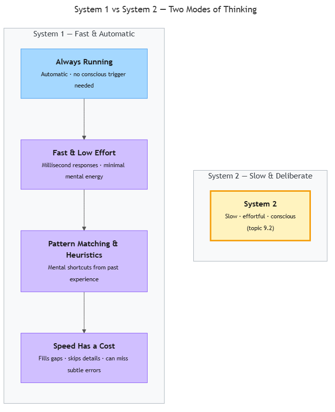
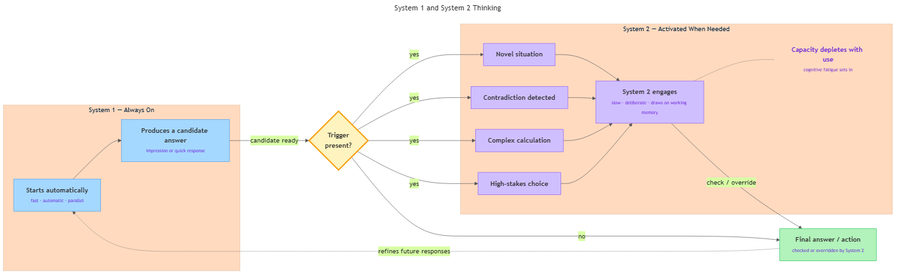

<!-- GENERATED FILE — DO NOT EDIT BY HAND.
     Cresent view of 14.1 — How Humans Think.
     Source of truth: CIT 9.1, CIT 9.2, CIT 9.3, CIT 9.4, CIT 9.5, CIT 9.6.
     Regenerate: python Cresent/Technical/tools/generate_shared_readings.py -->
<!-- nav:top:start -->
Previous: [⬅ 13.7 — Engineering Takeaway](../../../../m2-introduction-to-ai-systems/week-13/1-ethics-safety-governance/13-7-engineering-takeaway/reading.md)&emsp;·&emsp;[⬆ Table of Contents](../../../../../../README.md#part-b)&emsp;·&emsp;[14.2 — The Judgment Framework ➡](../14-2-the-judgment-framework/reading.md)
<!-- nav:top:end -->

---

# System 1 thinking — fast, instinctive, automatic

## Overview

Your brain is doing most of its work without you noticing. Right now, as you read this sentence, you are not choosing to decode each letter — meaning just arrives. That effortless, background mode of mental processing is called **System 1 thinking**, and understanding it changes how you interact with AI tools. When we evaluate AI-generated output, System 1 is usually the first — and sometimes only — part of our mind that weighs in. Knowing how it operates is the foundation for everything in this module. [1]

## Key Concepts

### What is System 1 thinking?

**System 1 thinking** is the brain's fast, automatic, and largely unconscious way of processing information [1]. It runs continuously in the background, producing instant reactions, filling in gaps, and returning answers without any deliberate effort on your part.

Think of it as the brain's autopilot. An aircraft autopilot handles routine adjustments without the pilot manually commanding each one. System 1 handles routine mental tasks the same way — without you consciously directing each step.

Psychologist Daniel Kahneman, drawing on decades of work with Amos Tversky, identified three defining characteristics of System 1 [1][2]:

| Characteristic | What it means | Everyday example |
|---|---|---|
| **Fast** | Responses take milliseconds to seconds | You brake for a child stepping into the road before deciding to |
| **Automatic** | Starts and runs without you choosing it | Reading words the moment your eyes land on them |
| **Low effort** | Uses very little mental energy | You can hold a conversation and walk at the same time |

System 1 is not a physical region of the brain. It is a label for a cluster of mental operations that share those three properties.

### Pattern matching and cognitive heuristics

System 1 works mainly through **pattern matching** — comparing the current situation against a vast library of patterns built up from past experience. When it finds a match, it returns a response immediately [1].

You see a red octagonal sign with the word "STOP." You do not decode the letters one at a time. You recognise the pattern and ease off the accelerator. No deliberate reasoning required.

When no exact pattern match is available, System 1 falls back on **cognitive heuristics** (pronounced hyu-RIS-tiks). A **cognitive heuristic** is a mental shortcut — a rule of thumb the brain uses to reach a "good enough" answer quickly, without running a full analysis [1].

Example: You walk into an unfamiliar restaurant. Before seeing the menu you notice it is busy, well-lit, and the diners look happy. System 1 fires the heuristic "busy plus happy diners equals quality" and you already feel it is probably good. That heuristic is right often enough that your brain keeps it — but it can also be wrong (tonight is busy only because of a discount deal).

Heuristics are not flaws or bugs. They evolved because fast, approximate answers are often more valuable than slow, precise ones [2]. The diagram below shows how System 1 and its counterpart System 2 sit alongside each other — you will study System 2 in topic 9.2.


*System 1 and System 2 — the two modes of thinking Kahneman described. System 2 is covered in topic 9.2.*

### Automatic processing: always running

**Automatic processing** is the technical term for mental operations that start without intention, run alongside other tasks, and complete without conscious monitoring [1][2].

Reading this sentence is automatic processing. You did not choose to decode each letter — your visual and language systems handled it without being asked. Other everyday examples:

- Recognising a friend's face in a crowd
- Feeling startled at a sudden loud noise
- Completing the phrase "bread and …" (most people automatically think "butter")
- Estimating which checkout queue is shorter
- Immediately sensing that a maths answer "looks wrong" before working it out

All of these fire in the background while conscious attention is elsewhere.

### Why speed has a cost

System 1's speed comes from not checking everything. It fills in gaps using past experience, skips low-salience details, and commits to an answer quickly. Under normal conditions this is efficient. Under unusual conditions — when a situation is genuinely novel, when stakes are high, or when information is deliberately misleading — the same speed becomes a liability [1][2].

A quick demonstration: count the letter F in the sentence below.

*"Finished files are the result of years of scientific study combined with the experience of years."*

Most people count three or four. The actual count is six. System 1 processes common short words like "of" as a single chunk rather than scanning each letter, so three of the Fs slip past undetected.

That "good enough, fast" trade-off is the central tension in this module. When you skim an AI-generated answer and it sounds fluent and confident, System 1 signals "this looks correct." It may well be correct — but fluency is not the same as accuracy, and automatic trust is not the same as justified trust. [1][3]

## Worked Example

**Scenario:** A developer asks an AI assistant how to reverse a list in Python. The assistant returns:

```
my_list.sort(reverse=True)
```

The answer is well-formatted, uses correct Python syntax, and looks authoritative. The developer's System 1 pattern-matches to "Python code, reverse keyword, looks right" and moves on.

The problem: `.sort(reverse=True)` sorts the list from largest to smallest — it does not reverse the original order. The correct method is `my_list.reverse()` or `my_list[::-1]`. The code is syntactically valid (no obvious error pattern for System 1 to catch) and semantically wrong.

Walk through what happened step by step:

1. The developer read the output quickly — System 1 activated automatically.
2. System 1 matched "Python + reverse keyword" to its library of familiar code patterns.
3. The match felt confident, so System 1 returned a "correct" verdict.
4. No prompt triggered System 2 to check whether the output actually did what was asked.
5. The error passed undetected until runtime.

The lesson is not that System 1 is broken. It is that System 1's pattern-matching is calibrated to surface-level features (syntax, style, familiar keywords) — not to semantic correctness. The faster and more fluent an AI output, the less friction System 1 experiences, and the more it trusts. [1][3]

## In Practice

System 1 shows up in every domain where people review information quickly:

- **Medicine.** Experienced clinicians develop strong System 1 pattern recognition over years of practice. A seasoned emergency physician can walk into a room and immediately sense "this patient is in trouble" before any test result is back. That trained intuition is often accurate — and can also lock onto the first plausible diagnosis too early, stopping further investigation. [1]

- **Software engineering.** Developers reviewing code quickly catch obvious bugs — misspellings, wrong variable names — because System 1 flags mismatches against familiar patterns. Subtle logic errors that look syntactically normal slide through.

- **AI-assisted work.** A well-structured, confidently worded AI output triggers a System 1 "this is correct" impression. This is the cognitive root of automation bias — a pattern you will examine in detail in topic 9.5. It is named here because System 1 is where it starts. [3]

**Key do/don't pairs:**

| Do | Don't |
|---|---|
| Scale scrutiny to stakes — low-stakes drafts are fine on System 1 approval | Treat fluency as accuracy — a grammatically polished output is not evidence of correctness |
| Create deliberate friction for high-stakes reviews (read it a second time looking for one claim to verify) | Try to switch System 1 off — you can't; redirect it instead |
| Notice System 1 activation signals (instant confidence, reading while tired or multitasking) | Assume your first impression of an AI output reflects careful analysis |

## Key Takeaways

- **System 1 is fast, automatic, and low-effort** — it runs continuously in the background without you consciously activating it.
- **It works through pattern matching and cognitive heuristics** — mental shortcuts that produce quick, "good enough" answers from past experience.
- **Speed is both a feature and a risk.** System 1 is highly efficient for routine, pattern-rich situations; it can miss subtle errors in novel or high-stakes ones.
- **Fluency is not accuracy.** An AI output that sounds confident and reads smoothly is not the same as one that is correct — System 1 cannot tell the difference without deliberate support from System 2.
- Understanding how System 1 operates builds the foundation for the cognitive bias topics that follow in this module.

## References

[1] The Decision Lab. *System 1 and System 2 Thinking*. https://thedecisionlab.com/reference-guide/philosophy/system-1-and-system-2-thinking

[2] Farnam Street. *Daniel Kahneman: The Two Systems*. https://fs.blog/daniel-kahneman-the-two-systems/

[3] arxiv.org. *Connecting Kahneman's System 1/2 Framework to AI Common Model of Cognition* (2023). https://arxiv.org/pdf/2305.10654

---

# System 2 Thinking — Slow, Deliberate, Effortful

## Overview

In topic 9.1 you met System 1 — the brain's autopilot. It fired your foot at the brake before you consciously decided to stop. Now meet the other mode. System 2 is the focused, step-by-step thinking you use when something genuinely requires your full attention: working through a logic problem, weighing a consequential decision, or carefully checking a piece of work before approving it.

Where System 1 runs automatically in the background, System 2 is more like a spotlight. It illuminates one thing at a time and costs real mental energy to keep on. Most of the time it sits dormant while System 1 handles the world. But when something is too novel, too risky, or too complex for autopilot, System 2 is the mode that steps in.

In this reading you will learn what System 2 is, why it has hard limits, and why those limits matter every time you evaluate an AI-generated output. [1]

## Key Concepts

System 2 is not a mysterious second brain. It is a describable, measurable mode of thinking with specific properties, a specific resource it draws on, specific triggers that wake it up, and specific ways it can fail. [1][2]



*The diagram contrasts System 1 (fast, automatic, parallel) with System 2 (slow, deliberate, serial) — notice how the two modes differ in effort and capacity.*

### What Is System 2 Thinking?

**System 2 thinking** is the brain's slow, deliberate, and effortful mode of processing information [1]. Unlike System 1, which fires automatically and continuously, System 2 is consciously directed — you choose to engage it, and engaging it costs noticeable mental energy.

Kahneman calls System 2 "the lazy controller": it is capable of precise logical reasoning, but the brain avoids running it unless necessary [1]. The three defining characteristics are:

1. **Slow** — System 2 unfolds over seconds or minutes, not milliseconds. Working through a multi-step calculation, reading a contract clause carefully, or tracing a logical argument all take measurable time.
2. **Deliberate** — System 2 requires conscious intention. It does not start on its own the way System 1 does. You have to choose to engage it.
3. **Effortful** — System 2 consumes significant mental energy. After sustained System 2 activity you feel mentally tired in a way that automatic processing never causes. [1][2]

A fourth property follows from the others: **serial processing** — System 2 handles only one task at a time, in sequence. System 1 can run many pattern-matching operations simultaneously because each one is cheap. System 2 cannot. You cannot genuinely reason through two complex problems at the same moment. [1][3]

### Working Memory: The Workspace System 2 Draws On

System 2 does not reason in thin air. It relies on a mental workspace called **working memory** [2].

**Working memory** is the limited-capacity space where you hold and manipulate information right now, in the moment. Think of it as a small whiteboard in your mind. You can write things on it, move them around, erase and rewrite — but the whiteboard is small. Most people can hold roughly four to seven chunks of information in working memory at one time before earlier items start falling off [2][3].

When you check whether a calculation in a report makes sense, you hold the numbers, the intermediate steps, and the logical rules all on that whiteboard simultaneously. If the problem becomes too complex, pieces drop off before you finish, and your reasoning becomes unreliable.

This limited capacity is why System 2 thinking is effortful and can be exhausted. It is not about intelligence. It is a structural feature of how the brain stores and manipulates information in real time. [2]

**Cognitive load** is the total demand that a task places on working memory at a given moment [2][3]. Compare two tasks:

| Task | Cognitive load | Effect |
|---|---|---|
| Copying a phone number you just heard | Low — working memory has spare capacity | Reasoning stays sharp |
| Following a dense technical argument while tracking three open questions | High — working memory near full | Details missed; logic errors increase |

When cognitive load is high, System 2 performance degrades and you are more likely to defer to whatever System 1 is suggesting. [2]

### When Does System 2 Activate?

System 1 handles the routine and familiar. System 2 steps in under four main conditions [1][2]:

1. **Novel situations.** When a situation does not match any stored pattern, System 1 has no ready answer. System 2 is called in to reason from first principles. Your first time configuring a new type of cloud resource will engage System 2; after dozens of repetitions, the same task becomes routine and System 1 can handle it.

2. **Contradictions.** When System 1's automatic output conflicts with another piece of information — when something "doesn't add up" — System 2 is triggered to investigate. The feeling of "wait, that doesn't seem right" is System 1 raising a flag; the investigation that follows is System 2. [1]

3. **Complex calculations and multi-step reasoning.** Any task requiring you to hold multiple pieces of information in mind and manipulate them — logical deduction, comparing options on several criteria — inherently requires System 2 because it exceeds what automatic processing can do. [2]

4. **High-stakes or consequential choices.** When the consequences of an error are significant, people tend to engage System 2 deliberately, slowing down rather than relying on gut response. Approving a production deployment or making a safety-critical recommendation are moments where System 2 engagement is expected. [1][3]

### System 2's Role: Checking and Overriding System 1

System 1 produces outputs constantly — impressions, intuitions, quick answers. Most of the time these are good enough, and System 2 never reviews them. But System 2 has the capacity to check System 1's work and, when necessary, override it [1][2].

A relay analogy is useful here. System 1 runs first and fast, producing a candidate answer. If that answer is flagged — by novelty, by a felt inconsistency, or by a deliberate choice to check — System 2 engages and applies logical scrutiny.

- When System 2 agrees with System 1's answer, the answer is accepted and confirmed.
- When System 2 disagrees, it can revise or reject System 1's output.

*Example:* System 1 scans a code snippet, recognises a familiar structure, and emits "this looks fine." System 2, engaged deliberately, traces through the logic step by step and notices an off-by-one error that pattern matching missed. [1]

Critically, System 2 does not always engage even when it should. If you are busy, tired, or under time pressure, the System 2 check may not happen — and System 1's output is accepted without verification. [2][3]

### Cognitive Fatigue: When System 2 Runs Low

System 2 is powerful but it has hard limits.

**Cognitive fatigue** is the progressive decline in the quality of deliberate, effortful thinking after sustained mental work [1][2]. After hours of deep concentration, a full day of high-stakes decisions, or an intense study session, the quality of System 2 thinking degrades. Working memory becomes less reliable, reasoning becomes less rigorous, and the brain increasingly defers to System 1 even for tasks that would normally trigger System 2.

You have almost certainly experienced this. After a long demanding day, you find yourself accepting things at face value that you would have questioned in the morning. That shift is real, measurable, and a direct consequence of the finite energy budget System 2 draws on. [2]

A related concept sometimes cited in research is **ego depletion** — the idea that making many decisions and resisting automatic responses all draw on the same finite resource. The practical consequence is the same as cognitive fatigue: as the resource depletes, System 2 engagement declines. The research picture around ego depletion is still being refined; what is well-established is that sustained effortful processing degrades over time. Cognitive fatigue is the primary term to remember.

The second hard limit is **finite serial capacity**. Because System 2 processes one thing at a time, it cannot be in two places at once. Heavy System 2 engagement on one task crowds out System 2 availability for another. A practitioner focused on writing a technical specification may not have System 2 capacity available to also carefully verify an AI output open in another tab — even if they are nominally "looking at" both. [3]

These limitations are not failures of character or intelligence. They are structural features of how human cognition works.

## Worked Example

**Priya reviews an AI-generated database configuration recommendation.**

Priya is a junior DevOps engineer. It is late morning and she has come through back-to-back meetings. She opens a ticket: the AI has recommended setting a database connection pool timeout to 30 seconds for a production API.

1. **System 1 fires first.** The recommendation is clearly written and confident in tone. 30 seconds sounds like a plausible timeout value. Priya's System 1 pattern-matches against timeout values she has seen before and returns: "this looks fine." She is about to approve it.

2. **A contradiction triggers System 2.** A phrase in the recommendation catches her eye: the AI described the API as "low-frequency." But Priya's own notes say it is the team's highest-traffic endpoint. System 1 raises a flag — something doesn't add up — and that flag activates System 2.

3. **System 2 takes over.** Priya slows down. She holds several pieces of information in working memory at once: the API's actual traffic volume, the consequence of a 30-second timeout under high concurrent load (connections queue up, latency spikes, cascading failure risk), and the team's documented SLA. Working through these steps deliberately takes about two minutes.

4. **System 2 overrides System 1.** Priya concludes that 30 seconds is dangerously long for this endpoint. The appropriate value is closer to 5 seconds with retry logic. She edits the recommendation, adds a note explaining why, and approves the revised configuration.

**What this shows:**

- System 1 produced an initial "looks fine" impression based on fluent presentation and pattern matching.
- A minor textual inconsistency was enough to trigger System 2.
- System 2 used working memory to reason through the problem step by step.
- System 2 caught the error — but only because it was successfully activated. If Priya had been more fatigued, or if there had been no inconsistency to notice, System 1's approval might have stood. [1][2]

## In Practice

Understanding System 2 is directly relevant to how you evaluate AI-generated outputs in your own work.

**Notice which mode you are in.** When you first read an AI suggestion, you are almost certainly using System 1 — skimming, pattern-matching, forming a quick impression. That is normal and fine for a first pass. The risk is stopping there.

**Build deliberate System 2 checks into high-stakes reviews.** Before approving an AI output that has real consequences — a configuration change, a code merge, a recommendation that will be acted on — create a moment of deliberate engagement. Ask: what would have to be wrong here for this to fail? Check at least one claim against an independent source.

**Manage your cognitive load.** Review critical AI outputs when you are mentally fresh — not back-to-back after a demanding morning, not at the end of the day. Cognitive fatigue is real. A tired System 2 misses things a fresh System 2 would catch.

**Know what depletes you.** Back-to-back tasks, information overload, and time pressure all push you toward System 1. When conditions like these are present, a System 2 check may not happen — or may happen shallowly. Design your workflow to account for this, not to ignore it. [1][2]

The specific ways that System 1's shortcuts produce predictable errors — patterns like confirmation bias and anchoring — are covered starting at topic 9.3. The Judgment Framework (topics 9.7–9.9) is the structured approach built on this foundation.

## Key Takeaways

- **System 2 thinking** is slow, deliberate, effortful, and serial — you must consciously choose to engage it, and it costs real mental energy. [1]
- **Working memory** is the small mental workspace System 2 draws on; most people can hold roughly four to seven chunks of information at once before earlier items fall off. [2]
- **Cognitive load** is the total demand a task places on working memory; high cognitive load degrades System 2 performance and increases reliance on System 1 defaults. [2][3]
- System 2 activates under four conditions: novel situations, contradictions, complex multi-step reasoning, and high-stakes choices — it does not run continuously the way System 1 does. [1]
- System 2's primary role is to **check and override System 1** — but only when it is actually engaged; fatigue, time pressure, and busyness can all prevent that check from happening. [1][2]
- **Cognitive fatigue** is the progressive decline of deliberate thinking after sustained effortful work; as fatigue builds, the brain defers increasingly to System 1, raising the risk of unchecked AI output acceptance. [2]
- For AI oversight, System 2's finite capacity is a design constraint, not just an inconvenience — effective oversight workflows must account for when and how System 2 can realistically be engaged. [1][3]

## References

[1] The Decision Lab. "System 1 and System 2 Thinking." https://thedecisionlab.com/reference-guide/philosophy/system-1-and-system-2-thinking

[2] Sue Behavioural Design. "System 1 and System 2 Explained." https://www.suebehaviouraldesign.com/en/blog/system-1-and-system-2-explained/

[3] Laird, J. E., et al. "A Standard Model of the Mind." arXiv:2305.10654. https://arxiv.org/abs/2305.10654

---

# Confirmation Bias — Seeking Information That Confirms Existing Beliefs

## Overview

Picture a student in a coding bootcamp who starts using an AI code assistant and quickly decides it is reliable. From that point on, they test the tool on familiar problems, read borderline outputs charitably, and remember its wins far better than its failures. That sequence — testing only comfortable ground, interpreting ambiguous results generously, recalling successes over mistakes — is **confirmation bias** in action. Confirmation bias is the systematic tendency to seek out, interpret, and remember information in a way that confirms what you already believe [1]. It is not carelessness or dishonesty; it is how the human brain is built. This reading explains what confirmation bias is, how it works through three mechanisms, and why understanding it is essential for evaluating AI systems honestly.

## Key Concepts

### What is confirmation bias?

**Confirmation bias** — the tendency to search for, interpret, and remember information in a way that supports existing beliefs rather than challenging them [1]. The word *systematic* matters: a random error sometimes makes you overconfident, sometimes underconfident. Confirmation bias is not random — it consistently pushes in one direction, toward whatever you already believe [1][2].


*The self-reinforcing loop: a prior belief shapes what information you search for, how you interpret it, and what you remember — each cycle strengthening the original belief.*

### The three mechanisms

Researchers have identified three distinct ways confirmation bias operates [1][2]:

**1. Selective search**

When testing a belief, people naturally look for *confirming* evidence rather than **disconfirming evidence** — that is, evidence that would prove the belief wrong. Instead of asking "what would show I am wrong?", the default impulse is "what supports what I already think?" [1][2].

The classic demonstration is the **Wason 2-4-6 task**, designed by psychologist Peter Wason in the 1960s [2]. Participants are told that the sequence "2, 4, 6" follows a secret rule. They must discover the rule by proposing their own sequences; the experimenter says whether each one fits or not. Most participants quickly guess "consecutive even numbers" and then test sequences like "8, 10, 12" — which all confirm their guess. The actual rule is broader: "any ascending sequence." Participants could discover this by testing sequences that *break* their hypothesis — like "1, 2, 3" or "5, 7, 100" — but the overwhelming majority never try them [1][2]. They keep gathering confirming evidence and declare confidence in a rule they have never actually tested.

**2. Biased interpretation**

Even when two people encounter the same piece of evidence, they often interpret it differently based on their prior beliefs. Ambiguous evidence gets read as confirming; challenging evidence gets scrutinised more heavily or explained away [2].

Imagine two practitioners evaluating an AI-generated summary. One believes the AI is trustworthy; the other is sceptical. When the summary contains a mildly imprecise sentence, the trusting evaluator thinks "close enough — it got the gist." The sceptical evaluator flags it as "proof the AI doesn't really understand the domain." Same sentence. Different prior beliefs [2].

**3. Selective memory**

People recall information that is consistent with their beliefs more readily than information that contradicts them [1]. This is not deliberate forgetting — it is how memory works. Experiences that fit an existing mental model are stored and retrieved more easily. Over time, this selective recall makes the original belief feel more evidence-based than it actually is.

### Why it is so automatic

You may think: "If I know about this bias, I'll just slow down and check myself." That instinct is reasonable — but not sufficient [1][2].

The root cause lies in **System 1 processing** (introduced in topic 9.1): the fast, automatic layer that scans for patterns matching existing mental models. When incoming information fits a familiar pattern, System 1 flags it as relevant and trustworthy. When information contradicts the pattern, System 1 deprioritises it. This is efficient for everyday life — but the efficiency is directionally biased [1].

There is also a driver called **cognitive economy** — the brain's tendency to minimise mental effort. Confirming an existing belief requires less cognitive work than revising it: no need to restructure your mental model, reconcile conflicting data, or tolerate uncertainty. Confirmation bias is, in part, the brain taking the path of least resistance [1].

### The limits of System 2 correction

Topic 9.2 introduced **System 2** as the deliberate, analytical mode that should catch and correct bias. In practice, there is a catch [2].

Even under deliberate thinking, a phenomenon called **motivated reasoning** can distort the outcome. **Motivated reasoning** — using analytical capacity not to find the truth but to build the strongest-possible case for what you already believe — can look rigorous on the surface while actually defending a prior conclusion [2]. Research suggests that more analytically skilled people are sometimes *better* at constructing sophisticated justifications for existing views, not less prone to the bias [1]. Awareness helps, but structured methods are needed — those are introduced later in the course.

### Confirmation bias is universal

One point worth making plainly: confirmation bias is not a flaw of low-intelligence or uneducated people — it is a feature of normal human cognition [1]. Every person, including trained scientists and experienced engineers, shows it in experimental settings. Dismissing the bias as something that only affects "other people" is itself a form of confirmation bias.

## Worked Example

**Scenario:** A junior developer evaluates a new AI code assistant before recommending it to their team. They believe, based on early demos, that the tool is strong.

1. **Selective search.** To test the tool, the developer picks problems from areas they already know well — basic string manipulation, standard API patterns, simple sorting. These are tasks where they can judge output quality quickly. They never pick problems in areas where they have less experience (database query optimisation, concurrency bugs), so the tool is only ever tested on ground where it is most likely to succeed.

2. **Biased interpretation.** One generated function returns a correct result but uses a deprecated library method. The developer notices the deprecated method but thinks: "It still works — the AI just used an older style." A neutral evaluator might flag this as evidence the tool's training data is outdated. The developer's interpretation is shaped by their prior belief that the tool is reliable.

3. **Selective memory.** At the end of the week, the developer writes up their recommendation. They vividly recall five or six examples of clean, correct code. They have a vague sense there were "a couple of rough ones" but cannot remember details. The write-up is strongly positive; failures are acknowledged in passing.

**Outcome:** The team adopts the tool based on a biased evaluation. It performs well on routine tasks (what it was tested on) but struggles with complex cases the developer never probed. The bias was invisible throughout.

## In Practice

When evaluating AI tools, confirmation bias does not disappear — in many ways the AI context makes it more dangerous. A practitioner who believes an AI system is reliable will tend to:

- Test it on familiar or easy inputs (selective search)
- Interpret borderline outputs as correct (biased interpretation)
- Remember successful outputs more vividly than failures (selective memory)

When an AI produces a plausible-sounding but wrong answer, System 1 pattern-matching and confirmation bias work together: the output *looks* right, and the prior belief fills in the rest [3]. The reverse applies equally — a practitioner who has decided a tool is unreliable will find failures everywhere and dismiss successes [3].

**Practical steps to counter confirmation bias during AI evaluation:**

- **Write down what would change your mind** before you start testing. Deciding in advance what a failure looks like stops you from redefining failure after you see the output.
- **Test on unfamiliar ground.** Deliberately choose inputs in areas where you cannot easily judge the output — those are the cases most likely to expose real weaknesses.
- **Log failures as specifically as you log successes.** A written record resists selective memory better than unaided recall.
- **Ask a sceptic to review.** A colleague who holds the opposite prior belief will notice what you explain away.

For a structured framework that builds these steps into a repeatable process, the Judgment Framework (topics 9.7–9.9) is designed to counteract exactly this kind of evaluator bias.

## Key Takeaways

- **Confirmation bias** is the systematic tendency to seek out, interpret, and remember information that confirms what you already believe — not a sign of low intelligence, but a feature of normal human cognition [1].
- It operates through three mechanisms: **selective search** (testing only for confirming evidence), **biased interpretation** (reading ambiguous evidence as supporting), and **selective memory** (recalling successes more readily than failures) [1][2].
- The Wason 2-4-6 task shows that even in purely logical, unemotional tasks, people default to confirmatory rather than falsifying search [2].
- **Cognitive economy** (the brain minimising effort) and **System 1 processing** make confirmation bias automatic and largely invisible to the person experiencing it.
- **Motivated reasoning** means that even deliberate, analytical (System 2) thinking can be hijacked to defend a prior belief rather than find the truth [2].
- Awareness of the bias is a starting point, but it does not switch off the underlying mechanism — structured evaluation techniques are more reliable than unaided self-awareness [1][3].
- In AI evaluation, confirmation bias can cause a practitioner to misjudge a system's quality in either direction — overrating a tool they trust or underrating one they distrust [3].

## References

[1] Simply Psychology — Confirmation Bias. https://www.simplypsychology.org/confirmation-bias.html

[2] Britannica — Confirmation Bias. https://www.britannica.com/science/confirmation-bias

[3] CogBias — Measuring and Mitigating Confirmation Bias in LLMs. https://arxiv.org/abs/2604.01366

---

# Anchoring Bias — Over-Relying on the First Piece of Information Received

## Overview

Anchoring bias is the tendency to give too much weight to the first piece of information you encounter and to let it pull every judgment you make afterward closer to that starting point — even when the information is wrong, random, or irrelevant [1]. It is one of the most consistently observed effects in psychology, replicated across cultures, professions, and levels of expertise. For anyone working with AI tools, it carries a direct practical risk: the first output an AI produces becomes an anchor before you have reviewed a single piece of underlying evidence.

## Key Concepts

**Anchor** — the first number, statement, or piece of information you encounter on a topic. It acts as a mental reference point that shapes all estimates and judgments made afterward.

An anchor can be a price tag, a model accuracy figure, a project timeline estimate, or the first answer an AI generates. Once set, the brain treats it as a baseline and measures everything else relative to it. High anchors push estimates up; low anchors pull them down. The key insight is that **the anchor does not have to be accurate or even relevant to have this effect** [1].

In a famous experiment, Tversky and Kahneman spun a rigged wheel-of-fortune that landed on either 10 or 65, then asked participants what percentage of African countries are members of the United Nations. The wheel result was completely unrelated to the question. Participants who saw 65 averaged around 45%; those who saw 10 averaged around 25% — a 20-percentage-point shift driven by a random number from a game wheel [1].

**Adjustment heuristic** — a mental shortcut in which the brain starts at the anchor and makes incremental adjustments up or down until an estimate "feels acceptable."

The process follows four steps:

1. An anchor is received (a number, a statement, a first answer).
2. The brain takes the anchor as its starting point.
3. The brain nudges the estimate up or down incrementally.
4. Adjustment stops when the result "feels right."

The problem is that "feels right" arrives too soon. People stop adjusting before they have moved far enough from the anchor. This pattern is called **insufficient adjustment**.

**Why adjustment stops too soon** — two reinforcing reasons explain this:

- **Reason 1 — Adjustment is System 2 work, and System 2 is effortful.** As covered in topic 9.2, System 2 thinking is cognitively expensive. It requires working memory and deliberate effort, and it fatigues over time. The moment adjustment feels plausible, System 2 stops — conserving cognitive resources [1].
- **Reason 2 — The anchor activates anchor-consistent information in memory.** Anchors do not just set a starting point; they steer memory retrieval toward facts that are consistent with the anchor [2]. That retrieved information then feels like evidence the estimate is in the right range — even though the anchor itself triggered the search. This makes the estimate feel justified when it is actually just close to the anchor.

The diagram below shows how these steps connect — from the moment an anchor arrives to the moment a biased judgment forms.


*How an anchor flows through System 1 registration, System 2 adjustment, and insufficient adjustment to produce a judgment biased toward the anchor.*

**Anchoring bias is universal.** Large-scale empirical research confirms it appears across dozens of countries and cultural contexts. It occurs with arbitrary anchors just as it does with plausible ones. People with higher education, domain expertise, or explicit warnings about anchoring still show significant anchoring effects — the warning reduces the bias but does not remove it. In typical experiments, anchors shift numerical estimates by 10–35% [3].

**How anchoring differs from confirmation bias** — both are cognitive biases you have encountered in this module, but they work differently:

| Feature | Confirmation bias | Anchoring bias |
|---|---|---|
| What distorts judgment | Existing beliefs and expectations | The first number or statement encountered |
| When it activates | When searching for or interpreting evidence | When forming an estimate from a starting value |
| Core mechanism | Selective search; biased interpretation | Anchor-and-adjust; stopping too close to anchor |
| Can a random input trigger it? | No — requires a prior belief to confirm | Yes — even a random number anchors estimates |

Both biases are driven largely by System 1, and both resist System 2 correction — but they are triggered by different inputs.

## Worked Example

**Scenario:** You ask an AI writing assistant to estimate the budget for a project.

**Step 1 — The anchor is set.**
The AI outputs: "Based on similar projects, a budget of approximately $180,000 seems appropriate." That number is now your anchor. Your brain registers it as the starting point before you have reviewed a single project detail.

**Step 2 — You review the project details.**
The project scope is actually smaller than the examples the AI compared it to. You think: "This should probably be less. Maybe $160,000."

**Step 3 — Adjustment stops too soon.**
$160,000 "feels reasonable" — it is lower than the AI's number, so it feels like you have corrected the estimate. You stop adjusting. But if you had built the estimate from scratch, independent research on similar small projects suggests a realistic range of $95,000–$110,000.

**Step 4 — The final judgment is biased toward the anchor.**
Your estimate of $160,000 is far higher than the evidence-based range — because the AI's initial output anchored you to a high starting point. You adjusted, but not nearly far enough.

The mechanism at each step:

1. AI produces a first output → anchor set automatically (System 1 registers it instantly).
2. You notice the anchor may be wrong → System 2 begins adjustment.
3. Adjustment feels sufficient at $160,000 → System 2 stops; insufficient adjustment occurs.
4. Final estimate remains biased toward $180,000 → anchoring bias has distorted the judgment.

**Takeaway:** Reviewing an AI's first output and then forming your own judgment is not the same as forming an independent judgment. The moment you see the AI's number, you have an anchor. Forming your own estimate *before* looking at the AI's output is one way to reduce this effect.

## In Practice

Anchoring bias is especially consequential in AI-assisted work because AI outputs arrive before the human has engaged with the underlying evidence. Common scenarios:

| Scenario | What anchors you | Risk |
|---|---|---|
| AI generates a cost, timeline, or score estimate | The AI's number | Your revised estimate stays too close to the AI's figure, even if evidence points elsewhere |
| AI drafts a summary or report | The AI's framing and word choices | Your edits stay structurally close to the AI's version; deeper flaws go unnoticed |
| AI states a model's accuracy as "approximately 87%" | The "87%" figure | You treat 87% as the baseline even when your test conditions differ significantly |
| AI gives a first recommendation (e.g., a risk rating) | The AI's recommendation | You fail to revise sufficiently even when contradicting evidence is found |

**The first-pass anchor** is worth naming explicitly. When an AI produces a first draft, that output becomes the anchor for every revision cycle that follows. Each pass starts from the AI's starting point, not a blank slate. Over multiple rounds, the final output may remain structurally close to the original — not because revisions were careless, but because each round was anchored to the previous version [2].

**Practical do / don't:**

- **Do** form your own estimate or outline before requesting an AI output on a high-stakes task.
- **Do** generate two independent AI outputs (different prompts or starting conditions) for important decisions and compare them before settling on a judgment.
- **Don't** assume awareness alone is sufficient protection — studies show that even people who know about anchoring, and are told an anchor is random, still show significant anchoring effects [3].
- **Don't** rely on domain expertise to eliminate the bias; experts show the same anchoring effects as novices, just slightly reduced [2].

## Key Takeaways

- **Anchoring bias** is the tendency to give too much weight to the first piece of information received — the anchor — and to let it pull later judgments toward it, even when the anchor is wrong or irrelevant.
- **The adjustment heuristic** explains the mechanism: the brain starts at the anchor and adjusts incrementally, but stops too soon — producing **insufficient adjustment**.
- **System 1 sets the anchor automatically** before System 2 can engage; System 2 then adjusts from an already-biased starting point, which is why the effect is so hard to shake.
- **The bias is universal and measurable** — it affects experts and novices alike, and shifts estimates by 10–35% in typical experiments.
- **In AI-assisted work**, the AI's first output is the anchor; forming an independent judgment before viewing that output is the most direct way to reduce the anchoring effect.

## References

1. Cherry, K. (updated). *What Is the Anchoring Bias?* Simply Psychology. https://www.simplypsychology.org/what-is-the-anchoring-bias.html
2. The Decision Lab. *Anchoring Bias.* https://thedecisionlab.com/biases/anchoring-bias
3. Mannes, A. E., & Moore, D. A. (large-scale empirical study). https://arxiv.org/abs/1911.12275

---

# Automation Bias — Trusting Automated Systems over Human Judgment

## Overview

**Automation bias** is the tendency to over-rely on the output of an automated system — following its recommendations without applying independent judgment, even when doing so is clearly warranted [1]. It is not a deliberate choice or a sign of carelessness; it is a predictable product of the way human cognition handles complexity and time pressure. As AI-assisted tools become standard in workplaces and everyday decisions, understanding this bias is the first step toward managing it.

## Key Concepts

### What Automation Bias Is

Automation bias was first named and studied by researchers Kathleen Mosier and Linda Skitka in the 1990s, using simulated cockpit environments [2]. Their central finding: when an automated system made a recommendation, operators were significantly more likely to follow it — even when instrument readings visible to the pilot contradicted it. This makes it a **bias** in the technical sense: a systematic, predictable skew in judgment, not a random error. Given the same information, a person who sees an automated recommendation will tend to defer to it more than someone reasoning from raw data alone [1].

### Two Types of Error

Automation bias produces two distinct kinds of mistake [2].

**Omission error** — failing to notice or act on something because the automated system did not flag it.

- Example: A radiologist pays close attention to areas a computer-aided detection system has highlighted and less attention to areas it has not. If the system misses a tumour, the radiologist may miss it too — not from carelessness, but because the absence of a flag reduced their vigilance [1].
- The error is something you *failed to do* because the automation's silence implied "nothing to see here."

**Commission error** — doing something incorrect *because* the automated system instructed it, even when independent information should have prompted hesitation.

- Example: A pilot receives an automated navigation instruction to turn left. A visual scan shows a mountainside in that direction. The pilot turns left anyway, deferring to the system [2].
- The error is an action you *actively took* because the automated directive overrode your own judgment.

A useful memory peg: **omission = you missed what the automation missed; commission = you did something wrong because the automation told you to**.


*How an automated output leads to two distinct error types: omission (failing to act on what the system missed) and commission (acting on what the system recommended despite contradicting evidence).*

### Why Automation Bias Happens

Four interconnected mechanisms drive this bias. All are amplified by the cognitive processes studied in earlier topics.

**Cognitive offloading** — **cognitive offloading** is the process of deliberately moving mental work onto an external tool to reduce the load on your own working memory [1]. This is rational in isolation: a spell-checker frees attention for argument structure. The problem arises when offloading becomes so habitual that the human loses **situational awareness** — the ongoing, active sense of what is happening in the environment. Over time, an operator may stop maintaining the internal skills needed to catch the automation's errors [3].

**Perceived reliability and the authority heuristic** — humans naturally extend more trust to sources they perceive as expert or authoritative. When an automated system has been correct many times before, users unconsciously treat its outputs as reliable by default [1]. This shortcut is useful in low-stakes situations. It becomes dangerous when the system's reliability is assumed rather than verified. Note the connection to anchoring bias (9.4): the automated output functions as an anchor, and the human adjusts their judgment insufficiently away from it.

**System 1 processing under time pressure** — recall from 9.1 that System 1 thinking is the brain's fast, automatic, pattern-matching mode. When an automated system presents a recommendation — especially under time pressure, cognitive fatigue, or information overload — the brain tends to accept it through System 1 processing. The implicit reasoning is: *a system has already done the thinking; I do not need to do it again* [1][3]. This effect is most dangerous when the automated system's error looks like a plausible recommendation that would not trip a fast heuristic scan.

**Complacency** — **complacency** is a gradual reduction in vigilance that develops from repeated, successful interactions with a reliable automated system [1]. A clinician who has found a diagnostic tool reliable over thousands of cases will spend less time cross-checking its outputs. This is normal human adaptation, not a character flaw. The risk is that the rare edge case — when the automation is wrong — arrives when vigilance is at its lowest.

### Real-World Evidence

Automation bias is documented across three key domains.

- **Aviation:** Simulator studies consistently show that pilots fail to notice automated system errors more often when a "system normal" indicator is present. In one class of study, pilots flying with a malfunctioning automated system were significantly less likely to detect the malfunction than pilots flying without any automation at all [2].
- **Medicine:** A well-documented pattern is **alert fatigue** — when automated alert systems flag too many low-priority items, clinicians learn to dismiss them with a click, and the rate of missed genuinely important alerts rises accordingly [1].
- **AI-assisted decision-making:** When AI systems provide explanations alongside their recommendations, users tend to defer to those recommendations even when the explanations are incorrect. The presence of text that *looks* like reasoning activates trust at a System 1 level [3].

## Worked Example

**Scenario: AI-assisted resume screening**

A hiring manager uses an AI tool that scores each of 200 job applications from 1 to 100.

1. **Automated output arrives.** The top 20 applications score above 85; the bottom 100 score below 40. The manager opens and reviews only the top 20.
2. **Omission error occurs.** One application scoring 32 belongs to a strong career-changer whose non-traditional background was penalised by the model (trained on conventional credentials). The manager never sees this candidate — the automation's silence (a low score) caused the miss.
3. **Commission error occurs.** An application scoring 91 is shortlisted. Had the manager read it before seeing the score, they would have noticed the candidate's skills do not match the role's core requirements. The high score anchored their assessment and drove an incorrect shortlist decision.
4. **Both errors are discovered later.** A colleague audits the low-scoring pile and surfaces the career-changer. The shortlisted "91" candidate fails to demonstrate core skills at interview.
5. **Structural mitigation is added.** The team decides to: (a) always manually review a random sample of low-scoring applications, and (b) read candidate materials before looking at the score. These procedural changes — not personal resolve — are what actually reduce automation bias going forward.

## In Practice

**Where automation bias shows up most often:**

- Reviewing AI-generated drafts or summaries without re-reading the source
- Accepting code-completion suggestions without checking correctness
- Following GPS routing without considering whether the route makes sense
- Approving a diagnostic tool's output without reviewing the underlying test data

**What actually reduces it (structural approaches work; willpower alone does not):**

- **Mandatory independent check before viewing the automated output** — read the raw materials first, then compare with the system's recommendation
- **Random audits of items the system rated lowest** — catches omission errors the system and human both missed
- **Blind review protocols** — remove or delay the automated score so the reviewer forms an independent view first
- **Calibrated trust** — accepting a system's output at the level of confidence the evidence warrants, neither over-trusting nor reflexively rejecting it [1][3]

**A common misconception to correct:** awareness of automation bias is necessary but not sufficient. Because this bias operates largely through System 1 (fast, automatic) processing, knowing it exists does not reliably prevent it in real-time, high-pressure situations [1]. Knowing about confirmation bias (9.3) does not make you immune to it; the same applies here.

## Key Takeaways

- **Automation bias** is the systematic tendency to defer to automated system outputs without applying independent judgment — a cognitive bias, not a personal failing [1].
- It produces two error types: **omission errors** (missing what the automation missed) and **commission errors** (acting wrongly because the automation directed it) [2].
- The main drivers are cognitive offloading, perceived reliability, System 1 processing under time pressure, and complacency — all amplified when systems have a strong track record.
- Effective mitigation is structural and procedural — mandatory cross-checks, blind review protocols, and random audits — not individual willpower.
- The goal is **calibrated trust**: accepting a system's output at the level the evidence actually warrants, and maintaining situational awareness as a deliberate practice [1][3].

## References

[1] The Decision Lab. "Automation Bias." https://thedecisionlab.com/biases/automation-bias

[2] Wikipedia. "Automation bias." https://en.wikipedia.org/wiki/Automation_bias

[3] Springer. "Automation bias in human-AI collaboration." *AI & Society* (2025). https://link.springer.com/article/10.1007/s00146-025-02422-7

---

# How Human Biases Get Encoded into AI Training Data

## Overview

AI systems learn from examples — feed them examples shaped by human prejudice or careless data collection, and they faithfully learn those patterns [1]. Almost every AI tool in use today was trained on data that humans produced, and that data carries human fingerprints: who was included, how things were labelled, and what past it recorded. Understanding how bias enters training data is the first step toward recognising it when it affects you — or when you are the person producing data that will train the next system.

## Key Concepts

### What "encoding" means

**Encoding** — capturing something into a form a computer can store and learn from.

When a bias is "encoded" into training data, it has been turned into a pattern inside a dataset. The AI does not see a human making a prejudiced decision — it sees numbers, labels, and text. If those numbers and labels reflect a prejudiced pattern, the AI treats that pattern as a fact about the world [1].

**Training data** — the set of examples an AI learns from before it is deployed. Whatever is in that data shapes what the AI "knows" [1][2].

A useful analogy: a camera does not judge — it records what is in front of the lens. But if the photographer always photographs one neighbourhood and never another, the photo archive will make the first look "normal" and the second look invisible. The camera had no bias; the choices behind it did.

### The four main routes bias travels


*The bias feedback loop: human decisions shape training data, which trains the AI model, whose decisions shape real-world outcomes, which feed back as new training data — amplifying the original bias with each cycle.*

**Labelling bias** — when the tags or categories attached to data reflect the prejudices or assumptions of the people doing the labelling, rather than objective reality [2].

Most large AI datasets are labelled by human workers who bring their own cultural backgrounds and blind spots. A company building a customer-service AI hired labellers to tag reviews as positive, negative, or neutral. One group consistently tagged sarcastic reviews as "positive" because they missed the tone; another tagged reviews using unfamiliar slang as "negative" because the language felt aggressive to them. The AI inherited both errors — it now misclassifies sarcasm and unfamiliar dialects in exactly the same way the human labellers did [2].

**Historical bias** — when training data accurately reflects a past that was itself unfair, and that unfairness gets carried forward into the AI's decisions as if it were a natural law [1].

This is a common surprise: a dataset can be completely accurate and still encode bias. Historical loan data shows higher default rates in certain zip codes — partly because past lending practices denied credit to those neighbourhoods. An AI trained on that data refuses loans to residents of those zip codes, reinforcing the same inequality that created the high default rate in the first place [1][2].

**Selection bias** (also called **representation bias**) — when the training data does not represent all the groups or situations the AI will later be used on [1][2].

Early commercial facial recognition systems were trained primarily on photos of light-skinned male faces, because public photo datasets scraped from the internet over-represented that demographic. When deployed, these systems had measurably higher error rates on darker-skinned women [1][3]. The AI was not intentionally discriminatory — it was under-trained on certain groups, and that gap showed up as performance disparity.

**Feedback loop amplification** — a cycle where the AI's own outputs become inputs for future training, compounding an initial bias with each cycle [1][3].

The steps of the loop are:

1. An AI is trained on biased data and deployed.
2. The AI makes decisions — loan approvals, resume rankings, patrol assignments.
3. Those decisions create real-world outcomes: who gets loans, who gets jobs, which areas get policed.
4. Data about those outcomes is collected and used to train the next version of the AI.
5. The next version learns from data that already reflects the AI's prior decisions — not just original human decisions.
6. Repeat.

A predictive policing AI illustrates this clearly. The AI directed more patrols to certain neighbourhoods; more patrols produced more arrests; those arrests were fed back to the AI as evidence the neighbourhood was "high risk." The AI's prediction was confirmed — not because the area was actually more dangerous, but because the deployment created the data that validated it [1][3].

### How cognitive biases from 9.3–9.5 make encoding worse

The encoding mechanisms above are structural — they describe how bias enters data. But the humans building and maintaining AI systems are also subject to the individual biases you studied earlier.

**Confirmation bias (9.3)** operates at the data pipeline level. A practitioner who believes a certain group is lower-risk will tend to choose datasets that confirm that belief, downweight contradicting data, and flag labels that disagree with expectations as "errors" while approving matching ones as "correct" [3]. This is selective search and biased interpretation working at scale.

**Automation bias (9.5)** prevents humans from catching the feedback loop in time. Engineers who accept AI outputs as authoritative — without checking whether those outputs reflect genuine world truth or the AI's prior biases — exhibit automation bias. When AI outputs are fed back as training data, no one catches the moment when AI-made decisions become the "ground truth" for the next training cycle [1][3]. This is the commission error variant from 9.5: acting on a recommendation without the critical evaluation that would expose the loop.

## Worked Example

**Tracing the bias path — a hiring AI:**

A large company trains an AI to rank job applicants by feeding it ten years of historical hiring records.

1. **Identify the data source.** Ten years of internal hire decisions, collected from 2010 to 2020.
2. **Check for historical context.** During that period, most senior roles were filled by men — reflecting an industry-wide pattern at the time.
3. **Check for selection.** Women are present in the data but concentrated in junior roles. Senior-level examples are predominantly male.
4. **Check for labelling.** The "successful hire" label was applied to whoever was actually hired — no correction for whether the selection process was fair.
5. **Check for aggregation.** All departments are pooled; no distinction between roles where gender gap was severe versus negligible.
6. **Check for feedback.** The AI is deployed and its rankings influence which candidates reach interview. Interview data is later used to update the model.
7. **Look for the cognitive bias layer.** The engineers reviewing data quality trusted the historical record without questioning what it reflected (automation bias). They chose datasets from the company's own archives rather than broader benchmarks that might have revealed the gap (confirmation bias).

The AI concluded that "male candidate" was a positive signal for senior-role success and began down-ranking women's resumes — not because it was told to, but because the historical data said that was the pattern [1][3]. The AI was right about the past; it was wrong to treat the past as a template for the future.

## In Practice

These encoding mechanisms appear in AI systems deployed at scale across multiple sectors [1][3].

| Sector | Mechanism | Pattern |
|---|---|---|
| Hiring | Historical + labelling bias | AI down-ranks women because historical data reflects male-dominated hiring [1] |
| Credit scoring | Historical bias via proxy variables | Race excluded as input, but zip code and credit history length encode historical inequality [1][2] |
| Healthcare | Historical bias via proxy | AI underestimates Black patients' needs because past under-treatment produced lower spending data [1][3] |
| Content moderation | Selection + labelling bias | Trained on English data; flags African American Vernacular English at higher rates than equivalent Standard English content [2][3] |

**For anyone who uses AI outputs:**

- When AI makes a decision about a person, ask: was the training data historically representative?
- When AI outputs feed into new data collection, watch for the feedback loop — the AI may be validating itself.
- When AI performs differently for different groups, suspect selection bias or aggregation bias.

**For anyone handling data that might train AI:**

- Treat labelling instructions as high-stakes documents — vague instructions produce inconsistent labels, inconsistent labels produce biased models.
- Audit representation before training begins: count who is and is not in your dataset.
- Keep training data separate from AI-generated outputs; do not let model predictions become labels for the next version without human review.
- Apply the confirmation bias check from 9.3: ask "what would I see if my assumption were wrong, and am I actively looking for it?"

A structured approach to detecting and addressing these problems — the **Judgment Framework** — is introduced in Topics 9.7–9.9. The goal here is to make the encoding path visible, which is the prerequisite for any corrective action [3].

## Key Takeaways

- **Bias enters AI through human decisions, not machine intention.** The four main routes are labelling bias (prejudiced tags), historical bias (accurate records of an unfair past), selection bias (unrepresentative data collection), and feedback loop amplification (AI outputs becoming future training data).
- **Accurate data is not the same as fair data.** A dataset can faithfully record history and still encode discrimination — because the history itself was discriminatory.
- **Feedback loops are the amplifier.** A small initial bias, cycled through deployment and re-training, can grow into a large structural disparity that looks like objective evidence.
- **Cognitive biases in practitioners make encoding worse.** Confirmation bias (9.3) shapes how data is collected and reviewed; automation bias (9.5) prevents humans from catching the feedback loop in time.
- **The encoding path is traceable.** Following the seven-step trace — source, historical context, selection, labelling, aggregation, feedback, cognitive bias layer — makes invisible bias visible [3].

## References

[1] IBM. "AI Bias." *IBM Think*. https://www.ibm.com/think/topics/ai-bias

[2] IBM. "Data Bias." *IBM Think*. https://www.ibm.com/think/topics/data-bias

[3] Navigli, R., et al. "Biases in Large Language Models: Origins, Inventory and Discussion." *arXiv*, 2023. https://arxiv.org/abs/2304.07683

---
<!-- nav:bottom:start -->
Previous: [⬅ 13.7 — Engineering Takeaway](../../../../m2-introduction-to-ai-systems/week-13/1-ethics-safety-governance/13-7-engineering-takeaway/reading.md)&emsp;·&emsp;[⬆ Table of Contents](../../../../../../README.md#part-b)&emsp;·&emsp;[14.2 — The Judgment Framework ➡](../14-2-the-judgment-framework/reading.md)
<!-- nav:bottom:end -->
