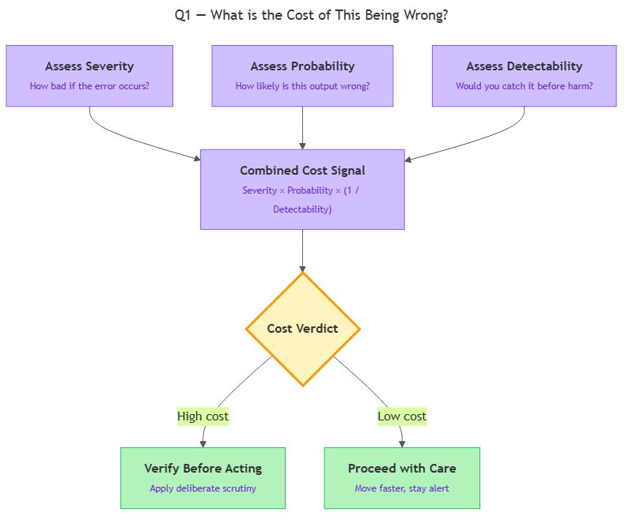
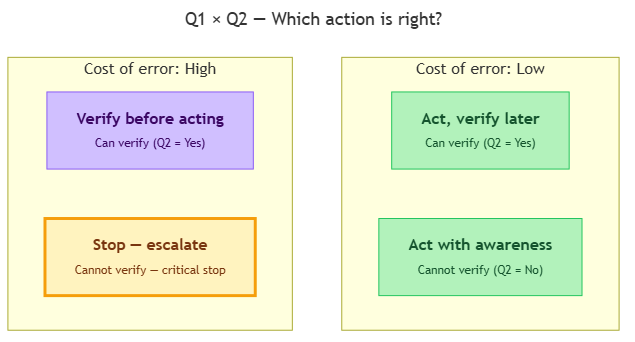
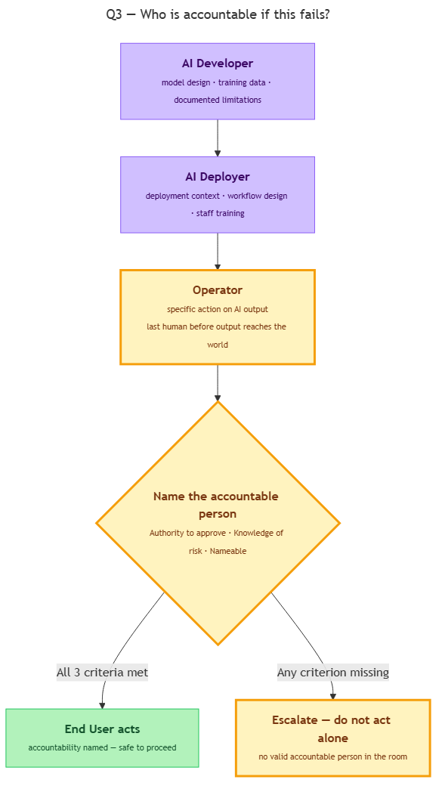
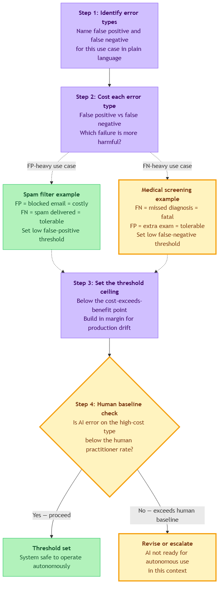
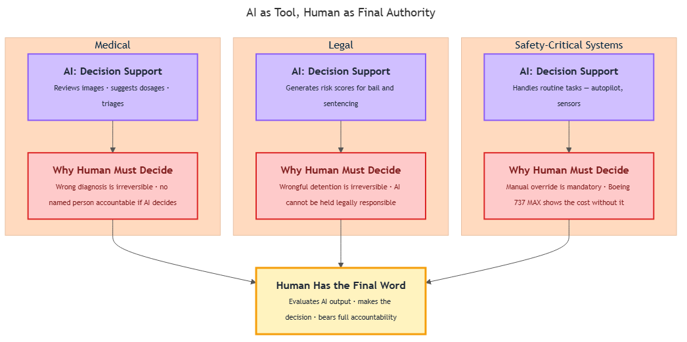

<!-- GENERATED FILE — DO NOT EDIT BY HAND.
     Cresent view of 14.2 — The Judgment Framework.
     Source of truth: CIT 9.7, CIT 9.8, CIT 9.9, CIT 9.10, CIT 9.11.
     Regenerate: python Cresent/Technical/tools/generate_shared_readings.py -->
<!-- nav:top:start -->
Previous: [⬅ 14.1 — How Humans Think](../14-1-how-humans-think/reading.md)&emsp;·&emsp;[⬆ Table of Contents](../../../../../../README.md#part-b)&emsp;·&emsp;[15.1 — Case Study: College Admissions ➡](../../../week-15/1-cognition-in-practice/15-1-case-study-1-college-admissions/reading.md)
<!-- nav:top:end -->

---

# The Judgment Framework — Q1: What is the cost of this being wrong?

## Overview

When you accept an AI output and act on it, you are making a decision. Some decisions barely matter if the AI was wrong — you send an email with an awkward sentence and nobody is harmed. Others can cause serious harm if the AI was wrong — a nurse follows an incorrect drug dosage and a patient is put at risk. Q1 of the Judgment Framework asks you to stop and think about this difference *before* you act: **What is the cost of this being wrong?** Asking that question is what switches your thinking from automatic acceptance to deliberate judgment [1][2].

## Key Concepts

The **Judgment Framework** is a set of three questions you ask before acting on any AI output. This topic covers Q1 only. Q2 and Q3 are introduced in topics 9.8 and 9.9.

Q1 works by breaking "cost of being wrong" into three dimensions. You assess all three, then decide how much scrutiny the output deserves.

*Three dimensions — severity, probability, and detectability — combine into a single cost signal that determines how much scrutiny an AI output deserves.*

### Dimension 1: Severity

**Severity** — how bad the harm would be if the error actually occurs.

Think of severity as a spectrum. At one end: trivially reversible (you delete a wrong word and retype it). At the other end: catastrophic and irreversible (a patient receives the wrong medication). Before acting on any AI output, ask yourself: *What is the worst plausible consequence if this is wrong?* Be concrete — name the actual harm, not a vague "something bad."

### Dimension 2: Probability

**Probability** — how likely it is that this specific output is wrong in this specific situation.

Probability is not fixed for an AI system overall. It goes up when:
- The task is unusual or outside the AI's training data.
- The AI has been wrong on similar tasks before.
- The output cannot be explained or seems surprising.
- The situation is highly variable (many edge cases).

Probability goes down when:
- The task is narrow and well-documented.
- The AI's reliability on this task type is known and high.
- The output can be quickly checked against a reliable source.

### Dimension 3: Detectability

**Detectability** — how easily you (or someone else) would catch the error *before* harm occurs.

This dimension has three rough bands:
- **High detectability:** The error is obvious and surfaces quickly (e.g., a number that is clearly impossible).
- **Medium detectability:** The error is catchable if you look carefully (e.g., a clause in a contract that reads oddly).
- **Low detectability:** The error blends in and is only discovered after harm has already happened (e.g., a missed cancer flag in a radiology scan).

Low detectability amplifies the cost even when severity and probability are individually moderate [1].

### Combining the three dimensions

The relationship is directional, not a precise formula: **Decision consequence = Severity × Probability × (1 / Detectability)** [1]. In practice, this is a quick triage, not a calculation:

1. How bad if wrong? (severity)
2. How likely is it wrong here? (probability)
3. Would I know before harm hits? (detectability)

If all three point high — apply scrutiny before acting. If all three point low — you can move faster. The habit of asking all three is what matters [2].

## Worked Example

Here is a step-by-step Q1 walkthrough using a real scenario: a nurse using an AI clinical assistant that suggests a drug dosage.

**Step 1 — Identify the AI output.**
The AI has recommended a dosage of 400 mg for a patient.

**Step 2 — Assess severity.**
Worst plausible consequence: too high a dose causes an adverse reaction; too low a dose leaves the condition untreated. Both are serious. Severity: **high**.

**Step 3 — Assess probability.**
The patient has an unusual combination of conditions the AI may not have encountered in training. The recommendation has no cited source. Probability of error: **meaningful**.

**Step 4 — Assess detectability.**
If the dosage is wrong, there is no immediate visible signal — the nurse administers it, and the patient deteriorates hours later. No other clinician will double-check the AI's work before administration. Detectability: **low**.

**Step 5 — Decide on scrutiny.**
High severity + meaningful probability + low detectability = high cost of being wrong. The nurse must verify the dosage against the pharmacopeia and the prescribing physician's notes before acting. Q2 (topic 9.8) covers exactly how to verify.

**Step 6 — Document reasoning (in professional contexts).**
In a clinical setting, note that the AI recommendation was reviewed and cross-checked. This creates an audit trail and reinforces the habit of deliberate judgment [1][2].

Compare this to a low-cost situation: an AI suggests a subject line for a marketing email. Severity: low (a weak subject line is annoying, not harmful). Probability: moderate. Detectability: high (you re-read it yourself before sending). Cost of being wrong: low — you can move faster and spend scrutiny elsewhere.

## In Practice

Three real-world patterns show how Q1 plays out across different domains [1][2][3].

**Medical — Radiology AI (87% sensitivity)**
- Severity: high — a missed diagnosis causes delayed treatment.
- Probability: meaningful — a 13% miss rate, and demographic mismatches from historical training data (see topic 9.6) can raise it further.
- Detectability: low — a missed flag is an *absent* signal; nothing visibly alerts the radiologist.
- Verdict: the AI flag is a starting point, never a final word.

**Legal — Contract Review AI**
- Severity: medium-high — an overlooked clause can affect rights, finances, or liability.
- Detectability: medium — anchoring bias (topic 9.4) pulls your attention toward what the AI highlighted, making it easy to skip the clauses it did not flag.
- Verdict: an independent read of high-risk clauses is warranted even when the AI reports clean.

**Content Moderation AI (94% precision)**
- At millions of posts per day, 6% error = hundreds of thousands of wrong decisions daily.
- Detectability: low for false negatives (missed harmful content), medium for false positives (wrongly removed content).
- Verdict: individual high-stakes cases need human review regardless of what the AI flags [3].

**Do / Don't checklist**

| Do | Don't |
|---|---|
| Ask all three dimensions every time | Skip Q1 when time pressure is high — that is exactly when it matters most |
| Be concrete about worst-case harm | Keep severity vague ("something bad could happen") |
| Factor in who else will catch an error | Assume someone downstream will check |
| Recognise genuinely low-cost situations | Treat every AI output as equally risky |
| Document reasoning in high-stakes contexts | Act first and justify later |

Recognising low-cost situations is part of using Q1 well. The framework is not about distrust — it is about spending scrutiny where it counts. The habit of asking is what protects you in high-cost situations, where time pressure makes skipping tempting [2][3].

## Key Takeaways

- Q1 asks one question before you act on AI output: **How bad would it be if this is wrong?** It does so by weighing three dimensions — severity, probability, and detectability.
- The three dimensions work together. Low detectability amplifies cost even when severity and probability are moderate on their own.
- High-stakes domains — medical, legal, safety-critical engineering, financial decisions affecting others — almost always return a high cost of being wrong.
- Low-cost situations are real; recognising them lets you spend scrutiny where it matters instead of everywhere equally.
- The habit of asking Q1 is the protection. It is most needed exactly when time pressure conspires to make you skip it [2][3].

## References

1. AI Competence, "Risk-Aware Decision Framework for Complex AI Systems." <https://aicompetence.org/risk-aware-decision-framework-complex-ai-systems/>
2. Acharya et al., "Think First, Verify Always" (arXiv 2508.03714). <https://arxiv.org/pdf/2508.03714>
3. Corporate Finance Institute, "How AI Affects Decision Making." <https://corporatefinanceinstitute.com/resources/strategy/how-ai-affects-decision-making/>

---

# The Judgment Framework — Q2: Can I verify this without the AI?

## Overview

Q1 of the Judgment Framework told you how much it matters if an AI answer is wrong. Q2 asks something different: can you actually check whether the answer is correct — without asking the AI to check itself? An AI cannot tell you whether its own output is trustworthy. Asking the same AI "are you sure?" gives you the same model's self-assessment, not an independent view. This topic explains what independent verification means, when it is possible, and what to do when it is not [1].

## Key Concepts

### Independent verification

**Independent verification** means checking an AI output against a source that is completely separate from the AI that produced it. The source cannot be the same AI, a related AI, or material that originally came from an AI.

Think of it like a rumour. If a friend tells you something and you want to know if it is true, asking that same friend again does not help. You need a second source — someone who was not part of the original conversation [3]. The same logic applies to AI output.

Independent sources include:
- A textbook, official publication, or peer-reviewed article.
- A qualified expert (doctor, lawyer, engineer) who can evaluate the claim from their own knowledge.
- A known standard, law, or regulation you can look up directly.
- A measurement or direct observation you can perform yourself.
- A second colleague who reviews the claim **before** reading the AI's answer.

### Verification is not the same as production

Students often mix up two different questions:

| Question | What it asks |
|---|---|
| **Production:** "Could I have produced this myself?" | Do I have enough expertise to generate the same output from scratch? |
| **Verification:** "Can I check whether this is correct?" | Can I test the claim against a separate source? |

These are not the same thing. You can verify without being able to produce. A patient does not know how to diagnose a disease, but they can still check that a drug dosage on a prescription matches the standard range in a reference guide. They are verifying — not producing [1]. Do not answer "no" to Q2 just because you could not have written the output yourself [2].

### The four verification methods

**1. Cross-referencing a source** — Take a specific claim from the AI and look it up in a separate, authoritative reference. Example: the AI says a drug interaction is dangerous; you check that claim in a pharmacology database written by medical professionals and updated independently of any AI [1].

**2. Using domain expertise** — Draw on your own professional knowledge to judge whether the AI's output is accurate and complete. Example: a structural engineer reads an AI-generated load calculation and spots that the safety factor is too low by professional standards. Their training is the independent source. This method only works when you have genuine expertise in the relevant domain [2].

**3. Checking against a known standard** — Compare the AI output to a rule, law, regulation, formula, or specification. Example: the AI generates a contract clause; you compare it line by line to the wording required by the legislation. The legislation removes subjectivity from the check [1].

**4. Asking a second person** — Have another human review the AI output. The second person should not have seen the AI's answer first. If they read it before forming their own view, they may be anchored to the AI's framing — a bias you studied in topic 9.4 [3].

### When is verification easy, hard, or impossible?

**Easy** when the AI's claim is factual and specific, a reliable reference exists that covers exactly that fact, and you can access it quickly. Example: the AI says the GDPR requires breach notification within 72 hours. You verify this in under two minutes by reading Article 33 of the GDPR directly [1].

**Hard** when the claim is specialised, no single authoritative reference exists, or meaningful verification would take significantly longer than the task itself. Hard does not mean skip it — it means plan for it: allow more time, find the right expert, or escalate [2].

**Impossible** when there is no external ground truth — for example, a prediction ("What will the stock price be in six months?"), frontier knowledge that no reference yet covers, or a timeline so short that no check can be done before action is required.

When verification is genuinely impossible, Q2 has a clear answer: "No, I cannot verify this." What you do next depends on what Q1 already told you.

### The Q1 × Q2 decision matrix

Q1 and Q2 work together. Your combined answers determine the right action.

*The Q1 × Q2 matrix: cost-of-error (from Q1) sets the stakes; verifiability (Q2) determines whether you can act or must escalate.*

| Q1 — cost of being wrong | Q2 — can I verify? | Recommended action |
|---|---|---|
| Low | Yes | Act, then verify when convenient. |
| Low | No | Act with awareness that error is undetected; review later. |
| High | Yes | Verify before acting. Do not act until the check passes. |
| **High** | **No** | **Stop. Do not act on AI output alone. Escalate, seek expert input, or use a different approach.** |

The bottom-right cell is the most important. When cost is high and verification is impossible, acting on the AI output without further steps is a failure of judgment — regardless of how confident the AI sounds [1][2].

## Worked Example

Here is Q2 applied step by step. A nurse receives an AI clinical decision support recommendation for a drug dosage.

**Step 1 — List the specific claims.**
Break the output into individual facts. In this case: drug name, recommended dose, unit, frequency, and any listed contraindications.

**Step 2 — Classify each claim.**
Each item is a factual medical statement. That points toward cross-referencing a published reference and using domain expertise.

**Step 3 — Identify a verification source.**
"I'll check online" is not a source. A specific source is: the hospital's formulary — an approved list of drugs and doses maintained by clinical pharmacists.

**Step 4 — Perform the check.**
Look up the drug in the formulary. Record what it says. Does the AI-recommended dose match the formulary entry? Does the patient's weight, kidney function, or other medications affect the safe range?

**Step 5 — Record the Q2 answer.**
State clearly: "I can verify this via the hospital formulary and clinical judgment — the recommended dose matches / does not match the formulary entry." This written record is the evidence trail if the decision is later questioned [1][3].

If the formulary is unavailable and the clinical expert cannot be reached in time, the answer to Q2 is "No — I cannot verify independently." Combined with the high cost-of-error from Q1, the correct next step is not to proceed on the AI output alone: escalate to a senior clinician.

## In Practice

These three patterns show Q2 applied in different fields:

**Legal — AI-generated contract clauses [1]**
Before any AI-drafted clause enters a final contract, a qualified lawyer checks it against the relevant legislation and the firm's precedent library — clause by clause. The lawyer is not re-drafting from scratch; they are verifying. If the AI clause deviates from the statutory requirement, it is corrected before the contract is signed.

**Medical — AI-suggested drug dosage [2]**
A prescribing doctor checks an AI dosage recommendation against the hospital formulary and applies their own clinical judgment about the specific patient. Two independent checks run in parallel. The AI recommendation is a starting point, not the final word.

**Financial — AI market analysis [2][3]**
An analyst cross-references AI-generated earnings figures against the company's actual regulatory filing before sharing the summary with clients. Numbers in public regulatory filings are independently verifiable. The AI may have misread a table or made an arithmetic error — the check is fast and covers the highest-risk element.

**Three common mistakes to avoid:**

- **Asking the AI again is not verification.** Two outputs from the same model can both be wrong in the same way. Consistency is not correctness [2].
- **"I'm not an expert" does not mean you can't verify.** Cross-referencing a claim against a published standard does not require expertise — it requires knowing where to look [3].
- **"I can't produce this" does not mean "I can't verify this."** A non-chemist can still check a molecular weight against a published chemistry database — that is verification, not production [1].

## Key Takeaways

- **Independent verification** means checking against a source completely separate from the AI — not the same AI, not a second prompt to the same AI.
- **Verification and production are different.** You can check a claim without being able to generate it yourself.
- **Four methods:** cross-referencing a source, applying domain expertise, checking against a known standard, and asking a second person (who has not seen the AI output first).
- **Q1 sets the stakes for Q2.** When cost-of-error is low, incomplete verification may be acceptable. When cost-of-error is high, Q2 becomes a gate — do not act before it passes.
- **High cost + cannot verify = stop and escalate.** Do not act on AI output alone. Seek expert input, a different source, or an explicit decision by an accountable person. (Who that accountable person is, and what accountability means, is the subject of topic 9.9.)

## References

1. Clio, "Verifying Legal AI Output — Checklist." <https://www.clio.com/resources/ai-for-lawyers/verify-legal-ai-output/>
2. VerifyWise, "AI Output Validation — Methods Catalog." <https://verifywise.ai/lexicon/ai-output-validation>
3. CSUN Library, "Evaluating AI-Generated Output." <https://libguides.csun.edu/c.php?g=1377855&p=11076059>

---

# The Judgment Framework — Q3: Who is accountable if this fails?

## Overview

When an AI tool produces an output and something goes wrong, one question always surfaces: who is responsible? Q3 of the Judgment Framework asks you to answer that question *before* you act — not after. Naming the accountable person in advance is a practical safety check that keeps humans genuinely in the loop and prevents the common pattern where, after a failure, everyone points at everyone else and nothing gets fixed [2].

## Key Concepts

### Three words that sound the same but mean different things

These three terms are used interchangeably in everyday conversation, but Q3 depends on keeping them separate:

| Term | What it means | Who decides |
|---|---|---|
| **Accountability** | A named person who is expected to answer for an outcome — to explain what happened and address it | Determined before acting, by the people involved |
| **Liability** | A legal obligation to compensate for harm | Determined by courts, contracts, and statutes |
| **Blame** | A moral judgment that someone did something wrong | A social and ethical assessment |

Q3 asks only about accountability — not a legal verdict, not a moral condemnation. It is a forward-looking, practical question: *before I act, who is the named person who will be expected to answer if this goes wrong?* [2]

---

### The accountability chain

When an AI system produces an output and a human acts on it, accountability is not concentrated in one place. It is spread across four levels — what we call the **accountability chain**: the set of parties, from AI developer to end user, each of whom holds a defined portion of responsibility [1].

*The four-level accountability chain, showing each party's scope of responsibility and the contrast between pre-decision naming and post-failure blame allocation.*

**Level 1 — The AI developer**

The developer is the company or team that built and trained the AI model. They are accountable for decisions baked into the model itself: what data it was trained on (relevant to the labelling bias and historical bias concepts from 9.6), what it was optimised for, what safeguards were built in, and what limitations were documented [1].

Their accountability covers the *class of outputs the model produces by design*. If the model was marketed as reliable for legal use without appropriate caveats, that scope expands. If limitations were clearly documented, that scope shrinks.

**Level 2 — The AI deployer**

The deployer is the organisation that takes the AI model and puts it into a real-world context — building a product, integrating it into a workflow, or offering it as a service. A hospital that installs an AI diagnostic assistant is the deployer. A bank that integrates a third-party AI credit-scoring model is the deployer.

The deployer's accountability covers the *appropriateness of the deployment*:
- Did they choose the right tool for the context?
- Did they set appropriate limits on what the AI can decide autonomously?
- Did they train staff?
- Did they disclose to affected parties that AI is being used?

Critically, the deployer cannot fully pass accountability to the developer by saying "we just used their model." Once an organisation deploys an AI system to affect real people, it accepts accountability for the consequences [1] [3].

**Level 3 — The operator**

The operator is the person within the deploying organisation who runs the specific task day-to-day — the paralegal using an AI document summariser, the nurse using an AI-assisted triage tool, the analyst flagging trading anomalies.

The operator's accountability covers *the specific action they took*: Did they apply appropriate judgment (Q1 and Q2 of the Judgment Framework) before acting on the output? Did they follow the organisation's procedures?

Operators are the humans in the room when a decision is made. They are the last checkpoint before the output affects the world [2].

**Level 4 — The end user**

The end user is the person who receives the AI-assisted output and acts on it — a patient following AI-generated health advice, a customer acting on an AI-generated recommendation.

End users are accountable for their own actions, but their accountability is limited by what they could reasonably have known — including whether they were even told AI was involved [3].

---

### Name accountability before acting, not after failure

After a failure, naming an accountable person becomes blame allocation — a political and often legal exercise that rarely produces learning. Before a decision, naming an accountable person is a safety check: it forces everyone to ask whether the right human has reviewed and authorised the action [2].

The practice is straightforward. Before acting on any AI output, ask: "Who is the person who has reviewed this and is prepared to answer for it if it is wrong?" If you can name that person — and they have been informed — you have established accountability. If you cannot, pause.

---

### Three criteria for a valid accountable person

Not just anyone can fill this role. For accountability to be real — not just a name on a form — three criteria must all be met [1] [2]:

1. **Authority to approve** — The person must have actual authority to say yes or no to the action. A junior employee who was told to forward an AI-generated report has not meaningfully approved it. The person who directed them is the authority.

2. **Knowledge of the risk** — The person must know that AI was involved and understand the key risks. They do not need to understand the AI's architecture, but they must know: this output came from an AI system, these are its known limitations, and here is what could go wrong. Accountability without knowledge is accountability in name only.

3. **Nameability** — The person must be identifiable after the fact. In automated systems where no human explicitly reviewed a specific decision, this still has an answer: the person who *authorised the deployment* of the automated pipeline is accountable for every output it produces [1].

---

### When no accountable person exists: escalate

What if you apply Q3 and cannot name a valid accountable person? The correct response is **escalation** — pausing the action and surfacing it to someone with the required authority and knowledge.

Escalation is not failure. It is the Judgment Framework working correctly. The steps are:

1. Stop the action.
2. Identify who in the organisation has the authority to approve it.
3. Brief that person: explain the AI output, its limitations, and what action is being proposed.
4. Get an explicit approval — not an implicit one.
5. Document that you escalated and why.

Acting without a named accountable person — because escalating is inconvenient — is precisely how large-scale AI failures occur. When everyone assumes someone else is responsible, no one is [2] [3].

---

### Accountability in fully automated systems

A frequent question: what if no human was involved in a specific decision at all? In automated pipelines — a fraud detection model that automatically freezes accounts, an AI scheduler that books appointments — Q3 still has an answer.

The accountable person for each automated decision is **the person who authorised the deployment of the pipeline** [1]. This is called **design-time accountability** — the accountability is assigned at the point when a human chose to let the system run autonomously.

This means that before an automated AI pipeline goes live, the organisation must explicitly record: who is authorising it, what its scope is, and what failure modes have been accepted. If that record does not exist, the pipeline should not be deployed.

---

### Three misconceptions to avoid

| Misconception | Why it is wrong |
|---|---|
| "The AI is responsible" | AI is not a legal person. It cannot be sued, disciplined, or learn from accountability. A tool produced the output; a human chose to act on it [1] [3]. |
| "Whoever clicked submit is responsible" | Accountability follows authority and knowledge, not mechanical action. The person with the power to approve — not the person who pressed the button — is accountable [2]. |
| "No one is responsible if it was automated" | Every automated system was authorised by a human at deployment. Automation compresses accountability into the design decision — it does not eliminate it [1] [3]. |

The third misconception is the most dangerous at scale. Automation bias (9.5) makes it feel natural: if the system ran on its own, surely it owns the outcome. But the accountability did not disappear — it was assigned when the deployment was approved.

## Worked Example

**Scenario:** A law firm deploys an AI legal research tool that drafts summaries of precedents. A junior associate uses the tool to produce a summary and sends it to a client without reviewing it. The summary incorrectly characterises a key ruling. The client makes a decision based on the incorrect summary.

**Applying Q3 step by step:**

1. **State the action explicitly** — "I am about to send a contract summary to a client based on AI-generated text."

2. **Who has authority to approve this action?** — A senior associate or partner, whose name appears on client communications for this matter.

3. **Does that person know AI was involved?** — In this case, no. The junior associate did not brief anyone. The approval was not meaningful.

4. **Check the three criteria:**
   - Authority: the partner has it, but was not consulted.
   - Knowledge: the partner was not told AI produced the summary.
   - Nameability: no one explicitly approved this output.

5. **Result:** No valid accountable person exists. The action should have been paused and escalated for explicit sign-off.

**Who is primarily accountable for the failure?**

The law firm as deployer — for putting the AI tool into a client-facing context without establishing a mandatory verification and approval step [1] [3]. The associate's accountability is real but secondary — they operated inside a system that did not require them to obtain approval. The developer's accountability is limited if the tool's limitations were clearly documented.

The lesson: deployers cannot outsource accountability to the AI developer. The moment an organisation puts an AI tool into a workflow that affects others, it accepts accountability for how that workflow was designed.

## In Practice

**Common patterns and the Q3 response:**

- **Medical discharge decisions** — An AI risk-scoring tool flags a patient as low-risk and the nursing team initiates discharge based on the flag. Q3: the accountable person is the named responsible clinician — the consultant or attending physician who examined the patient, reviewed the AI flag, and explicitly authorised discharge. The AI flag is a data point, not a decision. If the clinician was not consulted, accountability is diffuse and disputed [2].

- **Automated credit decisions** — A bank deploys an AI that automatically approves or declines credit applications with no human review. The model declines applications from a particular demographic at a higher rate — a feedback loop rooted in historical bias (9.6). Q3: no human was in the loop on each specific decision. The accountable parties are the risk officer and product lead who authorised the autonomous pipeline. Their accountability does not require that they intended the discriminatory outcome — they chose to deploy a system that made consequential decisions without human oversight [1].

**Practical checklist for applying Q3:**

- Before acting on any AI output, name the accountable person out loud or in writing.
- Confirm all three criteria: authority, knowledge, nameability.
- If any criterion is missing, escalate — do not proceed.
- For consequential decisions, make a brief record: who approved, when, on what basis, and with what known limitations acknowledged. Without a record, pre-decision accountability reverts to post-failure blame allocation [2].

**Watch for these failure modes:**

- Accountability pushed downward to the person with the least power and least context — the person who clicked the button.
- Accountability assumed to be the developer's problem because "it's their AI."
- Accountability skipped entirely in automated pipelines because "no human decided this."

## Key Takeaways

- **Accountability means answerability, not blame.** The accountable person is the named individual expected to explain and address an outcome. They need not have been at fault, but they must be identifiable and reachable.
- **The accountability chain has four levels** — developer, deployer, operator, end user — each with a different scope. Deployers cannot fully transfer their accountability to developers; operators cannot transfer theirs to deployers.
- **Name accountability before acting, not after failure.** After a failure, assigning accountability is blame allocation. Before acting, it is a safety check.
- **A valid accountable person must have authority to approve, knowledge of the risk, and the ability to be named.** If any of these is missing, escalate rather than proceed.
- **In automated systems, accountability attaches to the deployment decision.** When no human was in the loop on a specific output, the person who authorised the pipeline to run autonomously is accountable for its outputs.
- **When applying the Judgment Framework to an AI component you are analysing** — for any AI system you evaluate, you should be able to name who sits at each level of the accountability chain and who would be the valid accountable person for a given decision.

## References

1. HFW, "Legal liability for AI-driven decisions: when AI gets it wrong, who can you turn to?" <https://www.hfw.com/insights/legal-liability-for-ai-driven-decisions-when-ai-gets-it-wrong-who-can-you-turn-to/>
2. Salesforce, "AI Accountability." <https://www.salesforce.com/blog/ai-accountability/>
3. Stephen Rimmer, "Artificial Intelligence: Who is Accountable for Getting it Wrong?" <https://www.stephenrimmer.com/news/artificial-intelligence-who-is-accountable-for-getting-it-wrong/>

---

# Acceptable error — defining the failure threshold tolerable for a use case

## Overview

Every AI system makes mistakes. The question is not how to eliminate errors entirely — no production system achieves that. The real question is: which errors are tolerable, which are not, and at what rate does the line get crossed?

**Acceptable error** is the deliberate decision about where that line sits: the maximum rate of specific failure types that a use case can absorb before the cost of using the AI exceeds its benefit. This is not a licence to be sloppy — it is a design decision that forces you to confront exactly what "wrong" looks like for your situation and how much of it you can sustain [3].

This topic builds directly on Judgment Framework Q1 (9.7): "What is the cost of this being wrong?" Q1 asks that question for a single decision. Acceptable error asks it for a whole system operating repeatedly over time — and translates the answer into a threshold that governs when the AI's output is safe to act on and when it must be escalated or reviewed.

## Key Concepts

Every AI classification system produces two kinds of errors:

| Error type | What happens | Example |
|---|---|---|
| **False positive (FP)** | AI says "yes" when the correct answer is "no" | Spam filter marks a legitimate email as spam |
| **False negative (FN)** | AI says "no" when the correct answer is "yes" | Medical screening tool clears a patient who has the condition |

These two error types almost never cost the same. In most real-world use cases, one is far more harmful than the other. This is **asymmetric error cost** — and it is the most important thing to understand before setting any threshold. A single combined accuracy figure (e.g., "94% accurate") hides which error type is occurring and at what rate, making it a poor guide for safety-critical decisions.

*The four-step process for setting an acceptable error threshold, with contrasting examples of FP-heavy versus FN-heavy use cases.*

The diagram above shows the **four-step threshold-setting process**:

**Step 1 — Identify error types.** In plain language, define what a false positive and a false negative each mean for your specific use case. "The AI flags a legitimate transaction as fraud" is a false positive. "The AI misses a fraudulent transaction" is a false negative. Vague definitions produce vague thresholds — and vague thresholds fail silently in production.

**Step 2 — Cost each error type.** What happens when each type occurs? Who is affected, and how severely? This step forces you to decide which type is more harmful. If both are roughly equally costly, combined accuracy is a useful single metric. If the costs are asymmetric — the normal case in real-world deployments — you need separate thresholds for each type [2].

**Step 3 — Set the threshold ceiling.** The threshold is not a target — it is a ceiling the system must stay below. Set it conservatively: build in margin for the difference between test conditions and real-world production (distribution shift, adversarial inputs, edge cases). A threshold calibrated tight to test-set performance will often be exceeded once the system meets the full range of production data [2].

**Step 4 — Compare to the human baseline.** What error rate does a human practitioner achieve on the same task? Research found that radiology staff held AI to a stricter standard than human clinicians — an average acceptable AI error rate of 6.8%, compared to 11.3% for humans performing the same task [1]. The human baseline is a calibration reference: if the AI's error rate on the high-cost type exceeds the human baseline for that type, the case for deploying the AI rather than a human becomes harder to defend on quality grounds.

A useful decision-level tool is the **confidence threshold**: the minimum confidence score below which the AI's output is routed to human review rather than acted on automatically. Raising this threshold reduces the AI's autonomous error rate but increases human workload — the right calibration depends on the cost structure established in step 2 [3].

## Worked Example

A team is deploying an AI tool to screen job applications at a recruitment agency. They apply the four steps:

**Step 1.** False positive: AI shortlists a candidate who is not qualified. False negative: AI rejects a candidate who is qualified.

**Step 2.** A false positive wastes one recruiter's time (roughly one hour reviewing an unqualified application). A false negative loses a potentially strong hire and damages the agency's reputation with its client. False negatives are more costly.

**Step 3.** The agency sets its threshold: no more than 5% of qualified candidates may be incorrectly rejected. They calibrate conservatively, actually targeting 3%, to account for the fact that the AI was trained on historical hiring data that may not fully represent the current candidate pool. The threshold is a ceiling — not the acceptable rate to aim for.

**Step 4.** A human recruiter scanning CVs at speed incorrectly rejects approximately 8% of qualified candidates. The AI's measured false negative rate in testing is 3.2% — well below both the threshold (5%) and the human baseline (8%). The threshold is cleared.

The team also sets a confidence threshold at 75%: any application where the AI's score is below this level goes to a human reviewer, regardless of whether the tentative decision is accept or reject. This gives human judgment a foothold on borderline cases without routing every decision manually.

## In Practice

**Spam filtering: minimise false positives.**
Most spam filters accept a higher false negative rate (some spam lands in the inbox) in order to keep the false positive rate very low (legitimate email rarely blocked). Blocking a real email — especially from a financial institution or government agency — can cause material harm, while delivering an occasional spam message is a manageable nuisance. Enterprise filters often apply **threshold segmentation**: near-zero false positive tolerance for high-priority sender categories, higher tolerance for unknown senders.

**Medical screening: minimise false negatives.**
In cancer screening, missing a tumour (false negative) is far more costly than flagging a benign finding for follow-up (false positive). Screening protocols are calibrated for very high sensitivity, accepting a higher false positive rate because an unnecessary follow-up examination costs far less than a missed diagnosis [1]. Regulatory standards for medical AI devices often specify maximum false negative rates rather than overall accuracy.

**Fraud detection: tiered thresholds.**
Fraud detection applies the threshold-setting process twice: one threshold for "block automatically" (high-confidence fraud) and one for "route to manual review" (medium-confidence). Below both thresholds, transactions pass with enhanced monitoring. This three-tier structure manages both error types explicitly — rather than burying one inside a combined accuracy figure [2].

**Alert fatigue: the cost of thresholds set too strictly.**
Setting a threshold too conservatively generates excessive false alarms. This causes **alert fatigue** — introduced in 9.5 — where reviewers stop taking alerts seriously because so many turn out to be false positives. Paradoxically, a threshold that is too strict can increase overall error rates by degrading the human vigilance that is supposed to catch genuine misses [2].

## Key Takeaways

- **Acceptable error is a deliberate threshold decision:** the maximum rate of specific failure types a use case can absorb before AI cost exceeds benefit. Not zero errors — bounded tolerance within defined conditions.
- **False positives and false negatives carry asymmetric costs** in almost every real-world use case. Set separate thresholds per error type when costs are unequal — overall accuracy hides the distribution.
- **The four-step process:** identify error types in plain language → cost each separately → set threshold ceiling conservatively → compare to human baseline as a calibration reference.
- **The human baseline** shows that stakeholders hold AI to stricter standards than humans (6.8% vs 11.3% in radiology) [1] — account for this asymmetry when communicating threshold decisions.
- **Alert fatigue** (9.5) is the direct consequence of thresholds set too strictly — excessive false alarms erode human vigilance and can raise overall error rates [2].

## References

1. "Should artificial intelligence have lower acceptable error rates than humans?" — PMC / National Library of Medicine. https://pmc.ncbi.nlm.nih.gov/articles/PMC10301708/
2. "What are good and acceptable error rates?" — AppSignal Learning Center. https://www.appsignal.com/learning-center/what-are-good-and-acceptable-error-rates
3. "Understanding Confidence Threshold in AI Systems" — LlamaIndex Glossary. https://www.llamaindex.ai/glossary/what-is-confidence-threshold

---

# High-stakes domains where AI must not have the final word — medical, legal, safety

## Overview

Some AI errors are annoying. Others are catastrophic. This topic is about the second kind. In medicine, law, and safety-critical engineering, a wrong AI decision can end a life, take away someone's freedom, or bring down a bridge — and those outcomes cannot be undone. Week 9 has shown you how humans over-rely on automated systems, how accountability chains must end with a named person, and how every system has an error threshold below which harm becomes intolerable. This topic names the three domains where that threshold is already breached — and explains why, in those domains, a human must always have the final word.

## Key Concepts

### What makes a domain "high-stakes"?

Consider two AI systems. One recommends a film you end up disliking. The other recommends a cancer treatment that turns out to be wrong. These are not the same kind of mistake.

A **high-stakes domain** is one where a wrong decision causes severe, often irreversible harm to a real person — harm that cannot be compensated for after the fact [1].

Three signals tell you whether you are in high-stakes territory:

| Signal | What it means | Example |
|---|---|---|
| **Irreversibility** | The decision cannot be undone | A wrongful conviction; a surgery on the wrong patient |
| **Direct impact on fundamental interests** | The decision affects health, liberty, or safety — not preference | A missed cancer diagnosis; detention before trial |
| **Asymmetric error cost** | One type of error causes catastrophic harm | Missing a real tumour (false negative) versus flagging a healthy scan (false positive) |

These three signals connect directly to the Judgment Framework you saw in topics 9.7 and 9.10. Q1 asks: what is the cost if the AI is wrong? The failure threshold concept asks: how much error can we tolerate? In a high-stakes domain, the cost is catastrophic and the tolerable error rate is effectively zero — lower than any current AI system can reliably achieve [1].

### The three named domains

The EU AI Act — the European Union Artificial Intelligence Act, the EU's 2024 regulation on artificial intelligence — formally lists categories it calls **high-risk AI**. Three domains appear in that list more consistently than any others: medicine, law, and safety-critical engineering [3].

*Three domains where AI must serve as decision support — and the human must retain final authority.*

#### Medicine

AI systems in medicine review images, recommend drug dosages, triage patients, and suggest diagnoses. Each of these outputs can be genuinely useful — but only as **decision support**, meaning a tool that helps a clinician think, not one that replaces the clinician's judgment [2].

When AI makes the final call in medicine and gets it wrong:

1. A patient receives the wrong treatment, causing direct physical harm.
2. The error may not surface until the damage is already irreversible.
3. No named human made the decision — so the accountability chain (from topic 9.9) breaks entirely [1].

MRI (Magnetic Resonance Imaging) scans, CT (computed tomography) scans, and pathology slides are among the image types AI tools now analyse. In every case, the correct model is: AI reviews, human decides.

#### Law

In legal settings, the most documented AI application is **recidivism prediction** — estimating the probability that a convicted person will reoffend. The best-known tool is COMPAS (Correctional Offender Management Profiling for Alternative Sanctions), a commercial system used in US courts to generate risk scores for bail and sentencing decisions [1].

A wrongful detention is irreversible in the moment it occurs. The time a person spends detained before an error is corrected cannot be returned. Research — including a widely cited 2016 ProPublica investigation — documented that COMPAS produced systematically different error rates across demographic groups [1].

The EU AI Act classifies AI used in law enforcement and the administration of justice as high-risk, requiring human oversight of every decision [3].

#### Safety-critical engineering

**Safety-critical** refers to any engineered system whose failure could directly cost human lives: aircraft, railways, chemical plants, nuclear facilities.

Modern aircraft are highly automated. Autopilot systems handle most routine flying. Yet every aviation authority — including the FAA (United States Federal Aviation Administration) and EASA (European Union Aviation Safety Agency) — requires pilots to retain manual override capability and exercise final authority when a situation falls outside the system's designed parameters [2].

The Boeing 737 MAX accidents of 2018 and 2019 show what happens when that principle fails. The MCAS (Maneuvering Characteristics Augmentation System) — an automated flight control feature — repeatedly pushed the nose of the aircraft down after a faulty sensor triggered it. Pilots attempted to override. The system overrode the override. 346 people died. Investigators found that pilots had not been adequately trained to understand or override MCAS [2].

The lesson is not "remove the automation." It is: never remove the human's ability to override.

### The core principle: AI as decision support, human as final authority

The phrase "humans must have the final word" does not mean AI is useless in these domains. It means the roles must be clearly separated:

- **AI role — decision support**: narrows the field, flags anomalies, prioritises cases, surfaces information the human might miss.
- **Human role — final authority**: evaluates the AI's output against the full picture and makes the call.

"AI as tool, human as authority." This is the operating principle in every high-stakes domain [2].

Four separate arguments — each independently defensible — explain why this division is required:

1. **Cost-of-error argument** (from Judgment Framework Q1): severity is catastrophic, detectability is low, recovery is near-zero. No failure threshold is low enough to justify removing the human [1][3].
2. **Accountability argument** (from Judgment Framework Q3): AI systems cannot lose a licence, go to prison, or be sanctioned professionally. When AI makes the final call, no named human made the decision — the accountability chain breaks [1].
3. **Explainability argument** (from EU AI Act requirements): XAI — explainable artificial intelligence — refers to AI outputs that a human can trace and understand. Many AI systems are not fully explainable. A human reviewer who cannot understand the reason for a decision cannot meaningfully evaluate it — they can only approve a number [3].
4. **Cognitive bias argument** (from topics 9.1–9.6): automation bias means humans systematically defer to automated outputs under time pressure, fatigue, and information overload. Saying "a human must review" is not enough on its own [2].

### Meaningful oversight vs nominal oversight

A human signature on an AI output is not the same as human judgment applied to it. The radiologist who approves 47 AI flags without examining a single image has provided a nominal checkpoint — not real oversight.

For oversight to be **meaningful**, four conditions must hold:

1. The reviewer has enough time to evaluate the AI output independently.
2. The reviewer has access to the underlying data — not just the AI's conclusion.
3. The reviewer is trained and empowered to override the system.
4. Overriding is easy, not laborious — it must be designed in [1][2].

A human who cannot realistically override — because of time pressure, missing data, or organisational culture — provides accountability in name only.

## Worked Example

### The radiologist rubber-stamp scenario: applying the four-argument logic

**Setup.** A hospital deploys an AI system that reviews chest X-rays overnight and flags suspicious cases. By morning, 47 X-rays are flagged as requiring attention. A radiologist, pressed for time, opens the dashboard, approves all 47 flags, and dismisses the rest — without examining any individual image. One dismissed image contained an early-stage tumour the algorithm missed [1].

Walk through the four arguments:

**Step 1 — Cost-of-error (Q1).**
Ask: if the AI is wrong, what is the cost?
- Severity: catastrophic. A missed tumour means delayed treatment, which can be fatal.
- Detectability: low. The patient leaves without diagnosis. The error surfaces only when the disease progresses.
- Recovery: near-zero. You cannot restore time lost before correct treatment begins.

Verdict: the cost-of-error threshold has been crossed. Human final authority is required.

**Step 2 — Accountability (Q3).**
Ask: who made the decision?
- The AI flagged and dismissed cases. The radiologist approved the flags without examining the dismissals.
- No named human evaluated the dismissed image. The accountability chain is broken [1].

Verdict: if this reaches litigation, the court will look for a human to hold responsible. No clear candidate exists.

**Step 3 — Explainability.**
Ask: could the radiologist have evaluated the AI's reasoning?
- Most medical imaging AI systems are not fully explainable. The radiologist saw flags and dismissals — not the reasoning behind them.
- Without access to the AI's logic, independent evaluation was not possible. The "review" was rubber-stamping [3].

Verdict: the explainability condition for meaningful oversight was not met.

**Step 4 — Cognitive bias.**
Ask: was the oversight structured to counteract automation bias?
- The radiologist was time-pressured. The AI output was prominent. No easy mechanism existed to examine dismissed cases efficiently.
- These are precisely the conditions under which automation bias operates (topic 9.5): deference to the automated output rather than independent judgment [2].

Verdict: the deployment design actively encouraged rubber-stamping rather than preventing it.

**Conclusion.** The radiologist scenario is not a human failure alone — it is a system design failure. The hospital deployed AI in a high-stakes domain without ensuring the four conditions for meaningful oversight. Fixing it requires redesigning the process: giving the radiologist time, access to underlying images for dismissed cases, and a workflow that makes override natural rather than laborious.

## In Practice

### Pattern 1 — NHS medical imaging: AI as pre-screener, radiologist as authority

In UK National Health Service (NHS) trials of AI mammography screening, AI pre-screened images and flagged those needing urgent radiologist attention. This reduced the time radiologists spent on routine negatives and focused their attention on complex cases. The radiologist remained the decision-maker for every case that proceeded to clinical action [2][3].

This model — AI as pre-screener, human as authority — has become the standard recommended by radiological professional bodies. It improves throughput, reduces cognitive fatigue, and keeps the accountability chain intact. A named radiologist reviews every case that leads to clinical action.

### Pattern 2 — COMPAS legal risk scoring: score informs, judge decides

Courts in most US states have ruled that AI risk scores may be presented as one input among many — but that the judge must exercise independent discretion. The score cannot be the sole or determinative basis for a sentencing decision [1].

Where this has gone wrong is when risk scores were made so prominent that judges effectively rubber-stamped them — automation bias at the institutional level. The lesson: the oversight structure must be designed to counteract automation bias, not assume judges will naturally resist it [1][2].

### Pattern 3 — Boeing 737 MAX: mandatory override capability as a design requirement

After the 737 MAX accidents, regulatory changes required mandatory pilot training on MCAS, a redesigned override procedure with fewer steps under high-workload conditions, and enhanced alerting. These changes did not remove automation. They restored the conditions under which human final authority is real rather than nominal [2].

The lesson: "humans have final authority" is a design requirement. It must be engineered in — not assumed, not declared in a disclaimer.

| What went wrong | Why it failed | What was required |
|---|---|---|
| Pilots could not reliably override MCAS | Not trained on the system; override was complex under stress | Training, simplified override, clear alerts |
| Radiologist approved flags without review | Time pressure; no workflow for examining dismissals | Time allocation, access to underlying data, override-friendly design |
| COMPAS scores over-weighted in sentencing | Score made prominent; institutional pressure to follow it | Structured deliberation, explicit override step |

## Key Takeaways

- A **high-stakes domain** has three defining signals: irreversibility, direct impact on fundamental interests, and asymmetric error cost. Medicine, law, and safety-critical engineering consistently meet all three [1].
- Four arguments — cost-of-error, accountability, explainability, and cognitive bias — each independently justify mandatory human final authority in high-stakes domains [1][2][3].
- AI in these domains should function as **decision support**: it narrows, flags, and prioritises. The human evaluates and decides. "AI as tool, human as authority."
- **Meaningful oversight** requires time, access to underlying data, training to evaluate independently, and an easy override mechanism. A rubber-stamp approval does not satisfy the requirement [1][2].
- The EU AI Act classifies AI in medicine, law enforcement, and safety infrastructure as **high-risk AI**, making human oversight and XAI (explainable artificial intelligence) a legal requirement — not an optional safeguard [3].
- When AI makes the final call, the **accountability chain breaks**. There is no named human who made the decision. This is both a legal and an ethical problem [1].
- Human final authority is a **design requirement**. It must be engineered into the system — as the Boeing 737 MAX case demonstrates, nominal authority and real authority can diverge fatally [2].

## References

[1] Harvard Law & Technology — "Redefining the Standard of Human Oversight for AI Negligence." *Journal of Law and Technology at Harvard*. https://jolt.law.harvard.edu/digest/redefining-the-standard-of-human-oversight-for-ai-negligence

[2] OneReach.ai — "Human-in-the-Loop Agentic AI Systems." https://onereach.ai/blog/human-in-the-loop-agentic-ai-systems/

[3] AI Competence — "XAI in High-Stakes: When the Law Demands Answers." https://aicompetence.org/xai-in-high-stakes-when-the-law-demands-answers/

---
<!-- nav:bottom:start -->
Previous: [⬅ 14.1 — How Humans Think](../14-1-how-humans-think/reading.md)&emsp;·&emsp;[⬆ Table of Contents](../../../../../../README.md#part-b)&emsp;·&emsp;[15.1 — Case Study: College Admissions ➡](../../../week-15/1-cognition-in-practice/15-1-case-study-1-college-admissions/reading.md)
<!-- nav:bottom:end -->
