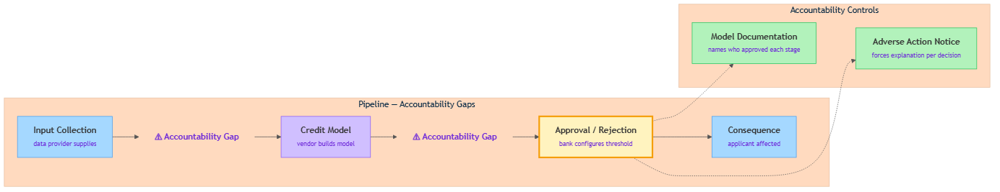

<!-- GENERATED FILE — DO NOT EDIT BY HAND.
     Cresent view of 15.3 — Case Study: AI Loan Approval at Scale.
     Source of truth: CIT 10.3.
     Regenerate: python Cresent/Technical/tools/generate_shared_readings.py -->
<!-- nav:top:start -->
Previous: [⬅ 15.2 — Case Study: Automated Medical Triage](../15-2-case-study-2-automated-medical-triage/reading.md)&emsp;·&emsp;[⬆ Table of Contents](../../../../../../README.md#part-b)&emsp;·&emsp;[15.4 — Automation Complacency ➡](../15-4-automation-complacency/reading.md)
<!-- nav:top:end -->

---

# Case study: AI loan approval at scale — who was accountable?

## Overview

You applied for a small loan online. Within seconds, the decision arrived: rejected. No explanation. No name. No one to call. The platform processed a quarter of a million applications that week. No human reviewed your file.

Who made that decision? Who is responsible if it was wrong?

This topic applies Judgment Framework Q3 — *who is accountable if this fails?* — to an AI loan approval system operating at scale. You will see how responsibility becomes diffuse when a single decision crosses multiple organisations, why the answer "the AI said so" fails legally, ethically, and practically, and what two accountability controls close the gap.

## Key Concepts

### What an AI loan approval system does

A loan approval system decides whether a person qualifies to borrow money and on what terms. The pipeline at scale runs like this:

1. **Input collection** — the applicant submits income, employment status, existing debts, credit history, sometimes location or device type.
2. **Credit model** — a machine learning model calculates a risk score: the estimated probability this applicant will repay.
3. **Approval or rejection** — the score is compared to a threshold. Above: approved. Below: rejected.
4. **Consequence delivery** — the applicant is notified. Money disbursed or denied.

At scale this pipeline processes hundreds of thousands or millions of applications per day, with no human reviewing individual cases [1].

### What accountability means — three components

**Accountability** — being answerable for a decision: the obligation to explain what was decided, why, and what will happen if it turns out to be wrong.

Accountability has three components. All three must be present:

| Component | What it requires |
|---|---|
| **Identifiability** | A named person or organisation who made the decision. |
| **Explainability** | The ability to state the reason for the decision in plain terms. |
| **Remediation** | A mechanism for correcting the decision if it was wrong. |

Research on AI loan platforms shows that at scale, all three often collapse at once [1]. When they do, the system still runs — but no one is genuinely accountable for what it produces.

### Diffuse accountability — the specific failure mode

**Diffuse accountability** — what happens when responsibility for a decision is spread across so many organisations, contracts, and automated steps that no single actor can be named as the one who is accountable.

An AI loan approval pipeline typically crosses organisational boundaries: a bank or lender deploys the system and issues the loans; a software vendor builds and maintains the credit model; a data provider supplies the training data or real-time data feeds. Each actor is responsible for their slice. No single actor sees the whole chain.

This creates the **accountability gap** — the space between what each actor claims is not their responsibility and what ends up being no one's responsibility [1].

### Applying Judgment Framework Q3 to loan approval

Q3 from topic 9.9: *Who is accountable if this fails?*

A valid Q3 answer names a specific person or role, describes what they are accountable for, and explains how they would know if the system had failed. Applied to an AI loan rejection, the answers collapse:

- **Who decided?** The model. But a model cannot be held accountable.
- **Which human or organisation?** The bank says: "The vendor built the model." The vendor says: "The bank chose the threshold." Nobody says: "I am accountable for this specific rejection."
- **How would they know it failed?** In most real-world deployments, there was no systematic monitoring of rejection patterns by population group [1].

The Q3 answer — *nobody knows* — is itself the failure mode.

*The loan approval pipeline: applicant data flows from input collection through the credit model to an approval or rejection decision. Accountability gaps appear at each organisational handoff — between lender, vendor, and data provider. Two controls close the gap: model documentation at the design stage and adverse action notice at the consequence delivery stage.*

### Why "the AI said so" is not a valid accountability answer

This answer fails on three grounds:

1. **Practically false** — humans made every design and deployment decision. The AI is the mechanism, not the decision-maker.
2. **Legally unsound** — the Equal Credit Opportunity Act (ECOA) in the US requires lenders to provide specific reasons for credit denial [2]. "The algorithm determined this" is not a legally sufficient reason. Regulators have clarified this obligation applies to algorithmic decisions.
3. **Ethically indefensible** — it is automation bias at an institutional scale. It forecloses correction: if the reason is "the AI said so," there is nothing for a reviewer to examine, challenge, or change.

## Worked Example

### Scenario

A fintech lender operates an instant loan platform. The credit model was built by a third-party vendor. Training data was sourced from a data broker. The bank set the approval threshold at a risk score of 0.35. A customer in a financially stressed postcode received a rejection with no reason provided. She asks: who decided this, and why?

### Six-step accountability audit

1. **Name the pipeline actors.** Three organisations are involved: the bank (deploys the system, issues loans), the vendor (built and maintains the credit model), the data broker (supplied training data).

2. **Assign accountability per stage.** Input collection: the bank's application interface. Credit model: the vendor. Approval threshold: the bank. Consequence delivery: the bank. On paper, each stage has an owner.

3. **Apply Q3 at every handoff.** At the bank-vendor joint: if the model produces systematically wrong scores for certain postcodes, who is accountable? The bank says the vendor built the model; the vendor says the bank set the threshold. Neither has a complete answer. Mark as **accountability gap**.

4. **Check for model documentation.** There is no written record naming who approved this model for deployment, what the training data contained, what performance was measured, or who is responsible for monitoring. Gap confirmed: identifiability is absent [3].

5. **Check for an explanation mechanism.** The rejection notice says: "Based on our assessment, you do not meet our current criteria." No specific reason. No reference to which data or which factor. ECOA requires more than this [2]. Gap confirmed: explainability is absent.

6. **Check for a remediation path.** There is no stated review process. The customer has no channel to request a manual re-evaluation. Gap confirmed: remediation is absent.

All three accountability components are missing. The pipeline fails the accountability audit at steps 3, 4, 5, and 6.

## In Practice

Two controls close the accountability gaps that diffuse accountability creates.

**Model documentation** — a written record naming who approved this model for deployment, what data it was trained on, what performance was measured, and who is responsible for monitoring its outputs. This control addresses identifiability: it creates a named owner at every stage and makes the ownership visible before harm occurs. The 2026 AI Impact Survey found that 78% of senior executives could not demonstrate AI accountability within 90 days; the primary gap was the absence of model documentation [3].

**Adverse action notice** — the legal requirement under ECOA and Regulation B that a lender must tell a declined applicant, in specific written terms, why they were declined [2]. This control addresses explainability: it forces the lender to translate the model's output into a human-readable reason. "Black box" is not a legally acceptable architecture for consumer lending. The notice also creates a remediation path — a specific reason gives the applicant something to respond to or challenge.

Neither control is technically complex. Both require a decision by a named human to implement and maintain.

**The Q3 test as the practical verifier.** Before deploying any AI system that affects people, ask: if this produces a wrong outcome, can I name who is accountable, explain the decision in plain terms, and describe how an affected person would seek a correction? If any answer is "I don't know," you have an accountability gap. Close it before deployment, not after.

## Key Takeaways

- **Diffuse accountability** — when responsibility is spread across so many organisations and automated steps that no single actor can be named as accountable; the specific failure mode of AI systems operating across multiple organisations [1].
- **Accountability gap** — the space between what each actor claims is not their responsibility and what ends up being nobody's responsibility; it appears at every organisational handoff in an AI pipeline.
- **Three components of accountability** — identifiability, explainability, and remediation must all be present; the collapse of any one disables genuine accountability even when the system keeps running.
- **"The AI said so" fails** — practically false (humans designed and deployed the system), legally unsound (ECOA requires specific reasons), and ethically indefensible (automation bias at institutional scale, foreclosing correction).
- **Two controls that work** — model documentation closes the identifiability gap by naming an owner at every stage; adverse action notice closes the explainability and remediation gaps by requiring a specific, human-readable reason for every decline [2][3].
- **Q3 as the verifier** — a valid accountability answer names who is responsible, for what, and how they would know the system had failed; "nobody knows" is itself the failure mode.

## References

[1] Marda, V., & Narayan, S. (2022). "Algorithmic accountability in instant loan platforms: Power relations and accountability gaps." *arXiv preprint* arXiv:2205.05661. https://arxiv.org/pdf/2205.05661

[2] HES Fintech. "All Legislative Trends Regulating AI in Lending: ECOA, Adverse Action, and Transparency Obligations." https://hesfintech.com/blog/all-legislative-trends-regulating-ai-in-lending/

[3] Grant Thornton. *2026 AI Impact Survey: Accountability and Governance Findings*. https://www.grantthornton.com/services/advisory-services/artificial-intelligence/2026-ai-impact-survey

---
<!-- nav:bottom:start -->
Previous: [⬅ 15.2 — Case Study: Automated Medical Triage](../15-2-case-study-2-automated-medical-triage/reading.md)&emsp;·&emsp;[⬆ Table of Contents](../../../../../../README.md#part-b)&emsp;·&emsp;[15.4 — Automation Complacency ➡](../15-4-automation-complacency/reading.md)
<!-- nav:bottom:end -->
